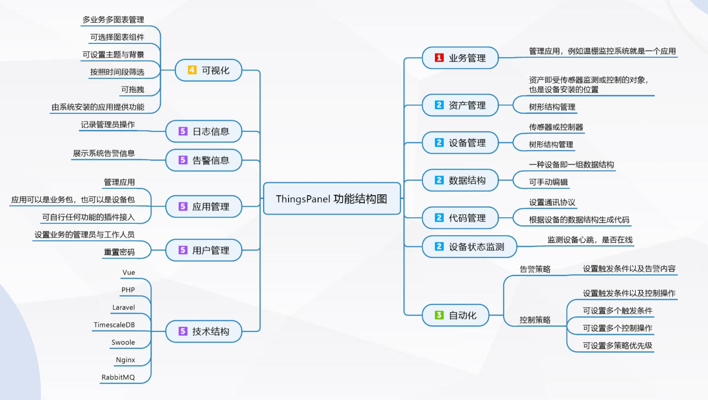
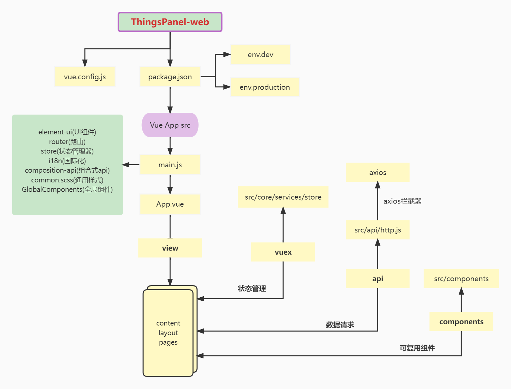
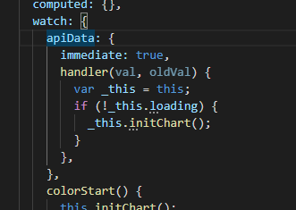
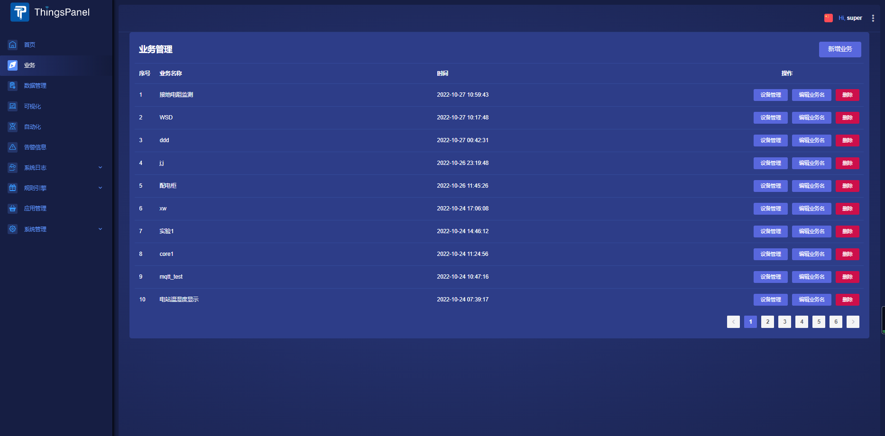
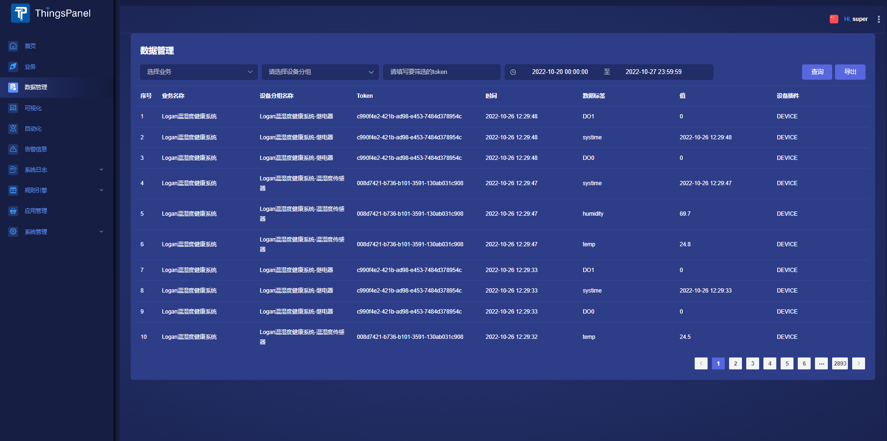
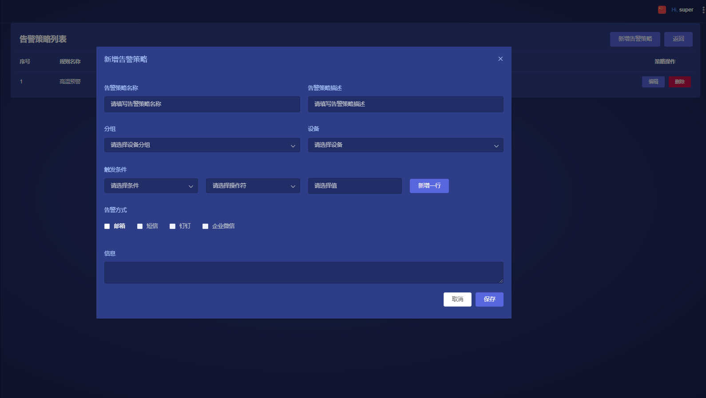
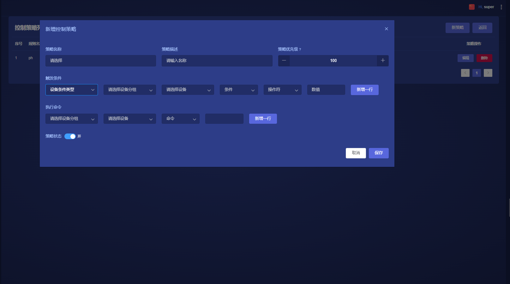
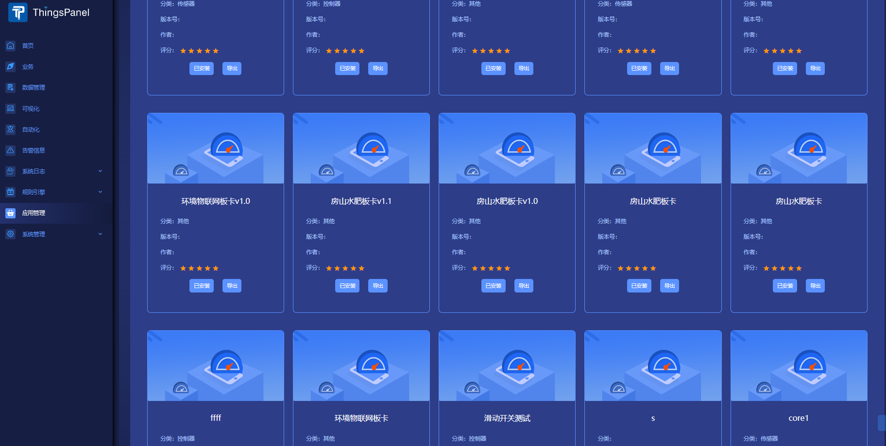
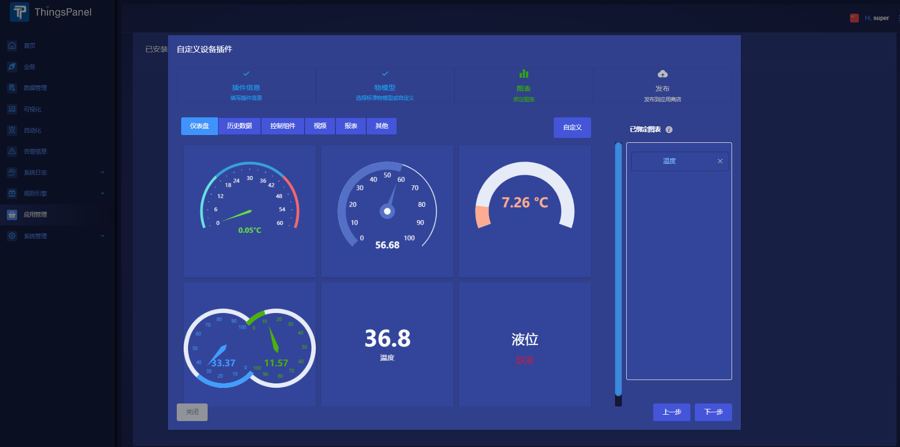

<p style="text-align: center">
    <a href="https://github.com/ThingsPanel/ThingsPanel-Backend-Vue">
        
    </a>
    <a href="">
        
    </a>
    <a href="https://github.com/ThingsPanel/ThingsPanel-Backend-Vue">
        
    </a>

</p>

# ThingsPanel前端使用说明

本系统采用Golang 微服务架构,一款高性能、高吞吐量、高扩展性的物联网平台! 单机可以支持百万链接,同时支持自定义扩展功能多种协议交互，支持插件化开发!

# 1. 平台描述

物联网核心支撑软件 ・适用所有物联网场景 ・开源

* 通用物联网场景快速实现
* 美观、开源
* 简洁、上手门槛低   
* 功能可无限扩展

## 1.1 功能介绍



## 1.2 在线体验

演示地址：http://dev.thingspanel.cn

测试账号： admin@thingspanel.cn  
测试密码： 123456

[相关技术资料及话题](http://forum.thingspanel.cn/)

# 2. 技术栈

- Backend：Golang(Go 1.17.5)
- Frontend：Vue.js(2.6.12) Element-UI （node.js 16.13)
- MQTT Broker：GMQTT
- TSDB: PostgreSQL 14.1

# 3. 项目结构
        ├── babel.config.js
        ├── package.json               -- 包管理器代码
        ├── vue.config.js              -- 配置文件
        ├── src                        -- 源代码
        │   ├── App.vue                -- 主页面
        │   ├── main.js                -- 入口文件
        │   ├── router.js              -- 路由中间件
        │   ├── api                    -- api 组
        │   ├── assets                 -- 静态资源
        │   ├── components             -- 全局组件
        │   ├── core                   -- 核心组
        │   │   ├── config             -- i18n配置
        │   │   │   └── i18n           -- 国际化
        │   │   └── services           -- 全局函数
        │   │       └── store          -- 状态管理器
        │   ├── style                  -- 全局样式
        │   │   ├── _iconfont.scss
        │   │   ├── _var.scss
        │   │   ├── app.scss
        │   │   ├── bootstrap-custom.scss
        │   │   ├── common.scss
        │   │   ├── element-ui-custom.scss  -- 此处可以全局覆盖 element-plus 样式(弃用）
        │   │   ├── scrollbar.scss
        │   │   ├── vuetify-custom.scss     -- 弃用
        │   ├── themes                 -- 弃用
        │   ├── utils                  -- 方法包库
        │   ├── view -- 主要view代码
        │   │   ├── content -- 通用页面组件
        │   │   ├── layout  --  layout约束
        │   │   │   ├── aside          -- 左侧菜单
        │   │   │   ├── brand          -- 左上角logo
        │   │   │   ├── extras         
        │   │   │   ├── footer         -- 公共底部
        │   │   │   ├── header         -- 公共头部
        │   │   │   ├── subheader      
        │   │   │   └── Layout.vue     -- layout约束页面 
        │   ├── pages                  -- 视图页面
        │   │   ├── access-engine      -- 接入引擎
        │   │   ├── alarm              -- 告警信息
        │   │   ├── auth               -- 登录/注册
        │   │   ├── automation         -- 自动化
        │   │   ├── business           -- 业务
        │   │   ├── chart              -- 可视化
        │   │   ├── datas              -- 数据管理
        │   │   ├── device             -- 可视化 -> 设备管理
        │   │   ├── equipment          -- 系统日志 -> 设备日志
        │   │   ├── log                -- 系统日志 -> 操作日志
        │   │   ├── management         -- 系统管理 -> 角色管理
        │   │   ├── plugin             -- 应用管理
        │   │   ├── product            -- 产品管理
        │   │   ├── system             -- 系统设置/权限管理
        │   │   ├── transpond          -- 规则引擎 -> 数据转发
        │   │   ├── users              -- 用户管理
        │   │   ├── visual             -- 可视化编辑器
                └── Home.vue           -- 首页
        
# 4. 前端设计图


# 5. 环境搭建

## 5.1 ThingsPanel-Go后台环境搭建

[详情查看此链接 —> http://forum.thingspanel.cn/d/10-thingspanel-go](http://forum.thingspanel.cn/d/10-thingspanel-go)

## 5.2 安装依赖
- 下载安装Node.js，推荐版本16.13
- 终端进入项目根目录下，执行命令```npm install```，等待依赖下载完毕

## 5.3 本地运行
- 执行```npm run dev```
- 打开浏览器输入```localhost:8080```即可访问

## 5.4 部署到服务器
- 执行 ```npm run build``` 打包项目
- 打包成功后，会在dist目录下生成打包后的文件，将dist目录里的所有文件上传到服务器的web目录里
- 在服务器上配置nginx
- 配置完后测试配置文件是否正确 ```nginx -t```
- 重新加载配置文件 ```nginx -s reload```
- 在浏览器中输入地址访问

# 6. 运行效果








## 联系我们

[wiki](http://wiki.thingspanel.cn/index.php?title=%E9%A6%96%E9%A1%B5)

论坛：[论坛](http://forum.thingspanel.cn/)

qq群：371794256
