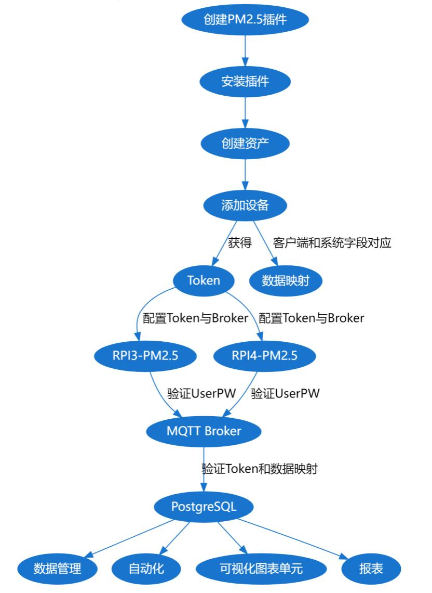

<p style="text-align: center">
    <a href="https://github.com/ThingsPanel/ThingsPanel-Backend-Vue">
        
    </a>
    <a href="LICENSE">
        
    </a>
    <a href="">
        
    </a>
    <a href="https://github.com/ThingsPanel/ThingsPanel-Backend-Vue">
        
    </a>
</p>
# ThingsPanel前端使用说明

本系统采用Golang 微服务架构,一款高性、高吞吐量、高扩展性的物联网平台! 单机可以支持百万链接,同时支持自定义扩展功能多种协议交互，支持插件化开发!

## 1. 平台描述

物联网核心支撑软件 ・适用所有物联网场景 ・开源

* 通用物联网场景快速实现
* 美观、开源
* 简洁、上手门槛低   
* 功能可无限扩展

### 1.1 功能介绍


### 1.2 在线体验

演示地址：即将发布

测试账号： 暂未开放

[相关技术资料及话题](http://forum.thingspanel.cn/)

## 2. 技术栈

- Backend：Golang(Go 1.17.5)
- Frontend：Vue.js （node.js 16.13)
- MQTT Broker：GMQTT
- TSDB: PostgreSQL 14.1

## 3. 环境搭建

### 3.1 ThingsPanel-Go后台环境搭建

[详情查看此链接 —> http://forum.thingspanel.cn/d/10-thingspanel-go](http://forum.thingspanel.cn/d/10-thingspanel-go)

### 3.2 ThingsPanel-Backend-Vue项目部署

[详情查看此链接 -> https://github.com/ThingsPanel/ThingsPanel-Backend-Vue.git](https://github.com/ThingsPanel/ThingsPanel-Backend-Vue.git)

- 下载安装Node.js，推荐版本16.13
- 终端进入当项目根目录下，```npm install```，等待依赖下载完毕
- 执行```npm run dev``` 运行项目

## 4. 平台数据流程



### 4.1 插件开发流程1-后台开发部分

#### 4.1.1 首先搭建后台部分，下载后台代码并安装环境 __参照3.1__
#### 4.1.2 进入项目extensions目录，创建对应插件目录，例如pm2.5插件，以下以pm25为例
#### 4.1.3 进入pm25目录创建config.yaml配置文件，内容如下：

```javascirpt
pm25:
  type: 'app'
  name: 'pm25'
  device: 'PM2.5传感器'
  description: 'PM2.5插件 PM2.5 plug-in'
  version: '1.0.0'
  author: ''
  email: ''
  widgets:
    pm25_main:
      name: 'PM2.5值'
      description: 'PM信息'
      receiver: 'Pm25'
      thumbnail: '/pm25.png'
      template: 'pm25_main'
      fields:
        time:
          name: '时间'
          type: 3
          symbol: ''
        pm25:
          name: 'PM2.5'
          type: 3
          symbol: 'ug/m3'
        pm10:
          name: 'PM10'
          type: 3
          symbol: 'mg/h'
        pm100:
          name: 'PM100'
          type: 3
          symbol: 'ug/h'
    pm10_main:
      name: 'PM10值'
      description: 'PM10值'
    pm100_main:
      name: 'PM100值'
      description: 'PM100值'
    pm25_curve:
      name: 'PM2.5曲线'
      description: 'PM2.5曲线'
    pm10_curve:
      name: 'PM10曲线'
      description: 'PM10曲线'
    pm100_curve:
      name: 'PM100曲线'
      description: 'PM100曲线'
```

#### 4.1.4 创建插件数据存储和渲染组件文件，pm25.go 和 pm25.vue组件

> pm25.vue

```go
package actions

import (
	"ThingsPanel-Go/extensions"
	"fmt"
)

type PM25 struct{}

func init() {
	fmt.Println("pm25")
}

func (p *PM25) Main(device_ids []string, startTs int64, endTs int64) []interface{} {
	var Base extensions.Base
	t := Base.Main(device_ids, startTs, endTs)
	return t
}
```

> pm25.vue

--------------------------------------------------

核心字段：

1. title：插件名称
2. apiData：socket推送数据包内容

--------------------------------------------------

```vue
<template>
	<div class="x-pm25">
		<div class="number">{{number != ''? number:"0"}} ug/m3</div>
	</div>
</template>
<script>
	export default {
		name: "pm25_current_chart",
		props: {
			id: '',
			loading: {
				type: Boolean,
				default: true,
			},
			legend: {
				type: Boolean,
				default: true,
			},
			apiData: {
				type: Object,
			},
			title: {
				type: String,
				default: "",
			},
			colorStart: {
				type: String,
				default: "#7956EC",
			},
			colorEnd: {
				type: String,
				default: "#3CECCF",
			},
		},
		data() {
			return {
				chart_type: "pm25_current_chart",
				level: 0,
				course_id: '',
				chapter_id: '',
				idNameMapping: [],
				maxLevel: 2,
				hasAxis: true,
				chart: null,
				direction: 'vertical',
				initOptions: {
					renderer: 'canvas'
				},
				xColumn: {},
				yColumns: [],
				categories: [],
				seriesData: [],
				latest: {},
				fields: [],
				number: ""
			};
		},
		computed: {
		},
		watch: {
			apiData: {
				// deep: true,
				immediate: true,
				handler(val, oldVal) {
					var _this = this;
					if (!_this.loading) {
						if (val['fields']) {
							_this.latest = val["latest"];
							_this.fields = val["fields"];
							
							if (_this.id == '2') {
								_this.number = _this.latest['pm25']
							}
							else if (_this.id == '6') {
								_this.number = _this.latest['pm100']
							}
							else if (_this.id == '4') {
								_this.number = _this.latest['pm10']
								
							}
						}
					}
				},
			},
			colorStart() {},
			colorEnd() {},
			legend(val, oldVal) {
			},
		},
		methods: {
		},
	};
</script>

<style lang="scss" scoped>
	.x-pm25 {
		.number {
			font-size: 30px;
			color: white;
			text-align: center;
			margin: 10px;
		}
	}
</style>
```

#### 4.1.6 重启编译后台项目，启用插件

### 4.2 插件开发流程2-前端对接开发部分

#### 4.2.1 拉取ThingsPanel前端最新版本代码 __详见 3.2__

#### 4.2.2 登录系统，进入应用管理查看是否显示后台新增的插件，如果有表示插件启用成功

#### 4.2.3 进入业务管理模块，新增业务，选择资产设置度对应的应用，保存业务后，可以在编辑业务中设置“代码”获取设备Token

#### 4.2.4 插件数据显示


- 当需要在前端可视化页面下查看数据展示，前端通过接口返回指定插件的名称，例如pm25.vue插件中的name: __pm25_current_chart__，及一些预设字段后
- 前端通过```<component :title="title" :apiData="apiData"/>```的方式，动态加载插件模板
- 在后台可视化管理创建可视化， 并新建图表单元，选择之前在后台新增的图表单元，并保存
- 进入可视化图表，就可以展示出插件所接收到的数据了

### 4.3 数据校验流程

- 启用插件
- 配置资产设备
- 配置客户端并推送数据数据
- 在[数据管理]下面查看数据

## 联系我们

[wiki](http://wiki.thingspanel.cn/index.php?title=%E9%A6%96%E9%A1%B5)

论坛：[论坛](http://forum.thingspanel.cn/)

qq群：260150504
