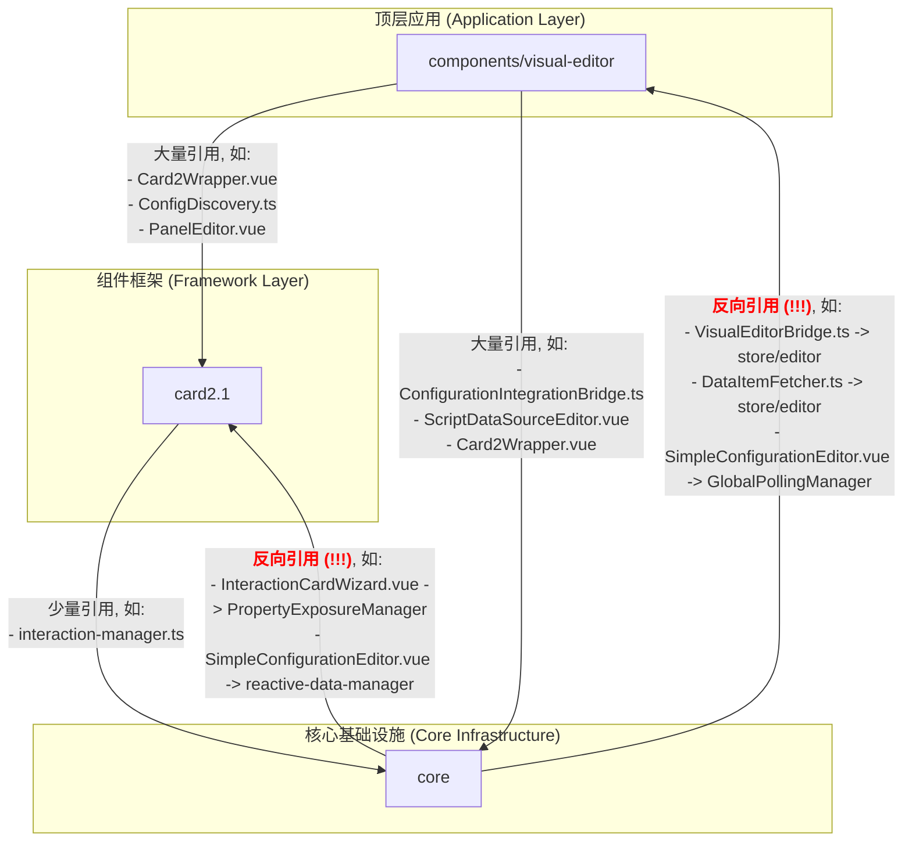

# 架构深度分析报告: `core`, `card2.1`, 和 `visual-editor`

**版本: 2.0**
**更新日期: 2023-10-27**

## 1. 分析概述

本报告在之前分析的基础上，通过对模块间具体文件引用关系的深度挖掘，提供了对 `core`, `card2.1`, 和 `visual-editor` 三个核心目录更精确、更深入的架构评估。报告包含：
1.  三个模块的完整目录树结构及文件职责解释。
2.  基于文件真实引用关系绘制的详细依赖图谱。
3.  由反向依赖和跨层引用所揭示的核心架构问题。
4.  一份明确列出所有涉及交叉引用的文件清单。

## 2. 核心模块目录树

### 2.1. `src/core` (核心基础设施)

此目录是应用的基石，提供数据处理、交互逻辑和脚本执行等与业务无关的底层能力。

```
src/core/
├── SystemInitializer.ts                # 系统初始化器：在应用启动时协调和初始化所有核心服务。
├── data-architecture/                  # 核心：数据架构层，负责所有与数据获取、处理、缓存和流动相关的逻辑。
│   ├── DataWarehouse.ts                # 数据仓库：核心的数据缓存和管理中心。
│   ├── SimpleDataBridge.ts             # 简单数据桥：为上层提供简化的数据访问接口。
│   ├── UnifiedDataExecutor.ts          # 统一数据执行器：执行来自不同源（API, WebSocket）的数据请求。
│   ├── VisualEditorBridge.ts           # (问题点) 可视化编辑器桥接器：专门为`visual-editor`提供服务，但存在对上层模块的反向引用。
│   └── ... (其他子模块)
├── interaction-system/                 # 核心：交互系统，负责处理组件间的交互和事件响应。
│   ├── interaction-engine.ts           # 交互引擎：核心的事件处理引擎。
│   └── components/
│       └── InteractionCardWizard.vue   # (问题点) 交互向导组件，但反向引用了`card2.1`和`visual-editor`。
└── script-engine/                      # 核心：脚本引擎，提供动态执行JavaScript脚本的能力。
    ├── executor.ts                     # 脚本执行器。
    └── sandbox.ts                      # 用于安全执行脚本的沙箱环境。
```

### 2.2. `src/components/visual-editor` (顶层应用)

可视化编辑器的UI和业务逻辑实现，整合`core`和`card2.1`的能力，提供所见即所得的编辑体验。

```
src/components/visual-editor/
├── PanelEditor.vue                   # 编辑器主入口Vue组件。
├── components/                       # 编辑器自身的UI子组件（工具栏、画布等）。
├── configuration/                    # 负责组件的属性配置面板和逻辑。
│   ├── ConfigurationPanel.vue        # 属性配置面板UI。
│   └── ConfigurationIntegrationBridge.ts # 配置集成桥，与`core`层交互。
├── core/                             # 编辑器的核心逻辑。
│   └── ConfigDiscovery.ts            # (问题点) 配置发现：主动扫描并注册其他模块的组件，职责不清。
├── renderers/                        # 渲染器，负责将组件配置渲染成视图。
│   └── base/
│       └── Card2Wrapper.vue          # `card2.1`组件的包装器，是与`card2.1`集成的关键。
└── store/                            # 编辑器的状态管理（Pinia/Zustand）。
    └── editor.ts                     # (问题点) 编辑器的全局状态，被`core`模块反向引用。
```

### 2.3. `src/card2.1` (组件框架)

一个独立的、可复用的业务组件（卡片）框架，构建于`core`之上。

```
src/card2.1/
├── components/                       # 所有标准化的“卡片”业务组件库。
├── core/                             # `card2.1`框架自身的内核。
│   ├── component-registry.ts         # `card2.1`组件注册表。
│   ├── data-source-mapper.ts         # 数据源映射器，连接`core`的数据和组件的属性。
│   ├── interaction-manager.ts        # (问题点) 交互管理器，存在对`core`中`VisualEditorBridge`的引用。
│   └── PropertyExposureManager.ts    # 属性暴露管理器，定义组件哪些属性是可配置的。
└── integration/                      # 与其他模块集成的配置。
    └── visual-editor-config.ts       # 定义`card2.1`组件如何被`visual-editor`发现。
```

## 3. 详细引用关系图谱

此图谱基于对代码库的静态分析生成，精确地展示了模块间的实际依赖关系。



**图谱解读:**

*   **绿色箭头 (健康依赖):** `visual-editor` -> `card2.1` -> `core`。这是理想的单向依赖链，上层依赖下层，符合分层架构原则。
*   **红色箭头 (反向依赖):** `core` -> `visual-editor` 和 `core` -> `card2.1`。这是严重的架构缺陷。作为最底层的`core`模块，本应完全独立，但它却反向依赖了`visual-editor`的状态管理和`card2.1`的内部模块。这造成了**循环依赖**和**紧密耦合**，破坏了模块的独立性和可复用性。

## 4. 相关文件详细列表

以下文件是导致架构混乱的关键节点，清晰地展示了模块间的非法引用。

#### 4.1. `visual-editor` 对外引用

*   `e:\wbh\things2\thingspanel-frontend-community\src\components\visual-editor\renderers\base\Card2Wrapper.vue`: (枢纽) 同时引用`@/core/data-architecture`和`@/card2.1/core`。
*   `e:\wbh\things2\thingspanel-frontend-community\src\components\visual-editor\core\ConfigDiscovery.ts`: (职责不清) 引用`@/core/interaction-system`和`@/card2.1`。
*   `e:\wbh\things2\thingspanel-frontend-community\src\components\visual-editor\configuration\components\ScriptDataSourceEditor.vue`: 引用`@/core/script-engine`。

#### 4.2. `card2.1` 对外引用

*   `e:\wbh\things2\thingspanel-frontend-community\src\card2.1\core\interaction-manager.ts`: 引用`@/core/data-architecture/VisualEditorBridge`，是`card2.1`依赖`core`中一个本不该存在的“桥”的证据。

#### 4.3. `core` 的反向引用 (核心问题)

*   **`core` -> `visual-editor`**
    *   `e:\wbh\things2\thingspanel-frontend-community\src\core\data-architecture\VisualEditorBridge.ts`: 引用`@/components/visual-editor/store/editor`。
    *   `e:\wbh\things2\thingspanel-frontend-community\src\core\data-architecture\executors\DataItemFetcher.ts`: 引用`@/components/visual-editor/store/editor`。
    *   `e:\wbh\things2\thingspanel-frontend-community\src\core\data-architecture\components\SimpleConfigurationEditor.vue`: 引用`@/components/visual-editor/core/GlobalPollingManager`。
    *   `e:\wbh\things2\thingspanel-frontend-community\src\core\data-architecture\interfaces\IEditorDataManager.ts`: 引用`@/components/visual-editor/types`。

*   **`core` -> `card2.1`**
    *   `e:\wbh\things2\thingspanel-frontend-community\src\core\interaction-system\components\InteractionCardWizard.vue`: 引用`@/card2.1/core/PropertyExposureManager`。
    *   `e:\wbh\things2\thingspanel-frontend-community\src\core\data-architecture\components\SimpleConfigurationEditor.vue`: 引用`@/card2.1/core/data-source/reactive-data-manager`等多个模块。
    *   `e:\wbh\things2\thingspanel-frontend-community\src\core\SystemInitializer.ts`: 引用`@/card2.1/core/OptimizedInitializationManager`。

## 5. 结论与重构建议

**结论：当前架构存在严重的分层不明和循环依赖问题。`core`模块的纯洁性和独立性被严重破坏，导致整个系统耦合度过高，难以维护、扩展和测试。**

**重构建议：**

1.  **依赖倒置原则 (DIP):** 必须切断`core`对`visual-editor`和`card2.1`的所有引用。
    *   **方案:** 采用“事件/回调”或“依赖注入”模式。`core`层可以定义接口和发出事件，但不关心谁来实现接口和监听事件。上层模块（如`visual-editor`）在初始化时，向`core`层注册自己的实现或回调函数。
    *   **具体操作:**
        *   将`VisualEditorBridge.ts`中依赖`visual-editor`的部分剥离出去，形成一个位于更高层级的`Adapter`。
        *   `core`中的UI组件（如`InteractionCardWizard`）不应直接引用上层模块，应通过props接收数据和回调函数。

2.  **明确职责边界:**
    *   **方案:** 组件发现和注册的逻辑应从`visual-editor`的`ConfigDiscovery.ts`中移出，放到一个更高层级的启动模块（如`main.ts`或专门的`AppInitializer`）中。该模块负责扫描所有功能模块，并将发现的组件实例注入到`visual-editor`中。

3.  **统一数据流:**
    *   **方案:** 严格遵循 `visual-editor` -> `core` 的单向数据请求流。所有的数据获取和操作必须通过`core`提供的统一接口（如`SimpleDataBridge`）进行，禁止上层模块绕过`core`直接操作数据或互相调用。

通过以上重构，可以建立一个清晰、单向、可维护的架构体系。