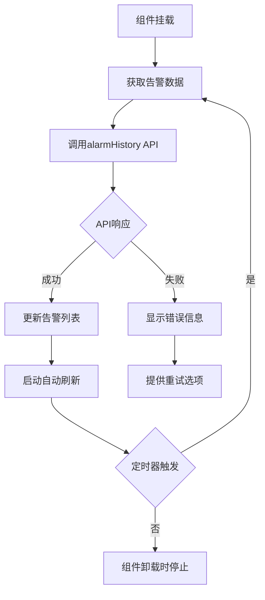

# 告警信息统计组件 (Alarm Info Card)

## 📋 组件概述

**告警信息统计组件** 是从 `builtin-card/alarm-info` 成功迁移到 Card2.1 系统的统计展示组件。该组件用于实时显示系统最新告警信息列表，支持自动刷新、错误处理和主题适配。

### 🎯 核心特性

- ✅ **历史兼容性**：保持组件ID `alarm-info` 不变，完美兼容历史数据
- ✅ **自包含设计**：无需外部数据源配置，组件内部自动获取告警数据
- ✅ **告警状态分类**：支持高危、中危、低危、正常四种告警状态显示
- ✅ **自动刷新**：支持可配置的定时数据更新
- ✅ **错误处理**：完善的错误恢复和用户反馈机制
- ✅ **主题集成**：完全支持明暗主题切换
- ✅ **响应式设计**：适配各种屏幕尺寸和容器大小
- ✅ **路由跳转**：支持点击查看全部跳转到告警管理页面
- ✅ **开发友好**：内置调试面板和日志系统

## 🏗️ 技术架构

### 组件结构
```
src/card2.1/components/statistics/alarm-info/
├── AlarmInfoCard.vue     # Vue组件实现
├── index.ts              # Card2.1组件定义
├── MIGRATION_GUIDE.md    # 详细迁移指南
└── README.md            # 组件说明文档
```

### 数据流架构


## 🔧 使用方式

### 1. 在 Visual Editor 中使用

1. 打开可视化编辑器 (`/test/editor-integration`)
2. 在组件库的 **"统计"** 分类中找到 **"告警信息"** 组件
3. 拖拽组件到画布上
4. 组件会自动开始获取和显示告警数据
5. 可在右侧属性面板中配置组件参数

### 2. 编程方式使用

```vue
<template>
  <AlarmInfoCard 
    :title="'系统告警'"
    :page-size="15"
    :refresh-interval="30000"
    :show-view-all-button="true"
    :enable-auto-refresh="true"
    :show-debug="false"
  />
</template>

<script setup lang="ts">
import AlarmInfoCard from '@/card2.1/components/statistics/alarm-info/AlarmInfoCard.vue'
</script>
```

## ⚙️ 配置参数

### Props 接口

| 参数 | 类型 | 默认值 | 说明 |
|------|------|--------|------|
| `rawDataSources` | `any` | `null` | Card2.1标准数据绑定接口 |
| `title` | `string` | `''` | 自定义组件标题 |
| `pageSize` | `number` | `10` | 显示的告警条数 (5-20) |
| `refreshInterval` | `number` | `60000` | 自动刷新间隔（毫秒） |
| `showViewAllButton` | `boolean` | `true` | 是否显示查看全部按钮 |
| `enableAutoRefresh` | `boolean` | `true` | 是否启用自动刷新 |
| `showDebug` | `boolean` | `false` | 是否显示调试信息面板 |

### 可配置属性（Visual Editor）

```typescript
{
  title: {
    type: 'string',
    default: '告警信息',
    label: '标题',
    description: '组件显示标题'
  },
  pageSize: {
    type: 'number',
    default: 10,
    label: '显示条数',
    description: '每页显示的告警条数',
    min: 5,
    max: 20
  },
  refreshInterval: {
    type: 'number',
    default: 60000,
    label: '刷新间隔(ms)',
    description: '数据自动刷新间隔时间（毫秒）'
  },
  showViewAllButton: {
    type: 'boolean',
    default: true,
    label: '显示查看全部按钮',
    description: '是否显示跳转到告警管理页面的按钮'
  },
  enableAutoRefresh: {
    type: 'boolean',
    default: true,
    label: '启用自动刷新',
    description: '是否启用定时自动刷新功能'
  }
}
```

## 🔄 API 集成

### 数据源配置

组件内部调用固定的告警历史API：

```typescript
// 调用告警历史API获取数据
const params = {
  page: 1,
  page_size: props.pageSize, // 可配置显示条数
  alarm_status: '',          // 不过滤状态，显示所有告警
  start_time: '',           // 不限制时间范围
  end_time: ''
}

const response = await alarmHistory(params)

// 预期响应格式
interface ApiResponse {
  data: {
    list: AlarmData[]  // 告警数据列表
    total: number      // 总条数
  }
}
```

### 告警状态映射

```typescript
// 告警状态对应关系
const statusMapping = {
  'H': { label: '高危告警', type: 'error' },   // 红色
  'M': { label: '中危告警', type: 'warning' }, // 橙色  
  'L': { label: '低危告警', type: 'info' },    // 蓝色
  'N': { label: '正常', type: 'success' }      // 绿色
}
```

### 错误处理机制

```typescript
// 1. 网络错误处理
catch (err) {
  error.value = err.message || '获取告警数据失败'
  logger.error('获取告警数据出错', err)
  
  // 保持UI稳定性
  if (alarmList.value.length === 0) {
    alarmList.value = []
  }
}

// 2. 数据格式验证
if (response?.data?.list && Array.isArray(response.data.list)) {
  alarmList.value = response.data.list
} else {
  throw new Error('API返回数据格式错误：缺少 list 字段')
}
```

## 🎨 样式系统

### 主题变量支持

```css
.alarm-info-card {
  /* 使用主题变量，自动适配明暗主题 */
  background: var(--card-color);
  color: var(--text-color);
  border: 1px solid var(--border-color);
}

/* 暗主题特殊适配 */
[data-theme="dark"] .debug-panel {
  background: var(--card-color-dark, #333);
  border-color: var(--border-color-dark, #555);
}
```

### 响应式设计

```css
/* 移动端适配 */
@media (max-width: 480px) {
  .title { font-size: 14px; }
  .header {
    flex-direction: column;
    align-items: flex-start;
    gap: 8px;
  }
}

/* 容器查询适配 */
@container (max-width: 350px) {
  .title { font-size: 13px; }
  .alarm-table :deep(.n-data-table) {
    font-size: 12px;
  }
}
```

## 🔍 调试功能

### 开启调试模式

```vue
<AlarmInfoCard :show-debug="true" />
```

### 调试信息包含

- 当前告警条数和列表内容
- 刷新状态和最后更新时间
- 配置参数信息
- 原始数据源信息
- 错误信息（如有）

### 控制台日志

```typescript
// 组件生命周期日志
logger.info('AlarmInfoCard 组件挂载')
logger.info('AlarmInfoCard 组件卸载')

// 数据获取日志
logger.info('开始获取告警信息数据', { pageSize })
logger.info('告警数据获取成功', { alarmCount, updateTime })
logger.error('获取告警数据出错', error)

// 自动刷新日志
logger.info('启动自动刷新', { interval })
logger.info('停止自动刷新')

// 页面跳转日志
logger.info('跳转到告警管理页面')
```

## 🚀 性能优化

### 1. 智能加载状态

```typescript
// 区分首次加载和刷新状态
if (alarmList.value.length === 0) {
  isLoading.value = true  // 首次加载显示完整loading
} else {
  isRefreshing.value = true  // 后续刷新显示小spinner
}
```

### 2. 定时器生命周期管理

```typescript
// 组件挂载时启动
onMounted(() => {
  startAutoRefresh()
})

// 组件卸载时清理
onUnmounted(() => {
  stopAutoRefresh()
})

// 参数变化时重启
watch(() => [props.refreshInterval, props.enableAutoRefresh], () => {
  startAutoRefresh()
})
```

### 3. 表格虚拟化

- 使用 Naive UI 的 `flex-height` 属性优化表格性能
- 支持横向滚动以适配小屏幕
- 文本省略和 tooltip 提升用户体验

## 📊 与原组件对比

| 特性 | 原 builtin-card | 新 Card2.1 | 提升 |
|------|-----------------|------------|------|
| **组件ID** | alarm-info | alarm-info | 保持兼容 ✅ |
| **数据获取** | 固定API调用 | 内部自管理 + 配置化 | 更灵活 🚀 |
| **自动刷新** | ❌ | ✅ 可配置间隔 | 新功能 ⭐ |
| **错误处理** | 基础 | 完善恢复机制 | 可靠性 ⬆️ |
| **主题支持** | 部分 | 完全集成 | 一致性 ⬆️ |
| **响应式** | 基础 | 全面适配 | 体验 ⬆️ |
| **调试支持** | ❌ | ✅ 内置面板 | 开发效率 ⬆️ |
| **可配置性** | 固定 | ✅ 多项配置 | 灵活性 ⬆️ |

## 🐛 故障排除

### 常见问题及解决方案

**问题 1：组件不显示数据**
```bash
# 解决步骤
1. 检查网络连接和API服务状态
2. 确认告警历史API权限和可访问性
3. 查看浏览器控制台错误信息
4. 启用调试模式：<AlarmInfoCard :show-debug="true" />
```

**问题 2：自动刷新不工作**
```bash
# 检查项目
1. 确认 enableAutoRefresh 为 true
2. 确认 refreshInterval > 0
3. 检查组件是否正常挂载和卸载
4. 查看控制台定时器相关日志
```

**问题 3：查看全部按钮无响应**
```bash
# 排查步骤  
1. 检查路由配置：/alarm/warning-message
2. 确认告警管理页面存在且可访问
3. 查看浏览器控制台路由跳转错误
4. 验证 vue-router 配置正确性
```

**问题 4：告警状态显示异常**
```bash
# 解决方法
1. 确认API返回的alarm_status字段值
2. 检查状态映射配置是否完整
3. 验证 Naive UI Tag 组件正常工作
4. 查看是否有自定义样式冲突
```

## 🔮 未来扩展

### 计划中的功能

1. **告警过滤**：支持按状态、时间范围过滤告警
2. **告警统计图**：显示告警数量趋势图表
3. **实时推送**：WebSocket实时告警通知
4. **批量操作**：支持批量处理告警
5. **导出功能**：支持告警数据导出Excel/CSV
6. **自定义列**：用户可配置显示的表格列

### 扩展接口

```typescript
// 未来可能的扩展Props
interface FutureProps extends Props {
  statusFilter?: string[]       // 状态过滤器
  timeRangeFilter?: string     // 时间范围过滤
  showChart?: boolean          // 显示统计图表
  enableWebSocket?: boolean    // 启用实时推送
  customColumns?: string[]     // 自定义显示列
  enableBatchOperation?: boolean // 启用批量操作
}
```

## 📞 技术支持

### 开发团队
- **开发者**: ThingsPanel Team
- **版本**: Card2.1 (v2.1.0)
- **迁移日期**: 2025-09-08

### 获取帮助
1. 查看 [迁移指南](./MIGRATION_GUIDE.md) 了解详细迁移过程
2. 启用组件调试模式获取诊断信息
3. 查看浏览器开发者工具控制台日志
4. 参考其他 Card2.1 组件的实现案例

---

**🎉 该组件已成功完成从 builtin-card 到 Card2.1 的完整迁移，提供了更强大的功能和更好的用户体验！**