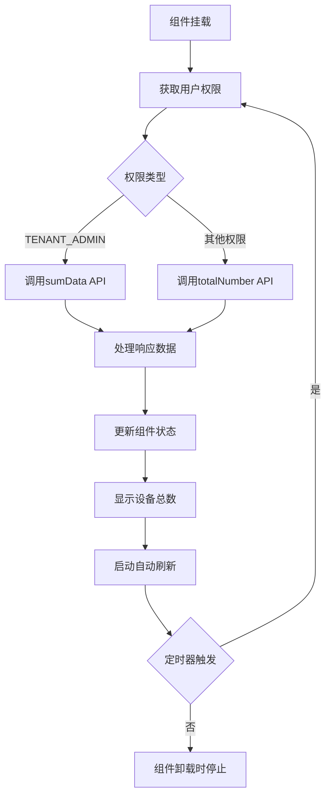

# 设备总数统计组件 (Access Num Card)

## 📋 组件概述

**设备总数统计组件** 是从 `builtin-card/access` 成功迁移到 Card2.1 系统的统计展示组件。该组件用于实时显示系统中设备的总数统计信息，支持自动刷新、权限控制和主题适配。

### 🎯 核心特性

- ✅ **历史兼容性**：保持组件ID `access-num` 不变，完美兼容历史数据
- ✅ **自包含设计**：无需外部数据源配置，组件内部自动获取数据
- ✅ **智能权限处理**：根据用户权限自动选择对应API接口
- ✅ **自动刷新**：支持可配置的定时数据更新
- ✅ **错误处理**：完善的错误恢复和用户反馈机制
- ✅ **主题集成**：完全支持明暗主题切换
- ✅ **响应式设计**：适配各种屏幕尺寸和容器大小
- ✅ **开发友好**：内置调试面板和日志系统

## 🏗️ 技术架构

### 组件结构
```
src/card2.1/components/statistics/access-num/
├── AccessNumCard.vue     # Vue组件实现
├── index.ts              # Card2.1组件定义
├── MIGRATION_GUIDE.md    # 详细迁移指南
└── README.md            # 组件说明文档
```

### 数据流架构


## 🔧 使用方式

### 1. 在 Visual Editor 中使用

1. 打开可视化编辑器 (`/test/editor-integration`)
2. 在组件库的 **"统计"** 分类中找到 **"设备总数"** 组件
3. 拖拽组件到画布上
4. 组件会自动开始获取和显示设备数据
5. 可在右侧属性面板中配置组件参数

### 2. 编程方式使用

```vue
<template>
  <AccessNumCard 
    :title="'我的设备统计'"
    :show-icon="true"
    :gradient-colors="['#ec4786', '#b955a4']"
    :refresh-interval="30000"
    :show-debug="false"
  />
</template>

<script setup lang="ts">
import AccessNumCard from '@/card2.1/components/statistics/access-num/AccessNumCard.vue'
</script>
```

## ⚙️ 配置参数

### Props 接口

| 参数 | 类型 | 默认值 | 说明 |
|------|------|--------|------|
| `rawDataSources` | `any` | `null` | Card2.1标准数据绑定接口 |
| `title` | `string` | `''` | 自定义组件标题 |
| `showIcon` | `boolean` | `true` | 是否显示设备图标 |
| `gradientColors` | `string[]` | `['#ec4786', '#b955a4']` | 背景渐变色配置 |
| `refreshInterval` | `number` | `30000` | 自动刷新间隔（毫秒） |
| `showDebug` | `boolean` | `false` | 是否显示调试信息面板 |

### 可配置属性（Visual Editor）

```typescript
{
  title: {
    type: 'string',
    default: '设备总数',
    label: '标题',
    description: '组件显示标题'
  },
  showIcon: {
    type: 'boolean', 
    default: true,
    label: '显示图标',
    description: '是否显示设备图标'
  },
  gradientColors: {
    type: 'array',
    default: ['#ec4786', '#b955a4'],
    label: '渐变色',
    description: '背景渐变颜色配置'
  },
  refreshInterval: {
    type: 'number',
    default: 30000,
    label: '刷新间隔(ms)',
    description: '数据自动刷新间隔时间'
  }
}
```

## 🔄 API 集成

### 数据源配置

组件会根据用户权限自动选择API：

```typescript
// TENANT_ADMIN 权限：使用汇总数据接口
const response = await sumData()

// 其他权限：使用总数接口  
const response = await totalNumber()

// 预期响应格式
interface ApiResponse {
  data: {
    device_total: number  // 设备总数
  }
}
```

### 错误处理机制

```typescript
// 1. 网络错误处理
catch (err) {
  error.value = err.message || '获取设备数据失败'
  logger.error('获取设备数据出错', err)
  
  // 保持UI稳定性
  if (deviceTotal.value === 0) {
    deviceTotal.value = 0
  }
}

// 2. 数据格式验证
if (response?.data && typeof response.data.device_total === 'number') {
  deviceTotal.value = response.data.device_total
} else {
  throw new Error('API返回数据格式错误：缺少 device_total 字段')
}
```

## 🎨 样式系统

### 主题变量支持

```css
.access-num-card {
  /* 使用主题变量，自动适配明暗主题 */
  background: var(--card-color);
  color: var(--text-color);
  border: 1px solid var(--border-color);
}

/* 暗主题特殊适配 */
[data-theme="dark"] .debug-panel {
  background: var(--card-color-dark, #333);
  border-color: var(--border-color-dark, #555);
}
```

### 响应式设计

```css
/* 移动端适配 */
@media (max-width: 480px) {
  .count-number { font-size: 28px; }
  .icon-and-count {
    flex-direction: column;
    align-items: center;
  }
}

/* 容器查询适配 */
@container (max-width: 250px) {
  .count-number { font-size: 24px; }
  .gradient-container { padding: 10px; }
}
```

## 🔍 调试功能

### 开启调试模式

```vue
<AccessNumCard :show-debug="true" />
```

### 调试信息包含

- 当前设备总数
- 刷新状态和最后更新时间
- 用户权限信息
- 组件配置参数
- 原始数据源信息
- 错误信息（如有）

### 控制台日志

```typescript
// 组件生命周期日志
logger.info('AccessNumCard 组件挂载')
logger.info('AccessNumCard 组件卸载')

// 数据获取日志
logger.info('开始获取设备统计数据', { userAuthority })
logger.info('设备数据获取成功', { deviceTotal, updateTime })
logger.error('获取设备数据出错', error)

// 自动刷新日志
logger.info('启动自动刷新', { interval })
logger.info('停止自动刷新')
```

## 🚀 性能优化

### 1. 智能数值格式化

```typescript
const formattedCount = computed(() => {
  if (deviceTotal.value >= 10000) {
    return `${(deviceTotal.value / 10000).toFixed(1)}万`
  } else if (deviceTotal.value >= 1000) {
    return `${(deviceTotal.value / 1000).toFixed(1)}k`
  }
  return deviceTotal.value.toString()
})
```

### 2. 定时器生命周期管理

```typescript
// 组件挂载时启动
onMounted(() => {
  startAutoRefresh()
})

// 组件卸载时清理
onUnmounted(() => {
  stopAutoRefresh()
})

// 参数变化时重启
watch(() => props.refreshInterval, () => {
  startAutoRefresh()
})
```

### 3. 错误状态保护

- API调用失败时不崩溃界面
- 保持上次成功的数据显示
- 提供用户友好的错误提示
- 支持后续自动恢复

## 📊 与原组件对比

| 特性 | 原 builtin-card | 新 Card2.1 | 提升 |
|------|-----------------|------------|------|
| **组件ID** | access-num | access-num | 保持兼容 ✅ |
| **数据获取** | 依赖外部配置 | 内部自管理 | 简化使用 🚀 |
| **自动刷新** | ❌ | ✅ 可配置 | 新功能 ⭐ |
| **错误处理** | 基础 | 完善恢复机制 | 可靠性 ⬆️ |
| **主题支持** | 部分 | 完全集成 | 一致性 ⬆️ |
| **响应式** | 基础 | 全面适配 | 体验 ⬆️ |
| **调试支持** | ❌ | ✅ 内置面板 | 开发效率 ⬆️ |
| **国际化** | 部分 | 完全支持 | 多语言 ⬆️ |

## 🐛 故障排除

### 常见问题及解决方案

**问题 1：组件不显示数据**
```bash
# 解决步骤
1. 检查网络连接和API服务状态
2. 确认用户权限和认证状态
3. 查看浏览器控制台错误信息
4. 启用调试模式：<AccessNumCard :show-debug="true" />
```

**问题 2：自动刷新不工作**
```bash
# 检查项目
1. 确认 refreshInterval > 0
2. 检查组件是否正常挂载和卸载
3. 查看控制台定时器相关日志
4. 确认没有JavaScript错误阻断执行
```

**问题 3：权限错误**
```bash
# 排查步骤  
1. 检查用户登录状态：authStore.userInfo
2. 确认API接口权限配置
3. 查看网络请求返回的错误码
4. 验证后端服务的权限验证逻辑
```

**问题 4：主题样式异常**
```bash
# 解决方法
1. 确认主题系统正常加载
2. 检查CSS变量是否正确定义
3. 验证暗主题切换功能
4. 清除浏览器缓存重新加载
```

## 🔮 未来扩展

### 计划中的功能

1. **数据缓存**：添加本地缓存减少API调用
2. **设备分类统计**：支持按设备类型分组显示
3. **趋势图表**：显示设备数量变化趋势
4. **交互功能**：点击跳转设备列表页面
5. **导出功能**：支持数据导出Excel/CSV
6. **实时推送**：WebSocket实时数据更新

### 扩展接口

```typescript
// 未来可能的扩展Props
interface FutureProps extends Props {
  showTrend?: boolean           // 显示趋势图
  enableClick?: boolean         // 启用点击交互  
  exportEnabled?: boolean       // 启用导出功能
  websocketUrl?: string        // WebSocket连接地址
  cacheEnabled?: boolean       // 启用数据缓存
  groupByType?: boolean        // 按类型分组显示
}
```

## 📞 技术支持

### 开发团队
- **开发者**: ThingsPanel Team
- **版本**: Card2.1 (v2.1.0)
- **迁移日期**: 2025-09-08

### 获取帮助
1. 查看 [迁移指南](./MIGRATION_GUIDE.md) 了解详细迁移过程
2. 启用组件调试模式获取诊断信息
3. 查看浏览器开发者工具控制台日志
4. 参考其他 Card2.1 组件的实现案例

---

**🎉 该组件已成功完成从 builtin-card 到 Card2.1 的完整迁移，提供了更强大的功能和更好的用户体验！**