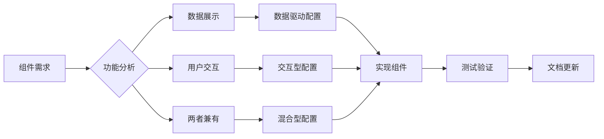

# Card 2.1 系统全面开发指南

## 🎯 系统概述

Card 2.1是ThingsPanel前端项目中的新一代组件化系统，专为物联网数据可视化而设计。它提供了完整的组件开发、数据绑定、配置管理和交互机制。

### 核心特性
- **组件化架构**：支持自定义组件开发和自动注册
- **数据绑定系统**：响应式数据源绑定和实时更新
- **配置管理**：统一的四层配置架构（基础、组件、数据源、交互）
- **权限控制**：基于角色的组件访问控制
- **属性暴露**：安全的组件属性白名单机制
- **多渲染器支持**：Canvas、GridStack、GridLayoutPlus等

## 🏗️ 系统架构

### 核心模块结构
```
src/card2.1/
├── index.ts                    # 系统入口和初始化
├── core/                       # 核心功能模块
│   ├── types.ts               # 类型定义
│   ├── component-registry.ts  # 组件注册表
│   ├── data-source-mapper.ts  # 数据源映射器
│   ├── config-manager.ts      # 配置管理器
│   ├── interaction-manager.ts # 交互管理器
│   └── data-source/          # 数据源系统
├── components/                 # 组件库
├── hooks/                     # Vue组合式函数
└── types/                     # 类型定义文件
```

### 数据流架构
```
用户操作 → 配置管理器 → 数据源映射器 → 组件实例 → 视图更新
    ↓
属性暴露 → 交互管理器 → 跨组件通信 → 数据源重新执行
```

## 🔧 组件开发规范

### 1. 组件目录结构（三文件架构）
```
src/card2.1/components/[组件名]/
├── index.ts          # 组件导出文件
├── definition.ts     # 组件定义
└── component.vue     # Vue组件实现
```

### 2. 组件定义文件 (definition.ts)
```typescript
import type { ComponentDefinition } from '@/card2.1/core/types'
import component from './component.vue'

export default {
  type: 'your-component',
  name: '组件显示名称',
  description: '组件功能描述',
  component,
  version: '2.1.0',
  category: 'system',
  permission: '不限',

  // 数据源需求声明
  dataSources: [
    {
      key: 'primaryData',
      name: '主数据源',
      description: '组件主要数据来源',
      supportedTypes: ['static', 'api', 'websocket'],
      required: true,
      example: {
        value: 100,
        name: '示例数据'
      }
    }
  ],

  // 静态参数配置
  staticParams: [
    {
      key: 'title',
      name: '组件标题',
      type: 'string',
      description: '显示在组件顶部的标题',
      defaultValue: '默认标题',
      required: false
    }
  ]
} as ComponentDefinition
```

### 3. Vue组件实现 (component.vue)
```vue
<template>
  <div class="your-component">
    <h3 v-if="config.title">{{ config.title }}</h3>

    <!-- 数据展示区域 -->
    <div v-if="hasData" class="data-display">
      <div v-for="item in displayData" :key="item.id">
        {{ item.name }}: {{ item.value }}
      </div>
    </div>

    <!-- 空状态 -->
    <div v-else class="empty-state">
      {{ $t('common.noData') }}
    </div>
  </div>
</template>

<script setup lang="ts">
import { computed } from 'vue'
import { useCard2Props } from '@/card2.1/hooks/useCard2Props'

// 组件配置接口
interface ComponentConfig {
  title?: string
  showHeader?: boolean
}

// Props定义
interface Props {
  /** 组件ID */
  componentId?: string
  /** 初始配置 */
  initialConfig?: any
}

const props = withDefaults(defineProps<Props>(), {
  componentId: '',
  initialConfig: () => ({})
})

// 使用统一配置管理
const {
  config,
  displayData,
  updateConfig,
  exposeWhitelistedProperties
} = useCard2Props<ComponentConfig>({
  config: props.initialConfig,
  componentId: props.componentId
})

// 计算属性
const hasData = computed(() => {
  return displayData.value && Object.keys(displayData.value).length > 0
})

// 暴露属性（用于交互）
exposeWhitelistedProperties()
</script>

<style scoped>
.your-component {
  padding: var(--card-padding, 16px);
  background: var(--card-color);
  border: 1px solid var(--border-color);
  border-radius: var(--border-radius, 6px);
}

.data-display {
  margin-top: 12px;
}

.empty-state {
  text-align: center;
  color: var(--text-color-3);
  padding: 24px;
}
</style>
```

### 4. 组件导出 (index.ts)
```typescript
import definition from './definition'

export default definition
```

## 📊 数据绑定系统

### 1. 数据源映射机制
Card 2.1使用`DataSourceMapper`类来处理组件数据源映射：

```typescript
// 数据源映射示例
const mappedData = DataSourceMapper.mapDataSources(
  'your-component',
  executorData
)

// 静态参数映射
const staticParams = DataSourceMapper.mapStaticParams(
  'your-component',
  staticParamsConfig
)
```

### 2. 数据绑定管理器
`DataBindingManager`负责数据源与组件的绑定关系：

```typescript
// 创建数据绑定
const bindingId = dataBindingManager.createBinding({
  componentId: 'component-123',
  dataSourceId: 'api-source-1',
  bindingConfig: {
    primaryData: {
      dataPath: 'response.data',
      transform: (value) => JSON.parse(value),
      fallbackValue: {}
    }
  }
})

// 订阅数据更新
dataBindingManager.subscribe(bindingId, (data) => {
  console.log('数据已更新:', data)
})
```

### 3. 响应式数据管理
使用`ReactiveDataManager`实现数据的响应式更新：

```typescript
// 注册响应式数据源
reactiveDataManager.registerDataSource({
  id: 'sensor-data',
  type: 'websocket',
  config: {
    url: 'ws://localhost:8080/sensor',
    updateInterval: 1000
  }
})
```

## ⚙️ 配置管理系统

### 1. 统一配置架构
Card 2.1采用四层配置架构：

```typescript
interface UnifiedCard2Configuration {
  /** 基础配置 - 设备绑定、UI样式等 */
  base?: {
    deviceId?: string
    metricsList?: MetricItem[]
    title?: string
    visible?: boolean
    // UI样式配置...
  }

  /** 组件配置 - 组件特定属性 */
  component?: Record<string, unknown>

  /** 数据源配置 - 数据绑定配置 */
  dataSource?: Record<string, unknown>

  /** 交互配置 - 组件间交互 */
  interaction?: Record<string, unknown>
}
```

### 2. useCard2Props Hook
这是组件配置管理的核心Hook：

```typescript
const {
  config,              // 组件配置
  displayData,         // 显示数据
  updateConfig,        // 更新配置
  updateUnifiedConfig, // 更新统一配置
  exposeWhitelistedProperties, // 暴露属性
  watchProperty       // 监听属性变化
} = useCard2Props({
  config: initialConfig,
  componentId: 'component-123',
  initialUnifiedConfig: unifiedConfig
})
```

### 3. 配置更新流程
```typescript
// 1. 更新组件配置
updateConfig('component', { title: '新标题' })

// 2. 自动同步到编辑器
// 3. 触发数据源重新执行（如果属性被绑定）
// 4. 更新组件显示
```

## 🔒 权限控制系统

### 1. 权限类型
```typescript
type ComponentPermission = '不限' | 'TENANT_ADMIN' | 'TENANT_USER' | 'SYS_ADMIN'
```

### 2. 权限检查机制
```typescript
// 组件注册时自动检查权限
ComponentRegistry.register(definition) // 会自动检查用户权限

// 手动权限检查
const hasPermission = hasComponentPermission(
  'SYS_ADMIN',
  getUserAuthorityFromStorage()
)
```

### 3. 属性暴露白名单
```typescript
// 组件定义中配置属性白名单
export default {
  // ...
  propertyWhitelist: {
    enabled: true,
    properties: {
      'title': {
        level: 'public',
        description: '组件标题',
        type: 'string',
        visibleInInteraction: true
      },
      'deviceId': {
        level: 'protected',
        description: '设备ID',
        type: 'string',
        visibleInDebug: true
      }
    }
  }
} as ComponentDefinition
```

## 🔄 交互管理系统

### 1. 交互管理器
`InteractionManager`处理组件间的交互通信：

```typescript
// 注册交互能力
interactionManager.registerComponent(componentId, {
  canTrigger: ['click', 'hover'],
  canReceive: ['data-update', 'config-change'],
  exposedProperties: ['selectedItem', 'filterValue']
})

// 触发交互
interactionManager.triggerInteraction(sourceId, targetId, {
  type: 'click',
  data: { selectedId: '123' }
})
```

### 2. 属性变化监听
```typescript
// 监听属性变化
watchProperty('title', (newValue, oldValue) => {
  console.log(`标题从 ${oldValue} 变更为 ${newValue}`)

  // 触发相关联的数据源更新
  if (isPropertyBound('title')) {
    triggerDataSourceUpdate()
  }
})
```

### 3. 跨组件通信
```typescript
// 发送属性变化事件
window.dispatchEvent(new CustomEvent('property-change', {
  detail: {
    componentId: 'source-component',
    propertyName: 'selectedItem',
    newValue: selectedItem,
    source: 'user-interaction'
  }
}))

// 监听属性变化事件
window.addEventListener('property-change', (event) => {
  const { componentId, propertyName, newValue } = event.detail
  // 处理属性变化...
})
```

## 🚀 系统初始化

### 1. 自动注册系统
Card 2.1使用`AutoRegistry`类实现组件的自动发现和注册：

```typescript
// 系统初始化
export async function initializeCard2System() {
  // 1. 设置权限监听器
  setupStorageListener()

  // 2. 扫描组件模块
  const componentModules = import.meta.glob('./components/**/index.ts', { eager: true })

  // 3. 自动注册组件
  await autoRegistry.autoRegister(componentModules)

  console.log('✅ Card2.1 系统初始化完成')
}
```

### 2. 组件树管理
```typescript
// 获取组件树结构
const componentTree = getComponentTree()
/*
{
  components: [...],
  categories: [
    {
      name: 'system',
      label: '系统组件',
      components: [...],
      subCategories: [...]
    }
  ],
  totalCount: 25
}
*/

// 按分类获取组件
const systemComponents = await getComponentsByCategory('system')
```

## 🔧 开发工具和调试

### 1. 调试接口
Card 2.1在开发环境提供全局调试接口：

```javascript
// 浏览器控制台中使用
window.__CARD2_DEBUG__.ComponentRegistry.getAll()
window.__CARD2_DEBUG__.getCard2CoreStatus()
window.__CARD2_DEBUG__.validateCard2Core()
```

### 2. 日志系统
```typescript
// 组件中使用日志
import { createLogger } from '@/utils/logger'

const logger = createLogger('YourComponent')
logger.info('组件初始化完成')
logger.warn('数据格式异常', data)
logger.error('组件错误', error)
```

### 3. 开发验证
```typescript
// 验证组件定义
const validation = FlexibleConfigManager.validateConfigs(tsConfig, vueConfig)
if (!validation.valid) {
  console.error('组件配置验证失败:', validation.errors)
}
```

## 📱 响应式设计和主题

### 1. CSS变量系统
```css
/* 使用主题变量 */
.component {
  color: var(--text-color);
  background: var(--card-color);
  border-color: var(--border-color);
  border-radius: var(--border-radius);
}

/* 暗主题适配 */
[data-theme="dark"] .component {
  box-shadow: 0 2px 8px rgba(0, 0, 0, 0.3);
}
```

### 2. 响应式断点
```css
/* 移动端适配 */
@media (max-width: 768px) {
  .component {
    padding: 12px;
    font-size: 14px;
  }
}

/* 大屏适配 */
@media (min-width: 1920px) {
  .component {
    padding: 24px;
    font-size: 18px;
  }
}
```

## 🧪 测试和验证

### 1. 单元测试
```typescript
import { mount } from '@vue/test-utils'
import YourComponent from './component.vue'

describe('YourComponent', () => {
  it('should render with default props', () => {
    const wrapper = mount(YourComponent, {
      props: {
        componentId: 'test-component',
        initialConfig: { title: '测试标题' }
      }
    })

    expect(wrapper.find('h3').text()).toBe('测试标题')
  })
})
```

### 2. 集成测试
查看`src/views/test/property-binding-fix-validation/index.vue`了解完整的集成测试示例。

### 3. 性能测试
```typescript
// 组件性能监控
const performanceObserver = new PerformanceObserver((list) => {
  for (const entry of list.getEntries()) {
    if (entry.name.includes('card2-component')) {
      console.log(`组件渲染时间: ${entry.duration}ms`)
    }
  }
})
performanceObserver.observe({ entryTypes: ['measure'] })
```

## 🚨 常见问题和解决方案

### 1. 组件无法注册
**问题**: 组件不出现在组件库中
**解决**:
- 检查`index.ts`文件是否正确导出
- 确认组件定义包含必需字段
- 验证权限配置

### 2. 数据绑定失效
**问题**: 组件接收不到数据
**解决**:
- 检查`dataSources`定义是否正确
- 确认数据源映射配置
- 验证数据解析逻辑

### 3. 样式主题问题
**问题**: 主题切换后样式异常
**解决**:
- 使用CSS变量而非硬编码颜色
- 添加暗主题适配规则
- 测试所有主题变体

### 4. 性能问题
**问题**: 组件渲染缓慢
**解决**:
- 使用`computed`而非`methods`
- 避免深度监听大对象
- 实现虚拟滚动（大数据集）

## 📚 最佳实践

### 1. 组件设计原则
- **单一职责**: 每个组件只负责一个特定功能
- **可复用性**: 通过配置参数支持多种使用场景
- **可访问性**: 支持键盘导航和屏幕阅读器
- **国际化**: 所有文本使用`$t()`函数

### 2. 数据处理
- **防御式编程**: 始终检查数据有效性
- **错误边界**: 提供优雅的错误处理
- **加载状态**: 显示数据加载进度
- **缓存策略**: 合理使用数据缓存

### 3. 性能优化
- **懒加载**: 大组件使用异步导入
- **节流防抖**: 高频事件使用节流
- **内存管理**: 及时清理事件监听器
- **渲染优化**: 使用`v-show`vs`v-if`

### 4. 安全考虑
- **属性暴露**: 只暴露必要的属性
- **权限检查**: 严格控制组件访问权限
- **XSS防护**: 安全处理用户输入
- **CSRF保护**: API请求添加安全头

## 🔮 高级特性

### 1. 自定义渲染器
```typescript
// 创建自定义渲染器
class CustomRenderer implements IRenderer {
  render(components: ComponentInstance[]): void {
    // 自定义渲染逻辑
  }

  updateLayout(componentId: string, layout: LayoutConfig): void {
    // 布局更新逻辑
  }
}

// 注册渲染器
rendererRegistry.register('custom', CustomRenderer)
```

### 2. 插件系统
```typescript
// 创建Card 2.1插件
export class DataVisualizationPlugin implements ICard2Plugin {
  name = 'data-visualization'
  version = '1.0.0'

  install(card2Instance: Card2Instance): void {
    // 注册组件
    card2Instance.registerComponents(this.getComponents())

    // 注册数据源
    card2Instance.registerDataSources(this.getDataSources())
  }

  getComponents(): ComponentDefinition[] {
    return [
      // 插件提供的组件
    ]
  }
}
```

### 3. 微前端集成
```typescript
// 将Card 2.1组件导出为微前端模块
export const Card2MicroApp = {
  mount(container: HTMLElement, props: any) {
    const app = createApp(Card2System)
    app.provide('props', props)
    app.mount(container)
    return app
  },

  unmount(app: App) {
    app.unmount()
  }
}
```

## 📖 API参考

### 核心类型
```typescript
// 组件定义接口
interface ComponentDefinition {
  type: string
  name: string
  description: string
  component: Component
  category?: string
  version?: string
  tags?: string[]
  dataSources?: DataSourceRequirement[]
  staticParams?: StaticParamRequirement[]
  permission?: ComponentPermission
  interactionCapabilities?: ComponentInteractionCapability
  propertyWhitelist?: ComponentPropertyWhitelist
}

// 数据源需求
interface DataSourceRequirement {
  key: string
  name: string
  description: string
  supportedTypes: Array<'static' | 'api' | 'websocket' | 'mqtt' | 'database' | 'script'>
  required?: boolean
  example?: Record<string, any>
}

// 统一配置接口
interface UnifiedCard2Configuration {
  base?: BaseConfiguration
  component?: Record<string, unknown>
  dataSource?: Record<string, unknown>
  interaction?: Record<string, unknown>
  componentId?: string
}
```

### 核心函数
```typescript
// 系统初始化
function initializeCard2System(): Promise<void>

// 组件注册
function registerComponent(definition: ComponentDefinition): void

// 获取组件树
function getComponentTree(): ComponentTree

// 按分类获取组件
function getComponentsByCategory(mainCategory?: string, subCategory?: string): Promise<ComponentDefinition[]>

// 数据源映射
function mapDataSources(componentType: string, executorData: ExecutorData): DataSourceMappingResult
```

## 🔧 开发环境配置

### 1. 环境变量
```bash
# .env.development
VITE_CARD2_DEBUG=true
VITE_CARD2_LOG_LEVEL=debug
VITE_CARD2_MOCK_DATA=true
```

### 2. TypeScript配置
```json
// tsconfig.json
{
  "compilerOptions": {
    "strict": true,
    "paths": {
      "@/card2.1/*": ["src/card2.1/*"]
    }
  }
}
```

### 3. Vite配置
```typescript
// vite.config.ts
export default defineConfig({
  resolve: {
    alias: {
      '@/card2.1': path.resolve(__dirname, 'src/card2.1')
    }
  }
})
```

## 🔄 Card 2.1 系统迁移指南

### 核心架构改进概述

Card 2.1 系统在架构演进过程中，我们发现了组件分类和配置的关键问题，并进行了系统性重构。本迁移指南基于实际修复经验，为开发者提供清晰的迁移路径。

### 🎯 组件分类重新定义

#### 1. 组件分类原则（重要！）

基于实际业务场景，我们将组件重新分为三大类：

**🔗 数据驱动组件 (Data-Driven Components)**
- **特征**：需要外部数据源配置，专注于数据展示
- **适用场景**：图表组件、实时监控大屏、数据统计面板
- **配置标识**：`dataDriven: true` + `dataSources` 配置

**⚡ 交互型组件 (Interactive Components)**
- **特征**：不需要外部数据源，专注于用户交互和导航
- **适用场景**：操作指引、应用下载、最近访问、告警管理入口
- **配置标识**：`dataDriven: false` + `interactionCapabilities` 配置

**🔀 混合型组件 (Hybrid Components)**
- **特征**：既展示数据又提供交互功能
- **适用场景**：设备列表（展示+操作）、用户管理面板
- **配置标识**：数据源配置 + 交互能力配置

#### 2. 常见分类错误和修正

**❌ 错误模式：系统组件被错误配置为数据驱动**
```typescript
// 错误：操作指引组件被配置为数据驱动
export default {
  type: 'operation-guide',
  dataDriven: true,  // ❌ 错误！
  dataSources: [     // ❌ 不需要外部数据源
    {
      key: 'guideData',
      name: '指引数据'
      // ...
    }
  ]
}
```

**✅ 正确模式：配置为交互型组件**
```typescript
// 正确：操作指引组件配置为交互型
export default {
  type: 'operation-guide',
  dataDriven: false,  // ✅ 正确！
  interactionCapabilities: {  // ✅ 声明交互能力
    supportedEvents: ['click', 'navigate']
  }
}
```

### 🛠️ 系统性迁移步骤

#### 步骤 1：组件审计和分类

**1.1 识别需要迁移的组件**
```bash
# 搜索错误配置的组件
grep -r "dataDriven: true" src/card2.1/components/system/
grep -r "dataSources:" src/card2.1/components/system/
```

**1.2 组件分类矩阵**
| 组件类型 | 数据来源 | 用户交互 | 正确配置 |
|---------|---------|---------|----------|
| 操作指引 | 内部静态 | 导航跳转 | 交互型 |
| 应用下载 | 内部静态 | 点击下载 | 交互型 |
| 设备状态统计 | 内部API | 点击查看 | 交互型 |
| 实时图表 | 外部数据源 | 图表交互 | 数据驱动 |
| 告警管理 | 内部API | 管理操作 | 交互型 |

#### 步骤 2：配置标准化迁移

**2.1 移除错误的数据源配置**
```typescript
// 迁移前
export default {
  type: 'system-component',
  dataDriven: true,           // 🔄 需要移除
  supportedDataSources: ['api'], // 🔄 需要移除
  dataSources: [              // 🔄 需要移除
    {
      key: 'systemData',
      name: '系统数据',
      // ...
    }
  ]
} as ComponentDefinition
```

**2.2 添加正确的交互配置**
```typescript
// 迁移后
export default {
  type: 'system-component',
  dataDriven: false,          // ✅ 明确声明组件类型
  interactionCapabilities: { // ✅ 添加交互能力
    supportedEvents: ['click']
  },
  tags: ['系统', '监控', '交互'] // ✅ 更新标签
} as ComponentDefinition
```

#### 步骤 3：统一的迁移模板

**3.1 交互型组件标准模板**
```typescript
import type { ComponentDefinition } from '@/card2.1/core/types'
import component from './component.vue'

export default {
  type: 'your-component',
  name: 'widget-library.components.yourComponent',
  description: '组件功能描述',
  icon: '<svg>...</svg>',
  component,
  version: '2.1.0',
  tags: ['分类标签', '交互'],

  // 🎯 交互型组件核心配置
  dataDriven: false,
  interactionCapabilities: {
    supportedEvents: ['click', 'navigate'] // 根据实际需求调整
  },
  permission: '不限' // 或具体权限
} as ComponentDefinition
```

**3.2 组件实现最佳实践**
```vue
<script setup lang="ts">
/**
 * 交互型组件实现要点：
 * 1. 数据通过内部API调用获取，不依赖外部数据源
 * 2. 专注于用户交互和导航功能
 * 3. 使用 useRouter 进行页面跳转
 * 4. 基于 localStorage 或内部状态管理
 */
import { useRouter } from 'vue-router'
import { $t } from '@/locales'

const router = useRouter()

// ✅ 内部数据获取
const fetchInternalData = async () => {
  // 组件内部API调用
}

// ✅ 交互功能实现
const handleNavigation = (route: string) => {
  router.push(route)
}

defineOptions({
  name: 'YourInteractiveComponent'
})
</script>
```

### 🚨 迁移过程中的关键注意事项

#### 1. 权限控制保持不变
```typescript
// ✅ 保持原有权限配置
export default {
  // ...
  permission: 'SYS_ADMIN', // 保持不变
  dataDriven: false,       // 新增配置
  interactionCapabilities: { // 新增配置
    supportedEvents: ['click']
  }
}
```

#### 2. 国际化键保持稳定
```typescript
// ✅ 保持原有国际化键
export default {
  name: 'widget-library.components.originalName', // 保持不变
  // ... 其他迁移配置
}
```

#### 3. 组件功能保持一致
```typescript
// 迁移原则：配置变化，功能不变
// ✅ 组件的用户界面和交互行为保持完全一致
// ✅ 只改变配置定义，不改变组件实现
// ✅ 确保向后兼容性
```

### 🔍 迁移验证和测试

#### 1. 自动化验证脚本
```typescript
// 创建验证脚本检查迁移完成度
function validateMigration() {
  const components = getAllSystemComponents()

  components.forEach(component => {
    // 检查是否有遗留的错误配置
    if (component.dataDriven === true &&
        component.category === 'system') {
      console.warn(`⚠️ ${component.type} 可能需要迁移`)
    }

    // 检查交互配置完整性
    if (component.dataDriven === false &&
        !component.interactionCapabilities) {
      console.error(`❌ ${component.type} 缺少交互配置`)
    }
  })
}
```

#### 2. 功能测试清单
- [ ] 组件在组件库中正常显示
- [ ] 组件交互功能正常工作
- [ ] 权限控制有效
- [ ] 国际化显示正确
- [ ] 主题切换正常
- [ ] 无控制台错误

#### 3. 性能影响评估
```typescript
// 监控迁移后的性能指标
const performanceMetrics = {
  componentLoadTime: 'measure component loading',
  renderTime: 'measure initial render',
  interactionResponseTime: 'measure click response'
}
```

### 📊 迁移统计和监控

#### 迁移进度跟踪
| 模块 | 组件总数 | 已迁移 | 待迁移 | 迁移率 |
|------|----------|--------|--------|--------|
| device-status | 4 | 4 | 0 | 100% |
| system-monitoring | 4 | 4 | 0 | 100% |
| alarm-management | 2 | 2 | 0 | 100% |
| data-information | 3 | 3 | 0 | 100% |
| operation-guide | 1 | 1 | 0 | 100% |
| tenant-app | 3 | 3 | 0 | 100% |
| user-behavior | 1 | 1 | 0 | 100% |
| **总计** | **18** | **18** | **0** | **100%** |

#### 成功案例分析

**案例1：告警管理组件重构**
```typescript
// 迁移前：错误配置为数据驱动
{
  dataDriven: true,
  dataSources: [
    {
      key: 'alarmData',
      name: '告警统计数据'
    }
  ]
}

// 迁移后：正确配置为交互型
{
  dataDriven: false,
  interactionCapabilities: {
    supportedEvents: ['click', 'navigate']
  }
}

// 结果：组件功能完全一致，但配置更符合实际用途
```

### 🎓 迁移最佳实践总结

#### 1. 设计原则重申
- **职责分离**：清晰区分数据展示 vs 用户交互
- **配置一致性**：同类组件使用统一配置模式
- **向前兼容**：确保迁移不破坏现有功能
- **文档同步**：配置变更必须同步更新文档

#### 2. 开发流程优化


#### 3. 未来演进方向
- **智能分类**：开发工具自动识别组件类型
- **配置验证**：构建时自动验证配置合理性
- **性能优化**：基于组件类型的差异化优化策略
- **文档生成**：从组件定义自动生成API文档

### 📝 更新日志

### v2.1.1 (当前版本)
- 🔄 **重大重构**：完成系统组件分类和配置标准化迁移
- 🎯 **架构优化**：建立清晰的数据驱动 vs 交互型组件分类体系
- ✅ **迁移完成**：18个系统组件成功迁移到新配置模式
- 📚 **文档完善**：添加全面的迁移指南和最佳实践
- 🛡️ **向后兼容**：确保所有组件功能保持一致

### v2.1.0
- 🚀 新增统一配置管理系统
- 🔒 实现属性暴露白名单机制
- ⚡ 优化数据绑定性能
- 🎨 改进主题系统
- 🐛 修复多个已知问题

### v2.0.0
- 🎉 初始版本发布
- 📊 基础数据绑定系统
- 🔧 组件自动注册
- 🎛️ 配置管理框架

## 🤝 贡献指南

### 1. 开发流程
1. Fork项目
2. 创建功能分支：`git checkout -b feature/new-component`
3. 提交更改：`git commit -m 'Add new component'`
4. 推送分支：`git push origin feature/new-component`
5. 创建Pull Request

### 2. 代码规范
- 使用TypeScript严格模式
- 遵循ESLint配置
- 编写单元测试
- 添加中文注释

### 3. 组件贡献
- 遵循三文件架构
- 实现完整的类型定义
- 提供使用示例
- 编写文档说明

## 📞 技术支持

### 问题反馈
- GitHub Issues: [项目Issues页面]
- 技术讨论: [项目Discussions页面]

### 文档资源
- API文档: `/docs/api/`
- 组件示例: `/docs/examples/`
- 迁移指南: `/docs/MIGRATION_GUIDE.md`

---

**📚 该指南会持续更新，请关注最新版本以获取最新功能和最佳实践。**

*最后更新: 2025-09-23*