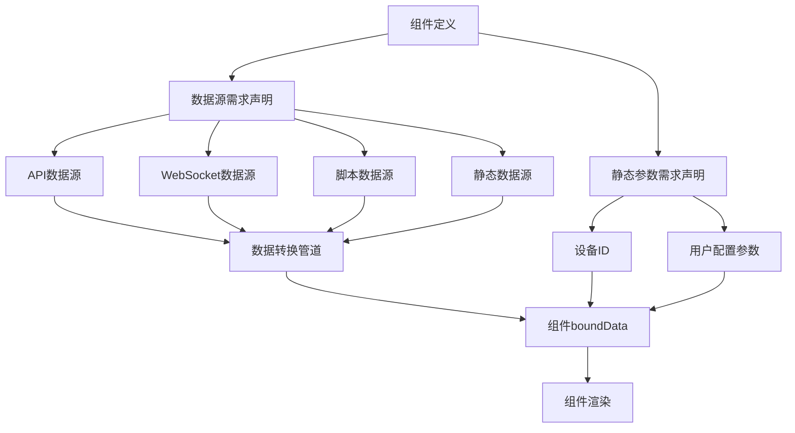
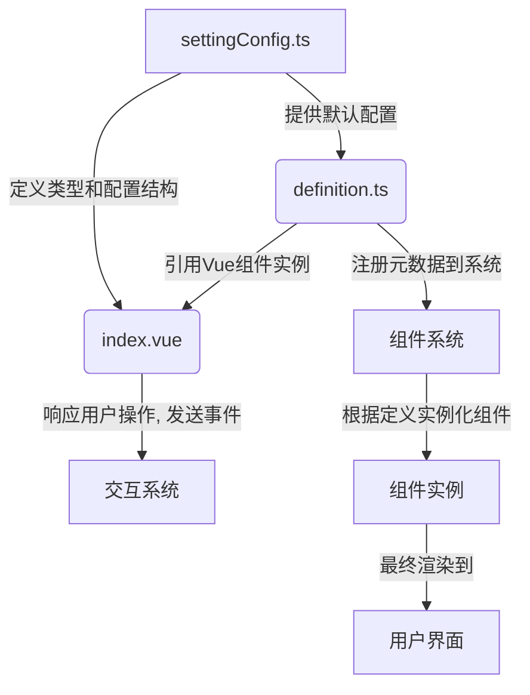

# Card 2.1 组件开发指南（修正版）

> **🎯 目标**：看了这个指南就能开发出合适的组件！

## 📋 目录

- [快速入门](#快速入门)
- [三文件架构标准](#三文件架构标准)
- [数据源系统](#数据源系统)
- [交互系统](#交互系统)
- [属性暴露机制](#属性暴露机制)
- [配置表单系统](#配置表单系统)
- [权限配置](#权限配置)
- [最佳实践](#最佳实践)

## 🚀 快速入门

### 第一步：理解 Card 2.1 系统

Card 2.1 是一个完全重构的组件系统，具备以下核心特性：

- **三文件架构**：清晰分离组件逻辑、配置定义和元数据。
- **类型安全**：完整的 TypeScript 类型定义。
- **数据驱动**：支持多种数据源和响应式数据绑定。
- **交互丰富**：内置交互系统，支持组件间联动。
- **属性暴露**：组件属性可被其他组件监听和绑定。
- **权限控制**：基于用户角色的组件访问控制。

### 第二步：创建你的第一个组件

```bash
# 创建组件目录
mkdir -p src/card2.1/components/my-widget

# 创建三个核心文件
touch src/card2.1/components/my-widget/index.vue        # 主组件
touch src/card2.1/components/my-widget/definition.ts   # 组件元数据定义
touch src/card2.1/components/my-widget/settingConfig.ts # 组件配置定义
```

## 🏗️ 三文件架构标准

Card 2.1 采用创新的“三文件架构”标准，旨在实现组件的高度内聚和低耦合，提升开发效率和可维护性。每个组件由三个核心文件组成，各司其职。

### 设计理念

- **职责清晰**：每个文件都有明确的用途，UI渲染、元数据定义和配置结构完全分离。
- **关注点分离**：开发者可以专注于特定任务，而无需在单个庞大文件中切换上下文。
- **易于维护**：模块化结构使代码更易于理解、调试和扩展。
- **自动化集成**：标准化的结构便于自动化工具进行代码生成、检查和文档化。

### 文件结构详解

以一个名为 `my-component` 的组件为例，其目录结构如下：

```
my-component/
├── index.vue          # 核心：组件的 UI 渲染和交互逻辑
├── settingConfig.ts   # 核心：组件的配置项定义和类型
└── definition.ts      # 核心：组件的元数据和系统集成定义
```

---

### 1. `index.vue` - UI 与交互层

这是组件的核心，负责所有与视图相关的任务。

- **职责**：
    - **UI 渲染**：使用 Vue 模板语法构建组件的 HTML 结构。
    - **样式**：定义组件的私有样式（scoped CSS）。
    - **用户交互**：处理用户的输入事件（如点击、悬停）。
    - **内部状态管理**：管理组件自身的、不需外部感知的状态。
    - **Props 接收**：接收来自父组件或系统的配置和数据。

- **关键要点**：
    - **逻辑分离**：复杂的业务逻辑应抽离到独立的 Hooks 或 `script` 部分。
    - **类型安全**：使用 TypeScript (`<script setup lang="ts">`) 为 `props` 和 `emits` 提供严格的类型定义。
    - **响应式数据**：充分利用 Vue 3 的 `computed` 和 `reactive` API 处理动态数据。
    - **事件派发**：通过 `defineEmits` 定义并派发事件，与外部系统（如交互系统）通信。

---

### 2. `settingConfig.ts` - 配置定义层

此文件是组件与配置系统之间的桥梁，定义了组件的可配置项。

- **职责**：
    - **类型定义**：定义组件自定义配置（`Customize`）的 TypeScript 接口。
    - **设置项配置**：声明组件在设置面板中展示的表单控件（如输入框、颜色选择器）。
    - **默认值**：提供所有配置项的默认值。
    - **数据验证**：可配置基本的验证规则。

- **关键要点**：
    - **标准化导出**：必须导出一个名为 `settingConfig` 的配置对象。
    - **配置生成器**：使用 `@/card2.1/types/setting-config` 提供的 `createSetting` 等辅助函数创建标准化的配置结构。
    - **接口与实现分离**：`settingConfig.ts` 只定义“需要什么配置”，而配置界面的具体实现则由 `setting.vue`（如果需要自定义界面）完成。

---

### 3. `definition.ts` - 元数据定义层

此文件定义了组件的“身份”信息，用于在系统中注册和展示。

- **职责**：
    - **基础信息**：组件的唯一类型（`componentType`）、名称、描述、标签等。
    - **视觉信息**：在组件市场中展示的图标和封面图。
    - **布局配置**：默认的宽度、高度和布局约束。
    - **数据源配置**：声明组件所需的数据源类型和字段。
    - **交互能力**：声明组件支持的事件（`events`）和可执行的动作（`actions`）。
    - **权限定义**：定义访问该组件所需的权限点。

- **关键要点**：
    - **唯一标识**：`componentType` 是组件的唯一 ID，必须保证在系统中不重复。
    - **自动化注册**：系统会根据此文件的导出自动发现和注册组件。
    - **能力声明**：交互系统和数据源系统会依据此文件中的声明来为组件提供相应的功能。

## 组件分类指南

为了更好地组织和管理组件，Card 2.1 系统根据组件的功能和用途，将其划分为以下几大类。在开发新组件时，请根据其核心职责，将其归入最合适的分类。

### 1. 数据展示类 (Data Display)

- **核心职责**：以各种形式可视化数据，如图表、列表、数值面板等。
- **特点**：
    - 通常与数据源紧密集成。
    - 重点在于信息的清晰传达。
    - 交互通常较为简单，如悬停提示、点击钻取。
- **示例**：
    - `ChartComponent` (图表)
    - `ValuePanel` (指标卡)
    - `StatusList` (状态列表)

### 2. 容器与布局类 (Container & Layout)

- **核心职责**：提供结构和布局，用于容纳其他组件。
- **特点**：
    - 自身通常没有复杂的业务逻辑。
    - 重点在于布局管理和响应式设计。
    - 可提供插槽（Slot）或特定区域供其他组件放置。
- **示例**：
    - `Grid` (栅格布局)
    - `Tabs` (标签页)
    - `Card` (卡片容器)

### 3. 用户输入类 (User Input)

- **核心职责**：收集用户的输入和操作，如表单、开关、按钮等。
- **特点**：
    - 交互性强，是用户与系统沟通的主要渠道。
    - 通常会触发大量的交互事件。
    - 需要完善的输入验证和状态管理。
- **示例**：
    - `Button` (按钮)
    - `Form` (表单)
    - `DatePicker` (日期选择器)

### 4. 导航类 (Navigation)

- **核心职责**：引导用户在不同页面或视图之间跳转。
- **特点**：
    - 通常与路由系统或页面管理逻辑关联。
    - 交互行为明确，主要是链接或跳转动作。
- **示例**：
    - `Menu` (菜单)
    - `Breadcrumb` (面包屑)
    - `Pagination` (分页)

### 5. 媒体与视觉类 (Media & Visual)

- **核心职责**：展示图片、视频或实现特定的视觉效果。
- **特点**：
    - 侧重于视觉表现力。
    - 可能涉及资源加载和性能优化。
- **示例**：
    - `Image` (图片)
    - `VideoPlayer` (视频播放器)
    - `Carousel` (轮播图)

### 6. 业务功能类 (Business Function)

- **核心职责**：封装特定的、完整的业务流程或功能模块。
- **特点**：
    - 具有较高的复杂度和内聚性。
    - 可能是由多个基础组件组合而成。
    - 与具体的业务场景强相关。
- **示例**：
    - `DeviceControlPanel` (设备控制面板)
    - `AlarmList` (告警列表)
    - `UserLogin` (用户登录模块)
      defaultValue: ''
    }),

    createSetting(SettingControlType.DYNAMIC_TAGS, '指标列表', 'metricsList', {
      group: '设备配置',
      placeholder: '请输入指标名称',
      defaultValue: []
    }),

    // 组件特定设置
    createSetting(SettingControlType.INPUT, '组件标题', 'customize.title', {
      group: '内容设置',
      placeholder: '请输入组件标题',
      defaultValue: '我的组件'
    }),

    createSetting(SettingControlType.TEXTAREA, '展示内容', 'customize.content', {
      group: '内容设置',
      placeholder: '请输入展示内容',
      defaultValue: '这是一个自定义组件'
    }),

    createSetting(SettingControlType.COLOR_PICKER, '主题颜色', 'customize.themeColor', {
      group: '样式设置',
      defaultValue: '#2080f0'
    }),

    createSetting(SettingControlType.SELECT, '显示模式', 'customize.displayMode', {
      group: '显示设置',
      options: [
        { label: '简单', value: 'simple' },
        { label: '详细', value: 'detailed' },
        { label: '紧凑', value: 'compact' }
      ],
      defaultValue: 'simple'
    }),

    createSetting(SettingControlType.SWITCH, '显示边框', 'customize.showBorder', {
      group: '样式设置',
      defaultValue: true
    })
  ],

  // 默认自定义配置
  customConfig: createCustomConfig<MyWidgetCustomize>('my-widget', {
    title: '我的组件',
    content: '这是一个自定义组件',
    themeColor: '#2080f0',
    displayMode: 'simple',
    showBorder: true
  })
}

/**
 * 导出类型定义供外部使用
 */
export type MyWidgetConfig = CustomConfig<MyWidgetCustomize>
```

### 3. definition.ts - 组件定义

```typescript
/**
 * my-widget 组件定义
 * 新三文件结构 - 标准组件模板
 */

import type { ComponentDefinition } from '@/card2.1/core/types'
import MyWidgetComponent from './index.vue'
import { myWidgetSettingConfig } from './settingConfig'
import { componentRegistry } from '@/card2.1/core/component-registry'

/**
 * my-widget 组件定义
 */
const myWidgetDefinition: ComponentDefinition = {
  // 基础信息
  type: 'my-widget',
  name: '我的组件',
  description: '这是一个示例组件，展示Card 2.1的基本功能',
  category: '数据展示',
  mainCategory: '自定义',
  subCategory: '展示组件',
  icon: `<svg viewBox="0 0 24 24" fill="currentColor"><path d="M12 2L2 7v10c0 5.55 3.84 9.74 9 11 5.16-1.26 9-5.45 9-11V7l-10-5z"/></svg>`,
  version: '2.1.0',
  author: '开发者',

  // 组件实现
  component: MyWidgetComponent,

  // 默认配置
  config: myWidgetSettingConfig.customConfig,

  // 标签
  tags: ['example', 'widget', 'demo'],

  // 权限控制
  permission: '不限'
}

// 注册组件到组件注册中心
componentRegistry.registerComponent(myWidgetDefinition, myWidgetSettingConfig)
export default myWidgetDefinition
```

## 核心系统：组件注册 (`component-registry.ts`)

`component-registry.ts` 是 Card 2.1 系统的中央枢纽，负责管理所有组件的生命周期。它提供了一个单例 `componentRegistry`，用于注册、查询和管理所有卡片组件的定义。

### 主要职责

1.  **集中注册**:
    - 通过 `registerComponent` 方法，将 `definition.ts` 中的组件定义注册到系统中。
    - `enhancedAutoRegister` 函数会自动扫描 `src/card2.1/components` 目录，并调用 `registerComponent` 来实现组件的自动注册，无需手动导入。

2.  **组件查询**:
    - 提供 `getComponentByName`、`getComponentsByGroup` 等方法，允许系统根据名称或分类快速查找组件。

3.  **端口隔离 (Port Isolation)**:
    - 这是注册表的一个关键特性。它确保每个组件实例都拥有独立的状态管理器（如 Pinia store），即使它们是同一组件的不同实例。这可以防止组件间的状态污染。

4.  **字段自动注入**:
    - 在组件注册时，系统会自动向组件的 `props` 中注入 `deviceId` 和 `metricsList` 字段。这使得组件能够自动感知其所在的设备上下文，并获取与该设备关联的度量数据，极大地简化了数据绑定过程。

通过这种方式，组件注册表不仅简化了组件的开发和管理，还通过端口隔离和自动字段注入等高级功能，增强了系统的稳定性和可扩展性。

## 核心系统：属性暴露 (`property-exposure.ts`)

`property-exposure.ts` 文件是实现 Card 2.1 动态数据绑定和组件间交互的关键。它负责自动发现、注册和管理组件的所有可暴露属性，使得这些属性可以在系统中的任何地方被监听或修改。

### `enhancedAutoRegister` 的双重职责

之前提到的 `enhancedAutoRegister` 函数不仅负责注册组件定义，它还有一个更强大的功能：**自动注册组件的可绑定属性**。它通过以下两种方式实现：

1.  **基于 `settingConfig.ts` 的静态分析**:
    - 函数会深度分析 `settingConfig.ts` 文件中定义的每一个配置项。
    - 对于每个配置项，它会自动创建一个对应的“可暴露属性”，并将其注册到全局的 `propertyExposureRegistry` 中。
    - 它还会根据 `settingConfig` 中的类型定义（如 `ControlType.Text`、`ControlType.Number`）**自动推断属性的数据类型**（`string`, `number` 等），从而减少了手动定义类型的工作量。

2.  **基于组件 `props` 的动态检测**:
    - 除了静态配置，该函数还会检查组件自身的 `props` 定义。
    - 它会自动将这些 `props` 也注册为可暴露属性，确保了组件的所有输入参数都能参与数据绑定。

### 主要优势

- **自动化与零配置**：开发者只需在 `settingConfig.ts` 中定义好配置项，属性的暴露和类型定义几乎是全自动的，无需编写额外的模板代码。
- **动态扩展**：该机制不仅处理基础配置，还能自动注册系统内置的“基础配置属性”（如卡片位置、尺寸等），并为这些属性设置监听器，实现了真正的动态化和响应式布局。
- **统一管理**：所有组件的属性都被集中到 `propertyExposureRegistry` 中进行管理，为后续的交互系统、数据绑定和第三方扩展提供了坚实的基础。

这个强大的属性暴露系统是 Card 2.1 区别于传统组件开发模式的核心特征之一，它极大地提升了开发效率和系统的灵活性。

## 数据源系统

数据源系统是 Card 2.1 的核心基石，它通过**配置驱动**的设计理念，为组件提供了强大而灵活的数据获取与管理能力。开发者只需声明数据需求，系统即可自动完成数据绑定、类型检查和响应式更新。

### 核心理念

- **配置驱动**：组件通过 `ComponentDefinition` 声明其数据需求，而非在代码中硬编码数据获取逻辑。
- **类型安全**：完整的 TypeScript 支持，确保数据在整个生命周期中的一致性和可预测性。
- **响应式更新**：系统自动处理数据变化，并高效地重新渲染相关组件。
- **多种数据源**：内置支持静态数据、API、WebSocket 和自定义脚本，满足不同场景的需求。

### 数据源架构



### 数据源类型详解

#### 1. StaticDataSource (静态数据源)

**适用场景**：固定配置、演示数据、默认值。

```typescript
// 在 ComponentDefinition 中配置
const staticDataSource = {
  key: 'displayData',
  name: '显示数据',
  type: 'static',
  config: {
    data: {
      title: '静态标题',
      metrics: [{ name: '温度', value: 25.6, unit: '°C' }]
    }
  }
};
```

#### 2. ApiDataSource (API数据源)

**适用场景**：后端数据获取、实时查询、参数化请求。

```typescript
// 在 ComponentDefinition 中配置
const apiDataSource = {
  key: 'deviceMetrics',
  name: '设备指标',
  type: 'api',
  config: {
    url: '/api/device/{{deviceId}}/metrics', // 支持模板变量
    method: 'GET',
    params: { interval: '1h' },
    refreshInterval: 30000, // 30秒刷新
    retryCount: 3 // 失败重试3次
  }
};
```

#### 3. WebSocketDataSource (WebSocket数据源)

**适用场景**：实时数据推送、事件监听、状态同步。

```typescript
// 在 ComponentDefinition 中配置
const websocketDataSource = {
  key: 'realtimeMetrics',
  name: '实时指标',
  type: 'websocket',
  config: {
    url: 'wss://api.example.com/ws/device/{{deviceId}}/realtime',
    // 可选的消息过滤和转换
    messageFilter: (message: any) => message.type === 'metrics_update',
    messageTransform: (message: any) => ({ value: message.data.value })
  }
};
```

#### 4. ScriptDataSource (脚本数据源)

**适用场景**：复杂数据计算、多数据源聚合、业务逻辑处理。

```typescript
// 在 ComponentDefinition 中配置
const scriptDataSource = {
  key: 'calculatedData',
  name: '计算数据',
  type: 'script',
  config: {
    script: `
      // 可通过 await getComponentData('componentId') 获取其他组件数据
      const tempData = await getComponentData('temp-sensor');
      const humData = await getComponentData('hum-sensor');
      
      // 执行复杂计算
      const comfortIndex = (tempData.value * 0.6 + humData.value * 0.4);
      
      return { comfortIndex };
    `,
    dependencies: ['temp-sensor', 'hum-sensor'] // 声明依赖项
  }
};
```

### 数据绑定与使用

1.  **声明需求**：在组件的 `definition.ts` 文件中，通过 `dataSources` 和 `staticParams` 数组声明所需的数据。

2.  **注入数据**：系统会自动处理数据源的请求和更新，并将结果通过 `boundData` 这个 prop 注入到组件中。

3.  **在组件中使用**：

```vue
<script setup lang="ts">
import { computed } from 'vue';

interface Props {
  // ... 其他 props
  // 数据绑定系统自动注入的数据
  boundData?: Record<string, any>;
}

const props = defineProps<Props>();

// 响应式地访问数据
const deviceMetrics = computed(() => props.boundData?.deviceMetrics || []);
const deviceId = computed(() => props.boundData?.deviceId || '未知设备');
</script>

<template>
  <div>
    <h3>设备: {{ deviceId }}</h3>
    <ul>
      <li v-for="metric in deviceMetrics" :key="metric.id">
        {{ metric.name }}: {{ metric.value }}
      </li>
    </ul>
  </div>
</template>
```

### 最佳实践

- **明确数据需求**：在 `definition.ts` 中清晰、完整地声明所有数据依赖。
- **合理设置刷新率**：为 `ApiDataSource` 设置合理的 `refreshInterval`，避免不必要的服务器请求。
- **添加错误处理**：在组件中检查 `boundData.__error` 字段，并向用户提供友好的错误提示。
- **利用脚本数据源**：将复杂的、跨组件的数据处理逻辑封装在 `ScriptDataSource` 中，保持组件内部逻辑的纯粹。

### 5. 交互系统 (Interaction System)

Card 2.1 交互系统是一个基于事件驱动的组件交互框架，它允许开发者通过声明式配置，轻松实现组件间的动态通信、状态同步和行为响应。该系统的核心是单例的 `InteractionManager`，它统一管理所有组件的交互配置、事件触发和状态变更。

#### 5.1 核心理念

- **事件驱动**: 组件通过触发和监听标准化的事件（如 `click`, `hover`, `dataChange`）来进行通信。
- **声明式配置**: 开发者在组件的定义文件中声明其支持的交互行为，而不是在组件代码中硬编码逻辑。
- **响应式属性绑定**: 支持将一个组件的属性动态绑定到另一个组件的属性上，当源属性变化时，目标属性会自动更新。
- **类型安全**: 所有交互相关的配置和 API 都提供了严格的 TypeScript 类型定义，确保开发过程中的类型安全。

#### 5.2 核心架构

交互系统的核心是 `InteractionManager` 单例，它负责：

- **注册与管理**: 注册组件的交互配置，并在组件销毁时进行清理。
- **事件总线**: 作为全局事件总线，处理事件的触发和分发。
- **状态管理**: 维护和更新所有组件的交互状态和属性。
- **属性解析**: 解析跨组件的属性绑定表达式。

```typescript
import { interactionManager } from '@/card2.1/core/interaction-manager';

// 注册组件的交互配置
interactionManager.registerComponent(componentId, interactionConfigs);

// 触发一个交互事件
interactionManager.triggerEvent(componentId, 'click', eventData);

// 监听其他组件的属性变化
const unwatch = interactionManager.watchComponentProperty(
  'target-component-id',
  'customize.value',
  (newValue) => {
    console.log('目标组件的值变为:', newValue);
  }
);
```

#### 5.3 交互配置详解

一个完整的交互由 **事件 (Event)** 和 **响应 (Response)** 组成。当指定的事件发生时，系统会执行一个或多个响应动作。

```typescript
// 交互配置的基本结构
export interface InteractionConfig {
  event: 'click' | 'hover' | 'dataChange'; // 触发事件的类型
  responses: InteractionResponse[];         // 响应动作列表
  name?: string;                            // 交互名称，便于调试
  watchedProperty?: string;                 // 当 event 为 dataChange 时，指定监听的属性
  condition?: DataChangeCondition;          // 触发条件
}

// 响应动作的结构
export interface InteractionResponse {
  action: 'jump' | 'modify'; // 动作类型
  jumpConfig?: JumpConfig;     // 跳转动作的配置
  modifyConfig?: ModifyConfig; // 修改属性动作的配置
  delay?: number;              // 延迟执行（毫秒）
}
```

#### 5.4 具体动作类型

##### 1. `jump` (URL 跳转)

用于页面跳转，支持跳转到外部 URL 或系统内部的菜单路径。

```typescript
// 跳转到外部网站
const externalJump: InteractionResponse = {
  action: 'jump',
  jumpConfig: {
    jumpType: 'external',
    url: 'https://example.com',
    target: '_blank', // 在新标签页打开
  },
};

// 跳转到内部页面
const internalJump: InteractionResponse = {
  action: 'jump',
  jumpConfig: {
    jumpType: 'internal',
    internalPath: '/dashboard/panel',
  },
};
```

##### 2. `modify` (修改组件属性)

用于动态修改目标组件的任意属性，是实现组件间联动的主要方式。

```typescript
// 点击按钮时，修改另一个组件的标题
const modifyTitle: InteractionResponse = {
  action: 'modify',
  modifyConfig: {
    targetComponentId: 'target-component-123', // 目标组件的 ID
    targetProperty: 'customize.title',         // 目标属性的路径
    updateValue: '新的标题内容',             // 新的属性值
  },
};
```

#### 5.5 `dataChange` 事件与条件触发

`dataChange` 事件是交互系统中最强大的功能之一。它允许组件监听自身或其他组件的属性变化，并在满足特定条件时触发响应。

```typescript
// 当温度传感器的值（customize.value）大于 30 度时，将警示灯（alert-light-456）的颜色变为红色
const tempAlertConfig: InteractionConfig = {
  event: 'dataChange',
  watchedProperty: 'customize.value', // 监听当前组件的 value 属性
  condition: {
    operator: 'greaterThan', // 操作符：大于
    value: 30,               // 比较值
  },
  responses: [
    {
      action: 'modify',
      modifyConfig: {
        targetComponentId: 'alert-light-456',
        targetProperty: 'customize.color',
        updateValue: '#ff0000',
      },
    },
  ],
};
```

支持的比较操作符包括：`equals`, `notEquals`, `greaterThan`, `lessThan`, `contains` 等。

#### 5.6 属性绑定系统

在配置交互时，通常需要引用其他组件的属性值。属性绑定系统通过特定的表达式格式 `componentInstanceId.propertyPath` 来实现这一点。

```typescript
// 在跳转 URL 中动态插入当前选择的设备 ID
const dynamicJump: InteractionResponse = {
  action: 'jump',
  jumpConfig: {
    jumpType: 'external',
    // URL 中的 {{...}} 部分将被动态解析和替换
    url: 'https://example.com/devices/{{device-selector-789.customize.selectedDeviceId}}',
  },
};
```

当 `device-selector-789` 组件的 `selectedDeviceId` 属性变化时，这个跳转链接也会自动更新。

#### 5.7 最佳实践

- **明确命名**: 为每个 `InteractionConfig` 提供一个清晰的 `name`，如“点击跳转到设备详情”，便于调试和维护。
- **使用条件**: 善用 `condition` 来精确控制交互的触发时机，避免不必要的计算和行为。
- **性能考量**: 对于频繁触发的 `dataChange` 事件，确保其响应逻辑足够高效，避免引起性能问题。
- **逻辑分离**: 将复杂的业务逻辑封装在 `ScriptDataSource` 中，让交互系统专注于状态同步和行为触发，保持职责单一。

---
```

### 6. 属性暴露系统 (Property Exposure System)

属性暴露系统是 Card 2.1 实现组件间通信和动态配置的核心机制。它允许每个组件明确声明哪些内部属性可以被外部系统（如交互系统、数据源系统或其他组件）访问、监听和修改。该系统极大地增强了组件的封装性和互操作性。

#### 6.1 核心理念

- **声明式暴露**: 组件通过配置文件（`definition.ts` 或 `settingConfig.ts`）声明其可暴露的属性，而不是通过 API 调用。
- **自动注册**: 系统能够基于组件的 `settingConfig.ts` 文件自动分析并注册可供绑定的属性，极大地简化了开发者的工作。
- **类型安全**: 所有暴露的属性都具有明确的 TypeScript 类型，确保了在属性绑定和交互过程中的类型安全。
- **UI 友好**: 暴露的属性信息（如名称、描述、类型）可被用于自动生成配置界面，让用户可以直观地进行组件配置和交互设置。

#### 6.2 自动注册机制

这是属性暴露系统最便捷的特性。当一个组件被注册到系统时，`ComponentRegistry` 会自动调用 `enhancedAutoRegister` 函数，该函数会：

1.  **解析 `settingConfig.ts`**: 分析 `settings` 数组中的每一个配置项。
2.  **提取属性信息**: 将每个配置项的 `field` 作为属性路径（如 `customize.title`），`label` 作为显示名称，并根据 `component` 类型（如 `input`, `color-picker`）推断出属性的数据类型。
3.  **注册属性**: 将这些解析出的属性注册到全局的 `PropertyExposureRegistry` 中。

```typescript
// src/card2.1/components/my-widget/settingConfig.ts
const myWidgetSettingConfig = {
  componentType: 'my-widget',
  settings: [
    {
      field: 'customize.title',
      label: '图表标题',
      component: 'input',
    },
    {
      field: 'customize.themeColor',
      label: '主题颜色',
      component: 'color-picker',
    }
  ]
};

// 当组件注册时，以上配置会自动暴露两个属性：
// 1. customize.title (类型: string)
// 2. customize.themeColor (类型: color)
```

#### 6.3 手动与增强注册

除了完全自动注册，开发者也可以手动声明更复杂的属性信息。

```typescript
// src/card2.1/components/my-widget/definition.ts
import { createProperty } from '@/card2.1/core/property-exposure';

export const myWidgetDefinition = {
  type: 'my-widget',
  name: '我的组件',
  // ...
  interactionCapability: {
    // ...
    // 手动声明一些 settingConfig 中不存在或需要更详细描述的属性
    listenableProperties: [
      createProperty('realtimeValue', '实时数据值', 'number', {
        description: '由 WebSocket 推送的实时数据',
        group: '数据',
        isCore: true, // 标记为核心属性，在配置界面中优先显示
      }),
    ],
  },
};
```

在组件注册时，系统会将自动注册的属性和手动声明的 `listenableProperties` 进行合并，形成完整的属性列表。

#### 6.4 属性的结构与分组

为了便于在 UI 中展示和管理，每个暴露的属性都包含丰富的元数据。

```typescript
export interface ListenableProperty {
  name: string;          // 属性路径 (e.g., 'customize.title')
  label: string;         // 显示名称 (e.g., '标题')
  type: PropertyDataType;// 数据类型 (e.g., 'string', 'number', 'color')
  description?: string;   // 详细描述
  group?: string;         // 分组 (e.g., '基础样式', '数据配置')
  isCore?: boolean;       // 是否为核心属性
  enum?: { label: string; value: any }[]; // 如果是枚举类型，提供选项
}
```

通过 `group` 字段，可以在配置面板中将属性分门别类地展示给用户，提升可配置性。

#### 6.5 如何在交互和数据绑定中使用

属性暴露系统的最终目的是服务于交互和数据绑定。一旦一个属性被暴露，就可以在系统的任何地方通过 `componentInstanceId.propertyPath` 的格式来引用它。

- **交互系统**: 在 `modify` 动作或 `dataChange` 的 `condition` 中，使用属性路径来指定目标或监听的属性。
- **数据源系统**: 在 API 或脚本数据源的参数配置中，使用属性绑定表达式来动态传递参数。

```typescript
// 示例：一个交互配置
const interactionConfig = {
  event: 'dataChange',
  watchedProperty: 'customize.value', // 监听当前组件暴露的 'value' 属性
  responses: [
    {
      action: 'modify',
      modifyConfig: {
        targetComponentId: 'target-component-123',
        targetProperty: 'customize.title', // 修改目标组件暴露的 'title' 属性
        updateValue: '值已更新',
      },
    },
  ],
};
```

#### 6.6 最佳实践

- **优先使用自动注册**: 对于绝大部分配置项，让系统从 `settingConfig.ts` 自动注册属性是最简单高效的方式。
- **合理分组**: 为手动声明的属性提供清晰的 `group`，如“内容”、“样式”、“数据”，以改善配置体验。
- **标记核心属性**: 将最常用、最重要的属性标记为 `isCore: true`，使其在 UI 中更易被发现。
- **提供描述**: 为复杂的属性提供 `description`，解释其用途和影响。

## 🛠️ 配置表单系统

Card 2.1 使用 `AutoFormGenerator` 自动生成配置表单：

### 支持的控件类型

```typescript
export enum SettingControlType {
  INPUT = 'input',
  TEXTAREA = 'textarea',
  SELECT = 'select',
  SWITCH = 'switch',
  SLIDER = 'slider',
  COLOR_PICKER = 'color-picker',
  DATE_PICKER = 'date-picker',
  TIME_PICKER = 'time-picker',
  DYNAMIC_TAGS = 'dynamic-tags',
  NUMBER_INPUT = 'number-input'
}
```

### 高级配置示例

```typescript
const advancedSettings = [
  // 条件显示
  createSetting(SettingControlType.SWITCH, '启用高级模式', 'customize.advancedMode'),
  
  createSetting(SettingControlType.INPUT, '高级参数', 'customize.advancedParam', {
    visibleWhen: (config) => config.customize?.advancedMode === true,
    validation: {
      required: true,
      minLength: 5
    }
  }),
  
  // 动态选项
  createSetting(SettingControlType.SELECT, '设备类型', 'customize.deviceType', {
    dynamicOptions: async () => {
      const devices = await fetchDeviceTypes()
      return devices.map(d => ({ label: d.name, value: d.id }))
    }
  })
]
```

### 核心系统：权限管理 (Permission System)

平台采用先进的混合权限模型，结合了**基于角色的访问控制 (RBAC)** 和**基于属性的访问控制 (ABAC)**，以实现对组件和数据的精细化、动态化权限管理。

#### 核心理念

- **混合模型 (RBAC + ABAC)**:
  - **RBAC**: 通过预定义的用户角色（如系统管理员、租户管理员、普通用户）实现分层权限控制。
  - **ABAC**: 基于用户属性（如部门、地理位置）和资源属性（如数据敏感等级）进行动态、上下文感知的访问决策。
- **声明式配置**: 权限规则在组件的 `settingConfig.ts` 文件中进行声明式配置，使权限逻辑与业务代码分离。
- **默认安全**: 未明确授权的访问默认为拒绝，确保系统安全性。

#### 主要构成

1.  **角色系统 (Role System)**:
    - 预设角色: `SYS_ADMIN`, `TENANT_ADMIN`, `TENANT_USER`, `PUBLIC`，构成一个层级结构。
    - 自定义角色: 支持扩展以满足特定的业务需求。

2.  **组件级权限 (Component-Level Permissions)**:
    - **操作权限**: 控制用户对组件的 `view`, `edit`, `delete` 等基本操作。
    - **自定义动作**: 支持定义业务相关的特定动作权限（如 `device:control`）。
    - **动态检查**: 可编写 `dynamicPermissionCheck` 函数，根据实时上下文（如设备状态、操作时间）进行复杂的权限判断。

3.  **属性级权限 (Property-Level Permissions)**:
    - **访问控制**: 精确控制每个暴露属性的读写权限。
    - **属性过滤**: `propertyFilter` 可根据用户角色动态过滤敏感字段。
    - **ABAC 规则**: 为敏感数据定义基于属性的访问策略，例如，只允许特定部门或具有特定安全等级的用户访问。

#### 配置示例 (`settingConfig.ts`)

```typescript
// settingConfig.ts
const devicePanelConfig: ComponentSettingConfig = {
  permissions: {
    // 基础角色权限
    view: ComponentPermission.TENANT_USER,
    edit: ComponentPermission.TENANT_ADMIN,
    // 自定义动作权限
    customPermissions: {
      'device:control': {
        permission: ComponentPermission.TENANT_USER,
        name: '设备控制'
      }
    },
    // 动态权限检查
    dynamicPermissionCheck: (action, user, context) => {
      if (action === 'device:control' && context.deviceStatus === 'maintenance') {
        return { allowed: false, reason: '设备维护中' };
      }
      return { allowed: true };
    }
  },
  propertyExposure: {
    exposedProperties: {
      sensitiveData: {
        permission: ComponentPermission.TENANT_ADMIN,
        // ABAC 规则
        attributeBasedAccess: {
          rules: [
            {
              name: '部门限制',
              condition: (user) => user.attributes?.department === 'R&D',
              denyReason: '仅研发部门可访问'
            }
          ]
        }
      }
    }
  }
};
```

#### 核心服务

- **`ComponentPermissionValidator`**: 权限验证的核心服务，用于检查用户对组件动作的权限。
- **`PropertyPermissionMiddleware`**: 属性访问的中间件，在读取或写入属性前进行权限校验。

> **深入阅读**
> 关于权限系统的详细配置、高级用法和完整示例，请参阅 `docs/permission-system.md`。

### 2. 组件开发

Card 2.1 的组件系统采用“三文件结构”标准，这是一种旨在实现关注点分离、提升代码可维护性、并增强开发效率的设计模式。通过将组件拆分为独立的 UI、配置和定义文件，我们可以确保每个部分都职责清晰。

#### 2.1 三文件架构详解

“三文件架构”是组件开发的核心标准。它将一个完整的组件拆分为以下三个（或更多）文件：

- **`index.vue`**: **UI 渲染层**。负责组件的视觉呈现和用户交互。它应该专注于“长什么样”和“如何操作”。
- **`settingConfig.ts`**: **配置定义层**。定义组件所有可配置的属性、事件、样式及其类型、默认值和校验规则。这是组件数据结构的“蓝图”。
- **`definition.ts`**: **系统集成层**。包含组件的元数据，如名称、类型、图标、数据源配置、权限规则等。它负责将组件“注册”到系统中。

##### 文件间协作关系



#### 2.2 文件职责与最佳实践

##### `index.vue` (UI渲染)

- **职责**:
    - 渲染组件的 HTML 结构。
    - 处理用户输入和交互事件（如点击、悬停）。
    - 接收 `customConfig` prop，并根据配置动态渲染视图。
    - 通过 `emits` 发送标准化事件，与交互系统通信。
- **最佳实践**:
    - 保持模板（template）简洁，复杂逻辑抽离到计算属性或方法中。
    - 使用 TypeScript 定义 `props` 和 `emits` 的类型。
    - 样式使用 CSS 变量，以支持主题系统。
    - 避免在此文件处理复杂的业务逻辑。

##### `settingConfig.ts` (配置定义)

- **职责**:
    - 定义组件可自定义的属性接口（如 `MyComponentCustomize`）。
    - 定义完整的组件配置类型（如 `MyComponentConfig`）。
    - 创建并导出 `myComponentSettingConfig` 对象，该对象使用 `defineSettingConfig` API 定义了配置项的分组、标签、控件类型（如输入框、颜色选择器）和校验规则。
    - 提供获取默认配置的函数。
- **最佳实践**:
    - 为每个配置项提供详细的 JSDoc 注释。
    - 将配置项按功能逻辑分组（`group`），提升用户体验。
    - 提供合理的默认值，确保组件在无配置时也能正常工作。

##### `definition.ts` (系统集成)

- **职责**:
    - 定义组件的唯一 `type` 和人类可读的 `name`。
    - 声明组件的视觉信息，如 `icon`。
    - 引用 `index.vue` 作为组件的实现。
    - 声明组件的交互能力（`emits` 和 `actions`）。
    - 配置数据源需求（`dataSource`）和权限（`permission`）。
    - 调用 `registerComponent` 将组件定义注册到系统中。
- **最佳实践**:
    - 元数据应尽可能全面、准确。
    - `example` 配置应提供一个功能完整的可用示例。
    - 交互事件和动作的命名应清晰、规范。

#### 2.3 组件分类

- **数据展示类**: 图表 (`Chart`)、列表 (`List`)、仪表盘 (`Gauge`) 等，专注于数据的可视化。
- **用户输入类**: 表单 (`Form`)、开关 (`Switch`)、选择器 (`Select`) 等，用于收集用户操作。
- **布局容器类**: 网格 (`Grid`)、卡片 (`Card`)、选项卡 (`Tabs`) 等，用于组织页面结构。
- **信息提示类**: 弹窗 (`Modal`)、通知 (`Notification`)、徽章 (`Badge`) 等，用于向用户传递信息。

#### 2.4 快速开始：创建你的第一个组件

1.  **创建文件结构**:
    在 `src/components/` 目录下创建一个新目录，例如 `MyComponent`，并包含以下文件：
    ```
    src/components/MyComponent/
    ├── index.vue           # UI
    ├── settingConfig.ts    # 配置定义
    └── definition.ts       # 系统元数据
    ```

2.  **定义配置 (`settingConfig.ts`)**:
    定义组件的 `props` 接口和 `settingConfig` 对象。

3.  **编写视图 (`index.vue`)**:
    实现组件的 Vue 模板和脚本，确保能响应 `customConfig` 的变化。

4.  **定义元数据 (`definition.ts`)**:
    填写组件的 `name`, `type`, `icon` 等信息，并引用其他文件，最后调用 `registerComponent`。

#### 2.5 开发检查清单

在开发和提交组件前，请对照以下清单进行检查：

- **`settingConfig.ts`**:
    - [ ] 类型接口是否完整？
    - [ ] JSDoc 注释是否清晰？
    - [ ] 配置项分组是否合理？
    - [ ] 默认值是否覆盖所有必填项？
- **`index.vue`**:
    - [ ] 是否正确处理了 `customConfig`？
    - [ ] CSS 是否使用了变量以支持主题？
    - [ ] 事件发送格式是否标准？
- **`definition.ts`**:
    - [ ] 元数据是否完整准确？
    - [ ] 交互能力声明是否正确？
    - [ ] 示例配置是否可用？

## 📋 最佳实践

### 1. 组件命名规范

```typescript
// ✅ 正确的命名
'temperature-gauge'     // 具体功能描述
'device-status-card'    // 清晰的业务含义
'real-time-chart'      // 明确的特性说明

// ❌ 错误的命名
'widget1'              // 无意义的命名
'temp'                // 过度缩写
'component'           // 过于通用
```

### 2. 类型定义规范

```typescript
// ✅ 完整的类型定义
export interface TemperatureGaugeCustomize {
  /** 温度阈值上限 */
  maxTemperature: number
  /** 温度阈值下限 */
  minTemperature: number
  /** 温度单位 */
  unit: 'celsius' | 'fahrenheit'
  /** 是否显示告警 */
  showAlert: boolean
}

// ❌ 不完整的类型定义
export interface BadCustomize {
  max: number        // 缺少注释和明确含义
  min: number
  unit: string       // 类型过于宽泛
  alert?: any        // 使用any类型
}
```

### 3. 性能优化

```typescript
// ✅ 使用计算属性缓存
const expensiveCalculation = computed(() => {
  if (!props.boundData?.metrics) return 0
  
  return props.boundData.metrics
    .filter(m => m.type === 'temperature')
    .reduce((sum, m) => sum + m.value, 0) / props.boundData.metrics.length
})

// ❌ 在模板中进行复杂计算
// {{ boundData.metrics.filter(...).reduce(...) }} // 每次渲染都计算
```

### 4. 错误处理

```vue
<script setup lang="ts">
const error = ref<string | null>(null)
const loading = ref(false)

const handleDataLoad = async () => {
  try {
    loading.value = true
    error.value = null
    
    // 数据加载逻辑
    await loadData()
  } catch (err) {
    error.value = err instanceof Error ? err.message : '加载失败'
    console.error('组件数据加载失败:', err)
  } finally {
    loading.value = false
  }
}
</script>

<template>
  <div class="widget">
    <div v-if="error" class="error-state">
      {{ error }}
    </div>
    <div v-else-if="loading" class="loading-state">
      加载中...
    </div>
    <div v-else class="content">
      <!-- 正常内容 -->
    </div>
  </div>
</template>
```

### 5. 主题系统集成

```vue
<style scoped>
.my-widget {
  /* ✅ 使用CSS变量 */
  color: var(--text-color);
  background: var(--card-color);
  border: 1px solid var(--border-color);
  
  /* ❌ 硬编码颜色 */
  /* color: #333333; */
  /* background: #ffffff; */
}

/* 深色主题适配 */
[data-theme="dark"] .my-widget {
  /* 深色主题下的特殊样式 */
  box-shadow: var(--box-shadow-dark);
}
</style>
```

---

## 🎯 总结

Card 2.1 组件开发遵循以下核心原则：

1. **三文件架构** - 清晰分离关注点
2. **类型安全** - 完整的TypeScript支持  
3. **配置驱动** - 声明式的数据源和交互配置
4. **自动化** - 自动属性暴露和表单生成
5. **权限控制** - 细粒度的访问控制
6. **主题集成** - 完整的主题系统支持

遵循这些最佳实践，你就能开发出高质量、可维护的Card 2.1组件！

---

**💡 提示**：这个修正版本确保了所有代码示例与实际的Card 2.1代码库保持一致。如果在开发过程中遇到任何问题，请参考实际的代码实现进行调整。