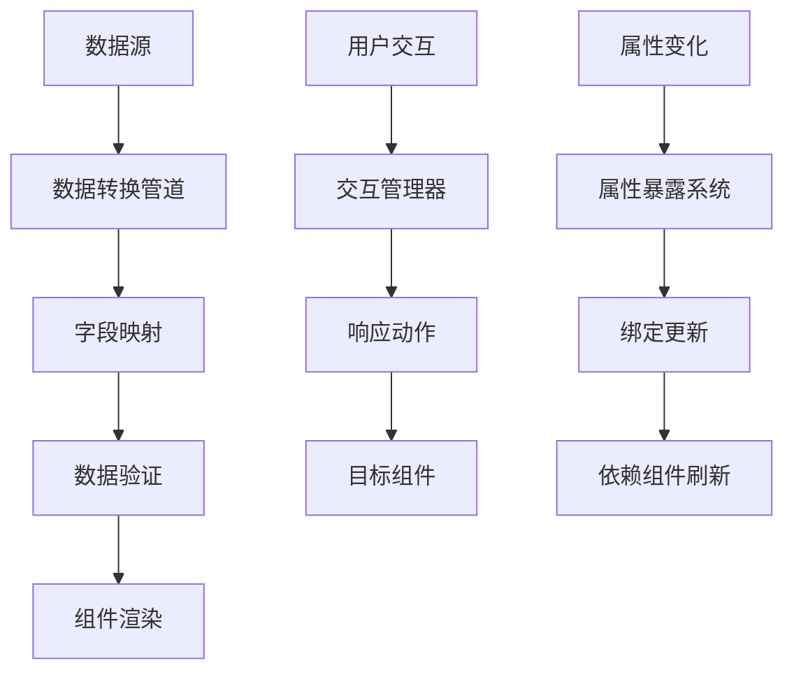

# Card 2.1 组件系统总览

> Card 2.1 是一个基于 Vue 3 + TypeScript 的下一代组件系统，提供完整的类型安全、数据驱动和交互能力。

## 🎯 系统特性

### 核心特性
- **三文件架构** - 清晰分离组件逻辑、配置定义和设置界面
- **类型安全** - 完整的 TypeScript 类型定义，开发时智能提示
- **数据驱动** - 支持静态数据、API、WebSocket、脚本等多种数据源
- **交互丰富** - 内置交互系统，支持点击、悬停、属性变化等事件
- **属性暴露** - 组件属性可被其他组件监听和绑定
- **权限控制** - 基于用户角色的组件访问控制

### 设计理念
1. **开发者友好** - 只需看一次文档就能完全掌握组件开发
2. **类型安全** - 严格的 TypeScript 类型定义，减少运行时错误
3. **可扩展** - 统一的架构模式，方便扩展和维护
4. **高性能** - 基于 Vue 3 Composition API，支持响应式数据更新

## 📁 组件分类

### 数据展示类
- `simple-display` - 简单静态展示组件
- `triple-data-display` - 三数据源展示组件
- `dual-data-display` - 双数据源展示组件

### 数据输入类
（待扩展）

### 图表可视化类
（待扩展）

### 控制交互类
（待扩展）

## 🏗️ 组件架构

### 三文件结构标准

每个 Card 2.1 组件都严格遵循三文件架构：

```
my-component/
├── index.vue          # 主组件 - UI渲染和业务逻辑
├── definition.ts      # 组件定义 - 注册信息、布局、数据需求
├── settingConfig.ts   # 配置定义 - 设置项和类型定义
├── setting.vue        # 设置界面 - 组件配置面板
└── index.ts          # 导出文件 - 统一对外接口
```

### 数据流架构



## 🔧 开发工具链

### 核心 API
- `ComponentDefinition` - 组件定义接口
- `ComponentSettingConfig` - 配置定义接口
- `CustomConfig` - 组件配置类型
- `AutoFormGenerator` - 自动表单生成器

### 管理器系统
- `componentRegistry` - 组件注册中心
- `interactionManager` - 交互管理器
- `propertyExposureRegistry` - 属性暴露注册中心
- `ComponentRequirementManager` - 组件需求管理器

### 数据源系统
- `StaticDataSource` - 静态数据源
- `ApiDataSource` - API 数据源
- `WebSocketDataSource` - WebSocket 数据源
- `ScriptDataSource` - 脚本数据源

## 📋 快速开始

### 1. 创建新组件

```bash
# 使用组件生成器（如果有的话）
npm run generate:component my-new-widget

# 或手动创建文件结构
mkdir -p src/card2.1/components/my-new-widget
```

### 2. 基本模板

```typescript
// settingConfig.ts
export interface MyWidgetCustomize {
  title: string
  content: string
  themeColor: string
}

export const myWidgetSettingConfig: ComponentSettingConfig<MyWidgetCustomize> = {
  componentType: 'my-widget',
  settings: [
    createSetting(SettingControlType.INPUT, '标题', 'customize.title', {
      defaultValue: '我的组件'
    })
  ],
  customConfig: createCustomConfig<MyWidgetCustomize>('my-widget', {
    title: '我的组件',
    content: '组件内容',
    themeColor: '#2080f0'
  })
}
```

```vue
<!-- index.vue -->
<template>
  <div class="my-widget" :style="{ '--theme-color': themeColor }">
    <h3>{{ title }}</h3>
    <p>{{ content }}</p>
  </div>
</template>

<script setup lang="ts">
import { computed } from 'vue'
import type { MyWidgetConfig } from './settingConfig'

interface Props {
  customConfig?: MyWidgetConfig
  componentId?: string
}

const props = defineProps<Props>()

const currentCustomize = computed(() => 
  props.customConfig?.customize || {
    title: '默认标题',
    content: '默认内容',
    themeColor: '#2080f0'
  }
)

const title = computed(() => currentCustomize.value.title)
const content = computed(() => currentCustomize.value.content)
const themeColor = computed(() => currentCustomize.value.themeColor)
</script>
```

### 3. 注册组件

```typescript
// definition.ts
const myWidgetDefinition: ComponentDefinition = {
  type: 'my-widget',
  name: '我的组件',
  description: '组件描述',
  category: '数据展示',
  component: MyWidgetComponent,
  configComponent: MyWidgetSetting,
  defaultConfig: myWidgetSettingConfig.customConfig
}

// 自动注册
componentRegistry.registerComponent(myWidgetDefinition)
componentRegistry.registerSettingConfig(myWidgetSettingConfig)
```

## 🎨 主题系统集成

所有 Card 2.1 组件都必须支持主题系统：

```scss
.my-widget {
  // ✅ 使用 CSS 变量
  background: var(--card-color);
  color: var(--text-color);
  border: 1px solid var(--border-color);
  
  // ❌ 避免硬编码颜色
  // background: #ffffff;
  // color: #333333;
}
```

## 🔗 组件间通信

### 事件通信
```typescript
// 发送事件
emit('click', {
  componentId: props.componentId,
  timestamp: new Date().toISOString()
})

// 监听事件（由父组件或系统处理）
```

### 属性绑定
```typescript
// 在 API 配置中绑定其他组件属性
const apiConfig = {
  url: '/api/device/{{comp-123.customize.deviceId}}/data',
  params: {
    startTime: 'comp-456.customize.startTime'
  }
}
```

### 交互响应
```typescript
// 配置交互响应
const interactionConfig = {
  event: 'click',
  responses: [{
    action: 'modify',
    modifyConfig: {
      targetComponentId: 'comp-789',
      targetProperty: 'backgroundColor',
      updateValue: '#ff6b6b'
    }
  }]
}
```

## 📊 性能优化

### 1. 响应式数据优化
```typescript
import { computed, shallowRef, markRaw } from 'vue'

// 使用计算属性缓存复杂计算
const computedStyles = computed(() => ({
  '--theme-color': props.customConfig?.customize.themeColor
}))

// 大数据使用 shallowRef
const largeDataSet = shallowRef(new Map())

// 静态数据使用 markRaw
const staticConfig = markRaw({ /* 配置数据 */ })
```

### 2. 组件懒加载
```typescript
import { defineAsyncComponent } from 'vue'

const MyWidget = defineAsyncComponent(() => import('./MyWidget.vue'))
```

### 3. 数据源优化
```typescript
// 配置合适的刷新间隔
const apiConfig = {
  refreshInterval: 30000, // 30秒刷新一次，避免过于频繁
  timeout: 10000,         // 10秒超时
  retryCount: 3          // 重试3次
}
```

## 🚀 下一步

1. 阅读 [开发指南](../DEVELOPMENT_GUIDE.md) 了解详细开发流程
2. 查看 [内置组件](./builtin-components.md) 学习最佳实践
3. 参考 [组件示例](./component-examples.md) 快速上手
4. 了解 [三文件结构](./component-structure.md) 架构细节

---

**💡 提示**: Card 2.1 系统设计的目标是让开发者能够快速、安全地创建高质量的组件。遵循文档中的最佳实践，你将能够创建出既美观又功能强大的组件！