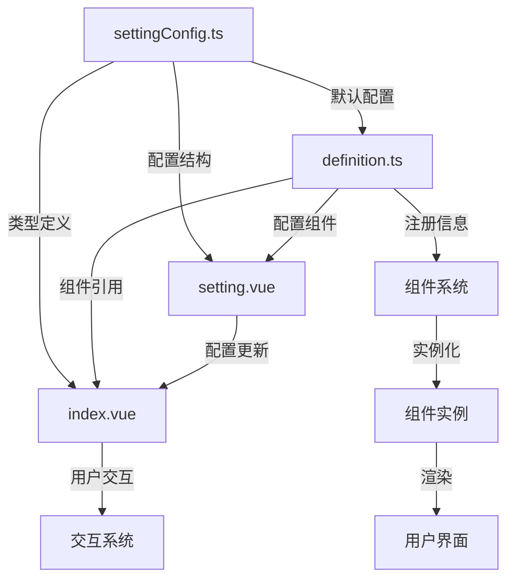

# Card 2.1 三文件结构标准

> 详细解释三文件架构的设计理念、文件职责和开发规范。

## 🎯 设计理念

三文件架构将组件开发的不同关注点进行清晰分离：

- **index.vue** - 专注于 UI 渲染和用户交互
- **definition.ts** - 专注于组件元数据和系统集成
- **settingConfig.ts** - 专注于配置结构和类型安全

这种分离带来的好处：
1. **职责清晰** - 每个文件都有明确的职责边界
2. **易于维护** - 修改配置不需要触及UI代码
3. **类型安全** - TypeScript 提供完整的类型检查
4. **可测试性** - 各部分可以独立测试

## 📁 文件结构详解

### 完整文件结构

```
my-component/
├── index.vue              # 主组件文件
├── definition.ts          # 组件定义文件  
├── settingConfig.ts       # 配置定义文件
├── setting.vue           # 设置界面文件
└── index.ts              # 统一导出文件
```

## 📄 文件职责详解

### 1. index.vue - 主组件文件

**职责**：UI渲染、用户交互、业务逻辑

```vue
<script setup lang="ts">
/**
 * 主组件只关注以下内容：
 * 1. UI渲染逻辑
 * 2. 用户交互处理  
 * 3. 数据展示逻辑
 * 4. 组件状态管理
 */

import { computed, reactive } from 'vue'
import type { MyComponentConfig, MyComponentCustomize } from './settingConfig'

// === Props 定义 ===
interface Props {
  /** 组件配置 - 使用新的 CustomConfig 结构 */
  customConfig?: MyComponentConfig
  /** 组件实例ID - 用于交互系统 */
  componentId?: string
  /** 预览模式 - 是否在编辑器中预览 */
  previewMode?: boolean
}

const props = withDefaults(defineProps<Props>(), {
  componentId: '',
  customConfig: undefined,
  previewMode: false
})

// === 事件定义 ===
interface Emits {
  /** 点击事件 - 交互系统会拦截处理 */
  (e: 'click', data: { componentId: string; timestamp: string }): void
  /** 悬停事件 - 交互系统会拦截处理 */
  (e: 'hover', data: { componentId: string; type: 'enter' | 'leave' }): void
}

const emit = defineEmits<Emits>()

// === 组件状态管理 ===
interface ComponentState {
  isActive: boolean
  clickCount: number
  lastUpdate: string
}

const componentState = reactive<ComponentState>({
  isActive: true,
  clickCount: 0,
  lastUpdate: new Date().toISOString()
})

// === 配置处理 ===
/**
 * 获取当前组件的 customize 配置
 * 支持新旧格式兼容
 */
const currentCustomize = computed((): MyComponentCustomize => {
  // 优先使用新的 customConfig.customize 结构
  if (props.customConfig?.customize) {
    return props.customConfig.customize
  }
  
  // 回退到默认配置
  return {
    title: '默认标题',
    content: '默认内容',
    themeColor: '#2080f0'
  }
})

/**
 * 获取变换配置（旋转、缩放）
 */
const currentTransform = computed(() => {
  return props.customConfig?.root?.transform || { rotate: 0, scale: 1 }
})

// === 计算属性 ===
// 从 customize 中提取各个属性，方便在模板中使用
const title = computed(() => currentCustomize.value.title)
const content = computed(() => currentCustomize.value.content)
const themeColor = computed(() => currentCustomize.value.themeColor)

// === 事件处理 ===
const handleClick = () => {
  // 更新组件状态
  componentState.clickCount++
  componentState.lastUpdate = new Date().toISOString()
  
  // 发送标准点击事件
  emit('click', {
    componentId: props.componentId || '',
    timestamp: new Date().toISOString()
  })
}

const handleMouseEnter = () => {
  emit('hover', {
    componentId: props.componentId || '',
    type: 'enter'
  })
}

const handleMouseLeave = () => {
  emit('hover', {
    componentId: props.componentId || '',
    type: 'leave'
  })
}

// === 对外接口 ===
// 暴露给父组件或测试使用
defineExpose({
  componentState,
  currentCustomize,
  // 可以暴露一些方法供外部调用
  refresh: () => {
    componentState.lastUpdate = new Date().toISOString()
  }
})
</script>

<template>
  <div
    class="my-component"
    :class="{ 'preview-mode': previewMode }"
    :style="{
      '--theme-color': themeColor,
      transform: `rotate(${currentTransform.rotate}deg) scale(${currentTransform.scale})`
    }"
    :data-component-id="componentId"
    @click="handleClick"
    @mouseenter="handleMouseEnter"
    @mouseleave="handleMouseLeave"
  >
    <!-- 组件头部 -->
    <div class="component-header">
      <h3>{{ title }}</h3>
    </div>
    
    <!-- 组件内容 -->
    <div class="component-content">
      <p>{{ content }}</p>
      
      <!-- 组件特定的 UI 内容 -->
      <div class="widget-specific-content">
        <!-- 在这里实现组件特定的UI -->
      </div>
    </div>
    
    <!-- 预览模式下显示状态信息 -->
    <div v-if="previewMode" class="debug-info">
      <small>点击次数: {{ componentState.clickCount }}</small>
      <small>最后更新: {{ componentState.lastUpdate }}</small>
    </div>
  </div>
</template>

<style scoped>
/* === 基础样式 === */
.my-component {
  padding: 20px;
  background: var(--card-color);
  border: 1px solid var(--border-color);
  border-radius: var(--border-radius);
  height: 100%;
  display: flex;
  flex-direction: column;
  cursor: pointer;
  transition: all 0.3s ease;
  position: relative;
}

/* === 交互效果 === */
.my-component:hover {
  border-color: var(--theme-color);
  transform: translateY(-2px);
  box-shadow: 0 4px 12px rgba(0, 0, 0, 0.1);
}

/* === 布局样式 === */
.component-header {
  margin-bottom: 16px;
  padding-bottom: 12px;
  border-bottom: 2px solid var(--theme-color);
}

.component-header h3 {
  margin: 0;
  color: var(--text-color);
  font-size: 18px;
  font-weight: bold;
}

.component-content {
  flex: 1;
  display: flex;
  flex-direction: column;
}

.component-content p {
  margin: 0 0 16px 0;
  color: var(--text-color-2);
  line-height: 1.6;
}

.widget-specific-content {
  flex: 1;
  display: flex;
  align-items: center;
  justify-content: center;
}

/* === 调试信息 === */
.debug-info {
  margin-top: auto;
  padding-top: 8px;
  border-top: 1px solid var(--border-color);
  display: flex;
  gap: 16px;
  font-size: 12px;
  color: var(--text-color-3);
}

/* === 响应式设计 === */
@media (max-width: 600px) {
  .my-component {
    padding: 16px;
  }
  
  .component-header h3 {
    font-size: 16px;
  }
}
</style>
```

**关键要点**：
- ✅ 只处理 UI 渲染和用户交互
- ✅ 使用 TypeScript 严格类型定义
- ✅ 支持 CustomConfig 新结构
- ✅ 集成主题系统（CSS 变量）
- ✅ 发送标准事件供交互系统处理
- ❌ 不包含组件注册逻辑
- ❌ 不包含复杂的配置定义

### 2. settingConfig.ts - 配置定义文件

**职责**：类型定义、设置项配置、默认值定义

```typescript
/**
 * 配置定义文件只关注以下内容：
 * 1. TypeScript 类型定义
 * 2. 设置项配置
 * 3. 默认配置值
 * 4. 验证规则定义
 */

import type { ComponentSettingConfig, CustomConfig } from '@/card2.1/types/setting-config'
import { createSetting, createCustomConfig, SettingControlType } from '@/card2.1/types/setting-config'

// === 类型定义 ===

/**
 * 组件特有的 customize 接口
 * 这里定义组件的所有可配置属性
 */
export interface MyComponentCustomize {
  /** 组件标题 - 显示在组件头部 */
  title: string
  
  /** 展示内容 - 组件主要内容 */
  content: string
  
  /** 主题颜色 - 影响边框和强调色 */
  themeColor: string
  
  /** 字体大小 - 内容文字大小 */
  fontSize: number
  
  /** 显示模式 - 控制组件显示方式 */
  displayMode: 'simple' | 'detailed' | 'compact'
  
  /** 是否显示图标 */
  showIcon: boolean
  
  /** 图标名称 - emoji或图标字符 */
  iconName: string
  
  /** 是否显示边框 */
  showBorder: boolean
  
  /** 背景透明度 - 0-1之间 */
  backgroundOpacity: number
}

// === 设置配置 ===

/**
 * 组件的完整设置配置
 * 定义所有可在设置面板中配置的项目
 */
export const myComponentSettingConfig: ComponentSettingConfig<MyComponentCustomize> = {
  // 组件类型标识
  componentType: 'my-component',

  // === 设置项定义 ===
  settings: [
    // ---- 设备配置组 ----
    // 所有新组件都应包含这两个字段
    createSetting(SettingControlType.INPUT, '设备ID', 'deviceId', {
      group: '设备配置',
      placeholder: '请输入设备ID',
      defaultValue: '',
      required: false // 不是所有组件都需要设备ID
    }),

    createSetting(SettingControlType.DYNAMIC_TAGS, '指标列表', 'metricsList', {
      group: '设备配置',
      placeholder: '请输入指标名称',
      defaultValue: [],
      addButtonText: '添加指标'
    }),

    // ---- 内容设置组 ----
    createSetting(SettingControlType.INPUT, '组件标题', 'customize.title', {
      group: '内容设置',
      placeholder: '请输入组件标题',
      defaultValue: '我的组件',
      required: true,
      minLength: 1,
      maxLength: 50
    }),

    createSetting(SettingControlType.TEXTAREA, '展示内容', 'customize.content', {
      group: '内容设置',
      placeholder: '请输入展示内容',
      defaultValue: '这是一个自定义组件',
      rows: 3,
      maxLength: 200
    }),

    // ---- 样式设置组 ----
    createSetting(SettingControlType.COLOR_PICKER, '主题颜色', 'customize.themeColor', {
      group: '样式设置',
      defaultValue: '#2080f0',
      showAlpha: false
    }),

    createSetting(SettingControlType.INPUT_NUMBER, '字体大小', 'customize.fontSize', {
      group: '样式设置',
      min: 12,
      max: 32,
      step: 1,
      defaultValue: 16
    }),

    createSetting(SettingControlType.SLIDER, '背景透明度', 'customize.backgroundOpacity', {
      group: '样式设置',
      min: 0,
      max: 1,
      step: 0.1,
      defaultValue: 1
    }),

    // ---- 显示设置组 ----
    createSetting(SettingControlType.SELECT, '显示模式', 'customize.displayMode', {
      group: '显示设置',
      options: [
        { label: '简单模式', value: 'simple', description: '显示基本信息' },
        { label: '详细模式', value: 'detailed', description: '显示详细信息' },
        { label: '紧凑模式', value: 'compact', description: '紧凑显示' }
      ],
      defaultValue: 'simple'
    }),

    createSetting(SettingControlType.SWITCH, '显示图标', 'customize.showIcon', {
      group: '显示设置',
      defaultValue: true
    }),

    createSetting(SettingControlType.INPUT, '图标符号', 'customize.iconName', {
      group: '显示设置',
      placeholder: '输入emoji或图标符号',
      defaultValue: '📊',
      // 条件显示 - 只有开启显示图标时才显示此项
      visible: (config) => config?.customize?.showIcon === true
    }),

    createSetting(SettingControlType.SWITCH, '显示边框', 'customize.showBorder', {
      group: '显示设置',
      defaultValue: true
    })
  ],

  // === 默认配置 ===
  customConfig: createCustomConfig<MyComponentCustomize>('my-component', {
    title: '我的组件',
    content: '这是一个自定义组件',
    themeColor: '#2080f0',
    fontSize: 16,
    displayMode: 'simple',
    showIcon: true,
    iconName: '📊',
    showBorder: true,
    backgroundOpacity: 1
  })
}

// === 导出类型 ===

/**
 * 组件配置类型 - 供外部使用
 */
export type MyComponentConfig = CustomConfig<MyComponentCustomize>

/**
 * 设置项类型映射 - 用于表单验证
 */
export type MyComponentSettingValue = {
  deviceId: string
  metricsList: string[]
  customize: MyComponentCustomize
}
```

**关键要点**：
- ✅ 完整的 TypeScript 类型定义
- ✅ 详细的 JSDoc 注释
- ✅ 合理的设置项分组
- ✅ 完善的验证规则
- ✅ 条件显示逻辑
- ❌ 不包含 Vue 组件代码
- ❌ 不包含业务逻辑

### 3. definition.ts - 组件定义文件

**职责**：组件元数据、系统集成、注册逻辑

```typescript
/**
 * 组件定义文件只关注以下内容：
 * 1. 组件元数据定义
 * 2. 系统集成配置
 * 3. 数据源需求声明
 * 4. 交互能力声明
 * 5. 组件注册逻辑
 */

import type { ComponentDefinition } from '@/card2.1/core/types'
import type { ComponentInteractionDefinition } from '@/card2.1/core/interaction-types'
import MyComponentVue from './index.vue'
import MyComponentSetting from './setting.vue'
import { myComponentSettingConfig } from './settingConfig'
import { componentRegistry } from '@/card2.1/core/component-registry'

// === 交互能力定义 ===

/**
 * 组件的交互能力声明
 */
const interactionDefinition: ComponentInteractionDefinition = {
  // 交互能力声明
  capability: {
    // 支持的事件类型
    supportedEvents: ['click', 'hover', 'dataChange'],
    
    // 支持的动作类型  
    supportedActions: ['jump', 'modify'],
    
    // 默认权限配置
    defaultPermissions: {
      allowExternalControl: true,
      requirePermissionCheck: false
    },
    
    // 可被其他组件监听的属性
    listenableProperties: [
      'customize.title',
      'customize.content', 
      'customize.themeColor',
      'customize.displayMode'
    ]
  },

  // 交互配置示例
  examples: [
    {
      name: '点击跳转示例',
      description: '点击组件时跳转到指定URL',
      scenario: 'click-jump',
      config: {
        event: 'click',
        responses: [{
          action: 'jump',
          jumpConfig: {
            jumpType: 'external',
            url: 'https://example.com',
            target: '_blank'
          }
        }],
        enabled: true,
        priority: 1
      },
      applicableComponents: ['my-component']
    },

    {
      name: '悬停修改属性',
      description: '悬停时修改目标组件的背景颜色',
      scenario: 'hover-modify',
      config: {
        event: 'hover',
        responses: [{
          action: 'modify',
          modifyConfig: {
            targetComponentId: 'target-component-id',
            targetProperty: 'backgroundColor',
            updateValue: '#ff6b6b',
            updateMode: 'replace'
          }
        }],
        enabled: true,
        priority: 1
      }
    },

    {
      name: '标题变化响应',
      description: '当标题包含特定关键词时触发动作',
      scenario: 'data-change-action',
      config: {
        event: 'dataChange',
        watchedProperty: 'customize.title',
        condition: {
          operator: 'contains',
          value: '告警'
        },
        responses: [{
          action: 'modify',
          modifyConfig: {
            targetComponentId: 'alert-panel',
            targetProperty: 'visibility',
            updateValue: 'visible'
          }
        }]
      }
    }
  ],

  // 属性暴露配置
  propertyExposure: {
    componentType: 'my-component',
    componentName: '我的组件',
    listenableProperties: [
      {
        name: 'customize.title',
        label: '标题',
        type: 'string',
        description: '组件的标题文字',
        group: '内容',
        example: '我的组件'
      },
      {
        name: 'customize.themeColor',
        label: '主题颜色',
        type: 'color',
        description: '组件的主题颜色',
        group: '样式',
        example: '#2080f0'
      },
      {
        name: 'customize.displayMode',
        label: '显示模式',
        type: 'string',
        description: '组件的显示模式',
        group: '显示',
        enum: [
          { label: '简单', value: 'simple' },
          { label: '详细', value: 'detailed' },
          { label: '紧凑', value: 'compact' }
        ],
        example: 'simple'
      }
    ]
  }
}

// === 组件定义 ===

/**
 * 组件的完整定义
 * 包含所有元数据和系统集成配置
 */
const myComponentDefinition: ComponentDefinition = {
  // === 基础信息 ===
  type: 'my-component',
  name: '我的组件',
  description: '这是一个示例组件，展示了Card 2.1的完整功能特性',
  category: '数据展示',
  subCategory: '基础展示',
  mainCategory: '自定义', // 对应组件库中的主分类
  
  // === 视觉信息 ===
  icon: `<svg viewBox="0 0 24 24" fill="currentColor">
    <path d="M12 2L2 7v10c0 5.55 3.84 9.74 9 11 5.16-1.26 9-5.45 9-11V7l-10-5z"/>
  </svg>`,
  version: '2.1.0',
  author: 'ThingsPanel Team',

  // === 组件实现 ===
  component: MyComponentVue,
  configComponent: MyComponentSetting,

  // === 默认配置 ===
  defaultConfig: myComponentSettingConfig.customConfig,

  // === 布局配置 ===
  defaultLayout: {
    // Canvas 渲染器的默认布局
    canvas: {
      width: 300,
      height: 200,
      x: 0,
      y: 0
    },
    // GridStack 渲染器的默认布局
    gridstack: {
      w: 3, // 宽度（栅格单位）
      h: 2, // 高度（栅格单位）
      x: 0, // X坐标
      y: 0, // Y坐标
      minW: 2, // 最小宽度
      minH: 1, // 最小高度
      maxW: 6, // 最大宽度
      maxH: 4  // 最大高度
    }
  },

  // === 数据源配置 ===
  // 如果组件需要数据源，在这里声明
  dataSources: [
    {
      key: 'mainData',
      name: '主要数据',
      description: '组件的主要数据源',
      supportedTypes: ['static', 'api'],
      fieldMappings: {
        'data.value': {
          targetField: 'displayValue',
          type: 'value',
          required: true,
          defaultValue: 0
        },
        'data.status': {
          targetField: 'status',
          type: 'value',
          required: false,
          defaultValue: 'normal'
        }
      },
      required: false // 此组件的数据源是可选的
    }
  ],

  // === 权限配置 ===
  permission: '不限', // 所有用户都可以使用
  isRegistered: true,   // 在组件库中显示

  // === 标签和特性 ===
  tags: ['custom', 'display', 'example', 'basic'],
  
  // 特性标记 - 用于组件库筛选和功能介绍
  features: {
    realtime: false,      // 支持实时数据更新
    dataBinding: true,    // 支持数据绑定
    themeable: true,      // 支持主题定制
    responsive: true,     // 支持响应式布局
    configurable: true,   // 支持配置定制
    interactive: true     // 支持交互功能
  },

  // === 交互系统 ===
  interaction: interactionDefinition,

  // === 示例配置 ===
  examples: [
    {
      name: '基础展示',
      description: '最基本的配置示例',
      config: {
        type: 'my-component',
        root: { transform: { rotate: 0, scale: 1 } },
        customize: {
          title: '基础展示组件',
          content: '这是一个基础的展示组件',
          themeColor: '#2080f0',
          fontSize: 16,
          displayMode: 'simple',
          showIcon: true,
          iconName: '📊',
          showBorder: true,
          backgroundOpacity: 1
        }
      }
    },
    {
      name: '紧凑模式',
      description: '紧凑显示模式的配置',
      config: {
        type: 'my-component',
        root: { transform: { rotate: 0, scale: 1 } },
        customize: {
          title: '紧凑展示',
          content: '紧凑模式下的组件展示',
          themeColor: '#52c41a',
          fontSize: 14,
          displayMode: 'compact',
          showIcon: false,
          iconName: '',
          showBorder: false,
          backgroundOpacity: 0.8
        }
      }
    }
  ]
}

// === 组件注册 ===
// 自动注册到组件系统
componentRegistry.registerComponent(myComponentDefinition)
componentRegistry.registerSettingConfig(myComponentSettingConfig)

// 输出详细的注册信息（开发模式）
if (process.env.NODE_ENV === 'development') {
  console.log(`📦 [ComponentRegistry] 注册组件: ${myComponentDefinition.name} (${myComponentDefinition.type})`, {
    features: myComponentDefinition.features,
    dataSourcesCount: myComponentDefinition.dataSources?.length || 0,
    interactionExamplesCount: myComponentDefinition.interaction?.examples.length || 0,
    settingsCount: myComponentSettingConfig.settings.length
  })
}

// === 导出 ===
export default myComponentDefinition

// 导出相关类型供其他文件使用
export type { MyComponentDefinition }
export { interactionDefinition }
```

**关键要点**：
- ✅ 完整的组件元数据
- ✅ 详细的交互能力声明
- ✅ 数据源需求配置
- ✅ 权限和特性标记
- ✅ 自动注册逻辑
- ✅ 开发时的调试信息
- ❌ 不包含 Vue 组件代码
- ❌ 不包含具体的UI实现

### 4. setting.vue - 设置界面文件

**职责**：配置界面UI、表单数据绑定、配置验证

```vue
<template>
  <div class="my-component-setting">
    <!-- 使用自动表单生成器 -->
    <AutoFormGenerator
      :setting-config="settingConfig"
      :model-value="localConfig"
      :disabled="readonly"
      label-placement="left"
      :label-width="120"
      @update:model-value="handleConfigChange"
    />
    
    <!-- 可选：自定义设置区域 -->
    <div v-if="showAdvancedSettings" class="advanced-settings">
      <n-divider>高级设置</n-divider>
      
      <!-- 自定义的复杂配置项 -->
      <n-form-item label="自定义样式">
        <n-input
          type="textarea"
          v-model:value="customStyle"
          placeholder="输入自定义CSS样式"
          :rows="4"
        />
      </n-form-item>
    </div>
  </div>
</template>

<script setup lang="ts">
/**
 * 设置界面文件只关注以下内容：
 * 1. 配置表单的UI渲染
 * 2. 表单数据的双向绑定
 * 3. 配置的验证和处理
 * 4. 特殊配置项的自定义实现
 */

import { reactive, watch, nextTick, ref, computed } from 'vue'
import { NDivider, NFormItem, NInput } from 'naive-ui'
import { myComponentSettingConfig } from './settingConfig'
import type { MyComponentConfig } from './settingConfig'
import AutoFormGenerator from '@/card2.1/core/AutoFormGenerator.vue'

// === Props 接口 ===
interface Props {
  /** 当前配置值 */
  modelValue?: MyComponentConfig
  /** 配置值（向后兼容） */
  config?: MyComponentConfig  
  /** 组件实例引用 */
  widget?: any
  /** 是否只读模式 */
  readonly?: boolean
}

// === Emits 接口 ===
interface Emits {
  /** 配置更新事件 */
  (e: 'update:modelValue', config: MyComponentConfig): void
  (e: 'update:config', config: MyComponentConfig): void
  (e: 'change', value: MyComponentConfig, oldValue: MyComponentConfig): void
  (e: 'update', config: MyComponentConfig): void
}

const props = withDefaults(defineProps<Props>(), {
  readonly: false
})

const emit = defineEmits<Emits>()

// === 配置管理 ===
const settingConfig = myComponentSettingConfig

/**
 * 获取默认配置
 */
const getDefaultConfig = (): MyComponentConfig => ({
  ...settingConfig.customConfig
})

/**
 * 本地配置状态
 */
const localConfig = reactive<MyComponentConfig>(
  props.modelValue || props.config || getDefaultConfig()
)

// 防循环更新标志
let isUpdatingFromProps = false

// === 自定义设置项 ===
const customStyle = ref<string>('')
const showAdvancedSettings = computed(() => {
  // 根据用户权限或组件配置决定是否显示高级设置
  return !props.readonly && localConfig.customize?.displayMode === 'detailed'
})

// === 事件处理 ===

/**
 * 配置变更处理
 */
const handleConfigChange = (newConfig: MyComponentConfig) => {
  if (isUpdatingFromProps) return
  
  // 验证配置（可选）
  const validatedConfig = validateConfig(newConfig)
  
  // 更新本地配置
  Object.assign(localConfig, validatedConfig)
  
  // 发送更新事件
  emit('update:modelValue', { ...localConfig })
  emit('update:config', { ...localConfig })
  emit('change', { ...localConfig }, { ...localConfig })
  emit('update', { ...localConfig })
}

/**
 * 配置验证（可选）
 */
const validateConfig = (config: MyComponentConfig): MyComponentConfig => {
  const validated = { ...config }
  
  // 确保必要的字段存在
  if (!validated.customize) {
    validated.customize = getDefaultConfig().customize
  }
  
  // 验证颜色格式
  if (validated.customize.themeColor && !isValidColor(validated.customize.themeColor)) {
    validated.customize.themeColor = '#2080f0'
  }
  
  // 验证字体大小范围
  if (validated.customize.fontSize < 12 || validated.customize.fontSize > 32) {
    validated.customize.fontSize = 16
  }
  
  return validated
}

/**
 * 验证颜色格式
 */
const isValidColor = (color: string): boolean => {
  const colorRegex = /^#([A-Fa-f0-9]{6}|[A-Fa-f0-9]{3})$/
  return colorRegex.test(color)
}

// === 生命周期 ===

/**
 * 监听props配置变化
 */
watch(
  [() => props.modelValue, () => props.config],
  ([newModelValue, newConfig]) => {
    if (isUpdatingFromProps) return
    
    const sourceConfig = newModelValue || newConfig
    if (sourceConfig) {
      isUpdatingFromProps = true
      try {
        // 深度合并配置，保持完整结构
        const mergedConfig = {
          ...getDefaultConfig(),
          ...sourceConfig,
          root: {
            ...getDefaultConfig().root,
            ...sourceConfig.root,
            transform: {
              ...getDefaultConfig().root.transform,
              ...sourceConfig.root?.transform
            }
          },
          customize: {
            ...getDefaultConfig().customize,
            ...sourceConfig.customize
          }
        }
        
        Object.assign(localConfig, mergedConfig)
      } finally {
        nextTick(() => {
          setTimeout(() => {
            isUpdatingFromProps = false
          }, 10)
        })
      }
    }
  },
  { deep: true, immediate: true }
)

// === 暴露方法 ===
defineExpose({
  // 暴露配置验证方法
  validate: () => validateConfig(localConfig),
  
  // 重置配置
  reset: () => {
    Object.assign(localConfig, getDefaultConfig())
    handleConfigChange(localConfig)
  },
  
  // 获取当前配置
  getConfig: () => ({ ...localConfig })
})
</script>

<style scoped>
.my-component-setting {
  padding: 16px;
  max-height: 600px;
  overflow-y: auto;
}

/* === 为AutoFormGenerator提供样式支持 === */
:deep(.auto-form-generator) {
  width: 100%;
}

:deep(.n-form-item) {
  margin-bottom: 16px;
}

:deep(.n-form-item-label) {
  font-weight: 500;
  color: var(--text-color-2);
  min-width: 120px;
}

:deep(.form-group) {
  margin-bottom: 24px;
}

:deep(.form-group-title) {
  font-size: 14px;
  font-weight: 600;
  color: var(--text-color);
  margin-bottom: 16px;
  padding-bottom: 8px;
  border-bottom: 1px solid var(--border-color);
  display: flex;
  align-items: center;
  gap: 8px;
}

:deep(.form-group-title::before) {
  content: '⚙️';
  font-size: 16px;
}

/* === 高级设置样式 === */
.advanced-settings {
  margin-top: 24px;
  padding-top: 16px;
  border-top: 1px dashed var(--border-color);
}

.advanced-settings :deep(.n-divider) {
  margin: 0 0 16px 0;
}

/* === 响应式设计 === */
@media (max-width: 600px) {
  .my-component-setting {
    padding: 12px;
  }
  
  :deep(.n-form-item-label) {
    min-width: 80px;
    font-size: 13px;
  }
  
  :deep(.form-group-title) {
    font-size: 13px;
  }
}

/* === 滚动条样式 === */
.my-component-setting::-webkit-scrollbar {
  width: 6px;
}

.my-component-setting::-webkit-scrollbar-track {
  background: var(--scrollbar-color);
}

.my-component-setting::-webkit-scrollbar-thumb {
  background: var(--scrollbar-color);
  border-radius: 3px;
}
</style>
```

**关键要点**：
- ✅ 使用 AutoFormGenerator 自动生成表单
- ✅ 支持自定义配置项
- ✅ 完整的数据双向绑定
- ✅ 配置验证和错误处理
- ✅ 响应式设计
- ✅ 暴露验证和重置方法
- ❌ 不包含业务逻辑
- ❌ 不包含复杂的数据处理

### 5. index.ts - 统一导出文件

**职责**：统一对外接口、简化导入路径

```typescript
/**
 * 统一导出文件
 * 提供组件的标准导出接口
 */

// === 主要导出 ===
// 导出组件定义（包含自动注册逻辑）
export { default } from './definition'

// === 类型导出 ===
// 导出设置配置
export { myComponentSettingConfig } from './settingConfig'

// 导出TypeScript类型
export type { 
  MyComponentCustomize,
  MyComponentConfig,
  MyComponentSettingValue 
} from './settingConfig'

// === 可选导出 ===
// 如果需要单独导出组件实例
export { default as MyComponentVue } from './index.vue'
export { default as MyComponentSetting } from './setting.vue'

// 导出交互定义（如果其他地方需要使用）
export { interactionDefinition } from './definition'

// === 元数据导出 ===
export const COMPONENT_INFO = {
  type: 'my-component',
  name: '我的组件',
  version: '2.1.0',
  description: 'Card 2.1 示例组件'
} as const
```

## 🔄 文件间协作关系

### 数据流转



### 类型依赖

```typescript
// settingConfig.ts 定义基础类型
interface MyComponentCustomize { /* ... */ }
type MyComponentConfig = CustomConfig<MyComponentCustomize>

// index.vue 使用这些类型
interface Props {
  customConfig?: MyComponentConfig  // 来自 settingConfig.ts
}

// setting.vue 也使用相同类型
interface Props {
  modelValue?: MyComponentConfig    // 来自 settingConfig.ts  
}

// definition.ts 引用所有相关内容
import MyComponentVue from './index.vue'
import MyComponentSetting from './setting.vue'
import { myComponentSettingConfig } from './settingConfig'
```

## ✅ 开发检查清单

### 创建新组件前
- [ ] 确定组件功能和需求
- [ ] 设计组件的配置接口
- [ ] 规划数据源需求
- [ ] 考虑交互能力需求

### settingConfig.ts 检查
- [ ] 类型接口完整，包含所有可配置属性
- [ ] JSDoc 注释详细，说明每个属性的用途
- [ ] 设置项分组合理，用户体验友好
- [ ] 默认值合理，覆盖所有必填字段
- [ ] 验证规则完整，防止无效配置

### index.vue 检查
- [ ] 组件支持 CustomConfig 结构
- [ ] 正确处理配置的向后兼容
- [ ] 使用 CSS 变量支持主题系统
- [ ] 事件发送格式标准，便于交互系统处理
- [ ] 响应式设计，适配不同屏幕尺寸
- [ ] 性能优化，使用计算属性缓存

### definition.ts 检查
- [ ] 组件元数据完整准确
- [ ] 交互能力声明正确
- [ ] 数据源需求清晰
- [ ] 权限配置合适
- [ ] 自动注册逻辑正确
- [ ] 示例配置可用

### setting.vue 检查
- [ ] 使用 AutoFormGenerator 自动生成表单
- [ ] 数据双向绑定正确
- [ ] 配置验证逻辑完善
- [ ] 支持只读模式
- [ ] 处理配置更新事件
- [ ] 样式适配表单组件

### index.ts 检查
- [ ] 导出接口完整
- [ ] 类型导出正确
- [ ] 没有遗漏的导出项

## 📚 参考资源

- [开发指南](../DEVELOPMENT_GUIDE.md) - 完整开发流程
- [内置组件](./builtin-components.md) - 学习最佳实践
- [组件示例](./component-examples.md) - 快速上手
- [API 参考](../api-reference.md) - 接口详细说明

---

**💡 记住**: 三文件架构的核心是分离关注点。每个文件都有明确的职责，这样可以让代码更清晰、更易维护、更易测试！