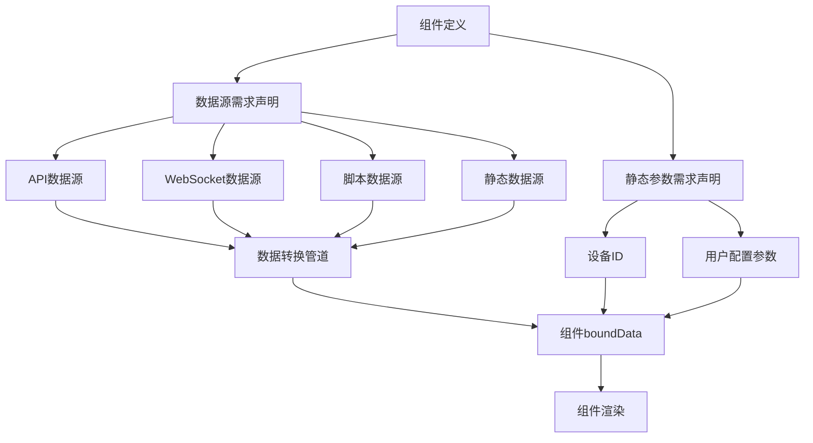

# Card 2.1 数据源系统详解（修正版）

> 数据源系统是 Card 2.1 的核心特性，为组件提供基于配置的数据获取能力。

## 🎯 系统概览

### 核心理念

Card 2.1 数据源系统基于**配置驱动**的设计理念：

1. **组件声明需求** - 组件通过 `ComponentDefinition` 声明数据需求
2. **系统自动绑定** - 数据绑定系统根据配置自动获取和绑定数据
3. **类型安全保证** - 完整的 TypeScript 类型检查
4. **响应式更新** - 自动处理数据变化和组件重新渲染

### 数据源架构图



## 📊 数据源类型详解

Card 2.1 实际支持以下数据源类型：

### 1. StaticDataSource (静态数据源)

**适用场景**：固定配置、演示数据、默认值

#### 基本配置

```typescript
// 在 ComponentDefinition 中配置静态数据源
const myComponentDefinition: ComponentDefinition = {
  type: 'my-component',
  name: '我的组件',
  
  // 静态数据源声明
  dataSources: [{
    key: 'displayData',
    name: '显示数据',
    type: 'static',
    config: {
      data: {
        title: '静态标题',
        content: '这是静态内容',
        metrics: [
          { name: '温度', value: 25.6, unit: '°C' },
          { name: '湿度', value: 60, unit: '%' }
        ]
      }
    }
  }]
}
```

#### 动态静态数据

```typescript
// 使用函数提供动态静态数据
const dynamicStaticDataSource = {
  key: 'timeBasedData',
  name: '基于时间的数据',
  type: 'static',
  config: {
    data: () => ({
      timestamp: new Date().toISOString(),
      greeting: new Date().getHours() < 12 ? '早上好' : '下午好',
      randomValue: Math.random() * 100
    }),
    refreshInterval: 30000 // 30秒刷新一次
  }
}
```

### 2. ApiDataSource (API数据源)

**适用场景**：后端数据获取、实时查询、参数化请求

#### 基本API配置

```typescript
const apiComponentDefinition: ComponentDefinition = {
  type: 'api-component',
  name: 'API组件',
  
  // API数据源配置
  dataSources: [{
    key: 'deviceMetrics',
    name: '设备指标数据',
    type: 'api',
    config: {
      url: '/api/device/{{deviceId}}/metrics',
      method: 'GET',
      headers: {
        'Authorization': 'Bearer {{token}}',
        'Content-Type': 'application/json'
      },
      params: {
        startTime: '{{startTime}}',
        endTime: '{{endTime}}',
        interval: '1h'
      },
      refreshInterval: 30000, // 30秒刷新
      timeout: 10000,         // 10秒超时
      retryCount: 3          // 重试3次
    }
  }],
  
  // 静态参数需求声明
  staticParams: [{
    key: 'deviceId',
    name: '设备ID',
    type: 'string',
    required: true
  }, {
    key: 'startTime',
    name: '开始时间',
    type: 'string',
    required: false,
    defaultValue: () => new Date(Date.now() - 24 * 3600000).toISOString()
  }]
}
```

### 3. WebSocketDataSource (WebSocket数据源)

**适用场景**：实时数据推送、事件监听、状态同步

#### 基本WebSocket配置

```typescript
const websocketComponentDefinition: ComponentDefinition = {
  type: 'realtime-component',
  name: '实时数据组件',
  
  dataSources: [{
    key: 'realtimeMetrics',
    name: '实时指标数据',
    type: 'websocket',
    config: {
      url: 'wss://api.example.com/ws/device/{{deviceId}}/realtime',
      protocols: ['v1.device.protocol'],
      
      // 连接配置
      connectTimeout: 5000,
      heartbeatInterval: 30000,
      reconnectInterval: 3000,
      maxReconnectAttempts: 10,
      
      // 消息处理
      messageFilter: (message: any) => {
        return message.type === 'metrics_update'
      },
      
      messageTransform: (message: any) => ({
        deviceId: message.device_id,
        timestamp: new Date(message.ts * 1000).toISOString(),
        value: message.data.value,
        unit: message.data.unit
      })
    }
  }]
}
```

### 4. ScriptDataSource (脚本数据源)

**适用场景**：复杂数据计算、业务逻辑处理、数据聚合

#### 基本脚本配置

```typescript
const scriptComponentDefinition: ComponentDefinition = {
  type: 'script-component',
  name: '脚本数据组件',
  
  dataSources: [{
    key: 'calculatedData',
    name: '计算数据',
    type: 'script',
    config: {
      script: `
        // 获取其他组件的数据
        const tempData = await getComponentData('temp-sensor');
        const humData = await getComponentData('hum-sensor');
        
        // 计算舒适度指数
        const comfortIndex = (tempData.value * 0.6 + humData.value * 0.4) / 100;
        
        // 趋势分析
        const trend = comfortIndex > 0.7 ? 'comfortable' : 
                     comfortIndex > 0.5 ? 'acceptable' : 'uncomfortable';
        
        return {
          comfortIndex: Math.round(comfortIndex * 100) / 100,
          trend,
          temperature: tempData.value,
          humidity: humData.value,
          timestamp: new Date().toISOString()
        };
      `,
      refreshTrigger: 'data-change',
      dependencies: ['temp-sensor', 'hum-sensor'],
      timeout: 5000
    }
  }]
}
```

## 🔄 数据绑定机制

### 组件数据需求声明

Card 2.1 通过 `ComponentDefinition` 声明组件的数据需求：

```typescript
export interface ComponentDefinition {
  // 基础信息
  type: string
  name: string
  
  // 数据源需求声明
  dataSources?: DataSourceRequirement[]
  
  // 静态参数需求声明  
  staticParams?: StaticParamRequirement[]
  
  // 其他配置...
}

// 数据源需求接口
export interface DataSourceRequirement {
  key: string              // 数据键名
  name: string            // 显示名称
  type: 'static' | 'api' | 'websocket' | 'script'
  config: any             // 类型特定配置
  required?: boolean      // 是否必需
}

// 静态参数需求接口
export interface StaticParamRequirement {
  key: string             // 参数键名
  name: string           // 显示名称  
  type: string           // 数据类型
  required?: boolean     // 是否必需
  defaultValue?: any     // 默认值
}
```

### 组件中使用绑定数据

```vue
<script setup lang="ts">
import { computed } from 'vue'

interface Props {
  customConfig?: MyComponentConfig
  componentId?: string
  // 数据绑定系统自动注入的数据
  boundData?: Record<string, any>
}

const props = defineProps<Props>()

// 访问绑定的数据源数据
const deviceMetrics = computed(() => props.boundData?.deviceMetrics || [])
const calculatedData = computed(() => props.boundData?.calculatedData || {})

// 访问静态参数
const deviceId = computed(() => props.boundData?.deviceId || '')

// 数据状态判断
const hasData = computed(() => Object.keys(props.boundData || {}).length > 0)
const isLoading = computed(() => !props.boundData && props.componentId)
</script>

<template>
  <div class="my-component">
    <div v-if="isLoading" class="loading">
      数据加载中...
    </div>
    
    <div v-else-if="hasData" class="data-content">
      <h3>设备: {{ deviceId }}</h3>
      
      <!-- 显示API数据 -->
      <div v-if="deviceMetrics.length > 0" class="metrics">
        <div v-for="metric in deviceMetrics" :key="metric.id" class="metric-item">
          {{ metric.name }}: {{ metric.value }} {{ metric.unit }}
        </div>
      </div>
      
      <!-- 显示计算数据 -->
      <div v-if="calculatedData.comfortIndex" class="calculated">
        <p>舒适度指数: {{ calculatedData.comfortIndex }}</p>
        <p>趋势: {{ calculatedData.trend }}</p>
      </div>
    </div>
    
    <div v-else class="no-data">
      暂无数据
    </div>
  </div>
</template>
```

## 🛠️ 数据管理API

Card 2.1 提供了数据管理相关的核心API：

### ComponentRequirementManager

```typescript
import { ComponentRequirementManager } from '@/card2.1/core/data-binding/component-requirement-manager'

// 注册组件数据需求
ComponentRequirementManager.registerComponent('my-component', {
  dataSources: [{
    key: 'sensorData',
    name: '传感器数据',
    type: 'api',
    config: {
      url: '/api/sensors/{{sensorId}}/data'
    }
  }],
  staticParams: [{
    key: 'sensorId',
    name: '传感器ID',
    type: 'string',
    required: true
  }]
})

// 获取组件需求
const requirements = ComponentRequirementManager.getComponentRequirements('my-component')

// 验证组件需求
const isValid = ComponentRequirementManager.validateRequirements('my-component', {
  sensorId: 'TEMP001'
})
```

### ReactiveBinding

```typescript
import { ReactiveBinding } from '@/card2.1/core/data-binding/reactive-binding'

// 创建响应式绑定
const binding = new ReactiveBinding('my-component', {
  sensorId: 'TEMP001',
  refreshInterval: 30000
})

// 监听数据变化
binding.onDataChange((newData, oldData) => {
  console.log('数据已更新:', newData)
})

// 手动刷新数据
await binding.refresh()

// 销毁绑定
binding.destroy()
```

### DataTransformPipeline

```typescript
import { DataTransformPipeline } from '@/card2.1/core/data-binding/data-transform-pipeline'

// 数据转换管道
const pipeline = new DataTransformPipeline([
  // 数据验证
  (data: any) => {
    if (!data || typeof data !== 'object') {
      throw new Error('无效的数据格式')
    }
    return data
  },
  
  // 数据转换
  (data: any) => ({
    ...data,
    timestamp: new Date(data.timestamp).toISOString(),
    temperature: parseFloat(data.temp),
    humidity: parseFloat(data.hum)
  }),
  
  // 数据过滤
  (data: any) => ({
    ...data,
    // 过滤掉无效数据
    temperature: data.temperature < -40 || data.temperature > 80 ? null : data.temperature
  })
])

// 处理数据
const transformedData = await pipeline.process(rawData)
```

## 📋 实际开发示例

### 完整的温度监控组件

```typescript
// definition.ts
import type { ComponentDefinition } from '@/card2.1/core/types'
import TemperatureMonitorComponent from './index.vue'
import TemperatureMonitorSetting from './setting.vue'
import { temperatureMonitorSettingConfig } from './settingConfig'
import { componentRegistry } from '@/card2.1/core/component-registry'

const temperatureMonitorDefinition: ComponentDefinition = {
  type: 'temperature-monitor',
  name: '温度监控',
  description: '实时监控设备温度数据',
  category: '监控',
  icon: `<svg>...</svg>`,
  
  component: TemperatureMonitorComponent,
  configComponent: TemperatureMonitorSetting,
  config: temperatureMonitorSettingConfig.customConfig,
  
  // 数据源需求
  dataSources: [{
    key: 'temperatureData',
    name: '温度数据',
    type: 'api',
    config: {
      url: '/api/device/{{deviceId}}/temperature',
      method: 'GET',
      refreshInterval: 5000,
      params: {
        interval: '1m'
      }
    }
  }, {
    key: 'temperatureAlerts',
    name: '温度告警',
    type: 'websocket',
    config: {
      url: 'wss://api.example.com/alerts/{{deviceId}}',
      messageFilter: (msg: any) => msg.type === 'temperature_alert'
    }
  }],
  
  // 静态参数需求
  staticParams: [{
    key: 'deviceId',
    name: '设备ID',
    type: 'string',
    required: true
  }, {
    key: 'alertThreshold',
    name: '告警阈值',
    type: 'number',
    required: false,
    defaultValue: 35
  }]
}

// 注册组件
componentRegistry.registerComponent(temperatureMonitorDefinition, temperatureMonitorSettingConfig)
export default temperatureMonitorDefinition
```

```vue
<!-- index.vue -->
<script setup lang="ts">
import { computed, watch } from 'vue'
import type { TemperatureMonitorConfig } from './settingConfig'

interface Props {
  customConfig?: TemperatureMonitorConfig
  componentId?: string
  boundData?: Record<string, any>
}

const props = defineProps<Props>()

// 获取绑定数据
const temperatureData = computed(() => props.boundData?.temperatureData || [])
const temperatureAlerts = computed(() => props.boundData?.temperatureAlerts || [])
const deviceId = computed(() => props.boundData?.deviceId || '')
const alertThreshold = computed(() => props.boundData?.alertThreshold || 35)

// 计算当前温度
const currentTemperature = computed(() => {
  const latest = temperatureData.value[temperatureData.value.length - 1]
  return latest?.value || 0
})

// 检查是否超过阈值
const isOverThreshold = computed(() => {
  return currentTemperature.value > alertThreshold.value
})

// 告警状态
const hasActiveAlerts = computed(() => {
  return temperatureAlerts.value.length > 0
})

// 监听告警变化
watch(hasActiveAlerts, (newVal) => {
  if (newVal) {
    // 处理新告警
    console.log('收到新的温度告警')
  }
})
</script>

<template>
  <div class="temperature-monitor" :class="{ 'alert': isOverThreshold }">
    <div class="header">
      <h3>{{ deviceId }} 温度监控</h3>
      <div class="status" :class="{ 'warning': isOverThreshold }">
        {{ isOverThreshold ? '超温告警' : '正常' }}
      </div>
    </div>
    
    <div class="temperature-display">
      <span class="value">{{ currentTemperature }}°C</span>
      <span class="threshold">阈值: {{ alertThreshold }}°C</span>
    </div>
    
    <div v-if="temperatureData.length > 0" class="temperature-chart">
      <!-- 这里可以集成图表组件显示历史数据 -->
      <div class="data-points">
        <div
          v-for="(point, index) in temperatureData.slice(-10)"
          :key="index"
          class="data-point"
          :style="{ height: `${point.value}px` }"
        />
      </div>
    </div>
    
    <div v-if="hasActiveAlerts" class="alerts">
      <div v-for="alert in temperatureAlerts" :key="alert.id" class="alert-item">
        {{ alert.message }}
      </div>
    </div>
  </div>
</template>

<style scoped>
.temperature-monitor {
  padding: 16px;
  border-radius: 8px;
  background: var(--card-color);
  border: 1px solid var(--border-color);
}

.temperature-monitor.alert {
  border-color: var(--error-color);
  background: var(--error-color-light);
}

.header {
  display: flex;
  justify-content: space-between;
  align-items: center;
  margin-bottom: 16px;
}

.status.warning {
  color: var(--error-color);
  font-weight: bold;
}

.temperature-display {
  text-align: center;
  margin: 20px 0;
}

.value {
  font-size: 2.5em;
  font-weight: bold;
  color: var(--primary-color);
}

.threshold {
  display: block;
  color: var(--text-color-2);
  font-size: 0.9em;
}

.temperature-chart {
  height: 100px;
  margin: 16px 0;
}

.data-points {
  display: flex;
  align-items: end;
  height: 100%;
  gap: 2px;
}

.data-point {
  flex: 1;
  background: var(--primary-color);
  min-height: 2px;
}

.alerts {
  margin-top: 16px;
}

.alert-item {
  padding: 8px;
  background: var(--error-color);
  color: white;
  border-radius: 4px;
  margin-bottom: 8px;
}
</style>
```

## 📋 最佳实践

### 1. 数据源配置原则

```typescript
// ✅ 正确：明确的数据源声明
dataSources: [{
  key: 'deviceMetrics',        // 清晰的键名
  name: '设备指标数据',         // 描述性名称
  type: 'api',               // 明确类型
  config: {
    url: '/api/device/{{deviceId}}/metrics',
    refreshInterval: 30000,   // 合理的刷新频率
    timeout: 10000,          // 设置超时
    retryCount: 3            // 错误重试
  }
}]

// ❌ 错误：模糊的配置
dataSources: [{
  key: 'data',               // 模糊的键名
  name: 'Data',             // 无意义的名称
  type: 'api',
  config: {
    url: '/api/data'         // 缺少必要参数
  }
}]
```

### 2. 参数验证

```typescript
// ✅ 正确：完整的参数声明
staticParams: [{
  key: 'deviceId',
  name: '设备ID',
  type: 'string',
  required: true,
  validation: {
    minLength: 3,
    pattern: /^DEV\d{3}$/
  }
}, {
  key: 'refreshInterval',
  name: '刷新间隔',
  type: 'number', 
  required: false,
  defaultValue: 30000,
  validation: {
    min: 5000,
    max: 300000
  }
}]
```

### 3. 错误处理

```vue
<script setup lang="ts">
// 错误状态管理
const error = ref<string | null>(null)
const loading = ref(false)

// 监听数据加载错误
watch(() => props.boundData, (newData) => {
  if (newData?.__error) {
    error.value = newData.__error.message
  } else {
    error.value = null
  }
}, { immediate: true })

// 监听加载状态
watch(() => props.boundData, (newData) => {
  loading.value = newData?.__loading || false
}, { immediate: true })
</script>

<template>
  <div class="component">
    <div v-if="error" class="error-state">
      <p>数据加载失败: {{ error }}</p>
      <button @click="retryLoad">重试</button>
    </div>
    
    <div v-else-if="loading" class="loading-state">
      <div class="spinner">加载中...</div>
    </div>
    
    <div v-else class="content">
      <!-- 正常内容 -->
    </div>
  </div>
</template>
```

### 4. 性能优化

```typescript
// 数据源配置优化
const optimizedDataSources = [{
  key: 'heavyData',
  name: '大数据集',
  type: 'api',
  config: {
    url: '/api/heavy-data',
    refreshInterval: 60000,    // 降低刷新频率
    
    // 数据分页
    params: {
      page: '{{page}}',
      pageSize: 50
    },
    
    // 数据缓存
    cache: {
      enabled: true,
      ttl: 300000  // 5分钟缓存
    }
  }
}]
```

---

## 🔗 相关文档

- [交互系统配置文档](./interaction-system-corrected.md) - 了解如何配置组件交互
- [属性暴露机制文档](./property-exposure-corrected.md) - 学习属性绑定
- [组件开发指南](./DEVELOPMENT_GUIDE_CORRECTED.md) - 完整的开发流程

---

**💡 总结**：Card 2.1 数据源系统通过在 `ComponentDefinition` 中声明 `dataSources` 和 `staticParams`，实现了配置驱动的数据绑定。组件通过 `props.boundData` 自动获取绑定的数据，简化了数据管理的复杂度。掌握这些概念和API，就能构建出数据驱动的高质量组件。