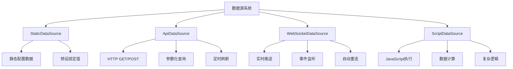
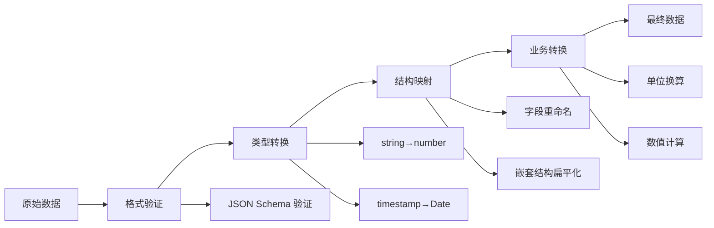

# Card 2.1 数据源系统详解

> 数据源系统是 Card 2.1 的核心特性之一，为组件提供灵活、类型安全的数据获取能力。

## 🎯 系统概览

### 核心理念

Card 2.1 数据源系统基于**需求驱动**的设计理念：

1. **组件声明需求** - 组件通过 `settingConfig` 声明需要什么样的数据
2. **系统自动匹配** - 数据绑定系统根据需求自动选择合适的数据源
3. **类型安全保证** - 完整的 TypeScript 类型检查，确保数据结构匹配
4. **响应式更新** - 自动处理数据变化和组件重新渲染

### 数据源类型概览



## 📊 数据源类型详解

### 1. StaticDataSource (静态数据源)

**适用场景**：固定配置、演示数据、默认值

#### 基本使用
```typescript
// 在 settingConfig.ts 中声明
export const myComponentSettingConfig: ComponentSettingConfig<MyComponentCustomize> = {
  dataRequirements: [{
    key: 'deviceStatus',
    name: '设备状态',
    type: 'object',
    structure: {
      online: { type: 'boolean', name: '在线状态' },
      temperature: { type: 'number', name: '温度' },
      location: { type: 'string', name: '位置' }
    },
    dataSources: [{
      type: 'static',
      value: {
        online: true,
        temperature: 25.6,
        location: '北京机房A区'
      }
    }]
  }]
}
```

#### 高级配置
```typescript
// 复杂静态数据结构
const complexStaticData = {
  type: 'static' as const,
  value: {
    // 数组数据
    deviceList: [
      { id: '001', name: '温度传感器', value: 25.6 },
      { id: '002', name: '湿度传感器', value: 60.2 }
    ],
    // 嵌套对象
    dashboard: {
      title: '监控概览',
      stats: {
        total: 156,
        online: 142,
        offline: 14
      },
      // 时间序列数据
      timeSeries: Array.from({ length: 24 }, (_, i) => ({
        time: new Date(Date.now() - (23 - i) * 3600000).toISOString(),
        value: Math.random() * 100
      }))
    }
  }
}
```

### 2. ApiDataSource (API数据源)

**适用场景**：后端数据获取、实时查询、参数化请求

#### 基本配置
```typescript
export const apiDataExample: ComponentSettingConfig<MyComponentCustomize> = {
  dataRequirements: [{
    key: 'deviceMetrics',
    name: '设备指标数据',
    type: 'array',
    structure: {
      timestamp: { type: 'string', name: '时间戳' },
      value: { type: 'number', name: '数值' },
      unit: { type: 'string', name: '单位' }
    },
    dataSources: [{
      type: 'api',
      url: '/api/v1/device/{{deviceId}}/metrics',
      method: 'GET',
      headers: {
        'Authorization': 'Bearer {{token}}',
        'Content-Type': 'application/json'
      },
      params: {
        startTime: '{{startTime}}',
        endTime: '{{endTime}}',
        interval: '1h'
      },
      refreshInterval: 30000, // 30秒刷新
      timeout: 10000,         // 10秒超时
      retryCount: 3,          // 重试3次
      retryDelay: 1000        // 重试延迟1秒
    }]
  }]
}
```

#### 参数绑定系统
```typescript
// 参数可以绑定到其他组件的属性
const parameterBindingExample = {
  type: 'api' as const,
  url: '/api/device/{{comp-selector-001.customize.selectedDeviceId}}/data',
  params: {
    // 绑定到时间选择器组件的值
    startTime: 'comp-time-picker-002.customize.startTime',
    endTime: 'comp-time-picker-002.customize.endTime',
    // 绑定到下拉选择器的值
    metricType: 'comp-dropdown-003.customize.selectedMetric',
    // 静态参数
    format: 'json',
    limit: 100
  }
}
```

#### 响应数据处理
```typescript
// API响应数据转换
const apiWithTransform = {
  type: 'api' as const,
  url: '/api/device/stats',
  method: 'POST',
  body: {
    deviceIds: ['{{deviceId1}}', '{{deviceId2}}'],
    fields: ['temperature', 'humidity', 'status']
  },
  // 数据转换函数（可选）
  transform: (response: any) => {
    // 将后端格式转换为组件需要的格式
    return response.data.map((item: any) => ({
      timestamp: new Date(item.time * 1000).toISOString(),
      value: item.temp_value,
      unit: '°C',
      status: item.device_status === 1 ? 'online' : 'offline'
    }))
  }
}
```

### 3. WebSocketDataSource (WebSocket数据源)

**适用场景**：实时数据推送、事件监听、状态同步

#### 基本配置
```typescript
export const websocketDataExample: ComponentSettingConfig<MyComponentCustomize> = {
  dataRequirements: [{
    key: 'realtimeData',
    name: '实时数据流',
    type: 'object',
    structure: {
      deviceId: { type: 'string', name: '设备ID' },
      timestamp: { type: 'string', name: '时间戳' },
      metrics: {
        type: 'object',
        structure: {
          temperature: { type: 'number', name: '温度' },
          humidity: { type: 'number', name: '湿度' },
          pressure: { type: 'number', name: '气压' }
        }
      }
    },
    dataSources: [{
      type: 'websocket',
      url: 'wss://api.example.com/ws/device/{{deviceId}}/realtime',
      protocols: ['v1.device.protocol'],
      
      // 连接配置
      connectTimeout: 5000,
      heartbeatInterval: 30000,
      reconnectInterval: 3000,
      maxReconnectAttempts: 10,
      
      // 消息处理
      messageFilter: (message: any) => {
        // 只处理特定类型的消息
        return message.type === 'metrics_update'
      },
      messageTransform: (message: any) => {
        // 转换WebSocket消息格式
        return {
          deviceId: message.device_id,
          timestamp: new Date(message.ts * 1000).toISOString(),
          metrics: {
            temperature: message.data.temp,
            humidity: message.data.hum,
            pressure: message.data.press
          }
        }
      }
    }]
  }]
}
```

#### 高级WebSocket功能
```typescript
const advancedWebSocketConfig = {
  type: 'websocket' as const,
  url: 'wss://api.example.com/ws/dashboard',
  
  // 连接时发送的初始化消息
  initMessages: [
    { type: 'subscribe', channels: ['device.metrics', 'system.alerts'] },
    { type: 'auth', token: '{{userToken}}' }
  ],
  
  // 心跳配置
  heartbeat: {
    message: { type: 'ping', timestamp: () => Date.now() },
    interval: 30000,
    timeout: 10000
  },
  
  // 事件处理器
  onConnect: (event: Event) => {
    console.log('WebSocket connected:', event)
  },
  onDisconnect: (event: CloseEvent) => {
    console.log('WebSocket disconnected:', event.code, event.reason)
  },
  onError: (error: Event) => {
    console.error('WebSocket error:', error)
  },
  
  // 数据缓存配置
  cache: {
    enabled: true,
    maxSize: 1000,
    ttl: 60000 // 1分钟缓存
  }
}
```

### 4. ScriptDataSource (脚本数据源)

**适用场景**：复杂数据计算、业务逻辑处理、数据聚合

#### 基本脚本数据源
```typescript
export const scriptDataExample: ComponentSettingConfig<MyComponentCustomize> = {
  dataRequirements: [{
    key: 'calculatedMetrics',
    name: '计算指标',
    type: 'object',
    structure: {
      efficiency: { type: 'number', name: '效率' },
      trend: { type: 'string', name: '趋势' },
      prediction: { type: 'number', name: '预测值' }
    },
    dataSources: [{
      type: 'script',
      script: `
        // 可以访问其他组件的数据和配置
        const temperature = getComponentData('comp-temp-001', 'current');
        const humidity = getComponentData('comp-hum-001', 'current');
        const historical = getComponentData('comp-chart-001', 'timeSeries');
        
        // 计算效率指标
        const efficiency = (temperature * 0.6 + humidity * 0.4) / 100;
        
        // 趋势分析
        let trend = 'stable';
        if (historical && historical.length > 1) {
          const recent = historical.slice(-5);
          const avg = recent.reduce((sum, item) => sum + item.value, 0) / recent.length;
          const prev = historical.slice(-10, -5);
          const prevAvg = prev.reduce((sum, item) => sum + item.value, 0) / prev.length;
          
          if (avg > prevAvg * 1.1) trend = 'rising';
          else if (avg < prevAvg * 0.9) trend = 'falling';
        }
        
        // 简单预测
        const prediction = efficiency * 1.05; // 假设5%增长
        
        return {
          efficiency: Math.round(efficiency * 100) / 100,
          trend,
          prediction: Math.round(prediction * 100) / 100
        };
      `,
      dependencies: ['comp-temp-001', 'comp-hum-001', 'comp-chart-001'],
      refreshTrigger: 'data-change', // 依赖数据变化时重新计算
      refreshInterval: 60000 // 或定时刷新（1分钟）
    }]
  }]
}
```

#### 高级脚本功能
```typescript
const advancedScriptExample = {
  type: 'script' as const,
  script: `
    // 引入工具函数
    const { calculateMA, detectAnomaly, formatNumber } = scriptUtils;
    
    // 获取多个数据源
    const rawData = await fetchApiData('/api/metrics/raw');
    const config = getComponentConfig('comp-settings-001');
    const thresholds = config.customize.thresholds;
    
    // 复杂数据处理
    const processedData = rawData.map(item => {
      const ma5 = calculateMA(rawData, item.timestamp, 5);
      const ma20 = calculateMA(rawData, item.timestamp, 20);
      const anomaly = detectAnomaly(item.value, ma20, thresholds.deviation);
      
      return {
        ...item,
        ma5: formatNumber(ma5, 2),
        ma20: formatNumber(ma20, 2),
        signal: ma5 > ma20 ? 'buy' : 'sell',
        anomaly: anomaly,
        trend: item.value > ma20 ? 'bullish' : 'bearish'
      };
    });
    
    // 生成统计摘要
    const summary = {
      total: processedData.length,
      anomalies: processedData.filter(item => item.anomaly).length,
      bullishSignals: processedData.filter(item => item.signal === 'buy').length,
      bearishSignals: processedData.filter(item => item.signal === 'sell').length
    };
    
    return {
      data: processedData,
      summary: summary,
      lastUpdate: new Date().toISOString()
    };
  `,
  
  // 脚本执行环境配置
  sandbox: {
    timeout: 5000,           // 5秒超时
    memoryLimit: 50 * 1024 * 1024, // 50MB内存限制
    apiAccess: true,         // 允许API调用
    fileAccess: false        // 禁止文件访问
  },
  
  // 缓存配置
  cache: {
    enabled: true,
    key: 'custom-calculation-{{deviceId}}-{{timeRange}}',
    ttl: 300000 // 5分钟缓存
  }
}
```

## 🔄 数据绑定与响应式更新

### 自动数据绑定

Card 2.1 提供了强大的自动数据绑定机制：

```typescript
// 在组件中声明数据需求
export const temperatureGaugeConfig: ComponentSettingConfig<TemperatureGaugeCustomize> = {
  dataRequirements: [{
    key: 'temperature',
    name: '温度数据',
    type: 'number',
    dataSources: [{
      type: 'api',
      url: '/api/device/{{deviceId}}/temperature',
      refreshInterval: 5000
    }]
  }],
  
  settings: [
    // 设备ID选择器
    createSetting(SettingControlType.DEVICE_SELECT, '设备', 'customize.deviceId'),
    // 温度单位选择
    createSetting(SettingControlType.SELECT, '单位', 'customize.unit', {
      options: [
        { label: '摄氏度', value: 'celsius' },
        { label: '华氏度', value: 'fahrenheit' }
      ]
    })
  ]
}
```

```vue
<!-- 组件中使用绑定的数据 -->
<template>
  <div class="temperature-gauge">
    <n-progress
      type="circle"
      :percentage="temperaturePercentage"
      :color="temperatureColor"
    >
      <div class="temperature-display">
        {{ formattedTemperature }}
        <small>{{ unit }}</small>
      </div>
    </n-progress>
  </div>
</template>

<script setup lang="ts">
import { computed } from 'vue'
import type { TemperatureGaugeConfig } from './settingConfig'

interface Props {
  customConfig?: TemperatureGaugeConfig
  componentId?: string
  boundData?: Record<string, any> // 自动注入的绑定数据
}

const props = defineProps<Props>()

// 自动获取绑定的温度数据
const temperature = computed(() => props.boundData?.temperature || 0)
const unit = computed(() => props.customConfig?.customize.unit || 'celsius')

const formattedTemperature = computed(() => {
  const temp = temperature.value
  if (unit.value === 'fahrenheit') {
    return Math.round(temp * 9/5 + 32) + '°F'
  }
  return Math.round(temp) + '°C'
})

const temperaturePercentage = computed(() => {
  // 假设温度范围 0-50°C
  return Math.min(Math.max(temperature.value / 50 * 100, 0), 100)
})

const temperatureColor = computed(() => {
  const temp = temperature.value
  if (temp < 10) return '#1890ff'      // 蓝色 - 低温
  if (temp < 25) return '#52c41a'      // 绿色 - 正常
  if (temp < 35) return '#faad14'      // 橙色 - 偏高
  return '#ff4d4f'                     // 红色 - 高温
})
</script>
```

### 数据更新触发器

Card 2.1 支持多种数据更新触发机制：

```typescript
const dataUpdateTriggers = {
  // 1. 定时刷新
  timer: {
    refreshInterval: 30000, // 30秒刷新一次
    immediate: true         // 立即执行第一次
  },
  
  // 2. 依赖变化触发
  dependency: {
    refreshTrigger: 'data-change',
    dependencies: ['comp-device-selector', 'comp-time-range']
  },
  
  // 3. 事件触发
  event: {
    refreshTrigger: 'event',
    eventTypes: ['component:click', 'data:update', 'config:change']
  },
  
  // 4. 手动触发
  manual: {
    refreshTrigger: 'manual'
    // 通过 dataManager.refreshData(componentId, dataKey) 手动触发
  },
  
  // 5. 实时推送（WebSocket）
  realtime: {
    type: 'websocket',
    // WebSocket 自动推送，无需额外触发配置
  }
}
```

## 🛠️ 数据管道与转换

### 数据转换管道

Card 2.1 提供了强大的数据转换管道，确保数据格式与组件需求匹配：



#### 实际转换示例

```typescript
// 后端API返回的原始数据格式
const apiResponse = {
  code: 200,
  message: 'success',
  data: {
    device_list: [
      {
        dev_id: 'DEV001',
        dev_name: '温度传感器01',
        temp_val: '25.6',
        hum_val: '60.2',
        update_ts: 1640995200,
        status_code: 1
      }
    ]
  }
}

// 组件需要的数据格式
interface DeviceData {
  deviceId: string
  deviceName: string
  temperature: number
  humidity: number
  lastUpdate: string
  isOnline: boolean
}

// 数据转换配置
const dataTransformPipeline = {
  // 1. 数据提取
  extract: (response: any) => response.data.device_list,
  
  // 2. 字段映射
  mapping: {
    'dev_id': 'deviceId',
    'dev_name': 'deviceName',
    'temp_val': 'temperature',
    'hum_val': 'humidity',
    'update_ts': 'lastUpdate',
    'status_code': 'isOnline'
  },
  
  // 3. 类型转换
  transform: {
    temperature: (val: string) => parseFloat(val),
    humidity: (val: string) => parseFloat(val),
    lastUpdate: (ts: number) => new Date(ts * 1000).toISOString(),
    isOnline: (code: number) => code === 1
  },
  
  // 4. 数据验证
  validate: {
    temperature: (val: number) => val >= -40 && val <= 80,
    humidity: (val: number) => val >= 0 && val <= 100,
    deviceId: (val: string) => val && val.length > 0
  },
  
  // 5. 业务逻辑处理
  postProcess: (data: DeviceData[]) => {
    return data
      .filter(device => device.deviceId) // 过滤无效设备
      .sort((a, b) => a.deviceName.localeCompare(b.deviceName)) // 按名称排序
      .map(device => ({
        ...device,
        // 添加计算字段
        comfortIndex: calculateComfortIndex(device.temperature, device.humidity),
        alertLevel: getAlertLevel(device.temperature, device.humidity)
      }))
  }
}
```

## 🔧 数据源管理API

### 数据管理器接口

Card 2.1 提供了完整的数据管理API：

```typescript
import { dataManager } from '@/card2.1/core/data-binding/data-manager'

// 手动刷新数据
await dataManager.refreshData('comp-001', 'temperatureData')

// 获取当前数据
const currentData = dataManager.getData('comp-001', 'temperatureData')

// 监听数据变化
dataManager.onDataChange('comp-001', 'temperatureData', (newData, oldData) => {
  console.log('数据已更新:', newData)
})

// 暂停数据刷新
dataManager.pauseRefresh('comp-001', 'temperatureData')

// 恢复数据刷新
dataManager.resumeRefresh('comp-001', 'temperatureData')

// 设置数据（用于测试或手动控制）
dataManager.setData('comp-001', 'temperatureData', { value: 25.6 })

// 批量操作
await dataManager.refreshAllData('comp-001')
dataManager.pauseAllRefresh('comp-001')
```

### 数据源状态监控

```typescript
// 监控数据源状态
interface DataSourceStatus {
  isActive: boolean      // 是否激活
  isLoading: boolean     // 是否加载中
  lastUpdate: string     // 最后更新时间
  updateCount: number    // 更新次数
  errorCount: number     // 错误次数
  lastError?: string     // 最后错误信息
}

// 获取数据源状态
const status = dataManager.getDataSourceStatus('comp-001', 'temperatureData')

// 监听状态变化
dataManager.onStatusChange('comp-001', 'temperatureData', (status: DataSourceStatus) => {
  if (status.lastError) {
    console.error('数据源错误:', status.lastError)
  }
})
```

## 🎯 性能优化指南

### 1. 数据缓存策略

```typescript
// 智能缓存配置
const cacheOptimizedDataSource = {
  type: 'api' as const,
  url: '/api/expensive-calculation',
  
  cache: {
    enabled: true,
    strategy: 'lru',           // LRU缓存策略
    maxSize: 100,              // 最大缓存条目
    ttl: 300000,               // 5分钟TTL
    
    // 缓存键生成
    keyGenerator: (params: any) => {
      return `calc-${params.deviceId}-${params.timeRange}-${params.precision}`
    },
    
    // 条件缓存
    shouldCache: (response: any) => {
      return response.success && response.data.length > 0
    }
  }
}
```

### 2. 批量数据请求

```typescript
// 批量API请求优化
const batchApiDataSource = {
  type: 'api' as const,
  url: '/api/devices/batch-metrics',
  method: 'POST',
  
  // 批量请求配置
  batch: {
    enabled: true,
    maxBatchSize: 50,          // 最大批量大小
    batchTimeout: 100,         // 100ms内的请求合并批次
    
    // 批量参数合并
    parameterMerger: (requests: any[]) => ({
      deviceIds: requests.map(req => req.deviceId),
      metrics: [...new Set(requests.flatMap(req => req.metrics))],
      timeRange: requests[0].timeRange // 假设时间范围相同
    }),
    
    // 批量响应分解
    responseSplitter: (batchResponse: any, originalRequests: any[]) => {
      return originalRequests.map(req => ({
        deviceId: req.deviceId,
        data: batchResponse.data.filter((item: any) => item.deviceId === req.deviceId)
      }))
    }
  }
}
```

### 3. 内存管理

```typescript
// 数据生命周期管理
const memoryOptimizedConfig = {
  // 数据清理策略
  cleanup: {
    maxDataAge: 3600000,       // 1小时后清理旧数据
    maxDataPoints: 1000,       // 最多保留1000个数据点
    cleanupInterval: 300000,   // 5分钟清理一次
    
    // 自定义清理逻辑
    customCleanup: (data: any[]) => {
      // 保留最近的重要数据点
      return data
        .sort((a, b) => new Date(b.timestamp).getTime() - new Date(a.timestamp).getTime())
        .slice(0, 500) // 只保留最新的500条
    }
  },
  
  // 大数据处理
  largeDataHandling: {
    enableVirtualization: true,  // 启用虚拟化
    chunkSize: 100,             // 分块处理大小
    lazyLoading: true,          // 懒加载
    compression: 'gzip'         // 数据压缩
  }
}
```

## 📋 最佳实践

### 1. 数据源选择指南

```typescript
// 根据使用场景选择合适的数据源类型
const dataSourceSelection = {
  // 静态展示数据 → StaticDataSource
  staticDisplay: {
    use: 'static',
    scenarios: ['演示数据', '固定配置', '默认值', '帮助信息']
  },
  
  // 定期更新数据 → ApiDataSource
  periodicUpdate: {
    use: 'api',
    scenarios: ['设备状态', '统计数据', '报表数据', '配置信息'],
    refreshInterval: '30秒-5分钟'
  },
  
  // 实时数据流 → WebSocketDataSource  
  realtime: {
    use: 'websocket',
    scenarios: ['实时监控', '告警通知', '在线状态', '实时图表'],
    latency: '<100ms'
  },
  
  // 复杂计算 → ScriptDataSource
  calculation: {
    use: 'script',
    scenarios: ['数据聚合', '业务计算', '多源融合', '预测分析'],
    complexity: '中高'
  }
}
```

### 2. 性能优化建议

```typescript
const performanceTips = {
  // 数据请求优化
  request: {
    '合理设置刷新频率': '避免过于频繁的API调用',
    '使用参数化查询': '减少不必要的数据传输',
    '启用数据压缩': '降低网络传输开销',
    '实现错误重试': '提高数据获取可靠性'
  },
  
  // 数据处理优化
  processing: {
    '避免阻塞操作': '使用异步处理大数据集',
    '合理使用缓存': '减少重复计算和请求',
    '数据分页加载': '避免一次性加载大量数据',
    '及时清理内存': '防止内存泄漏'
  },
  
  // 用户体验优化
  ux: {
    '显示加载状态': '用户友好的加载提示',
    '优雅错误处理': '清晰的错误信息显示',
    '数据预加载': '预测用户需要的数据',
    '离线缓存': '网络异常时的备用方案'
  }
}
```

### 3. 错误处理策略

```typescript
// 完善的错误处理配置
const errorHandlingConfig = {
  api: {
    // HTTP错误处理
    onError: (error: any, attempt: number) => {
      console.error(`API请求失败 (第${attempt}次):`, error.message)
      
      // 根据错误类型采取不同策略
      if (error.status === 401) {
        // 认证失败 - 重新登录
        return { action: 'reauth', retry: false }
      } else if (error.status >= 500) {
        // 服务器错误 - 重试
        return { action: 'retry', delay: Math.pow(2, attempt) * 1000 }
      } else if (error.status === 404) {
        // 资源不存在 - 使用默认值
        return { action: 'fallback', data: getDefaultData() }
      }
      
      return { action: 'fail' }
    },
    
    // 超时处理
    timeout: 10000,
    onTimeout: () => ({
      action: 'fallback',
      message: '请求超时，显示缓存数据'
    })
  },
  
  websocket: {
    // WebSocket连接错误
    onConnectionError: (error: Event) => {
      console.error('WebSocket连接失败:', error)
      return {
        action: 'fallback_to_api',
        fallbackDataSource: {
          type: 'api',
          url: '/api/realtime/latest'
        }
      }
    },
    
    // 自动重连策略
    reconnect: {
      enabled: true,
      maxAttempts: 10,
      backoffStrategy: 'exponential', // 指数退避
      initialDelay: 1000
    }
  },
  
  script: {
    // 脚本执行错误
    onScriptError: (error: Error) => {
      console.error('脚本执行错误:', error.message)
      return {
        action: 'fallback',
        data: null,
        message: '计算出现错误，请检查配置'
      }
    },
    
    // 执行超时
    executionTimeout: 5000
  }
}
```

---

## 🔗 相关文档

- [交互系统配置文档](./interaction-system.md) - 了解如何配置组件交互
- [属性暴露机制文档](./property-exposure.md) - 学习属性绑定和暴露
- [组件开发指南](../DEVELOPMENT_GUIDE.md) - 完整的开发流程
- [API参考手册](./api-reference.md) - 详细的API文档

---

**💡 总结**：Card 2.1 数据源系统提供了灵活、高效、类型安全的数据获取能力。通过合理选择数据源类型、配置数据转换管道、实现错误处理策略，可以构建出稳定可靠的数据驱动组件。掌握这些概念和最佳实践，就能充分发挥数据源系统的强大功能。