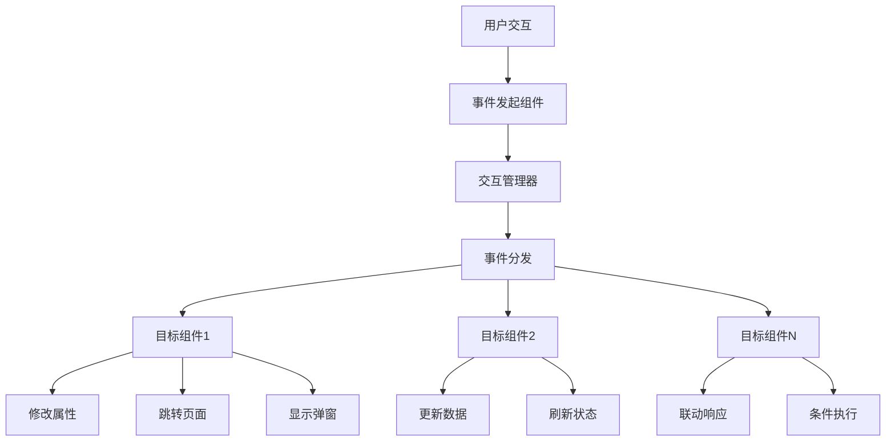

# Card 2.1 交互系统配置文档

> 交互系统是 Card 2.1 的核心特性，实现了组件间的智能通信和响应机制，让仪表板具备丰富的交互体验。

## 🎯 系统概览

### 核心概念

Card 2.1 交互系统基于**事件驱动**的设计模式：

1. **事件触发** - 组件产生交互事件（点击、悬停、数据变化等）
2. **事件传播** - 交互管理器捕获和分发事件
3. **响应执行** - 目标组件根据配置执行相应的响应动作
4. **状态同步** - 系统自动同步组件间的状态变化

### 交互架构图



## 🎭 事件类型系统

### 基础事件类型

Card 2.1 支持丰富的交互事件类型：

```typescript
// 交互事件类型枚举
export enum InteractionEventType {
  CLICK = 'click',           // 点击事件
  DOUBLE_CLICK = 'dblclick', // 双击事件
  HOVER = 'hover',           // 悬停事件  
  FOCUS = 'focus',           // 焦点事件
  DATA_CHANGE = 'dataChange', // 数据变化
  CONFIG_CHANGE = 'configChange', // 配置变化
  LIFECYCLE = 'lifecycle'     // 生命周期事件
}

// 在组件中声明支持的事件
export const interactiveButtonConfig: ComponentSettingConfig<ButtonCustomize> = {
  // 声明组件支持的交互事件
  interactionEvents: [
    {
      type: InteractionEventType.CLICK,
      name: '点击事件',
      description: '用户点击按钮时触发',
      payload: {
        componentId: 'string',
        timestamp: 'string',
        buttonText: 'string',
        clickPosition: { x: 'number', y: 'number' }
      }
    },
    {
      type: InteractionEventType.HOVER,
      name: '悬停事件', 
      description: '鼠标悬停在按钮上时触发',
      payload: {
        componentId: 'string',
        isHovering: 'boolean',
        duration: 'number'
      }
    }
  ]
}
```

### 高级事件配置

```typescript
// 复杂交互事件配置
const advancedInteractionEvents = [
  {
    type: InteractionEventType.DATA_CHANGE,
    name: '数据变化事件',
    description: '当温度数据发生显著变化时触发',
    
    // 事件触发条件
    trigger: {
      dataKey: 'temperature',        // 监听的数据字段
      condition: 'threshold',        // 触发条件类型
      threshold: {
        type: 'range',              // 阈值类型
        min: 15,                    // 最小值
        max: 35,                    // 最大值
        operator: 'outside'         // 超出范围触发
      }
    },
    
    // 事件负载数据
    payload: {
      componentId: 'string',
      oldValue: 'number',
      newValue: 'number',
      changeRate: 'number',
      alertLevel: 'string'
    },
    
    // 防抖配置
    debounce: {
      enabled: true,
      delay: 1000                   // 1秒内重复事件只触发一次
    }
  },
  
  {
    type: InteractionEventType.LIFECYCLE,
    name: '组件生命周期事件',
    description: '组件挂载、更新、卸载时触发',
    
    trigger: {
      phase: 'mounted',             // mounted | updated | unmounted
      condition: 'immediate'        // 立即触发
    },
    
    payload: {
      componentId: 'string',
      phase: 'string',
      timestamp: 'string',
      componentData: 'object'
    }
  }
]
```

## 🎯 响应动作系统

### 基础响应类型

```typescript
// 响应动作类型枚举
export enum InteractionActionType {
  MODIFY = 'modify',         // 修改组件属性
  JUMP = 'jump',            // 页面跳转
  SHOW_MODAL = 'showModal', // 显示弹窗
  API_CALL = 'apiCall',     // API调用
  SCRIPT = 'script',        // 执行脚本
  MESSAGE = 'message'       // 显示消息
}

// 基本响应动作配置
const basicInteractionResponses = {
  // 1. 修改组件属性
  modify: {
    action: InteractionActionType.MODIFY,
    targetComponentId: 'comp-chart-001',
    modifyConfig: {
      targetProperty: 'customize.selectedDevice',
      updateValue: '{{sourceComponent.customize.deviceId}}', // 绑定源组件的值
      updateMode: 'replace' // replace | merge | append
    }
  },
  
  // 2. 页面跳转
  jump: {
    action: InteractionActionType.JUMP,
    jumpConfig: {
      type: 'internal',     // internal | external | modal
      target: '/device/details',
      params: {
        deviceId: '{{payload.deviceId}}',
        timestamp: '{{payload.timestamp}}'
      },
      newWindow: false
    }
  },
  
  // 3. 显示消息提示
  message: {
    action: InteractionActionType.MESSAGE,
    messageConfig: {
      type: 'success',      // success | warning | error | info
      title: '操作成功',
      message: '设备 {{payload.deviceName}} 状态已更新',
      duration: 3000,
      closable: true
    }
  }
}
```

### 高级响应配置

```typescript
// 复杂响应动作配置
const advancedInteractionResponses = [
  {
    // 条件响应 - 根据事件数据执行不同动作
    action: InteractionActionType.MODIFY,
    condition: {
      field: 'payload.temperature',
      operator: 'greater_than',
      value: 35
    },
    
    // 满足条件时的动作
    trueResponse: {
      targetComponentId: 'comp-alert-panel',
      modifyConfig: {
        targetProperty: 'customize.alertLevel',
        updateValue: 'high',
        targetProperty2: 'customize.alertMessage',
        updateValue2: '温度过高：{{payload.temperature}}°C'
      }
    },
    
    // 不满足条件时的动作
    falseResponse: {
      targetComponentId: 'comp-alert-panel', 
      modifyConfig: {
        targetProperty: 'customize.alertLevel',
        updateValue: 'normal'
      }
    }
  },
  
  {
    // 批量响应 - 同时触发多个组件
    action: InteractionActionType.MODIFY,
    batchTargets: [
      {
        targetComponentId: 'comp-gauge-001',
        modifyConfig: {
          targetProperty: 'customize.value',
          updateValue: '{{payload.temperature}}'
        }
      },
      {
        targetComponentId: 'comp-chart-001',
        modifyConfig: {
          targetProperty: 'customize.highlightPoint',
          updateValue: {
            x: '{{payload.timestamp}}',
            y: '{{payload.temperature}}',
            color: '#ff4d4f'
          }
        }
      },
      {
        targetComponentId: 'comp-status-001',
        modifyConfig: {
          targetProperty: 'customize.status',
          updateValue: '{{payload.temperature > 35 ? "warning" : "normal"}}'
        }
      }
    ]
  },
  
  {
    // 脚本响应 - 执行自定义逻辑
    action: InteractionActionType.SCRIPT,
    scriptConfig: {
      script: `
        // 获取事件数据
        const { temperature, deviceId, timestamp } = payload;
        
        // 复杂业务逻辑
        const historicalData = getComponentData('comp-history-001', 'timeSeries');
        const average = calculateAverage(historicalData, 24); // 24小时平均值
        const trend = temperature > average * 1.1 ? 'rising' : 
                     temperature < average * 0.9 ? 'falling' : 'stable';
        
        // 动态更新多个组件
        updateComponent('comp-trend-001', {
          'customize.trend': trend,
          'customize.deviation': ((temperature - average) / average * 100).toFixed(1)
        });
        
        // 条件性触发告警
        if (temperature > 40) {
          showNotification({
            type: 'error',
            title: '严重告警',
            message: \`设备 \${deviceId} 温度异常：\${temperature}°C\`,
            actions: [
              {
                label: '查看详情',
                action: () => navigateTo(\`/device/\${deviceId}/alerts\`)
              },
              {
                label: '立即处理',
                action: () => triggerEmergencyProtocol(deviceId)
              }
            ]
          });
        }
        
        // 记录操作日志
        logInteraction({
          type: 'temperature_alert',
          deviceId,
          temperature,
          trend,
          timestamp: new Date().toISOString()
        });
      `,
      
      // 脚本执行配置
      timeout: 5000,
      dependencies: ['comp-history-001', 'comp-trend-001'],
      errorHandling: 'graceful' // graceful | strict
    }
  }
]
```

## 🔗 组件交互配置

### 在组件中配置交互

```typescript
// 在 settingConfig.ts 中配置组件交互
export const deviceSelectorConfig: ComponentSettingConfig<DeviceSelectorCustomize> = {
  componentType: 'device-selector',
  
  // 1. 声明组件支持的事件
  interactionEvents: [
    {
      type: InteractionEventType.CLICK,
      name: '设备选择',
      description: '用户选择设备时触发',
      payload: {
        deviceId: 'string',
        deviceName: 'string', 
        deviceType: 'string',
        selectedAt: 'string'
      }
    }
  ],
  
  // 2. 配置交互响应规则
  interactionConfig: {
    // 当设备被选中时的响应配置
    onDeviceSelect: {
      event: InteractionEventType.CLICK,
      responses: [
        {
          // 更新设备详情组件
          action: InteractionActionType.MODIFY,
          targetComponentId: 'comp-device-details',
          modifyConfig: {
            targetProperty: 'customize.deviceId',
            updateValue: '{{payload.deviceId}}',
            
            // 同时更新设备名称
            targetProperty2: 'customize.deviceName', 
            updateValue2: '{{payload.deviceName}}'
          }
        },
        {
          // 刷新设备数据图表
          action: InteractionActionType.MODIFY,
          targetComponentId: 'comp-device-chart',
          modifyConfig: {
            // 触发数据源刷新
            targetProperty: 'dataSource.params.deviceId',
            updateValue: '{{payload.deviceId}}',
            refreshData: true
          }
        },
        {
          // 显示成功消息
          action: InteractionActionType.MESSAGE,
          messageConfig: {
            type: 'info',
            message: '已选择设备：{{payload.deviceName}}',
            duration: 2000
          }
        }
      ]
    }
  },
  
  settings: [
    // 常规设置项...
    createSetting(SettingControlType.INPUT, '默认设备ID', 'customize.defaultDeviceId'),
    
    // 交互配置设置
    createSetting(SettingControlType.INTERACTION_CONFIG, '交互配置', 'interactionConfig', {
      supportedEvents: [InteractionEventType.CLICK],
      availableActions: [
        InteractionActionType.MODIFY,
        InteractionActionType.MESSAGE,
        InteractionActionType.JUMP
      ]
    })
  ]
}
```

### 在组件中触发事件

```vue
<!-- 组件模板中触发交互事件 -->
<template>
  <div class="device-selector">
    <n-select
      v-model:value="selectedDeviceId"
      :options="deviceOptions"
      @update:value="handleDeviceSelect"
      placeholder="选择设备"
    />
  </div>
</template>

<script setup lang="ts">
import { computed } from 'vue'
import type { DeviceSelectorConfig } from './settingConfig'
import { useInteractionManager } from '@/card2.1/core/interaction-manager'

interface Props {
  customConfig?: DeviceSelectorConfig
  componentId?: string
}

const props = defineProps<Props>()

// 获取交互管理器
const interactionManager = useInteractionManager()

// 设备选择列表
const deviceOptions = computed(() => [
  { label: '温度传感器01', value: 'temp-001' },
  { label: '湿度传感器01', value: 'hum-001' },
  { label: '压力传感器01', value: 'press-001' }
])

// 当前选中的设备ID
const selectedDeviceId = computed({
  get: () => props.customConfig?.customize.defaultDeviceId || '',
  set: (value: string) => {
    // 更新配置的同时触发交互事件
    handleDeviceSelect(value)
  }
})

/**
 * 处理设备选择事件
 * 触发交互系统的事件传播
 */
const handleDeviceSelect = (deviceId: string) => {
  if (!deviceId || !props.componentId) return
  
  // 查找设备信息
  const selectedDevice = deviceOptions.value.find(device => device.value === deviceId)
  if (!selectedDevice) return
  
  // 构建事件负载数据
  const eventPayload = {
    deviceId: deviceId,
    deviceName: selectedDevice.label,
    deviceType: deviceId.startsWith('temp') ? '温度传感器' : 
                deviceId.startsWith('hum') ? '湿度传感器' : '压力传感器',
    selectedAt: new Date().toISOString(),
    
    // 额外的上下文信息
    componentId: props.componentId,
    previousSelection: selectedDeviceId.value
  }
  
  // 触发交互事件
  interactionManager.triggerEvent({
    sourceComponentId: props.componentId,
    eventType: InteractionEventType.CLICK,
    eventName: 'onDeviceSelect',
    payload: eventPayload,
    timestamp: Date.now()
  })
  
  // 可选：本地状态更新
  console.log('设备选择事件已触发:', eventPayload)
}
</script>
```

## 🎛️ 交互配置界面

### 可视化交互配置器

Card 2.1 提供了可视化的交互配置界面，让用户可以通过拖拽和点击来配置组件间的交互关系：

```typescript
// 交互配置器组件配置
export const InteractionConfigEditor = {
  // 支持的事件类型配置
  eventTypeConfig: {
    [InteractionEventType.CLICK]: {
      name: '点击事件',
      icon: 'i-material-symbols:mouse',
      description: '用户点击组件时触发',
      configurable: true,
      
      // 事件特定配置项
      eventSettings: [
        {
          key: 'preventBubbling',
          name: '阻止冒泡',
          type: 'boolean',
          defaultValue: false
        },
        {
          key: 'debounceDelay',
          name: '防抖延迟(ms)',
          type: 'number',
          defaultValue: 0,
          min: 0,
          max: 5000
        }
      ]
    },
    
    [InteractionEventType.DATA_CHANGE]: {
      name: '数据变化',
      icon: 'i-material-symbols:data-usage',
      description: '组件数据发生变化时触发',
      configurable: true,
      
      eventSettings: [
        {
          key: 'dataKey',
          name: '监听数据字段',
          type: 'select',
          options: 'dynamic', // 动态获取组件数据字段
          required: true
        },
        {
          key: 'changeThreshold',
          name: '变化阈值(%)',
          type: 'number',
          defaultValue: 5,
          min: 0,
          max: 100
        }
      ]
    }
  },
  
  // 支持的响应动作配置
  actionTypeConfig: {
    [InteractionActionType.MODIFY]: {
      name: '修改属性',
      icon: 'i-material-symbols:edit',
      description: '修改目标组件的属性值',
      configurable: true,
      
      // 动作特定配置项
      actionSettings: [
        {
          key: 'targetComponentId',
          name: '目标组件',
          type: 'component-select',
          required: true,
          filter: 'interactive' // 只显示可交互的组件
        },
        {
          key: 'targetProperty',
          name: '目标属性',
          type: 'property-select',
          required: true,
          dependsOn: 'targetComponentId' // 依赖目标组件选择
        },
        {
          key: 'updateValue',
          name: '更新值',
          type: 'expression',
          required: true,
          supportVariables: true, // 支持变量绑定
          variables: [
            'payload.*',          // 事件负载数据
            'sourceComponent.*',  // 源组件数据
            'targetComponent.*',  // 目标组件数据
            'global.*'           // 全局变量
          ]
        }
      ]
    },
    
    [InteractionActionType.JUMP]: {
      name: '页面跳转',
      icon: 'i-material-symbols:open-in-new',
      description: '跳转到指定页面或弹出模态框',
      configurable: true,
      
      actionSettings: [
        {
          key: 'jumpType',
          name: '跳转类型',
          type: 'radio',
          options: [
            { label: '内部页面', value: 'internal' },
            { label: '外部链接', value: 'external' },
            { label: '模态框', value: 'modal' }
          ],
          defaultValue: 'internal'
        },
        {
          key: 'target',
          name: '目标地址',
          type: 'input',
          required: true,
          placeholder: '/device/details 或 https://example.com'
        },
        {
          key: 'params',
          name: '传递参数',
          type: 'key-value',
          description: '支持变量绑定，如：deviceId = {{payload.deviceId}}'
        }
      ]
    }
  }
}
```

### 交互配置示例界面

```vue
<!-- 交互配置编辑器组件 -->
<template>
  <div class="interaction-config-editor">
    <!-- 事件配置区域 -->
    <n-card title="事件触发配置" class="mb-4">
      <n-space vertical>
        <n-form-item label="触发事件">
          <n-select
            v-model:value="currentConfig.eventType"
            :options="eventTypeOptions"
            placeholder="选择触发事件"
            @update:value="handleEventTypeChange"
          />
        </n-form-item>
        
        <!-- 事件特定配置 -->
        <div v-if="currentEventConfig">
          <component
            :is="eventConfigComponent"
            v-model:value="currentConfig.eventSettings"
            :config="currentEventConfig"
          />
        </div>
      </n-space>
    </n-card>
    
    <!-- 响应动作配置区域 -->
    <n-card title="响应动作配置">
      <n-space vertical>
        <div class="response-list">
          <div
            v-for="(response, index) in currentConfig.responses"
            :key="index"
            class="response-item"
          >
            <n-card :title="`响应动作 ${index + 1}`" closable @close="removeResponse(index)">
              <!-- 动作类型选择 -->
              <n-form-item label="动作类型">
                <n-select
                  v-model:value="response.action"
                  :options="actionTypeOptions"
                  @update:value="handleActionTypeChange(index, $event)"
                />
              </n-form-item>
              
              <!-- 动作特定配置 -->
              <component
                :is="getActionConfigComponent(response.action)"
                v-model:value="response.config"
                :action-type="response.action"
                :available-components="availableComponents"
                :source-component="sourceComponent"
              />
              
              <!-- 条件配置 -->
              <n-collapse>
                <n-collapse-item title="高级条件配置" name="condition">
                  <InteractionConditionEditor
                    v-model:value="response.condition"
                    :event-payload="eventPayload"
                  />
                </n-collapse-item>
              </n-collapse>
            </n-card>
          </div>
        </div>
        
        <!-- 添加响应动作按钮 -->
        <n-button type="dashed" block @click="addResponse">
          <template #icon>
            <n-icon><i-material-symbols:add /></n-icon>
          </template>
          添加响应动作
        </n-button>
      </n-space>
    </n-card>
    
    <!-- 预览和测试区域 -->
    <n-card title="配置预览与测试" class="mt-4">
      <n-space vertical>
        <!-- JSON预览 -->
        <n-collapse>
          <n-collapse-item title="配置JSON预览" name="json">
            <n-code
              :code="JSON.stringify(currentConfig, null, 2)"
              language="json"
              show-line-numbers
            />
          </n-collapse-item>
        </n-collapse>
        
        <!-- 测试按钮 -->
        <n-space>
          <n-button type="primary" @click="testInteraction">
            测试交互
          </n-button>
          <n-button @click="saveConfig">
            保存配置
          </n-button>
          <n-button @click="resetConfig">
            重置配置
          </n-button>
        </n-space>
      </n-space>
    </n-card>
  </div>
</template>

<script setup lang="ts">
import { ref, computed, watch } from 'vue'
import type { ComponentInteractionConfig } from '@/card2.1/core/interaction-types'

interface Props {
  modelValue: ComponentInteractionConfig
  sourceComponent: any
  availableComponents: any[]
}

const props = defineProps<Props>()
const emit = defineEmits<{
  'update:modelValue': [value: ComponentInteractionConfig]
  'test': [config: ComponentInteractionConfig]
  'save': [config: ComponentInteractionConfig]
}>()

// 当前交互配置
const currentConfig = ref<ComponentInteractionConfig>({ ...props.modelValue })

// 事件类型选项
const eventTypeOptions = computed(() => 
  Object.entries(InteractionConfigEditor.eventTypeConfig).map(([key, config]) => ({
    label: config.name,
    value: key,
    description: config.description
  }))
)

// 响应动作类型选项  
const actionTypeOptions = computed(() =>
  Object.entries(InteractionConfigEditor.actionTypeConfig).map(([key, config]) => ({
    label: config.name,
    value: key,
    description: config.description
  }))
)

/**
 * 测试交互配置
 * 模拟触发交互事件，验证配置是否正确
 */
const testInteraction = () => {
  // 构建模拟事件数据
  const mockPayload = generateMockEventPayload(currentConfig.value.eventType)
  
  emit('test', {
    ...currentConfig.value,
    mockPayload
  })
}

/**
 * 保存交互配置
 */
const saveConfig = () => {
  emit('update:modelValue', currentConfig.value)
  emit('save', currentConfig.value)
}
</script>
```

## 🔄 高级交互模式

### 链式交互

实现复杂的多步骤交互流程：

```typescript
// 链式交互配置示例
const chainedInteractionConfig = {
  name: '设备故障处理流程',
  description: '检测设备异常 → 显示告警 → 确认处理 → 记录日志',
  
  chain: [
    {
      // 第一步：检测异常数据
      event: InteractionEventType.DATA_CHANGE,
      condition: {
        field: 'payload.temperature',
        operator: 'greater_than',
        value: 45
      },
      
      responses: [{
        action: InteractionActionType.MODIFY,
        targetComponentId: 'comp-alert-001',
        modifyConfig: {
          targetProperty: 'customize.visible',
          updateValue: true,
          targetProperty2: 'customize.message',
          updateValue2: '检测到设备异常：温度 {{payload.temperature}}°C'
        }
      }],
      
      // 链式下一步
      nextStep: 'step-2'
    },
    
    {
      // 第二步：用户确认处理
      id: 'step-2',
      event: InteractionEventType.CLICK,
      sourceComponent: 'comp-alert-001',
      eventName: 'onConfirm',
      
      responses: [
        {
          // 隐藏告警框
          action: InteractionActionType.MODIFY,
          targetComponentId: 'comp-alert-001',
          modifyConfig: {
            targetProperty: 'customize.visible',
            updateValue: false
          }
        },
        {
          // 调用处理API
          action: InteractionActionType.API_CALL,
          apiConfig: {
            url: '/api/device/{{payload.deviceId}}/handle-exception',
            method: 'POST',
            body: {
              exceptionType: 'high_temperature',
              temperature: '{{payload.temperature}}',
              handledBy: '{{user.name}}',
              handledAt: '{{now}}'
            }
          }
        }
      ],
      
      nextStep: 'step-3'
    },
    
    {
      // 第三步：记录处理日志
      id: 'step-3',
      event: InteractionEventType.API_CALL,
      eventName: 'onApiSuccess',
      
      responses: [{
        action: InteractionActionType.MESSAGE,
        messageConfig: {
          type: 'success',
          title: '处理完成',
          message: '设备异常已处理，操作已记录'
        }
      }]
    }
  ]
}
```

### 条件交互网络

基于复杂条件的交互决策网络：

```typescript
// 条件交互网络配置
const conditionalInteractionNetwork = {
  name: '智能设备状态响应网络',
  
  // 条件决策树
  decisionTree: {
    root: {
      condition: {
        type: 'expression',
        expression: 'payload.deviceType === "critical_sensor"'
      },
      
      // 满足条件的分支
      trueBranch: {
        condition: {
          type: 'expression', 
          expression: 'payload.alertLevel === "high"'
        },
        
        trueBranch: {
          // 关键传感器 + 高级告警 → 紧急处理
          responses: [
            {
              action: InteractionActionType.MESSAGE,
              messageConfig: {
                type: 'error',
                title: '紧急告警',
                message: '关键传感器异常，需立即处理！',
                persistent: true
              }
            },
            {
              action: InteractionActionType.API_CALL,
              apiConfig: {
                url: '/api/emergency/notify',
                method: 'POST'
              }
            }
          ]
        },
        
        falseBranch: {
          // 关键传感器 + 普通告警 → 标准处理
          responses: [{
            action: InteractionActionType.MODIFY,
            targetComponentId: 'comp-status-panel',
            modifyConfig: {
              targetProperty: 'customize.status',
              updateValue: 'warning'
            }
          }]
        }
      },
      
      // 不满足条件的分支
      falseBranch: {
        // 普通设备 → 常规处理
        responses: [{
          action: InteractionActionType.MESSAGE,
          messageConfig: {
            type: 'info',
            message: '设备状态已更新'
          }
        }]
      }
    }
  }
}
```

## 📊 交互性能优化

### 事件防抖和节流

```typescript
// 高频事件优化配置
const performanceOptimizedInteraction = {
  // 防抖配置 - 防止短时间内重复触发
  debounce: {
    enabled: true,
    delay: 300,           // 300ms 延迟
    maxWait: 1000,       // 最大等待时间
    leading: false,      // 不在开始时立即执行
    trailing: true       // 在延迟结束时执行
  },
  
  // 节流配置 - 限制执行频率
  throttle: {
    enabled: true,
    interval: 100,       // 100ms 最小间隔
    leading: true,       // 开始时立即执行
    trailing: false      // 延迟结束时不执行
  },
  
  // 批量处理 - 合并短时间内的多个事件
  batch: {
    enabled: true,
    size: 10,           // 批量大小
    timeout: 50,        // 批量超时时间
    
    // 批量处理函数
    processor: (events: InteractionEvent[]) => {
      // 合并处理多个事件
      const aggregatedPayload = events.reduce((acc, event) => {
        // 合并事件负载
        return { ...acc, ...event.payload }
      }, {})
      
      return {
        type: 'batch',
        eventCount: events.length,
        payload: aggregatedPayload
      }
    }
  }
}
```

### 内存管理

```typescript
// 交互系统内存优化配置
const memoryOptimization = {
  // 事件历史记录限制
  eventHistory: {
    maxSize: 1000,        // 最多保留1000条记录
    cleanupInterval: 30000, // 30秒清理一次
    retention: {
      error: 3600000,     // 错误事件保留1小时
      success: 600000,    // 成功事件保留10分钟
      debug: 60000        // 调试事件保留1分钟
    }
  },
  
  // 响应缓存
  responseCache: {
    enabled: true,
    maxSize: 500,
    ttl: 300000,          // 5分钟缓存
    
    // 缓存键生成策略
    keyStrategy: 'content-hash' // content-hash | event-id | custom
  },
  
  // 弱引用清理
  weakReferences: {
    enabled: true,
    cleanupInterval: 60000, // 1分钟清理一次
    checkUnusedComponents: true
  }
}
```

## 📋 最佳实践指南

### 1. 交互设计原则

```typescript
const interactionDesignPrinciples = {
  // 用户体验原则
  userExperience: {
    '即时反馈': '交互触发后立即提供视觉或听觉反馈',
    '状态清晰': '明确显示当前交互状态和进度',
    '错误处理': '优雅处理交互错误，提供恢复选项',
    '可撤销性': '支持撤销重要的交互操作'
  },
  
  // 性能原则
  performance: {
    '异步优先': '使用异步操作避免阻塞用户界面',
    '批量处理': '合理批量处理频繁的交互事件',
    '延迟加载': '根据需要动态加载交互配置',
    '内存控制': '及时清理不再需要的交互监听器'
  },
  
  // 可维护性原则
  maintainability: {
    '配置集中': '将交互配置集中管理，避免分散',
    '逻辑分层': '分离交互触发逻辑和业务逻辑',
    '类型安全': '使用TypeScript确保交互配置的类型安全',
    '文档完整': '为复杂交互提供详细的文档说明'
  }
}
```

### 2. 常见交互模式

```typescript
// 标准交互模式模板
const commonInteractionPatterns = {
  // 主从联动模式
  masterDetailPattern: {
    description: '主列表选择项目，详情组件显示对应内容',
    
    masterConfig: {
      event: InteractionEventType.CLICK,
      responses: [{
        action: InteractionActionType.MODIFY,
        targetComponentId: 'detail-component',
        modifyConfig: {
          targetProperty: 'customize.selectedId',
          updateValue: '{{payload.itemId}}'
        }
      }]
    }
  },
  
  // 筛选联动模式
  filterCascadePattern: {
    description: '筛选条件变化时，相关组件自动更新数据',
    
    filterConfig: {
      event: InteractionEventType.CONFIG_CHANGE,
      eventName: 'onFilterChange',
      responses: [{
        action: InteractionActionType.MODIFY,
        batchTargets: [
          {
            targetComponentId: 'chart-component',
            modifyConfig: {
              targetProperty: 'dataSource.params.filters',
              updateValue: '{{payload.filters}}'
            }
          },
          {
            targetComponentId: 'table-component', 
            modifyConfig: {
              targetProperty: 'dataSource.params.filters',
              updateValue: '{{payload.filters}}'
            }
          }
        ]
      }]
    }
  },
  
  // 钻取模式
  drillDownPattern: {
    description: '从概览逐层深入到详细信息',
    
    drillConfig: {
      event: InteractionEventType.DOUBLE_CLICK,
      responses: [{
        action: InteractionActionType.JUMP,
        jumpConfig: {
          type: 'modal',
          target: '/detail-view',
          params: {
            level: '{{payload.currentLevel + 1}}',
            parentId: '{{payload.itemId}}'
          }
        }
      }]
    }
  }
}
```

### 3. 调试和测试

```typescript
// 交互系统调试工具
const interactionDebugging = {
  // 开发模式日志
  developmentLogging: {
    enabled: process.env.NODE_ENV === 'development',
    level: 'debug', // debug | info | warn | error
    
    loggers: {
      eventTrigger: true,    // 记录事件触发
      responseExecution: true, // 记录响应执行
      performance: true,     // 记录性能数据
      errors: true          // 记录错误信息
    }
  },
  
  // 可视化调试面板
  debugPanel: {
    enabled: true,
    position: 'bottom-right',
    features: {
      eventTimeline: true,    // 事件时间线
      componentGraph: true,   // 组件关系图
      performanceMetrics: true, // 性能指标
      configEditor: true      // 配置编辑器
    }
  },
  
  // 测试工具
  testing: {
    mockEvents: {
      // 模拟各种交互事件用于测试
      click: (componentId: string, payload?: any) => ({
        sourceComponentId: componentId,
        eventType: InteractionEventType.CLICK,
        payload: payload || { mock: true },
        timestamp: Date.now()
      }),
      
      dataChange: (componentId: string, dataKey: string, newValue: any) => ({
        sourceComponentId: componentId,
        eventType: InteractionEventType.DATA_CHANGE,
        payload: { dataKey, newValue, oldValue: null },
        timestamp: Date.now()
      })
    },
    
    // 自动化测试用例生成
    generateTestCases: (interactionConfig: any) => {
      // 根据交互配置自动生成测试用例
      return interactionConfig.responses.map((response: any, index: number) => ({
        name: `测试响应动作 ${index + 1}`,
        event: generateMockEvent(interactionConfig.eventType),
        expectedResult: response,
        validate: (actualResult: any) => {
          // 验证执行结果是否符合预期
          return JSON.stringify(actualResult) === JSON.stringify(response)
        }
      }))
    }
  }
}
```

---

## 🔗 相关文档

- [数据源系统详解](./data-sources.md) - 了解数据绑定机制
- [属性暴露机制文档](./property-exposure.md) - 学习属性暴露和绑定
- [组件开发指南](../DEVELOPMENT_GUIDE.md) - 完整的开发流程
- [权限系统文档](./permission-system.md) - 权限控制配置

---

**💡 总结**：Card 2.1 交互系统通过事件驱动的设计模式，实现了灵活、强大的组件间通信机制。掌握事件类型、响应动作、条件配置等核心概念，可以构建出丰富的交互体验。结合性能优化和最佳实践，能够创建出高质量、可维护的交互式仪表板应用。