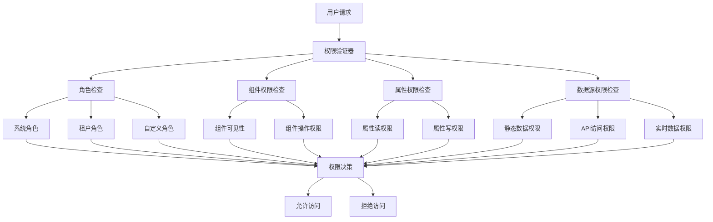

# Card 2.1 权限系统文档

> Card 2.1 权限系统提供了细粒度的访问控制机制，确保组件和数据的安全访问，支持多租户、角色分级和动态权限检查。

## 🎯 系统概览

### 核心概念

Card 2.1 权限系统基于**角色访问控制（RBAC）**和**属性访问控制（ABAC）**的混合模式：

1. **用户角色管理** - 基于角色的基础权限分配
2. **组件访问控制** - 控制用户对特定组件的访问权限
3. **属性访问权限** - 细粒度的组件属性访问控制
4. **数据源权限** - 控制对不同数据源的访问权限
5. **动态权限检查** - 基于业务逻辑的实时权限验证

### 权限架构图



## 👤 用户角色系统

### 基础角色定义

```typescript
// 系统预定义角色
export enum ComponentPermission {
  PUBLIC = '不限',               // 公开访问，无需登录
  TENANT_USER = 'TENANT_USER',   // 租户普通用户
  TENANT_ADMIN = 'TENANT_ADMIN', // 租户管理员
  SYS_ADMIN = 'SYS_ADMIN'        // 系统管理员
}

// 角色权限层级关系
const roleHierarchy = {
  [ComponentPermission.SYS_ADMIN]: {
    level: 4,
    inherits: [ComponentPermission.TENANT_ADMIN, ComponentPermission.TENANT_USER, ComponentPermission.PUBLIC],
    capabilities: [
      'system:manage',
      'tenant:create',
      'tenant:delete',
      'user:manage',
      'component:all',
      'data:all'
    ]
  },
  
  [ComponentPermission.TENANT_ADMIN]: {
    level: 3,
    inherits: [ComponentPermission.TENANT_USER, ComponentPermission.PUBLIC],
    capabilities: [
      'tenant:manage',
      'user:invite',
      'component:manage',
      'data:admin',
      'dashboard:manage'
    ]
  },
  
  [ComponentPermission.TENANT_USER]: {
    level: 2,
    inherits: [ComponentPermission.PUBLIC],
    capabilities: [
      'component:view',
      'data:read',
      'dashboard:view',
      'profile:edit'
    ]
  },
  
  [ComponentPermission.PUBLIC]: {
    level: 1,
    inherits: [],
    capabilities: [
      'public:view'
    ]
  }
}

// 用户信息接口
interface UserInfo {
  id: string
  username: string
  role: ComponentPermission
  tenantId: string
  permissions?: string[]        // 额外的自定义权限
  attributes?: Record<string, any> // 用户属性，用于ABAC
  createdAt: string
  lastLoginAt?: string
}
```

### 自定义角色配置

```typescript
// 自定义角色定义
export interface CustomRole {
  id: string
  name: string
  description: string
  baseRole: ComponentPermission    // 基础角色
  
  // 额外权限配置
  additionalPermissions: string[]
  
  // 权限限制配置
  restrictions: {
    // 时间限制
    timeRestrictions?: {
      startTime?: string         // 允许访问的开始时间
      endTime?: string           // 允许访问的结束时间
      daysOfWeek?: number[]      // 允许访问的星期几 (0-6)
      timezone?: string          // 时区设置
    }
    
    // IP限制
    ipRestrictions?: {
      allowList?: string[]       // IP白名单
      denyList?: string[]        // IP黑名单
    }
    
    // 设备限制
    deviceRestrictions?: {
      maxConcurrentSessions?: number // 最大并发会话数
      allowedDeviceTypes?: string[]  // 允许的设备类型
    }
  }
  
  // 资源访问限制
  resourceLimits: {
    maxComponentsPerDashboard?: number
    maxDashboards?: number
    maxDataSources?: number
    maxApiCallsPerHour?: number
  }
}

// 自定义角色使用示例
const customRoles: CustomRole[] = [
  {
    id: 'readonly-analyst',
    name: '只读分析师',
    description: '只能查看数据分析相关组件，不能修改配置',
    baseRole: ComponentPermission.TENANT_USER,
    
    additionalPermissions: [
      'analytics:view',
      'reports:export',
      'charts:interact'
    ],
    
    restrictions: {
      timeRestrictions: {
        startTime: '09:00',
        endTime: '18:00',
        daysOfWeek: [1, 2, 3, 4, 5], // 工作日
        timezone: 'Asia/Shanghai'
      }
    },
    
    resourceLimits: {
      maxComponentsPerDashboard: 20,
      maxDashboards: 5,
      maxApiCallsPerHour: 1000
    }
  },
  
  {
    id: 'device-operator',
    name: '设备操作员',
    description: '可以操作和监控设备，但不能修改系统配置',
    baseRole: ComponentPermission.TENANT_USER,
    
    additionalPermissions: [
      'device:control',
      'device:monitor',
      'alerts:manage'
    ],
    
    restrictions: {
      ipRestrictions: {
        allowList: ['192.168.1.0/24', '10.0.0.0/8']
      }
    },
    
    resourceLimits: {
      maxComponentsPerDashboard: 50,
      maxDataSources: 10
    }
  }
]
```

## 🔐 组件权限控制

### 组件级别权限配置

```typescript
// 在 settingConfig.ts 中配置组件权限
export const deviceControllerConfig: ComponentSettingConfig<DeviceControllerCustomize> = {
  componentType: 'device-controller',
  
  // 组件权限配置
  permissions: {
    // 基础访问权限
    view: ComponentPermission.TENANT_USER,      // 查看权限
    edit: ComponentPermission.TENANT_ADMIN,     // 编辑权限
    delete: ComponentPermission.TENANT_ADMIN,   // 删除权限
    
    // 自定义权限点
    customPermissions: {
      'device:control': {
        permission: ComponentPermission.TENANT_ADMIN,
        name: '设备控制',
        description: '允许用户控制设备开关状态'
      },
      
      'emergency:stop': {
        permission: ComponentPermission.SYS_ADMIN,
        name: '紧急停止',
        description: '紧急情况下停止所有设备操作'
      },
      
      'data:export': {
        permission: ComponentPermission.TENANT_USER,
        name: '数据导出',
        description: '导出设备运行数据'
      }
    },
    
    // 动态权限检查
    dynamicPermissionCheck: (
      action: string, 
      user: UserInfo, 
      component: any, 
      context?: any
    ) => {
      // 基于业务逻辑的动态权限检查
      if (action === 'device:control') {
        // 检查用户是否有操作该设备的权限
        const deviceId = component.customConfig?.customize?.deviceId
        if (deviceId) {
          const userDevices = context?.userDevices || []
          const hasDeviceAccess = userDevices.includes(deviceId)
          
          if (!hasDeviceAccess) {
            return {
              allowed: false,
              reason: '用户无权操作该设备'
            }
          }
        }
        
        // 检查设备当前状态
        const deviceStatus = context?.deviceStatus
        if (deviceStatus === 'maintenance') {
          return {
            allowed: false,
            reason: '设备正在维护中，暂时无法操作'
          }
        }
        
        // 检查操作时间限制
        const now = new Date()
        const hour = now.getHours()
        if (hour < 8 || hour > 22) {
          return {
            allowed: user.role === ComponentPermission.SYS_ADMIN,
            reason: '非工作时间，仅系统管理员可以操作设备'
          }
        }
      }
      
      return { allowed: true }
    }
  },
  
  settings: [
    // 权限相关的配置项
    createSetting(SettingControlType.SELECT, '设备ID', 'customize.deviceId', {
      // 选项基于用户权限动态生成
      dynamicOptions: (user: UserInfo) => {
        // 根据用户权限返回可选择的设备列表
        return getAccessibleDevices(user)
      }
    }),
    
    // 权限门控的配置项
    createSetting(SettingControlType.SWITCH, '启用紧急停止', 'customize.emergencyStopEnabled', {
      // 只有管理员才能看到此选项
      visibleWhen: (user: UserInfo) => user.role === ComponentPermission.TENANT_ADMIN,
      
      // 只有系统管理员才能修改
      editableWhen: (user: UserInfo) => user.role === ComponentPermission.SYS_ADMIN
    })
  ]
}
```

### 组件权限验证器

```typescript
// 组件权限验证核心类
export class ComponentPermissionValidator {
  /**
   * 检查组件访问权限
   * @param componentId 组件ID
   * @param action 动作类型
   * @param user 用户信息
   * @param context 上下文信息
   */
  static async checkPermission(
    componentId: string,
    action: string,
    user: UserInfo,
    context?: any
  ): Promise<PermissionResult> {
    try {
      // 1. 获取组件配置
      const componentConfig = componentRegistry.getSettingConfig(componentId)
      if (!componentConfig?.permissions) {
        // 没有配置权限，默认允许
        return { allowed: true }
      }
      
      const permissions = componentConfig.permissions
      
      // 2. 检查基础角色权限
      const requiredRole = this.getRequiredRole(permissions, action)
      if (requiredRole && !this.hasRole(user, requiredRole)) {
        return {
          allowed: false,
          reason: `需要 ${requiredRole} 或更高权限`
        }
      }
      
      // 3. 检查自定义权限点
      const customPermission = permissions.customPermissions?.[action]
      if (customPermission) {
        if (!this.hasRole(user, customPermission.permission)) {
          return {
            allowed: false,
            reason: customPermission.description || `权限不足：${action}`
          }
        }
      }
      
      // 4. 执行动态权限检查
      if (permissions.dynamicPermissionCheck) {
        const dynamicResult = await permissions.dynamicPermissionCheck(
          action,
          user,
          componentConfig,
          context
        )
        
        if (!dynamicResult.allowed) {
          return dynamicResult
        }
      }
      
      // 5. 检查用户自定义权限
      if (user.permissions) {
        const hasCustomPermission = user.permissions.includes(action)
        if (!hasCustomPermission && !requiredRole) {
          return {
            allowed: false,
            reason: `缺少自定义权限：${action}`
          }
        }
      }
      
      return { allowed: true }
      
    } catch (error) {
      console.error('权限检查失败:', error)
      return {
        allowed: false,
        reason: '权限检查失败，请联系管理员'
      }
    }
  }
  
  /**
   * 批量检查权限
   * @param checks 权限检查列表
   * @param user 用户信息
   */
  static async batchCheckPermissions(
    checks: Array<{
      componentId: string
      action: string
      context?: any
    }>,
    user: UserInfo
  ): Promise<Record<string, PermissionResult>> {
    const results: Record<string, PermissionResult> = {}
    
    await Promise.all(
      checks.map(async (check) => {
        const key = `${check.componentId}:${check.action}`
        results[key] = await this.checkPermission(
          check.componentId,
          check.action,
          user,
          check.context
        )
      })
    )
    
    return results
  }
  
  /**
   * 检查用户是否有指定角色
   * @param user 用户信息
   * @param requiredRole 需要的角色
   */
  private static hasRole(user: UserInfo, requiredRole: ComponentPermission): boolean {
    const userLevel = roleHierarchy[user.role]?.level || 0
    const requiredLevel = roleHierarchy[requiredRole]?.level || 0
    
    return userLevel >= requiredLevel
  }
  
  /**
   * 获取动作需要的角色权限
   * @param permissions 权限配置
   * @param action 动作
   */
  private static getRequiredRole(
    permissions: any,
    action: string
  ): ComponentPermission | null {
    switch (action) {
      case 'view':
        return permissions.view
      case 'edit':
        return permissions.edit
      case 'delete':
        return permissions.delete
      default:
        return permissions.customPermissions?.[action]?.permission || null
    }
  }
}

// 权限检查结果接口
interface PermissionResult {
  allowed: boolean
  reason?: string
  data?: any
}
```

## 🔑 属性权限控制

### 属性级权限配置

```typescript
// 属性权限控制配置
export const secureDataDisplayConfig: ComponentSettingConfig<SecureDataCustomize> = {
  componentType: 'secure-data-display',
  
  // 属性暴露权限配置
  propertyExposure: {
    exposedProperties: {
      // 公开数据 - 所有用户可访问
      publicInfo: {
        type: 'object',
        name: '公开信息',
        path: 'boundData.publicData',
        readonly: true,
        permission: ComponentPermission.PUBLIC
      },
      
      // 用户数据 - 租户用户可访问
      userData: {
        type: 'object',
        name: '用户数据',
        path: 'boundData.userData',
        readonly: false,
        permission: ComponentPermission.TENANT_USER,
        
        // 属性过滤器 - 基于用户权限过滤属性
        propertyFilter: (data: any, user: UserInfo) => {
          const filtered = { ...data }
          
          // 非管理员用户过滤敏感信息
          if (user.role !== ComponentPermission.TENANT_ADMIN) {
            delete filtered.personalInfo
            delete filtered.financialData
          }
          
          return filtered
        }
      },
      
      // 管理数据 - 仅管理员可访问
      adminData: {
        type: 'object',
        name: '管理数据',
        path: 'boundData.adminData',
        readonly: true,
        permission: ComponentPermission.TENANT_ADMIN,
        
        // 动态权限检查
        dynamicPermissionCheck: (user: UserInfo, component: any) => {
          // 只有数据拥有者或系统管理员可以访问
          const dataOwnerId = component.boundData?.adminData?.ownerId
          return user.id === dataOwnerId || user.role === ComponentPermission.SYS_ADMIN
        }
      },
      
      // 敏感数据 - 基于用户属性的访问控制
      sensitiveData: {
        type: 'object',
        name: '敏感数据',
        path: 'boundData.sensitiveData',
        readonly: true,
        permission: ComponentPermission.TENANT_ADMIN,
        
        // ABAC - 基于属性的访问控制
        attributeBasedAccess: {
          enabled: true,
          
          // 访问规则
          rules: [
            {
              name: '部门限制',
              condition: (user: UserInfo, context: any) => {
                const requiredDepartment = context.sensitiveData?.department
                return requiredDepartment ? user.attributes?.department === requiredDepartment : true
              },
              
              denyReason: '用户所在部门无权访问该敏感数据'
            },
            
            {
              name: '安全等级检查',
              condition: (user: UserInfo, context: any) => {
                const requiredClearance = context.sensitiveData?.securityLevel || 1
                const userClearance = user.attributes?.securityClearance || 0
                return userClearance >= requiredClearance
              },
              
              denyReason: '用户安全等级不足，无法访问该数据'
            },
            
            {
              name: '地理位置限制',
              condition: (user: UserInfo, context: any) => {
                const allowedRegions = context.sensitiveData?.allowedRegions
                if (!allowedRegions) return true
                
                const userRegion = user.attributes?.region
                return allowedRegions.includes(userRegion)
              },
              
              denyReason: '用户所在地区无权访问该数据'
            }
          ]
        }
      }
    },
    
    // 属性访问控制配置
    accessControl: {
      defaultPermission: ComponentPermission.TENANT_USER,
      
      // 属性级权限覆盖
      propertyPermissions: {
        publicInfo: ComponentPermission.PUBLIC,
        userData: ComponentPermission.TENANT_USER,
        adminData: ComponentPermission.TENANT_ADMIN,
        sensitiveData: ComponentPermission.TENANT_ADMIN
      },
      
      // 操作级权限控制
      operationPermissions: {
        read: ComponentPermission.TENANT_USER,
        write: ComponentPermission.TENANT_ADMIN,
        delete: ComponentPermission.SYS_ADMIN
      }
    }
  }
}
```

### 属性权限验证中间件

```typescript
// 属性访问权限验证中间件
export class PropertyPermissionMiddleware {
  /**
   * 属性读取权限检查
   * @param componentId 组件ID
   * @param propertyPath 属性路径
   * @param user 用户信息
   */
  static async checkReadPermission(
    componentId: string,
    propertyPath: string,
    user: UserInfo
  ): Promise<PermissionResult> {
    const propertyConfig = propertyExposureRegistry.getPropertyConfig(componentId, propertyPath)
    
    if (!propertyConfig) {
      return { allowed: false, reason: '属性不存在' }
    }
    
    // 检查基础权限
    if (propertyConfig.permission && !ComponentPermissionValidator.hasRole(user, propertyConfig.permission)) {
      return { 
        allowed: false, 
        reason: `需要 ${propertyConfig.permission} 权限才能读取此属性` 
      }
    }
    
    // 检查动态权限
    if (propertyConfig.dynamicPermissionCheck) {
      const component = componentRegistry.getComponent(componentId)
      const dynamicResult = await propertyConfig.dynamicPermissionCheck(user, component)
      
      if (!dynamicResult) {
        return { allowed: false, reason: '动态权限检查失败' }
      }
    }
    
    // 检查ABAC规则
    if (propertyConfig.attributeBasedAccess?.enabled) {
      const abacResult = await this.checkAttributeBasedAccess(
        propertyConfig.attributeBasedAccess,
        user,
        componentId,
        propertyPath
      )
      
      if (!abacResult.allowed) {
        return abacResult
      }
    }
    
    return { allowed: true }
  }
  
  /**
   * 属性写入权限检查
   * @param componentId 组件ID
   * @param propertyPath 属性路径
   * @param newValue 新值
   * @param user 用户信息
   */
  static async checkWritePermission(
    componentId: string,
    propertyPath: string,
    newValue: any,
    user: UserInfo
  ): Promise<PermissionResult> {
    // 先检查读取权限
    const readResult = await this.checkReadPermission(componentId, propertyPath, user)
    if (!readResult.allowed) {
      return readResult
    }
    
    const propertyConfig = propertyExposureRegistry.getPropertyConfig(componentId, propertyPath)
    
    // 检查只读属性
    if (propertyConfig.readonly) {
      return { allowed: false, reason: '该属性为只读属性' }
    }
    
    // 检查写入权限
    const accessControl = propertyConfig.accessControl
    if (accessControl?.operationPermissions?.write) {
      const writePermission = accessControl.operationPermissions.write
      if (!ComponentPermissionValidator.hasRole(user, writePermission)) {
        return {
          allowed: false,
          reason: `需要 ${writePermission} 权限才能修改此属性`
        }
      }
    }
    
    // 值变更权限检查
    if (propertyConfig.valueChangePermissionCheck) {
      const changeResult = await propertyConfig.valueChangePermissionCheck(
        user,
        propertyConfig.currentValue,
        newValue
      )
      
      if (!changeResult.allowed) {
        return changeResult
      }
    }
    
    return { allowed: true }
  }
  
  /**
   * 检查基于属性的访问控制（ABAC）
   * @param abacConfig ABAC配置
   * @param user 用户信息
   * @param componentId 组件ID
   * @param propertyPath 属性路径
   */
  private static async checkAttributeBasedAccess(
    abacConfig: any,
    user: UserInfo,
    componentId: string,
    propertyPath: string
  ): Promise<PermissionResult> {
    if (!abacConfig.rules || abacConfig.rules.length === 0) {
      return { allowed: true }
    }
    
    const component = componentRegistry.getComponent(componentId)
    const context = {
      component,
      property: propertyPath,
      ...component.boundData
    }
    
    // 检查所有ABAC规则
    for (const rule of abacConfig.rules) {
      try {
        const ruleResult = await rule.condition(user, context)
        if (!ruleResult) {
          return {
            allowed: false,
            reason: rule.denyReason || `ABAC规则检查失败: ${rule.name}`
          }
        }
      } catch (error) {
        console.error(`ABAC规则执行失败: ${rule.name}`, error)
        return {
          allowed: false,
          reason: `ABAC规则执行异常: ${rule.name}`
        }
      }
    }
    
    return { allowed: true }
  }
  
  /**
   * 过滤用户可访问的属性
   * @param componentId 组件ID
   * @param properties 原始属性对象
   * @param user 用户信息
   */
  static async filterAccessibleProperties(
    componentId: string,
    properties: Record<string, any>,
    user: UserInfo
  ): Promise<Record<string, any>> {
    const filtered: Record<string, any> = {}
    
    await Promise.all(
      Object.entries(properties).map(async ([propertyPath, value]) => {
        const permissionResult = await this.checkReadPermission(
          componentId,
          propertyPath,
          user
        )
        
        if (permissionResult.allowed) {
          // 应用属性过滤器
          const propertyConfig = propertyExposureRegistry.getPropertyConfig(componentId, propertyPath)
          
          if (propertyConfig.propertyFilter) {
            filtered[propertyPath] = propertyConfig.propertyFilter(value, user)
          } else {
            filtered[propertyPath] = value
          }
        }
      })
    )
    
    return filtered
  }
}
```

## 🗄️ 数据源权限控制

### 数据源访问权限

```typescript
// 数据源权限配置
export interface DataSourcePermissionConfig {
  // 基础访问权限
  accessPermission: ComponentPermission
  
  // 数据源类型特定权限
  typePermissions: {
    static?: ComponentPermission        // 静态数据访问权限
    api?: ComponentPermission          // API数据访问权限
    websocket?: ComponentPermission    // WebSocket数据访问权限
    script?: ComponentPermission       // 脚本数据访问权限
  }
  
  // API特定权限控制
  apiPermissions?: {
    allowedDomains?: string[]          // 允许访问的域名
    deniedDomains?: string[]           // 禁止访问的域名
    allowedPaths?: string[]            // 允许访问的API路径模式
    deniedPaths?: string[]             // 禁止访问的API路径模式
    
    // HTTP方法权限
    methodPermissions?: {
      GET?: ComponentPermission
      POST?: ComponentPermission
      PUT?: ComponentPermission
      DELETE?: ComponentPermission
    }
    
    // 参数过滤
    parameterFilters?: {
      required?: string[]              // 必需的参数
      forbidden?: string[]             // 禁止的参数
      
      // 动态参数验证
      validate?: (params: any, user: UserInfo) => boolean
    }
  }
  
  // WebSocket权限控制
  websocketPermissions?: {
    allowedOrigins?: string[]          // 允许的WebSocket来源
    allowedProtocols?: string[]        // 允许的协议
    
    // 连接限制
    connectionLimits?: {
      maxConcurrentConnections?: number
      maxConnectionsPerUser?: number
    }
  }
  
  // 脚本执行权限
  scriptPermissions?: {
    allowedAPIs?: string[]             // 脚本中允许调用的API
    forbiddenAPIs?: string[]           // 脚本中禁止调用的API
    maxExecutionTime?: number          // 最大执行时间
    maxMemoryUsage?: number            // 最大内存使用
    
    // 沙箱环境配置
    sandbox?: {
      allowFileAccess?: boolean
      allowNetworkAccess?: boolean
      allowSystemAccess?: boolean
    }
  }
  
  // 动态权限检查
  dynamicPermissionCheck?: (
    dataSourceConfig: any,
    user: UserInfo,
    context?: any
  ) => Promise<PermissionResult>
}

// 数据源权限验证器
export class DataSourcePermissionValidator {
  /**
   * 验证数据源访问权限
   * @param dataSourceConfig 数据源配置
   * @param user 用户信息
   * @param context 上下文信息
   */
  static async validateDataSourceAccess(
    dataSourceConfig: any,
    user: UserInfo,
    context?: any
  ): Promise<PermissionResult> {
    const permissionConfig = this.getDataSourcePermissionConfig(dataSourceConfig.type)
    
    if (!permissionConfig) {
      return { allowed: true } // 没有权限配置，默认允许
    }
    
    // 检查基础访问权限
    if (permissionConfig.accessPermission) {
      if (!ComponentPermissionValidator.hasRole(user, permissionConfig.accessPermission)) {
        return {
          allowed: false,
          reason: `需要 ${permissionConfig.accessPermission} 权限才能访问此数据源`
        }
      }
    }
    
    // 检查数据源类型特定权限
    const typePermission = permissionConfig.typePermissions?.[dataSourceConfig.type as keyof typeof permissionConfig.typePermissions]
    if (typePermission && !ComponentPermissionValidator.hasRole(user, typePermission)) {
      return {
        allowed: false,
        reason: `需要 ${typePermission} 权限才能访问 ${dataSourceConfig.type} 类型的数据源`
      }
    }
    
    // 根据数据源类型进行特定验证
    let specificResult: PermissionResult
    
    switch (dataSourceConfig.type) {
      case 'api':
        specificResult = await this.validateApiDataSource(
          dataSourceConfig,
          user,
          permissionConfig.apiPermissions
        )
        break
        
      case 'websocket':
        specificResult = await this.validateWebSocketDataSource(
          dataSourceConfig,
          user,
          permissionConfig.websocketPermissions
        )
        break
        
      case 'script':
        specificResult = await this.validateScriptDataSource(
          dataSourceConfig,
          user,
          permissionConfig.scriptPermissions
        )
        break
        
      default:
        specificResult = { allowed: true }
    }
    
    if (!specificResult.allowed) {
      return specificResult
    }
    
    // 执行动态权限检查
    if (permissionConfig.dynamicPermissionCheck) {
      const dynamicResult = await permissionConfig.dynamicPermissionCheck(
        dataSourceConfig,
        user,
        context
      )
      
      if (!dynamicResult.allowed) {
        return dynamicResult
      }
    }
    
    return { allowed: true }
  }
  
  /**
   * 验证API数据源权限
   */
  private static async validateApiDataSource(
    dataSourceConfig: any,
    user: UserInfo,
    apiPermissions?: any
  ): Promise<PermissionResult> {
    if (!apiPermissions) return { allowed: true }
    
    const url = dataSourceConfig.url
    const method = dataSourceConfig.method || 'GET'
    const params = dataSourceConfig.params || {}
    
    // 检查域名权限
    if (apiPermissions.allowedDomains) {
      const domain = new URL(url).hostname
      if (!apiPermissions.allowedDomains.includes(domain)) {
        return {
          allowed: false,
          reason: `不允许访问域名: ${domain}`
        }
      }
    }
    
    if (apiPermissions.deniedDomains) {
      const domain = new URL(url).hostname
      if (apiPermissions.deniedDomains.includes(domain)) {
        return {
          allowed: false,
          reason: `禁止访问域名: ${domain}`
        }
      }
    }
    
    // 检查路径权限
    if (apiPermissions.allowedPaths) {
      const path = new URL(url).pathname
      const isAllowed = apiPermissions.allowedPaths.some((pattern: string) =>
        new RegExp(pattern).test(path)
      )
      
      if (!isAllowed) {
        return {
          allowed: false,
          reason: `不允许访问路径: ${path}`
        }
      }
    }
    
    // 检查HTTP方法权限
    if (apiPermissions.methodPermissions) {
      const methodPermission = apiPermissions.methodPermissions[method as keyof typeof apiPermissions.methodPermissions]
      if (methodPermission && !ComponentPermissionValidator.hasRole(user, methodPermission)) {
        return {
          allowed: false,
          reason: `需要 ${methodPermission} 权限才能使用 ${method} 方法`
        }
      }
    }
    
    // 检查参数权限
    if (apiPermissions.parameterFilters) {
      const filters = apiPermissions.parameterFilters
      
      // 检查必需参数
      if (filters.required) {
        const missingParams = filters.required.filter(param => !(param in params))
        if (missingParams.length > 0) {
          return {
            allowed: false,
            reason: `缺少必需的参数: ${missingParams.join(', ')}`
          }
        }
      }
      
      // 检查禁止参数
      if (filters.forbidden) {
        const forbiddenParams = filters.forbidden.filter(param => param in params)
        if (forbiddenParams.length > 0) {
          return {
            allowed: false,
            reason: `包含禁止的参数: ${forbiddenParams.join(', ')}`
          }
        }
      }
      
      // 动态参数验证
      if (filters.validate && !filters.validate(params, user)) {
        return {
          allowed: false,
          reason: '参数验证失败'
        }
      }
    }
    
    return { allowed: true }
  }
  
  /**
   * 验证WebSocket数据源权限
   */
  private static async validateWebSocketDataSource(
    dataSourceConfig: any,
    user: UserInfo,
    wsPermissions?: any
  ): Promise<PermissionResult> {
    if (!wsPermissions) return { allowed: true }
    
    const url = dataSourceConfig.url
    
    // 检查来源权限
    if (wsPermissions.allowedOrigins) {
      const origin = new URL(url).origin
      if (!wsPermissions.allowedOrigins.includes(origin)) {
        return {
          allowed: false,
          reason: `不允许连接到来源: ${origin}`
        }
      }
    }
    
    // 检查协议权限
    if (wsPermissions.allowedProtocols) {
      const protocols = dataSourceConfig.protocols || []
      const hasAllowedProtocol = protocols.some((protocol: string) =>
        wsPermissions.allowedProtocols.includes(protocol)
      )
      
      if (protocols.length > 0 && !hasAllowedProtocol) {
        return {
          allowed: false,
          reason: '使用了不被允许的WebSocket协议'
        }
      }
    }
    
    // 检查连接限制
    if (wsPermissions.connectionLimits) {
      const limits = wsPermissions.connectionLimits
      
      // 这里应该检查实际的连接数，需要与WebSocket管理器集成
      // const currentConnections = await WebSocketManager.getConnectionCount(user.id)
      // if (limits.maxConnectionsPerUser && currentConnections >= limits.maxConnectionsPerUser) {
      //   return {
      //     allowed: false,
      //     reason: `超出用户最大连接数限制: ${limits.maxConnectionsPerUser}`
      //   }
      // }
    }
    
    return { allowed: true }
  }
  
  /**
   * 验证脚本数据源权限
   */
  private static async validateScriptDataSource(
    dataSourceConfig: any,
    user: UserInfo,
    scriptPermissions?: any
  ): Promise<PermissionResult> {
    if (!scriptPermissions) return { allowed: true }
    
    const script = dataSourceConfig.script || ''
    
    // 检查禁止的API调用
    if (scriptPermissions.forbiddenAPIs) {
      const forbiddenFound = scriptPermissions.forbiddenAPIs.find((api: string) =>
        script.includes(api)
      )
      
      if (forbiddenFound) {
        return {
          allowed: false,
          reason: `脚本包含禁止的API调用: ${forbiddenFound}`
        }
      }
    }
    
    // 检查沙箱环境限制
    if (scriptPermissions.sandbox) {
      const sandbox = scriptPermissions.sandbox
      
      // 文件访问检查
      if (!sandbox.allowFileAccess && this.containsFileAccess(script)) {
        return {
          allowed: false,
          reason: '脚本包含不被允许的文件访问操作'
        }
      }
      
      // 网络访问检查
      if (!sandbox.allowNetworkAccess && this.containsNetworkAccess(script)) {
        return {
          allowed: false,
          reason: '脚本包含不被允许的网络访问操作'
        }
      }
      
      // 系统访问检查
      if (!sandbox.allowSystemAccess && this.containsSystemAccess(script)) {
        return {
          allowed: false,
          reason: '脚本包含不被允许的系统访问操作'
        }
      }
    }
    
    return { allowed: true }
  }
  
  /**
   * 获取数据源权限配置
   */
  private static getDataSourcePermissionConfig(dataSourceType: string): DataSourcePermissionConfig | null {
    // 这里应该从配置文件或数据库中获取权限配置
    // 为了示例，返回一个默认配置
    return {
      accessPermission: ComponentPermission.TENANT_USER,
      typePermissions: {
        static: ComponentPermission.PUBLIC,
        api: ComponentPermission.TENANT_USER,
        websocket: ComponentPermission.TENANT_USER,
        script: ComponentPermission.TENANT_ADMIN
      },
      
      apiPermissions: {
        allowedDomains: ['api.example.com', 'localhost'],
        methodPermissions: {
          GET: ComponentPermission.TENANT_USER,
          POST: ComponentPermission.TENANT_ADMIN,
          PUT: ComponentPermission.TENANT_ADMIN,
          DELETE: ComponentPermission.SYS_ADMIN
        }
      },
      
      scriptPermissions: {
        forbiddenAPIs: ['eval', 'Function', 'require', 'import'],
        maxExecutionTime: 5000,
        sandbox: {
          allowFileAccess: false,
          allowNetworkAccess: false,
          allowSystemAccess: false
        }
      }
    }
  }
  
  // 辅助方法：检查脚本是否包含特定类型的访问
  private static containsFileAccess(script: string): boolean {
    const fileAccessPatterns = [
      /require\s*\(\s*['"`]fs['"`]\s*\)/,
      /import\s+.*from\s+['"`]fs['"`]/,
      /readFile|writeFile|mkdir|rmdir/
    ]
    
    return fileAccessPatterns.some(pattern => pattern.test(script))
  }
  
  private static containsNetworkAccess(script: string): boolean {
    const networkPatterns = [
      /fetch\s*\(/,
      /XMLHttpRequest/,
      /WebSocket/,
      /require\s*\(\s*['"`]http['"`]\s*\)/,
      /require\s*\(\s*['"`]https['"`]\s*\)/
    ]
    
    return networkPatterns.some(pattern => pattern.test(script))
  }
  
  private static containsSystemAccess(script: string): boolean {
    const systemPatterns = [
      /process\./,
      /require\s*\(\s*['"`]child_process['"`]\s*\)/,
      /exec|spawn|fork/,
      /os\./
    ]
    
    return systemPatterns.some(pattern => pattern.test(script))
  }
}
```

## 🛡️ 权限中间件与拦截器

### HTTP请求权限拦截器

```typescript
// HTTP请求权限拦截器
export class HttpPermissionInterceptor {
  /**
   * 请求前权限检查
   * @param request 请求配置
   * @param user 用户信息
   */
  static async beforeRequest(request: any, user: UserInfo): Promise<boolean> {
    // 检查API访问权限
    const hasApiAccess = await ComponentPermissionValidator.checkPermission(
      'system',
      'api:access',
      user
    )
    
    if (!hasApiAccess.allowed) {
      throw new Error(`API访问被拒绝: ${hasApiAccess.reason}`)
    }
    
    // 检查特定API端点权限
    const endpoint = `${request.method}:${request.url}`
    const endpointPermission = await this.getEndpointPermission(endpoint)
    
    if (endpointPermission) {
      const hasEndpointAccess = ComponentPermissionValidator.hasRole(user, endpointPermission)
      if (!hasEndpointAccess) {
        throw new Error(`无权访问API端点: ${endpoint}`)
      }
    }
    
    // 添加用户信息到请求头
    request.headers = {
      ...request.headers,
      'X-User-ID': user.id,
      'X-User-Role': user.role,
      'X-Tenant-ID': user.tenantId
    }
    
    return true
  }
  
  /**
   * 响应后数据过滤
   * @param response 响应数据
   * @param user 用户信息
   */
  static async afterResponse(response: any, user: UserInfo): Promise<any> {
    // 根据用户权限过滤响应数据
    return this.filterResponseData(response, user)
  }
  
  /**
   * 获取API端点权限要求
   * @param endpoint API端点
   */
  private static async getEndpointPermission(endpoint: string): Promise<ComponentPermission | null> {
    const endpointPermissions: Record<string, ComponentPermission> = {
      'GET:/api/users': ComponentPermission.TENANT_ADMIN,
      'POST:/api/users': ComponentPermission.SYS_ADMIN,
      'PUT:/api/users': ComponentPermission.TENANT_ADMIN,
      'DELETE:/api/users': ComponentPermission.SYS_ADMIN,
      
      'GET:/api/devices': ComponentPermission.TENANT_USER,
      'POST:/api/devices': ComponentPermission.TENANT_ADMIN,
      'PUT:/api/devices/control': ComponentPermission.TENANT_ADMIN,
      
      'GET:/api/dashboards': ComponentPermission.TENANT_USER,
      'POST:/api/dashboards': ComponentPermission.TENANT_USER,
      'PUT:/api/dashboards': ComponentPermission.TENANT_USER,
      'DELETE:/api/dashboards': ComponentPermission.TENANT_ADMIN
    }
    
    return endpointPermissions[endpoint] || null
  }
  
  /**
   * 过滤响应数据
   * @param data 原始数据
   * @param user 用户信息
   */
  private static filterResponseData(data: any, user: UserInfo): any {
    if (!data) return data
    
    // 根据用户角色过滤敏感数据
    if (user.role === ComponentPermission.TENANT_USER) {
      // 普通用户：移除管理员才能看到的字段
      return this.removeAdminFields(data)
    }
    
    if (user.role === ComponentPermission.TENANT_ADMIN) {
      // 租户管理员：移除系统管理员才能看到的字段
      return this.removeSysAdminFields(data)
    }
    
    // 系统管理员：返回完整数据
    return data
  }
  
  private static removeAdminFields(data: any): any {
    if (Array.isArray(data)) {
      return data.map(item => this.removeAdminFields(item))
    }
    
    if (typeof data === 'object' && data !== null) {
      const filtered = { ...data }
      
      // 移除管理员字段
      const adminFields = ['internalId', 'systemConfig', 'debugInfo', 'permissions']
      adminFields.forEach(field => delete filtered[field])
      
      // 递归处理嵌套对象
      Object.keys(filtered).forEach(key => {
        filtered[key] = this.removeAdminFields(filtered[key])
      })
      
      return filtered
    }
    
    return data
  }
  
  private static removeSysAdminFields(data: any): any {
    if (Array.isArray(data)) {
      return data.map(item => this.removeSysAdminFields(item))
    }
    
    if (typeof data === 'object' && data !== null) {
      const filtered = { ...data }
      
      // 移除系统管理员字段
      const sysAdminFields = ['systemInternalId', 'globalConfig', 'serverInfo']
      sysAdminFields.forEach(field => delete filtered[field])
      
      // 递归处理嵌套对象
      Object.keys(filtered).forEach(key => {
        filtered[key] = this.removeSysAdminFields(filtered[key])
      })
      
      return filtered
    }
    
    return data
  }
}
```

### Vue组合式函数权限集成

```typescript
// 权限相关的Vue组合式函数
import { ref, computed, onMounted } from 'vue'
import { ComponentPermissionValidator } from './permission-validator'

/**
 * 使用权限检查的组合式函数
 * @param componentId 组件ID
 * @param actions 需要检查的动作列表
 */
export function usePermissions(componentId: string, actions: string[] = []) {
  const user = ref<UserInfo | null>(null)
  const permissions = ref<Record<string, PermissionResult>>({})
  const loading = ref(false)
  
  /**
   * 检查单个权限
   * @param action 动作名称
   * @param context 上下文信息
   */
  const checkPermission = async (action: string, context?: any): Promise<boolean> => {
    if (!user.value) return false
    
    loading.value = true
    
    try {
      const result = await ComponentPermissionValidator.checkPermission(
        componentId,
        action,
        user.value,
        context
      )
      
      permissions.value[action] = result
      return result.allowed
      
    } catch (error) {
      console.error(`权限检查失败: ${action}`, error)
      permissions.value[action] = { allowed: false, reason: '权限检查异常' }
      return false
    } finally {
      loading.value = false
    }
  }
  
  /**
   * 批量检查权限
   * @param actionsWithContext 动作及其上下文
   */
  const checkBatchPermissions = async (
    actionsWithContext: Array<{ action: string; context?: any }> = []
  ) => {
    if (!user.value) return
    
    loading.value = true
    
    try {
      const checks = actionsWithContext.map(item => ({
        componentId,
        action: item.action,
        context: item.context
      }))
      
      const results = await ComponentPermissionValidator.batchCheckPermissions(checks, user.value)
      
      // 更新权限状态
      Object.entries(results).forEach(([key, result]) => {
        const action = key.split(':')[1]
        permissions.value[action] = result
      })
      
    } catch (error) {
      console.error('批量权限检查失败:', error)
    } finally {
      loading.value = false
    }
  }
  
  // 计算属性：各种权限状态
  const canView = computed(() => permissions.value.view?.allowed ?? false)
  const canEdit = computed(() => permissions.value.edit?.allowed ?? false)
  const canDelete = computed(() => permissions.value.delete?.allowed ?? false)
  
  // 通用权限检查
  const hasPermission = (action: string): boolean => {
    return permissions.value[action]?.allowed ?? false
  }
  
  // 获取权限拒绝原因
  const getPermissionReason = (action: string): string | undefined => {
    return permissions.value[action]?.reason
  }
  
  // 初始化权限检查
  onMounted(async () => {
    // 获取当前用户信息
    user.value = await getCurrentUser()
    
    if (user.value && actions.length > 0) {
      // 批量检查初始权限
      await checkBatchPermissions(
        actions.map(action => ({ action }))
      )
    }
  })
  
  return {
    user: computed(() => user.value),
    permissions: computed(() => permissions.value),
    loading: computed(() => loading.value),
    
    // 权限检查方法
    checkPermission,
    checkBatchPermissions,
    hasPermission,
    getPermissionReason,
    
    // 常用权限状态
    canView,
    canEdit,
    canDelete
  }
}

/**
 * 使用数据过滤的组合式函数
 * @param data 原始数据
 * @param filterRules 过滤规则
 */
export function useDataFiltering<T = any>(
  data: Ref<T>,
  filterRules?: DataFilterRule[]
) {
  const user = ref<UserInfo | null>(null)
  const filteredData = ref<T>()
  
  // 应用数据过滤
  const applyFiltering = () => {
    if (!user.value || !data.value || !filterRules) {
      filteredData.value = data.value
      return
    }
    
    let result = data.value
    
    // 应用每个过滤规则
    filterRules.forEach(rule => {
      if (rule.condition(user.value!)) {
        result = rule.filter(result, user.value!)
      }
    })
    
    filteredData.value = result
  }
  
  // 监听数据和用户变化
  watch([data, user], applyFiltering, { deep: true })
  
  onMounted(async () => {
    user.value = await getCurrentUser()
    applyFiltering()
  })
  
  return {
    filteredData: computed(() => filteredData.value),
    applyFiltering
  }
}

// 数据过滤规则接口
interface DataFilterRule {
  name: string
  condition: (user: UserInfo) => boolean
  filter: (data: any, user: UserInfo) => any
}

// 获取当前用户信息（示例实现）
async function getCurrentUser(): Promise<UserInfo | null> {
  try {
    // 这里应该从用户认证服务获取用户信息
    const response = await fetch('/api/auth/current-user')
    if (response.ok) {
      return await response.json()
    }
  } catch (error) {
    console.error('获取用户信息失败:', error)
  }
  return null
}
```

## 📊 权限审计与日志

### 权限操作日志记录

```typescript
// 权限操作日志记录系统
export class PermissionAuditLogger {
  private static logBuffer: PermissionAuditLog[] = []
  private static readonly BATCH_SIZE = 100
  private static readonly FLUSH_INTERVAL = 30000 // 30秒
  
  static {
    // 定期刷新日志到服务器
    setInterval(() => {
      this.flushLogs()
    }, this.FLUSH_INTERVAL)
  }
  
  /**
   * 记录权限检查日志
   * @param log 权限审计日志
   */
  static logPermissionCheck(log: PermissionAuditLog) {
    // 添加时间戳和会话信息
    const enrichedLog: PermissionAuditLog = {
      ...log,
      timestamp: new Date().toISOString(),
      sessionId: this.getCurrentSessionId(),
      userAgent: navigator.userAgent,
      clientIP: this.getClientIP()
    }
    
    this.logBuffer.push(enrichedLog)
    
    // 缓冲区满了立即刷新
    if (this.logBuffer.length >= this.BATCH_SIZE) {
      this.flushLogs()
    }
    
    // 在开发模式下输出到控制台
    if (process.env.NODE_ENV === 'development') {
      console.log('权限审计:', enrichedLog)
    }
  }
  
  /**
   * 记录权限违规行为
   * @param violation 违规信息
   */
  static logPermissionViolation(violation: PermissionViolation) {
    const log: PermissionAuditLog = {
      type: 'violation',
      action: violation.attemptedAction,
      resource: violation.resource,
      user: violation.user,
      result: 'denied',
      reason: violation.reason,
      severity: violation.severity || 'medium',
      
      metadata: {
        violation: true,
        attemptedAccess: violation.attemptedAccess,
        securityContext: violation.securityContext
      }
    }
    
    this.logPermissionCheck(log)
    
    // 高严重性违规立即发送告警
    if (violation.severity === 'high' || violation.severity === 'critical') {
      this.sendSecurityAlert(violation)
    }
  }
  
  /**
   * 记录权限变更日志
   * @param change 权限变更信息
   */
  static logPermissionChange(change: PermissionChange) {
    const log: PermissionAuditLog = {
      type: 'change',
      action: 'permission:modify',
      resource: change.resource,
      user: change.modifiedBy,
      result: 'success',
      
      metadata: {
        changeType: change.type,
        oldPermissions: change.oldPermissions,
        newPermissions: change.newPermissions,
        affectedUser: change.affectedUser,
        changeReason: change.reason
      }
    }
    
    this.logPermissionCheck(log)
  }
  
  /**
   * 刷新日志到服务器
   */
  private static async flushLogs() {
    if (this.logBuffer.length === 0) return
    
    const logsToSend = [...this.logBuffer]
    this.logBuffer = []
    
    try {
      await fetch('/api/audit/permissions', {
        method: 'POST',
        headers: {
          'Content-Type': 'application/json'
        },
        body: JSON.stringify({ logs: logsToSend })
      })
    } catch (error) {
      console.error('权限日志发送失败:', error)
      // 发送失败的日志重新加入缓冲区
      this.logBuffer.unshift(...logsToSend)
    }
  }
  
  /**
   * 发送安全告警
   * @param violation 权限违规信息
   */
  private static async sendSecurityAlert(violation: PermissionViolation) {
    try {
      await fetch('/api/security/alert', {
        method: 'POST',
        headers: {
          'Content-Type': 'application/json'
        },
        body: JSON.stringify({
          type: 'permission_violation',
          severity: violation.severity,
          user: violation.user,
          action: violation.attemptedAction,
          resource: violation.resource,
          reason: violation.reason,
          timestamp: new Date().toISOString()
        })
      })
    } catch (error) {
      console.error('安全告警发送失败:', error)
    }
  }
  
  private static getCurrentSessionId(): string {
    return sessionStorage.getItem('sessionId') || 'unknown'
  }
  
  private static getClientIP(): string {
    // 这里应该从服务器获取真实IP
    return 'unknown'
  }
}

// 权限审计日志接口
interface PermissionAuditLog {
  type: 'check' | 'violation' | 'change'
  action: string
  resource: string
  user: UserInfo
  result: 'allowed' | 'denied' | 'success' | 'failed'
  reason?: string
  severity?: 'low' | 'medium' | 'high' | 'critical'
  
  timestamp?: string
  sessionId?: string
  userAgent?: string
  clientIP?: string
  
  metadata?: Record<string, any>
}

// 权限违规接口
interface PermissionViolation {
  user: UserInfo
  attemptedAction: string
  resource: string
  reason: string
  severity?: 'low' | 'medium' | 'high' | 'critical'
  attemptedAccess?: any
  securityContext?: any
}

// 权限变更接口
interface PermissionChange {
  type: 'grant' | 'revoke' | 'modify'
  resource: string
  affectedUser: UserInfo
  modifiedBy: UserInfo
  oldPermissions: any
  newPermissions: any
  reason: string
}
```

## 📋 最佳实践指南

### 1. 权限设计原则

```typescript
const permissionDesignPrinciples = {
  // 最小权限原则
  leastPrivilege: {
    '默认拒绝': '没有明确授权的操作默认拒绝',
    '需要即授权': '只授予完成工作所需的最小权限',
    '权限分离': '避免单个用户拥有过多权限',
    '定期审查': '定期审查和清理不必要的权限'
  },
  
  // 防御深度
  defenseInDepth: {
    '多层验证': '在多个层面进行权限检查',
    '冗余控制': '关键操作使用多重权限验证',
    '异常检测': '监控异常的权限使用模式',
    '快速响应': '权限违规时快速响应和处理'
  },
  
  // 用户体验平衡
  userExperience: {
    '清晰反馈': '权限拒绝时提供清晰的提示信息',
    '渐进披露': '根据权限逐步显示可用功能',
    '优雅降级': '权限不足时提供替代方案',
    '快速授权': '简化必要权限的获取流程'
  }
}
```

### 2. 权限配置最佳实践

```typescript
const permissionConfigBestPractices = {
  // 角色设计
  roleDesign: {
    '职责清晰': '每个角色有明确的职责范围',
    '层次合理': '角色权限层次符合组织结构',
    '易于理解': '角色名称和描述容易理解',
    '便于维护': '角色数量适中，易于管理'
  },
  
  // 权限粒度
  granularity: {
    '适度细分': '权限粒度既不过粗也不过细',
    '业务对齐': '权限划分与业务流程对应',
    '技术可行': '权限检查在技术上可高效实现',
    '灵活组合': '支持权限的灵活组合和扩展'
  },
  
  // 动态权限
  dynamicPermissions: {
    '性能优化': '动态权限检查要考虑性能影响',
    '缓存策略': '合理使用缓存避免重复计算',
    '容错处理': '动态检查失败时的降级策略',
    '测试覆盖': '确保动态权限逻辑有充分测试'
  }
}
```

### 3. 安全加固措施

```typescript
const securityHardeningMeasures = {
  // 会话管理
  sessionSecurity: {
    '会话超时': '设置合理的会话超时时间',
    '并发控制': '限制用户并发会话数量',
    '会话绑定': '会话与IP地址和设备绑定',
    '安全退出': '确保安全退出清理会话信息'
  },
  
  // 访问监控
  accessMonitoring: {
    '实时监控': '实时监控权限访问行为',
    '异常告警': '检测和告警异常访问模式',
    '行为分析': '分析用户行为识别潜在风险',
    '取证支持': '保留足够的审计日志支持取证'
  },
  
  // 数据保护
  dataProtection: {
    '敏感数据标记': '明确标记和保护敏感数据',
    '数据脱敏': '在适当场景下对数据进行脱敏',
    '传输加密': '敏感数据传输使用加密',
    '存储加密': '敏感数据存储使用加密'
  }
}
```

---

## 🔗 相关文档

- [数据源系统详解](./data-sources.md) - 了解数据源权限控制
- [交互系统配置](./interaction-system.md) - 学习交互权限配置
- [属性暴露机制](./property-exposure.md) - 理解属性权限控制
- [组件开发指南](../DEVELOPMENT_GUIDE.md) - 完整的开发流程

---

**💡 总结**：Card 2.1 权限系统通过角色访问控制、属性访问控制和动态权限检查的混合模式，提供了全面的安全保护机制。掌握用户角色管理、组件权限控制、属性权限配置、数据源权限验证等核心功能，可以构建出安全可靠的企业级应用。结合权限审计、安全加固和最佳实践，能够确保系统的长期安全运行。