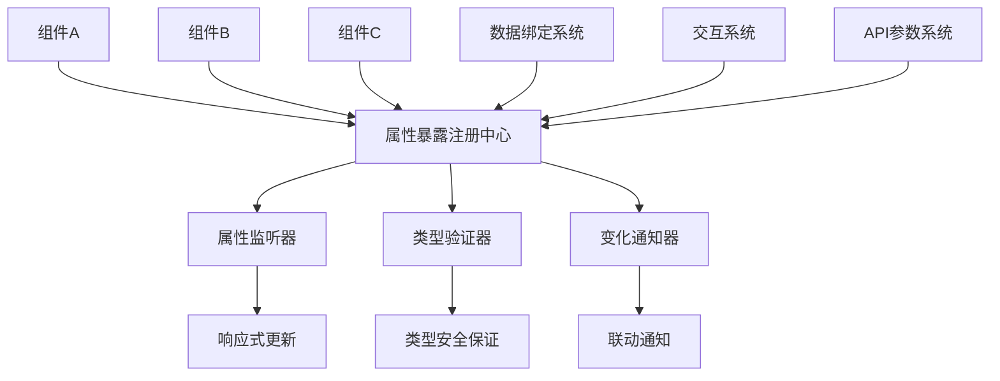

# Card 2.1 属性暴露机制文档

> 属性暴露机制是 Card 2.1 组件间数据绑定和交互的核心基础，实现了组件属性的动态访问和响应式更新。

## 🎯 系统概览

### 核心概念

属性暴露机制允许组件将其内部状态和配置属性暴露给其他组件，实现：

1. **数据绑定** - 组件间的数据引用和依赖关系
2. **响应式更新** - 属性变化时自动通知相关组件
3. **类型安全** - 完整的 TypeScript 类型检查和智能提示
4. **动态访问** - 运行时动态获取和设置组件属性

### 属性暴露架构



## 📋 属性暴露配置

### 基本属性暴露

在 `settingConfig.ts` 中声明组件需要暴露的属性：

```typescript
// settingConfig.ts - 基本属性暴露配置
export const deviceSelectorSettingConfig: ComponentSettingConfig<DeviceSelectorCustomize> = {
  componentType: 'device-selector',
  
  // 属性暴露配置
  propertyExposure: {
    // 暴露的属性定义
    exposedProperties: {
      // 当前选中的设备ID
      selectedDeviceId: {
        type: 'string',
        name: '选中设备ID',
        description: '当前用户选中的设备标识符',
        path: 'customize.selectedDeviceId', // 属性在组件配置中的路径
        readonly: false,    // 是否只读
        defaultValue: '',   // 默认值
        
        // 属性验证规则
        validation: {
          required: false,
          pattern: /^[A-Z]{3}-\d{3}$/, // 设备ID格式验证
          minLength: 1,
          maxLength: 50
        }
      },
      
      // 选中设备的详细信息
      selectedDeviceInfo: {
        type: 'object',
        name: '选中设备信息',
        description: '当前选中设备的完整信息对象',
        path: 'customize.deviceInfo',
        readonly: true, // 只读属性，由组件内部计算
        
        // 对象结构定义
        structure: {
          deviceId: { type: 'string', name: '设备ID' },
          deviceName: { type: 'string', name: '设备名称' },
          deviceType: { type: 'string', name: '设备类型' },
          location: { type: 'string', name: '位置' },
          status: { 
            type: 'string', 
            name: '状态',
            enum: ['online', 'offline', 'maintenance']
          },
          lastUpdate: { type: 'string', name: '最后更新时间' }
        }
      },
      
      // 设备列表数组
      availableDevices: {
        type: 'array',
        name: '可用设备列表',
        description: '所有可供选择的设备列表',
        path: 'boundData.deviceList',
        readonly: true,
        
        // 数组元素结构
        itemType: {
          type: 'object',
          structure: {
            deviceId: { type: 'string', name: '设备ID' },
            deviceName: { type: 'string', name: '设备名称' },
            enabled: { type: 'boolean', name: '是否启用' }
          }
        }
      }
    },
    
    // 属性变化监听配置
    changeListeners: {
      selectedDeviceId: {
        // 属性变化时的回调函数
        onChange: 'onDeviceSelectionChange',
        // 变化通知的防抖配置
        debounce: 300,
        // 是否立即通知
        immediate: true
      }
    },
    
    // 自动注册到全局属性注册中心
    autoRegister: true
  },
  
  settings: [
    createSetting(SettingControlType.SELECT, '默认设备', 'customize.selectedDeviceId', {
      options: [
        { label: '温度传感器01', value: 'TMP-001' },
        { label: '湿度传感器01', value: 'HUM-001' }
      ]
    })
  ]
}
```

### 高级属性暴露配置

```typescript
// 高级属性暴露配置 - 包含计算属性和条件暴露
export const advancedComponentConfig: ComponentSettingConfig<AdvancedCustomize> = {
  componentType: 'advanced-chart',
  
  propertyExposure: {
    exposedProperties: {
      // 计算属性 - 基于其他属性动态计算
      averageValue: {
        type: 'number',
        name: '平均值',
        description: '当前数据集的平均值',
        computed: true, // 标记为计算属性
        
        // 计算函数
        computeFunction: (component: any) => {
          const data = component.boundData?.timeSeries || []
          if (data.length === 0) return 0
          const sum = data.reduce((acc: number, item: any) => acc + (item.value || 0), 0)
          return Math.round(sum / data.length * 100) / 100
        },
        
        // 计算依赖的属性
        dependencies: ['boundData.timeSeries'],
        
        // 计算缓存配置
        cache: {
          enabled: true,
          ttl: 5000 // 5秒缓存
        }
      },
      
      // 条件暴露属性 - 根据条件决定是否暴露
      alertThreshold: {
        type: 'number',
        name: '告警阈值',
        description: '当前组件的告警阈值设置',
        path: 'customize.threshold',
        
        // 条件暴露配置
        conditional: {
          enabled: true,
          condition: (component: any) => {
            // 只有当组件启用了告警功能时才暴露此属性
            return component.customConfig?.customize?.enableAlert === true
          },
          
          // 条件不满足时的默认值
          fallbackValue: null
        }
      },
      
      // 格式化属性 - 暴露时进行格式转换
      formattedTimestamp: {
        type: 'string',
        name: '格式化时间',
        description: '格式化后的最后更新时间',
        path: 'boundData.lastUpdate',
        
        // 格式化函数
        formatter: (rawValue: any, component: any) => {
          if (!rawValue) return ''
          
          const date = new Date(rawValue)
          const locale = component.customConfig?.customize?.locale || 'zh-CN'
          const format = component.customConfig?.customize?.timeFormat || 'full'
          
          return new Intl.DateTimeFormat(locale, {
            dateStyle: format as 'full' | 'long' | 'medium' | 'short',
            timeStyle: format as 'full' | 'long' | 'medium' | 'short'
          }).format(date)
        },
        
        // 格式化依赖
        formatDependencies: ['customize.locale', 'customize.timeFormat']
      }
    },
    
    // 属性分组 - 将相关属性组织成组
    propertyGroups: {
      deviceInfo: {
        name: '设备信息',
        description: '与设备相关的属性',
        properties: ['selectedDeviceId', 'selectedDeviceInfo', 'availableDevices']
      },
      
      dataMetrics: {
        name: '数据指标',
        description: '数据分析相关的属性',
        properties: ['averageValue', 'alertThreshold'],
        
        // 组级权限控制
        permission: 'TENANT_ADMIN'
      },
      
      formatting: {
        name: '格式化',
        description: '显示格式相关的属性',
        properties: ['formattedTimestamp']
      }
    },
    
    // 属性访问权限配置
    accessControl: {
      // 全局默认权限
      defaultPermission: 'TENANT_USER',
      
      // 特定属性的权限配置
      propertyPermissions: {
        selectedDeviceId: 'TENANT_USER',    // 普通用户可访问
        alertThreshold: 'TENANT_ADMIN',     // 仅管理员可访问
        availableDevices: 'TENANT_USER'
      },
      
      // 动态权限检查
      dynamicPermissionCheck: (propertyName: string, user: any, component: any) => {
        // 基于用户角色和组件状态的动态权限检查
        if (propertyName === 'selectedDeviceInfo') {
          // 如果设备是私有的，只有创建者或管理员可以访问
          const deviceInfo = component.customConfig?.customize?.deviceInfo
          if (deviceInfo?.isPrivate) {
            return user.role === 'TENANT_ADMIN' || user.id === deviceInfo.ownerId
          }
        }
        return true
      }
    }
  }
}
```

## 🔗 属性绑定语法

### 基本绑定语法

Card 2.1 使用统一的属性绑定语法来引用其他组件的属性：

```typescript
// 属性绑定语法格式：{{组件ID.属性路径}}
const propertyBindingExamples = {
  // 基本属性绑定
  basicBinding: {
    // 绑定到其他组件的字符串属性
    deviceId: '{{comp-device-selector.selectedDeviceId}}',
    
    // 绑定到嵌套对象属性
    deviceName: '{{comp-device-selector.selectedDeviceInfo.deviceName}}',
    
    // 绑定到数组元素
    firstDeviceId: '{{comp-device-list.availableDevices.0.deviceId}}',
    
    // 绑定到计算属性
    averageTemp: '{{comp-temperature-chart.averageValue}}'
  },
  
  // 条件绑定 - 基于条件选择不同的绑定值
  conditionalBinding: {
    // 三元运算符语法
    displayText: '{{comp-status.isOnline ? comp-status.onlineText : comp-status.offlineText}}',
    
    // 空值合并操作符
    deviceName: '{{comp-selector.selectedDeviceInfo.deviceName ?? "未选择设备"}}',
    
    // 链式调用保护
    locationText: '{{comp-selector.selectedDeviceInfo?.location?.name}}'
  },
  
  // 表达式绑定 - 支持简单的JavaScript表达式
  expressionBinding: {
    // 数学运算
    percentage: '{{comp-gauge.currentValue / comp-gauge.maxValue * 100}}',
    
    // 字符串操作
    fullName: '{{comp-info.firstName + " " + comp-info.lastName}}',
    
    // 数组操作
    deviceCount: '{{comp-list.availableDevices.length}}',
    
    // 日期格式化
    formatDate: '{{new Date(comp-data.timestamp).toLocaleString()}}',
    
    // 条件判断
    statusColor: '{{comp-sensor.temperature > 35 ? "#ff4d4f" : "#52c41a"}}'
  },
  
  // 函数调用绑定 - 调用预定义的工具函数
  functionBinding: {
    // 格式化数值
    formattedValue: '{{formatNumber(comp-meter.value, 2)}}',
    
    // 时间格式化
    relativeTime: '{{formatRelativeTime(comp-data.lastUpdate)}}',
    
    // 条件格式化
    statusText: '{{getStatusText(comp-device.status, "zh-CN")}}',
    
    // 单位转换
    convertedValue: '{{convertTemperature(comp-sensor.temperature, "celsius", "fahrenheit")}}'
  }
}
```

### 高级绑定模式

```typescript
// 高级属性绑定配置
const advancedBindingPatterns = {
  // 多属性绑定 - 绑定到多个源属性
  multiPropertyBinding: {
    description: '从多个组件获取属性并合并',
    
    // 对象合并绑定
    deviceSummary: {
      type: 'object',
      binding: {
        deviceId: '{{comp-selector.selectedDeviceId}}',
        deviceName: '{{comp-selector.selectedDeviceInfo.deviceName}}',
        temperature: '{{comp-temp-sensor.currentValue}}',
        humidity: '{{comp-hum-sensor.currentValue}}',
        location: '{{comp-location.currentLocation}}',
        
        // 计算属性
        comfortIndex: '{{(comp-temp-sensor.currentValue * 0.6 + comp-hum-sensor.currentValue * 0.4) / 100}}'
      }
    }
  },
  
  // 数组聚合绑定 - 从多个组件聚合数组数据
  arrayAggregationBinding: {
    description: '聚合多个组件的数组数据',
    
    allDeviceMetrics: {
      type: 'array',
      aggregation: {
        type: 'merge', // merge | concat | union
        sources: [
          '{{comp-temp-sensors.deviceList}}',
          '{{comp-hum-sensors.deviceList}}',
          '{{comp-pressure-sensors.deviceList}}'
        ],
        
        // 聚合后的数据处理
        postProcess: (aggregatedData: any[]) => {
          // 去重并排序
          const uniqueDevices = aggregatedData
            .filter((device, index, self) => 
              self.findIndex(d => d.deviceId === device.deviceId) === index
            )
            .sort((a, b) => a.deviceName.localeCompare(b.deviceName))
          
          return uniqueDevices
        }
      }
    }
  },
  
  // 链式依赖绑定 - 属性依赖链
  chainedDependencyBinding: {
    description: '创建属性依赖链，A依赖B，B依赖C',
    
    chain: [
      {
        // 第一级：基础数据
        property: 'selectedRegion',
        binding: '{{comp-region-selector.selectedValue}}'
      },
      {
        // 第二级：依赖第一级数据
        property: 'regionDevices',
        binding: '{{comp-device-manager.getDevicesByRegion(selectedRegion)}}'
      },
      {
        // 第三级：依赖第二级数据
        property: 'activeDevices',
        binding: '{{regionDevices.filter(device => device.status === "online")}}'
      },
      {
        // 第四级：最终计算结果
        property: 'deviceCount',
        binding: '{{activeDevices.length}}'
      }
    ]
  },
  
  // 时间窗口绑定 - 基于时间窗口的数据绑定
  timeWindowBinding: {
    description: '根据时间窗口动态绑定历史数据',
    
    historicalData: {
      type: 'array',
      binding: {
        source: '{{comp-time-series.data}}',
        
        // 时间窗口配置
        timeWindow: {
          type: 'sliding', // sliding | fixed | dynamic
          duration: '{{comp-time-picker.selectedDuration}}', // 持续时间
          end: '{{comp-time-picker.endTime}}', // 结束时间
          
          // 数据筛选函数
          filter: (data: any[], startTime: number, endTime: number) => {
            return data.filter(item => {
              const timestamp = new Date(item.timestamp).getTime()
              return timestamp >= startTime && timestamp <= endTime
            })
          }
        },
        
        // 数据采样配置
        sampling: {
          enabled: true,
          maxPoints: 1000, // 最大数据点数
          method: 'average' // average | max | min | last
        }
      }
    }
  }
}
```

## 🔧 属性访问API

### 运行时属性访问

```typescript
// 属性暴露注册中心API
import { propertyExposureRegistry } from '@/card2.1/core/property-exposure'

// 基本属性访问操作
class PropertyAccessAPI {
  /**
   * 获取组件属性值
   * @param componentId 组件ID
   * @param propertyPath 属性路径
   */
  static getProperty(componentId: string, propertyPath: string): any {
    return propertyExposureRegistry.getPropertyValue(componentId, propertyPath)
  }
  
  /**
   * 设置组件属性值
   * @param componentId 组件ID
   * @param propertyPath 属性路径
   * @param value 新值
   */
  static setProperty(componentId: string, propertyPath: string, value: any): boolean {
    return propertyExposureRegistry.setPropertyValue(componentId, propertyPath, value)
  }
  
  /**
   * 监听属性变化
   * @param componentId 组件ID
   * @param propertyPath 属性路径
   * @param callback 变化回调函数
   */
  static watchProperty(
    componentId: string, 
    propertyPath: string, 
    callback: (newValue: any, oldValue: any) => void
  ): () => void {
    return propertyExposureRegistry.watchProperty(componentId, propertyPath, callback)
  }
  
  /**
   * 批量获取属性
   * @param requests 属性请求数组
   */
  static getBatchProperties(requests: Array<{componentId: string, propertyPath: string}>): Record<string, any> {
    const results: Record<string, any> = {}
    
    requests.forEach(req => {
      const key = `${req.componentId}.${req.propertyPath}`
      results[key] = this.getProperty(req.componentId, req.propertyPath)
    })
    
    return results
  }
  
  /**
   * 获取组件的所有暴露属性
   * @param componentId 组件ID
   */
  static getExposedProperties(componentId: string): Record<string, any> {
    return propertyExposureRegistry.getAllExposedProperties(componentId)
  }
  
  /**
   * 获取属性的元数据信息
   * @param componentId 组件ID
   * @param propertyPath 属性路径
   */
  static getPropertyMetadata(componentId: string, propertyPath: string) {
    return propertyExposureRegistry.getPropertyMetadata(componentId, propertyPath)
  }
  
  /**
   * 检查属性是否存在
   * @param componentId 组件ID
   * @param propertyPath 属性路径
   */
  static hasProperty(componentId: string, propertyPath: string): boolean {
    return propertyExposureRegistry.hasProperty(componentId, propertyPath)
  }
  
  /**
   * 解析属性绑定表达式
   * @param expression 绑定表达式，如 "{{comp-001.selectedValue}}"
   * @param context 上下文对象
   */
  static resolveBinding(expression: string, context?: Record<string, any>): any {
    return propertyExposureRegistry.resolveBinding(expression, context)
  }
}

// 使用示例
export class DeviceControllerComponent {
  componentId = 'comp-device-controller'
  
  // 初始化时设置属性监听
  setupPropertyListeners() {
    // 监听设备选择器的选择变化
    const unwatch = PropertyAccessAPI.watchProperty(
      'comp-device-selector',
      'selectedDeviceId',
      (newDeviceId, oldDeviceId) => {
        console.log('设备选择从', oldDeviceId, '变更为', newDeviceId)
        this.updateDeviceData(newDeviceId)
      }
    )
    
    // 在组件销毁时取消监听
    this.onUnmount(() => unwatch())
  }
  
  // 更新设备数据
  async updateDeviceData(deviceId: string) {
    if (!deviceId) return
    
    // 获取相关组件的属性
    const deviceInfo = PropertyAccessAPI.getProperty(
      'comp-device-selector',
      'selectedDeviceInfo'
    )
    
    const timeRange = PropertyAccessAPI.getProperty(
      'comp-time-picker',
      'selectedRange'
    )
    
    // 批量获取多个属性
    const batchData = PropertyAccessAPI.getBatchProperties([
      { componentId: 'comp-location-filter', propertyPath: 'selectedLocation' },
      { componentId: 'comp-metric-selector', propertyPath: 'selectedMetrics' },
      { componentId: 'comp-alert-settings', propertyPath: 'thresholdConfig' }
    ])
    
    // 使用获取的属性数据进行业务操作
    await this.fetchDeviceMetrics({
      deviceId,
      deviceInfo,
      timeRange,
      location: batchData['comp-location-filter.selectedLocation'],
      metrics: batchData['comp-metric-selector.selectedMetrics'],
      thresholds: batchData['comp-alert-settings.thresholdConfig']
    })
  }
  
  // 设置组件属性
  updateComponentProperties() {
    // 设置图表组件的数据
    PropertyAccessAPI.setProperty(
      'comp-device-chart',
      'customize.data',
      this.processedMetricsData
    )
    
    // 设置状态指示器
    PropertyAccessAPI.setProperty(
      'comp-status-indicator',
      'customize.status',
      this.deviceStatus
    )
    
    // 设置告警面板
    PropertyAccessAPI.setProperty(
      'comp-alert-panel',
      'customize.alerts',
      this.activeAlerts
    )
  }
}
```

### Vue组合式函数集成

```typescript
// 属性暴露的Vue组合式函数
import { ref, computed, watch, onUnmounted } from 'vue'
import { PropertyAccessAPI } from './property-access-api'

/**
 * 使用组件属性的组合式函数
 * @param componentId 目标组件ID
 * @param propertyPath 属性路径
 */
export function useComponentProperty<T = any>(
  componentId: string, 
  propertyPath: string
) {
  // 属性值响应式引用
  const value = ref<T>()
  const loading = ref(false)
  const error = ref<string | null>(null)
  
  // 获取属性值
  const getValue = async () => {
    try {
      loading.value = true
      error.value = null
      
      const result = PropertyAccessAPI.getProperty(componentId, propertyPath)
      value.value = result
      
      return result
    } catch (err) {
      error.value = err instanceof Error ? err.message : '获取属性失败'
      throw err
    } finally {
      loading.value = false
    }
  }
  
  // 设置属性值
  const setValue = async (newValue: T) => {
    try {
      loading.value = true
      error.value = null
      
      const success = PropertyAccessAPI.setProperty(componentId, propertyPath, newValue)
      if (success) {
        value.value = newValue
      }
      
      return success
    } catch (err) {
      error.value = err instanceof Error ? err.message : '设置属性失败'
      throw err
    } finally {
      loading.value = false
    }
  }
  
  // 设置属性监听
  const unwatch = PropertyAccessAPI.watchProperty(
    componentId,
    propertyPath,
    (newValue: T, oldValue: T) => {
      value.value = newValue
    }
  )
  
  // 组件卸载时清理监听
  onUnmounted(() => {
    unwatch()
  })
  
  // 初始化获取属性值
  getValue()
  
  return {
    value: computed(() => value.value),
    loading: computed(() => loading.value),
    error: computed(() => error.value),
    getValue,
    setValue,
    refresh: getValue
  }
}

/**
 * 使用多个组件属性的组合式函数
 * @param bindings 属性绑定配置
 */
export function useMultipleProperties(
  bindings: Record<string, { componentId: string; propertyPath: string }>
) {
  const values = ref<Record<string, any>>({})
  const loading = ref<Record<string, boolean>>({})
  const errors = ref<Record<string, string | null>>({})
  
  // 监听器清理函数数组
  const unwatchers: Array<() => void> = []
  
  // 初始化每个属性的监听和获取
  Object.entries(bindings).forEach(([key, binding]) => {
    loading.value[key] = false
    errors.value[key] = null
    
    // 获取初始值
    try {
      values.value[key] = PropertyAccessAPI.getProperty(
        binding.componentId,
        binding.propertyPath
      )
    } catch (err) {
      errors.value[key] = err instanceof Error ? err.message : '获取属性失败'
    }
    
    // 设置监听
    const unwatch = PropertyAccessAPI.watchProperty(
      binding.componentId,
      binding.propertyPath,
      (newValue: any) => {
        values.value[key] = newValue
        errors.value[key] = null
      }
    )
    
    unwatchers.push(unwatch)
  })
  
  // 清理所有监听器
  onUnmounted(() => {
    unwatchers.forEach(unwatch => unwatch())
  })
  
  // 刷新所有属性
  const refreshAll = () => {
    Object.entries(bindings).forEach(([key, binding]) => {
      try {
        loading.value[key] = true
        const value = PropertyAccessAPI.getProperty(
          binding.componentId,
          binding.propertyPath
        )
        values.value[key] = value
        errors.value[key] = null
      } catch (err) {
        errors.value[key] = err instanceof Error ? err.message : '获取属性失败'
      } finally {
        loading.value[key] = false
      }
    })
  }
  
  return {
    values: computed(() => values.value),
    loading: computed(() => loading.value),
    errors: computed(() => errors.value),
    refreshAll
  }
}

/**
 * 属性绑定表达式解析组合式函数
 * @param expression 绑定表达式
 * @param context 上下文数据
 */
export function usePropertyBinding(
  expression: string,
  context?: Record<string, any>
) {
  const value = ref<any>()
  const loading = ref(false)
  const error = ref<string | null>(null)
  
  // 解析表达式依赖的组件属性
  const dependencies = extractBindingDependencies(expression)
  const unwatchers: Array<() => void> = []
  
  // 解析绑定表达式
  const resolveExpression = () => {
    try {
      loading.value = true
      error.value = null
      
      const result = PropertyAccessAPI.resolveBinding(expression, context)
      value.value = result
      
      return result
    } catch (err) {
      error.value = err instanceof Error ? err.message : '解析表达式失败'
      throw err
    } finally {
      loading.value = false
    }
  }
  
  // 监听所有依赖属性的变化
  dependencies.forEach(dep => {
    const unwatch = PropertyAccessAPI.watchProperty(
      dep.componentId,
      dep.propertyPath,
      () => {
        // 依赖属性变化时重新解析表达式
        resolveExpression()
      }
    )
    unwatchers.push(unwatch)
  })
  
  // 清理监听器
  onUnmounted(() => {
    unwatchers.forEach(unwatch => unwatch())
  })
  
  // 初始解析
  resolveExpression()
  
  return {
    value: computed(() => value.value),
    loading: computed(() => loading.value),
    error: computed(() => error.value),
    resolve: resolveExpression
  }
}

// 辅助函数：从表达式中提取依赖的组件属性
function extractBindingDependencies(expression: string) {
  const regex = /\{\{([^}]+)\}\}/g
  const dependencies: Array<{ componentId: string; propertyPath: string }> = []
  
  let match
  while ((match = regex.exec(expression)) !== null) {
    const bindingPath = match[1].trim()
    const parts = bindingPath.split('.')
    
    if (parts.length >= 2) {
      dependencies.push({
        componentId: parts[0],
        propertyPath: parts.slice(1).join('.')
      })
    }
  }
  
  return dependencies
}
```

## 🎛️ 自动注册机制

### 基于配置的自动注册

Card 2.1 提供了自动属性注册机制，无需手动管理属性暴露：

```typescript
// property-exposure.ts - 自动注册实现
import { ComponentSettingConfig } from '@/card2.1/core/types'
import { propertyExposureRegistry } from './property-exposure-registry'

/**
 * 从组件配置自动注册属性暴露
 * @param componentId 组件ID
 * @param settingConfig 组件配置
 */
export function autoRegisterFromSettingConfig<T = any>(
  componentId: string,
  settingConfig: ComponentSettingConfig<T>
) {
  if (!settingConfig.propertyExposure?.exposedProperties) {
    return
  }
  
  const { exposedProperties, propertyGroups, accessControl } = settingConfig.propertyExposure
  
  // 注册每个暴露的属性
  Object.entries(exposedProperties).forEach(([propertyName, config]) => {
    propertyExposureRegistry.registerProperty(componentId, propertyName, {
      type: config.type,
      name: config.name,
      description: config.description,
      path: config.path,
      readonly: config.readonly || false,
      defaultValue: config.defaultValue,
      validation: config.validation,
      
      // 计算属性配置
      computed: config.computed || false,
      computeFunction: config.computeFunction,
      dependencies: config.dependencies || [],
      cache: config.cache,
      
      // 条件暴露配置
      conditional: config.conditional,
      
      // 格式化配置
      formatter: config.formatter,
      formatDependencies: config.formatDependencies || [],
      
      // 权限配置
      permission: accessControl?.propertyPermissions?.[propertyName] || 
                 accessControl?.defaultPermission || 'TENANT_USER'
    })
  })
  
  // 注册属性分组
  if (propertyGroups) {
    Object.entries(propertyGroups).forEach(([groupName, groupConfig]) => {
      propertyExposureRegistry.registerPropertyGroup(componentId, groupName, {
        name: groupConfig.name,
        description: groupConfig.description,
        properties: groupConfig.properties,
        permission: groupConfig.permission
      })
    })
  }
  
  // 设置动态权限检查
  if (accessControl?.dynamicPermissionCheck) {
    propertyExposureRegistry.setDynamicPermissionChecker(
      componentId,
      accessControl.dynamicPermissionCheck
    )
  }
  
  console.log(`属性暴露自动注册完成: ${componentId}`, {
    properties: Object.keys(exposedProperties),
    groups: propertyGroups ? Object.keys(propertyGroups) : []
  })
}

/**
 * 组件注册时的自动属性暴露注册
 */
export function onComponentRegister<T = any>(
  componentId: string,
  settingConfig: ComponentSettingConfig<T>
) {
  // 自动注册属性暴露
  if (settingConfig.propertyExposure?.autoRegister !== false) {
    autoRegisterFromSettingConfig(componentId, settingConfig)
  }
  
  // 注册属性变化监听器
  if (settingConfig.propertyExposure?.changeListeners) {
    Object.entries(settingConfig.propertyExposure.changeListeners).forEach(
      ([propertyName, listenerConfig]) => {
        propertyExposureRegistry.addChangeListener(
          componentId,
          propertyName,
          {
            callback: listenerConfig.onChange,
            debounce: listenerConfig.debounce,
            immediate: listenerConfig.immediate
          }
        )
      }
    )
  }
}

/**
 * 组件卸载时的自动清理
 */
export function onComponentUnmount(componentId: string) {
  // 清理所有属性暴露注册
  propertyExposureRegistry.unregisterComponent(componentId)
  
  console.log(`属性暴露注册已清理: ${componentId}`)
}
```

### 运行时动态注册

```typescript
// 运行时动态注册属性暴露
export class DynamicPropertyExposure {
  /**
   * 动态添加属性暴露
   * @param componentId 组件ID
   * @param propertyName 属性名称
   * @param config 属性配置
   */
  static addProperty(
    componentId: string,
    propertyName: string,
    config: PropertyExposureConfig
  ) {
    propertyExposureRegistry.registerProperty(componentId, propertyName, config)
  }
  
  /**
   * 动态移除属性暴露
   * @param componentId 组件ID
   * @param propertyName 属性名称
   */
  static removeProperty(componentId: string, propertyName: string) {
    propertyExposureRegistry.unregisterProperty(componentId, propertyName)
  }
  
  /**
   * 动态更新属性配置
   * @param componentId 组件ID
   * @param propertyName 属性名称
   * @param updates 更新的配置项
   */
  static updateProperty(
    componentId: string,
    propertyName: string,
    updates: Partial<PropertyExposureConfig>
  ) {
    const currentConfig = propertyExposureRegistry.getPropertyConfig(componentId, propertyName)
    if (currentConfig) {
      const newConfig = { ...currentConfig, ...updates }
      propertyExposureRegistry.updateProperty(componentId, propertyName, newConfig)
    }
  }
  
  /**
   * 批量注册属性
   * @param componentId 组件ID
   * @param properties 属性配置对象
   */
  static batchRegister(
    componentId: string,
    properties: Record<string, PropertyExposureConfig>
  ) {
    Object.entries(properties).forEach(([propertyName, config]) => {
      this.addProperty(componentId, propertyName, config)
    })
  }
}

// 使用示例
export class DynamicDataVisualizationComponent {
  componentId = 'comp-dynamic-viz'
  
  // 根据数据类型动态暴露不同的属性
  updatePropertyExposureBasedOnDataType(dataType: string) {
    // 清除之前的动态属性
    this.clearDynamicProperties()
    
    switch (dataType) {
      case 'timeSeries':
        // 时序数据相关属性
        DynamicPropertyExposure.batchRegister(this.componentId, {
          timeRange: {
            type: 'object',
            name: '时间范围',
            path: 'customize.timeRange',
            structure: {
              start: { type: 'string', name: '开始时间' },
              end: { type: 'string', name: '结束时间' }
            }
          },
          
          aggregationLevel: {
            type: 'string',
            name: '聚合级别',
            path: 'customize.aggregation',
            validation: {
              enum: ['minute', 'hour', 'day', 'month']
            }
          }
        })
        break
        
      case 'geographical':
        // 地理数据相关属性
        DynamicPropertyExposure.batchRegister(this.componentId, {
          centerPoint: {
            type: 'object',
            name: '地图中心点',
            path: 'customize.center',
            structure: {
              latitude: { type: 'number', name: '纬度' },
              longitude: { type: 'number', name: '经度' }
            }
          },
          
          zoomLevel: {
            type: 'number',
            name: '缩放级别',
            path: 'customize.zoom',
            validation: {
              min: 1,
              max: 20
            }
          }
        })
        break
        
      case 'statistical':
        // 统计数据相关属性
        DynamicPropertyExposure.batchRegister(this.componentId, {
          statistics: {
            type: 'object',
            name: '统计指标',
            computed: true,
            computeFunction: this.calculateStatistics.bind(this),
            dependencies: ['boundData.values']
          }
        })
        break
    }
  }
  
  // 计算统计指标
  private calculateStatistics(component: any) {
    const values = component.boundData?.values || []
    if (values.length === 0) return null
    
    const sum = values.reduce((acc: number, val: number) => acc + val, 0)
    const mean = sum / values.length
    const variance = values.reduce((acc: number, val: number) => acc + Math.pow(val - mean, 2), 0) / values.length
    
    return {
      count: values.length,
      sum,
      mean,
      variance,
      standardDeviation: Math.sqrt(variance),
      min: Math.min(...values),
      max: Math.max(...values)
    }
  }
  
  // 清理动态属性
  private clearDynamicProperties() {
    const dynamicProperties = ['timeRange', 'aggregationLevel', 'centerPoint', 'zoomLevel', 'statistics']
    dynamicProperties.forEach(propertyName => {
      DynamicPropertyExposure.removeProperty(this.componentId, propertyName)
    })
  }
}
```

## 📊 性能优化

### 属性缓存策略

```typescript
// 属性访问缓存优化
export class PropertyCacheManager {
  private static cache = new Map<string, {
    value: any
    timestamp: number
    ttl: number
  }>()
  
  /**
   * 获取缓存的属性值
   * @param cacheKey 缓存键
   */
  static getCached(cacheKey: string): any | null {
    const cached = this.cache.get(cacheKey)
    
    if (!cached) return null
    
    // 检查是否过期
    if (Date.now() - cached.timestamp > cached.ttl) {
      this.cache.delete(cacheKey)
      return null
    }
    
    return cached.value
  }
  
  /**
   * 设置属性缓存
   * @param cacheKey 缓存键
   * @param value 属性值
   * @param ttl 缓存时间（毫秒）
   */
  static setCached(cacheKey: string, value: any, ttl: number) {
    this.cache.set(cacheKey, {
      value,
      timestamp: Date.now(),
      ttl
    })
  }
  
  /**
   * 清理过期缓存
   */
  static cleanup() {
    const now = Date.now()
    
    for (const [key, cached] of this.cache.entries()) {
      if (now - cached.timestamp > cached.ttl) {
        this.cache.delete(key)
      }
    }
  }
  
  /**
   * 清空所有缓存
   */
  static clear() {
    this.cache.clear()
  }
}

// 定期清理缓存
setInterval(() => {
  PropertyCacheManager.cleanup()
}, 60000) // 每分钟清理一次
```

### 属性监听优化

```typescript
// 属性监听性能优化
export class OptimizedPropertyWatcher {
  private static watchers = new Map<string, {
    callback: Function
    debounced?: Function
    throttled?: Function
    lastValue?: any
  }>()
  
  /**
   * 添加优化的属性监听器
   * @param componentId 组件ID
   * @param propertyPath 属性路径
   * @param callback 变化回调
   * @param options 优化选项
   */
  static addWatcher(
    componentId: string,
    propertyPath: string,
    callback: (newValue: any, oldValue: any) => void,
    options: {
      debounce?: number
      throttle?: number
      deepEqual?: boolean
      immediate?: boolean
    } = {}
  ): () => void {
    const watcherId = `${componentId}.${propertyPath}`
    
    let optimizedCallback = callback
    
    // 防抖处理
    if (options.debounce) {
      optimizedCallback = this.debounce(callback, options.debounce)
    }
    
    // 节流处理
    if (options.throttle) {
      optimizedCallback = this.throttle(callback, options.throttle)
    }
    
    // 深度比较处理
    if (options.deepEqual) {
      const originalCallback = optimizedCallback
      optimizedCallback = (newValue: any, oldValue: any) => {
        if (!this.deepEqual(newValue, oldValue)) {
          originalCallback(newValue, oldValue)
        }
      }
    }
    
    // 存储监听器信息
    this.watchers.set(watcherId, {
      callback: optimizedCallback
    })
    
    // 设置实际的属性监听
    const unwatch = propertyExposureRegistry.watchProperty(
      componentId,
      propertyPath,
      optimizedCallback
    )
    
    // 返回清理函数
    return () => {
      unwatch()
      this.watchers.delete(watcherId)
    }
  }
  
  // 防抖函数
  private static debounce<T extends (...args: any[]) => any>(
    func: T,
    delay: number
  ): T {
    let timeoutId: NodeJS.Timeout
    
    return ((...args: any[]) => {
      clearTimeout(timeoutId)
      timeoutId = setTimeout(() => func(...args), delay)
    }) as T
  }
  
  // 节流函数
  private static throttle<T extends (...args: any[]) => any>(
    func: T,
    interval: number
  ): T {
    let lastCall = 0
    
    return ((...args: any[]) => {
      const now = Date.now()
      if (now - lastCall >= interval) {
        lastCall = now
        func(...args)
      }
    }) as T
  }
  
  // 深度相等比较
  private static deepEqual(a: any, b: any): boolean {
    if (a === b) return true
    
    if (a == null || b == null) return false
    
    if (typeof a !== typeof b) return false
    
    if (typeof a !== 'object') return false
    
    const keysA = Object.keys(a)
    const keysB = Object.keys(b)
    
    if (keysA.length !== keysB.length) return false
    
    for (const key of keysA) {
      if (!keysB.includes(key)) return false
      if (!this.deepEqual(a[key], b[key])) return false
    }
    
    return true
  }
}
```

## 📋 最佳实践指南

### 1. 属性设计原则

```typescript
const propertyDesignPrinciples = {
  // 命名规范
  naming: {
    '清晰描述': '属性名应清楚表达其用途和含义',
    '一致性': '相同类型的属性使用一致的命名模式',
    '避免缩写': '除非是广泛认知的缩写，否则使用完整单词',
    
    examples: {
      good: ['selectedDeviceId', 'deviceConfiguration', 'alertThreshold'],
      bad: ['selDevId', 'devCfg', 'altThr']
    }
  },
  
  // 类型安全
  typeSafety: {
    '明确类型': '为每个属性指定准确的TypeScript类型',
    '结构定义': '复杂对象提供完整的结构定义',
    '验证规则': '添加适当的验证规则确保数据有效性',
    
    examples: {
      stringProperty: {
        type: 'string',
        validation: {
          required: true,
          minLength: 1,
          maxLength: 100,
          pattern: /^[A-Za-z0-9_-]+$/
        }
      },
      
      objectProperty: {
        type: 'object',
        structure: {
          id: { type: 'string', required: true },
          name: { type: 'string', required: true },
          metadata: { type: 'object', required: false }
        }
      }
    }
  },
  
  // 权限控制
  permissions: {
    '最小权限': '只暴露必要的属性，避免过度暴露',
    '分级权限': '根据用户角色设置不同的访问权限',
    '动态权限': '基于业务逻辑的动态权限检查',
    
    examples: {
      publicProperty: {
        permission: 'TENANT_USER',
        description: '普通用户可访问的基础属性'
      },
      
      adminProperty: {
        permission: 'TENANT_ADMIN',
        dynamicCheck: (user, component) => {
          return user.role === 'TENANT_ADMIN' || component.ownerId === user.id
        }
      }
    }
  }
}
```

### 2. 性能最佳实践

```typescript
const performanceBestPractices = {
  // 缓存策略
  caching: {
    '计算属性缓存': '为复杂计算属性启用缓存机制',
    '合理TTL': '根据数据更新频率设置合适的缓存时间',
    '依赖失效': '依赖属性变化时及时清理缓存',
    
    example: {
      computedProperty: {
        computed: true,
        computeFunction: expensiveCalculation,
        dependencies: ['sourceData', 'parameters'],
        cache: {
          enabled: true,
          ttl: 30000, // 30秒缓存
          invalidateOnDependencyChange: true
        }
      }
    }
  },
  
  // 监听器优化
  watchers: {
    '防抖节流': '对高频变化的属性使用防抖或节流',
    '精确监听': '只监听真正需要的属性变化',
    '及时清理': '组件销毁时清理所有监听器',
    
    example: {
      // 高频数据监听使用防抖
      searchText: {
        debounce: 300,
        callback: performSearch
      },
      
      // 滚动位置监听使用节流
      scrollPosition: {
        throttle: 100,
        callback: updateScrollIndicator
      }
    }
  },
  
  // 批量操作
  batching: {
    '批量获取': '一次性获取多个属性值',
    '批量更新': '合并多个属性更新操作',
    '延迟更新': '使用requestIdleCallback延迟非关键更新',
    
    example: {
      // 批量获取相关属性
      const batchData = PropertyAccessAPI.getBatchProperties([
        { componentId: 'comp-a', propertyPath: 'value1' },
        { componentId: 'comp-b', propertyPath: 'value2' },
        { componentId: 'comp-c', propertyPath: 'value3' }
      ])
    }
  }
}
```

### 3. 调试和诊断

```typescript
// 属性暴露调试工具
export class PropertyExposureDebugger {
  /**
   * 打印组件的所有暴露属性
   * @param componentId 组件ID
   */
  static debugComponent(componentId: string) {
    console.group(`组件属性暴露信息: ${componentId}`)
    
    const exposedProperties = PropertyAccessAPI.getExposedProperties(componentId)
    
    Object.entries(exposedProperties).forEach(([propertyName, value]) => {
      const metadata = PropertyAccessAPI.getPropertyMetadata(componentId, propertyName)
      
      console.log(`${propertyName}:`, {
        value,
        type: metadata?.type,
        readonly: metadata?.readonly,
        permission: metadata?.permission
      })
    })
    
    console.groupEnd()
  }
  
  /**
   * 监控属性访问日志
   * @param componentId 组件ID
   * @param propertyPath 属性路径
   */
  static monitorPropertyAccess(componentId: string, propertyPath: string) {
    return PropertyAccessAPI.watchProperty(
      componentId,
      propertyPath,
      (newValue, oldValue) => {
        console.log(`属性变化监测 [${componentId}.${propertyPath}]:`, {
          from: oldValue,
          to: newValue,
          timestamp: new Date().toISOString()
        })
      }
    )
  }
  
  /**
   * 检查属性绑定依赖关系
   * @param expression 绑定表达式
   */
  static analyzeDependencies(expression: string) {
    const dependencies = extractBindingDependencies(expression)
    
    console.group(`绑定表达式依赖分析: ${expression}`)
    dependencies.forEach(dep => {
      const exists = PropertyAccessAPI.hasProperty(dep.componentId, dep.propertyPath)
      const metadata = exists ? PropertyAccessAPI.getPropertyMetadata(dep.componentId, dep.propertyPath) : null
      
      console.log(`${dep.componentId}.${dep.propertyPath}:`, {
        exists,
        type: metadata?.type,
        currentValue: exists ? PropertyAccessAPI.getProperty(dep.componentId, dep.propertyPath) : undefined
      })
    })
    console.groupEnd()
  }
}

// 开发模式下启用调试
if (process.env.NODE_ENV === 'development') {
  // 全局暴露调试工具
  (window as any).PropertyDebugger = PropertyExposureDebugger
  
  // 自动监控所有属性变化
  propertyExposureRegistry.onAnyPropertyChange((componentId, propertyPath, newValue, oldValue) => {
    console.debug(`属性变化: ${componentId}.${propertyPath}`, { newValue, oldValue })
  })
}
```

---

## 🔗 相关文档

- [数据源系统详解](./data-sources.md) - 了解数据绑定中的数据源配置
- [交互系统配置](./interaction-system.md) - 学习基于属性的交互配置  
- [组件开发指南](../DEVELOPMENT_GUIDE.md) - 完整的开发流程
- [权限系统文档](./permission-system.md) - 属性访问权限控制

---

**💡 总结**：Card 2.1 属性暴露机制通过类型安全的配置和响应式的访问接口，实现了组件间灵活、高效的数据绑定。掌握属性暴露配置、绑定语法、访问API等核心概念，可以构建出高度集成的交互式组件系统。结合性能优化和调试工具，能够创建出稳定可靠的大型仪表板应用。