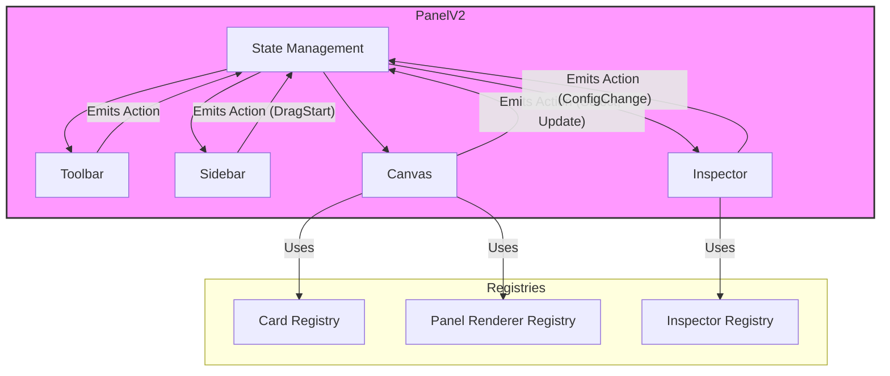

# PanelV2 组件架构设计 (v2 - 配置驱动与渲染解耦)

## 1. 核心理念变更

根据您的反馈，我们对架构进行根本性调整，确立两大核心原则：

*   **渲染责任下放 (Delegated Rendering):** `PanelV2` 自身不负责渲染任何具体的卡片内容。它的核心 `Canvas` 组件仅提供一个带有**插槽 (Slot)** 的布局系统。真正的渲染决策由 `PanelV2` 的使用者，在插槽中根据数据动态完成。
*   **配置驱动一切 (Configuration-Driven):** 数据结构是设计的核心。卡片和看板的配置被明确分离，并且配置结构本身将决定加载哪个对应的 `Inspector`（配置器）。

## 2. 整体架构 (v2)

```mermaid
graph TD
    subgraph User Implementation (e.g., Demo.vue)
        direction LR
        U1[Card & Inspector Registries] --> U2[Renderer Logic]
        U2 -- "Listens to Slot" --> P2[Canvas]
        U2 -- "Renders Specific Card" --> P2
    end

    subgraph PanelV2 Core
        direction LR
        P1[State Management] -.-> P2[Canvas]
        P1 -.-> P3[Inspector]
        P1 -.-> P4[Sidebar]
        P1 -.-> P5[Toolbar]

        P2 -- "Emits Layout/Select Events" --> P1
        P3 -- "Emits Config Events" --> P1
        P4 -- "Emits Drag Events" --> P1
        P5 -- "Emits Action Events" --> P1
    end

    P2 -- "Provides Slot with Data" --> U2
    P3 -- "Uses Dynamic Component" --> U1

    style PanelV2 Core fill:#f9f,stroke:#333,stroke-width:2px
```

### 模块职责 (v2)

*   **`PanelV2` Core (核心库):**
    *   **State Management (状态管理):** 依然是单一事实来源，但其数据结构将更加关注“配置”而非“内容”。
    *   **Canvas (画布):** **彻底简化**。它的唯一职责是管理布局（如 Gridstack），并为每个卡片数据项暴露一个**具名插槽**，同时将该卡片的完整数据 (`PanelCard`) 作为 `props` 传递给插槽。
    *   **Inspector (配置器):** 依然是配置中心。它会根据选中项的 `config.inspector` 标识，从外部（或内部）注册表中动态加载对应的配置器组件。
    *   **Sidebar / Toolbar:** 职责基本不变。

*   **User Implementation (用户实现层):**
    *   **Renderer Logic (渲染逻辑):** 这是用户在使用 `PanelV2` 时编写的逻辑。它通过 `v-slot` 指令监听 `Canvas` 提供的插槽，并根据插槽传来的 `PanelCard` 数据中的 `type` 字段，决定渲染哪个具体的卡片组件（如 `TextCard`）。
    *   **Card & Inspector Registries (注册表):** 用户负责维护一个或多个注册表，将卡片类型 (`type`) 和配置器标识 (`inspector`) 映射到实际的 Vue 组件。`PanelV2` 仅使用这些注册表，而不定义它们。

## 3. 核心数据结构 (v2 - 配置优先)

这是本次设计的**最关键部分**。我们将配置显式化、结构化。

```typescript
// src/components/panelv2/types.ts

// --- 基础配置单元 ---
/**
 * @description 定义一个配置项，包含其值和对应的配置器组件标识。
 * 这是实现“配置驱动”的基础。
 */
export interface ConfigItem<T> {
  value: T; // 配置的实际值
  inspector: string; // 指向 InspectorRegistry 的 key，告诉UI应渲染哪个配置器组件
}

// --- 卡片数据结构 ---
/**
 * @description 代表一个卡片实例。它现在主要由“布局”和“配置”组成。
 */
export interface PanelCard {
  id: string; // 唯一实例ID
  type: string; // 卡片类型标识，用于在用户实现层决定渲染哪个内容组件
  layout: { x: number; y: number; w: number; h: number; }; // 布局信息
  // 卡片的具体配置，每个字段都是一个独立的、可配置的单元
  config: {
    [key: string]: ConfigItem<any>;
  };
}

// --- 看板状态 ---
/**
 * @description 整个看板的状态树
 */
export interface PanelState {
  cards: PanelCard[];
  selectedItemId?: string | null;
  // 看板自身的全局配置
  config: {
    [key: string]: ConfigItem<any>;
  };
}

// --- 示例：一个文本卡片的具体数据会是这样 ---
const exampleTextCard: PanelCard = {
  id: 'xyz-123',
  type: 'text-card', // 用于渲染逻辑
  layout: { x: 0, y: 0, w: 4, h: 2 },
  config: {
    // 每个配置项都清晰地指明了它的值和它的配置器
    title: { value: 'Hello World', inspector: 'text-input' },
    content: { value: 'This is a demo.', inspector: 'textarea-input' },
    color: { value: '#333333', inspector: 'color-picker' },
  }
};

// --- 看板的全局配置示例 ---
const examplePanelState: PanelState = {
  cards: [/*...*/],
  selectedItemId: null,
  config: {
    backgroundColor: { value: '#ffffff', inspector: 'color-picker' },
    gridGap: { value: 10, inspector: 'number-input' },
  }
};
```

### 新数据结构的优势

1.  **高度解耦:** `Inspector` 组件不再需要一个庞大的 `if/else` 或 `switch` 来判断如何渲染。它只需遍历选中项的 `config` 对象，并根据每个 `ConfigItem` 的 `inspector` 字段动态加载通用配置组件（如 `TextInput.vue`, `ColorPicker.vue`）。
2.  **原子化与可组合:** 配置被分解为最小的“原子”单元。未来可以轻松地为任何卡片组合这些原子配置，而无需编写新的、特定的 `Inspector` 组件。
3.  **清晰的意图:** 数据结构本身就完整地描述了“是什么”(`value`)和“如何配置”(`inspector`)，具有自解释性。

## 4. 工作流示例 (v2)

### A. 修改卡片配置

1.  **用户操作:** 点击 `Canvas` 中的一个卡片。
2.  **Canvas:** 发出 `select` 事件，`State Management` 更新 `selectedItemId`。
3.  **Inspector:**
    *   检测到 `selectedItemId` 变化，从 `State` 中获取到对应的 `PanelCard` 对象。
    *   **遍历 `card.config` 对象**。例如，遍历到 `title: { value: '...', inspector: 'text-input' }`。
    *   它查找 `inspector` 注册表，找到 `'text-input'` 对应的组件 (`TextInputInspector.vue`)。
    *   渲染 `TextInputInspector.vue` 组件，并将 `title.value` 作为 `v-model` 传入。
4.  **用户操作:** 在渲染出的文本输入框中修改标题。
5.  **Inspector:** `TextInputInspector.vue` 发出 `update:modelValue` 事件。
6.  **State Management:** `Inspector` 监听到事件后，调用 `action`，将新的值更新到 `state.cards` 中对应卡片的 `config.title.value` 字段。
7.  **Vue 响应式更新:**
    *   `Canvas` 的插槽收到了更新后的 `PanelCard` 数据。
    *   **用户实现层的渲染逻辑**接收到新的 `props`，并将新的标题传递给它渲染的 `TextCard` 组件，UI更新。

## 5. 总结

这个新架构将 `PanelV2` 变成了一个更加纯粹和通用的“布局与状态协调器”。它将渲染和配置的复杂性完全推给了使用者，提供了最大程度的灵活性和可扩展性，完全符合您对高度分离和解耦的要求。


`PanelV2` 是一个高度可配置、可扩展的看板组件。它旨在提供一个灵活的框架，允许开发者通过组合不同的模块（工具、卡片、渲染器）来构建功能丰富的仪表盘或可视化编辑器。

## 2. 设计原则

*   **数据驱动 (Data-Driven):** 整个看板的UI和行为由一个中心化的状态对象描述。
*   **组件化与可组合 (Componentized & Composable):** 功能被拆分为独立的、可复用的组件（如工具、卡片）。
*   **可扩展性 (Extensible):** 核心框架提供清晰的扩展点，方便添加新的卡片类型、工具和渲染逻辑。
*   **关注点分离 (Separation of Concerns):** 各个模块（如状态管理、UI渲染、业务逻辑）职责分明，相互解耦。

## 3. 推荐目录结构

为了更好地组织代码、实现关注点分离并提高可维护性，我推荐在 `src/components/panelv2/` 目录下采用以下结构：

```
src/components/panelv2/
├── ARCHITECTURE.md         # 架构文档
├── PanelV2.vue             # 主入口组件，整合所有部分
├── Demo.vue                # 用于演示和测试的示例页面
├── types.ts                # 核心 TypeScript 类型定义，模块间的契约
│
├── canvas/                 # 核心：画布模块
│   ├── Canvas.vue          # 画布主组件 (处理拖放、渲染网格、动态加载卡片)
│   └── renderers/          # 可拔插的渲染器 (可选，用于高级抽象)
│       └── GridstackRenderer.vue # Gridstack 的封装
│
├── cards/                  # 核心：可重用的卡片组件集合
│   ├── TextCard.vue        # 示例：文本卡片
│   └── ...                 # 未来可添加图表、图片等更多卡片
│
├── inspector/              # 核心：配置器模块
│   ├── Inspector.vue       # 配置器主组件 (根据选中项动态加载具体的配置面板)
│   └── inspectors/         # 具体的配置面板组件
│       ├── PanelInspector.vue    # 看板自身的配置面板
│       └── TextCardInspector.vue # 文本卡片的配置面板
│
├── sidebar/                # 核心：侧边栏模块
│   └── Sidebar.vue         # 侧边栏主组件 (渲染可拖拽的组件列表)
│
├── toolbar/                # 核心：工具栏模块
│   └── Toolbar.vue         # 工具栏主组件
│
└── state/                  # 状态管理 (推荐使用 Pinia)
    └── panelStore.ts       # 定义所有状态、Getters 和 Actions
```

### 设计思路

*   **模块化 (Modularity):** 每个核心功能（`canvas`, `inspector`, `sidebar`, `toolbar`）都封装在自己的目录中。这使得每个部分都可以独立开发和测试。
*   **关注点分离 (SoC):**
    *   `PanelV2.vue` 作为**协调者**，负责组装模块并传递 `props`，自身不包含复杂的业务逻辑。
    *   `canvas/` 只关心**如何布局和渲染**卡片，不关心卡片的具体内容。
    *   `cards/` 只关心卡片**自身的内容展示**，不关心它被放在哪里或如何配置。
    *   `inspector/` 只关心**如何为不同类型的项提供配置界面**。
    *   `state/` 集中管理所有**共享状态和业务逻辑**，让组件变得更加“纯粹”，主要负责UI渲染。
*   **可扩展性 (Extensibility):** 这个结构非常容易扩展。例如，要添加一个新的“图表卡片”：
    1.  在 `cards/` 目录下创建 `ChartCard.vue`。
    2.  在 `inspector/inspectors/` 目录下创建 `ChartCardInspector.vue`。
    3.  在 `Demo.vue` 或外部配置中，将新的卡片类型添加到 `draggableItems` 列表。
    4.  无需修改任何核心模块代码，新卡片即可无缝集成。
*   **类型驱动 (Type-Driven):** `types.ts` 文件是整个组件的“单一事实来源”，定义了所有模块之间通信的数据结构。这极大地提高了代码的健壮性和可预测性。

## 4. 整体架构



### 模块职责

*   **State Management (状态管理):** (e.g., `Pinia` or `Vue Reactivity`)
    *   存储整个看板的完整状态，包括卡片列表、布局、当前选中的项目等。
    *   提供更新状态的 `actions`。
    *   所有对状态的修改都必须通过这些 `actions`，实现单向数据流。
*   **Toolbar (工具栏):**
    *   渲染顶部的工具按钮。工具的定义是可配置的，从外部注入。
    *   点击按钮时，调用状态管理中的 `action` 来执行操作，如保存、预览、清除等。
*   **Sidebar (侧边栏):**
    *   渲染可拖拽的组件列表（树形结构）。
    *   列表项来自一个可配置的源，每个项都定义了其 `type` 和拖拽时生成的默认 `props`。
    *   当拖拽开始时，通过 `DataTransfer` API 传递组件的 `type`。
*   **Canvas (画布):**
    *   核心展示区，负责渲染卡片和布局。
    *   使用一个可配置的 **Panel Renderer** (默认为 `GridstackRenderer`) 来管理布局。
    *   监听拖放事件，当一个新组件被拖入时，调用 `action` 在状态中创建新卡片。
    *   根据全局状态中的卡片列表，从 **Card Registry** 中获取对应的卡片组件并渲染它们。
    *   处理卡片的选择、移动、缩放等操作，并调用 `action` 更新状态。
*   **Inspector (配置器):**
    *   配置区，根据当前选中的项目（看板本身或某个卡片）动态渲染配置表单。
    *   从 **Inspector Registry** 中动态加载并渲染对应的配置组件。
    *   当表单值变化时，调用 `action` 更新对应项目（看板或卡片）的配置。
*   **Registries (注册表):**
    *   **Card Registry:** 一个映射 `{[cardType: string]: Component}`，用于根据卡片类型查找其Vue组件。
    *   **Panel Renderer Registry:** 允许切换看板的渲染引擎，例如从 `Gridstack` 切换到 `GridLayout`。
    *   **Inspector Registry:** 存储不同类型项目（看板、各种卡片）对应的配置面板组件。

## 4. 核心数据结构 (TypeScript)

建议在 `src/components/panelv2/types.ts` 中定义：

```typescript
// 代表一个放置在看板上的卡片实例
export interface PanelCard {
  id: string; // 唯一实例ID
  type: string; // 卡片类型，用于从 CardRegistry 查找组件
  layout: { // 布局信息，由 Panel Renderer 定义和使用
    x: number;
    y: number;
    w: number;
    h: number;
  };
  props?: Record<string, any>; // 该卡片实例的特定配置，由 Inspector 修改
}

// 代表左侧可拖拽的组件项
export interface DraggableItem {
  type: string; // 组件类型
  label: string; // 显示名称
  icon?: string; // 图标
  defaultLayout?: Partial<PanelCard['layout']>; // 默认尺寸
  defaultProps?: Record<string, any>; // 拖拽生成卡片时的默认配置
}

// 整个看板的状态
export interface PanelState {
  cards: PanelCard[];
  layoutType: string; // 看板渲染器类型, e.g., 'gridstack'
  selectedItemId?: string | null; // 当前选中的卡片ID，null表示选中看板本身
  config: Record<string, any>; // 看板自身的配置
}

// 工具栏按钮定义
export interface ToolbarAction {
  id: string;
  icon: string;
  tooltip: string;
  action: (state: PanelState) => void; // 点击后执行的操作
}
```

## 5. 工作流示例

### A. 添加一个新卡片

1.  **用户操作:** 从 `Sidebar` 拖拽一个 "Chart" 组件到 `Canvas` 上。
2.  **Sidebar:** `onDragStart` 事件触发，将 `{ type: 'chart' }` 信息存入 `DataTransfer`。
3.  **Canvas:**
    *   `onDrop` 事件触发，读取 `DataTransfer` 中的信息。
    *   调用状态管理的 `addCard` action，并传入 `{ type: 'chart', position: { x, y } }`。
4.  **State Management:**
    *   `addCard` action 被执行。
    *   生成一个新的 `PanelCard` 对象（包含唯一 `id`、`type`、`layout`），并将其添加到 `state.cards` 数组中。
5.  **Vue 响应式更新:**
    *   `Canvas` 组件检测到 `state.cards` 变化。
    *   根据新的卡片信息，从 `CardRegistry` 查找 `'chart'` 对应的组件。
    *   在指定位置渲染新的图表卡片。

### B. 修改卡片配置

1.  **用户操作:** 在 `Canvas` 中点击一个图表卡片。
2.  **Canvas:** `onClick` 事件触发，调用状态管理的 `selectItem` action，并传入卡片 `id`。
3.  **State Management:** `selectItem` action 更新 `state.selectedItemId`。
4.  **Inspector:**
    *   通过 `computed` 属性或 `watch` 检测到 `state.selectedItemId` 变化。
    *   根据新的 `id` 从 `state.cards` 中找到对应的卡片 `type` ('chart')。
    *   从 `InspectorRegistry` 中查找 `'chart'` 对应的配置面板组件并渲染。
5.  **用户操作:** 在 `Inspector` 的表单中修改了图表的标题。
6.  **Inspector:** 表单 `onChange` 事件触发，调用状态管理的 `updateCardProps` action，并传入 `{ cardId: '...', newProps: { title: 'New Title' } }`。
7.  **State Management:** `updateCardProps` action 找到对应的卡片，并更新其 `props` 字段。
8.  **Vue 响应式更新:** `Canvas` 中对应的卡片组件接收到新的 `props`，并重新渲染以显示新标题。

## 6. 扩展点

### 如何添加一个新的卡片类型 (e.g., `WeatherCard`)

1.  **创建组件:** 创建 `WeatherCard.vue` 组件。
2.  **注册卡片:** 在 `CardRegistry` 中注册: `registry.register('weather', WeatherCard)`。
3.  **创建配置面板:** 创建 `WeatherCardInspector.vue`。
4.  **注册配置面板:** 在 `InspectorRegistry` 中注册: `registry.register('weather', WeatherCardInspector)`。
5.  **添加到侧边栏:** 在 `Sidebar` 的配置中添加一个新的 `DraggableItem`。

## 7. 提出的问题与待讨论项

1.  **状态管理方案:** 对于Vue 3，使用 `provide/inject` 结合 `reactive` API 对于这个规模的组件可能变得复杂。我推荐使用 **Pinia**，它能提供更结构化的存储、更好的开发工具支持和更清晰的 action 定义，非常适合这种场景。
2.  **渲染器选型:** **Gridstack.js** 功能强大，是业界成熟的方案，我同意您的选择。我们可以将其封装成一个默认的 `PanelRenderer`。同时架构上支持未来替换成其他方案（如 `vue-grid-layout`）。
3.  **配置数据的归集与传递:** `Inspector` 产生的配置数据应该严格区分：
    *   **卡片配置:** 直接更新对应卡片的 `props` 属性。
    *   **看板配置:** 直接更新 `PanelState` 的 `config` 属性。
    *   如果存在需要同时影响多个目标的复杂操作，应将其定义为一个独立的 `Toolbar` 按钮或 `Inspector` 内的特定按钮，并执行一个专门的 `action` 来处理，而不是通过常规的表单双向绑定实现。

这份设计为您描绘了一个清晰、模块化且可扩展的蓝图。您可以审阅一下，我们可以基于此进行下一步的讨论和迭代。