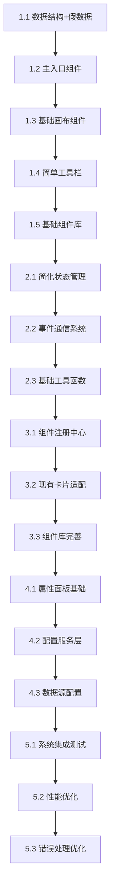

# PanelV2 实施任务列表 (调整版)

## 项目概述

基于"看板核心优先"的实施策略，本文档重新调整了任务顺序：先实现看板核心功能，只准备必要的基础设施，然后实现组件注册系统，最后集中处理配置层。这种方法能更快看到效果，验证架构可行性。

## 总体进度规划 (调整后)

```
阶段1: 看板核心实现 (4-5天)    ░░░░░░░░░░░░░░░░░░░░ 0%
阶段2: 最小基础设施 (3-4天)    ░░░░░░░░░░░░░░░░░░░░ 0%  
阶段3: 组件注册系统 (5-6天)    ░░░░░░░░░░░░░░░░░░░░ 0%
阶段4: 配置系统集成 (4-5天)    ░░░░░░░░░░░░░░░░░░░░ 0%
阶段5: 完善和优化 (3-4天)     ░░░░░░░░░░░░░░░░░░░░ 0%
```

## 实施理念调整

### 原实施理念的问题
- 过于传统的"基础设施优先"
- 需要等待大量基础代码完成才能看到效果
- 容易陷入过度工程化

### 新实施理念的优势
- **效果优先**: 快速看到看板核心功能
- **假数据驱动**: 用模拟数据验证UI和交互
- **最小必要**: 只实现当前阶段必须的基础设施
- **迭代验证**: 每个阶段都有可运行的功能

## 阶段1: 看板核心实现 (4-5天)

> **目标**: 快速实现看板的核心功能，使用假数据验证 UI 和交互，为后续开发提供可视化反馈

### 1.1 核心数据结构和假数据 (0.5天)

**任务**: 定义看板必需的数据结构，创建测试用假数据

**优先级**: 🔴 最高

**依赖**: 无

**交付物**:
- [ ] `types/canvas.ts` - 画布核心类型定义
- [ ] `mock/mockData.ts` - 假数据生成器
- [ ] 基础的 CanvasItem、Position、Size 等类型

**验收标准**:
- 数据结构支持基本的看板功能
- 假数据覆盖各种典型场景
- 类型定义简洁但完整

**假数据示例**:
```typescript
interface CanvasItem {
  id: string
  type: string
  position: { x: number, y: number }
  size: { width: number, height: number }
  config: Record<string, any>
}

// 生成假数据
export const mockCanvasItems: CanvasItem[] = [
  { id: '1', type: 'chart-bar', position: { x: 100, y: 100 }, size: { width: 200, height: 150 }, config: {} },
  // ... 更多假数据
]
```

---

### 1.2 主入口组件 (1天)

**任务**: 基于 PanelLayout 创建 PanelV2 主组件

**优先级**: 🔴 最高

**依赖**: 1.1 核心数据结构

**交付物**:
- [ ] `PanelV2.vue` - 主入口组件
- [ ] 集成 PanelLayout 布局组件
- [ ] 基础的 props 和 events 定义
- [ ] 假数据状态管理

**验收标准**:
- 能够正确使用 PanelLayout 的插槽机制
- 支持编辑/预览模式切换
- 使用假数据展示基本界面

**核心实现**:
```vue
<template>
  <PanelLayout :mode="mode" v-model:left-collapsed="leftCollapsed">
    <template #toolbar><!-- 工具栏内容 --></template>
    <template #left><!-- 组件库 --></template>
    <template #main><!-- 画布 --></template>
    <template #right><!-- 属性面板 --></template>
  </PanelLayout>
</template>
```

---

### 1.3 基础画布组件 (2天)

**任务**: 实现画布的核心渲染和交互功能

**优先级**: 🔴 最高

**依赖**: 1.2 主入口组件

**交付物**:
- [ ] `components/canvas/Canvas.vue` - 主画布组件
- [ ] `components/canvas/CanvasItem.vue` - 画布项组件
- [ ] 基础的拖拽移动功能
- [ ] 选择和多选功能
- [ ] 假数据渲染

**验收标准**:
- 能够渲染假数据中的所有项目
- 支持拖拽移动画布项
- 支持点击选择和多选
- 提供基础的视觉反馈

**核心功能**:
- 渲染 mockCanvasItems 数据
- 拖拽改变位置
- 点击选择项目
- 多选框选择
- 删除选中项目

---

### 1.4 简单工具栏 (1天)

**任务**: 实现基础的工具栏功能

**优先级**: 🟡 高

**依赖**: 1.3 基础画布组件

**交付物**:
- [ ] `components/toolbar/Toolbar.vue` - 工具栏组件
- [ ] 模式切换按钮
- [ ] 基础操作按钮 (清空、添加测试项)
- [ ] 状态显示

**验收标准**:
- 支持编辑/预览模式切换
- 提供清空画布功能
- 提供添加测试项功能
- 显示当前选中项目数量

---

### 1.5 基础组件库界面 (1天)

**任务**: 创建简单的组件展示列表

**优先级**: 🟡 高

**依赖**: 1.4 简单工具栏

**交付物**:
- [ ] `components/library/ComponentLibrary.vue` - 组件库
- [ ] 模拟的组件类型列表
- [ ] 基础的拖拽到画布功能

**验收标准**:
- 显示模拟的组件类型
- 支持从组件库拖拽到画布
- 拖拽后在画布创建新项目

---

## 阶段2: 最小基础设施 (3-4天)

> **目标**: 为看板功能提供最小必要的基础设施支持，重点是状态管理和事件系统

### 2.1 简化状态管理 (1.5天)

**任务**: 实现看板专用的状态管理

**优先级**: 🔴 最高

**依赖**: 阶段1 完成

**交付物**:
- [ ] `core/CanvasStore.ts` - 画布状态管理
- [ ] 替换假数据为响应式状态
- [ ] 基础的状态持久化
- [ ] 撤销/重做功能

**验收标准**:
- 画布状态完全响应式
- 支持本地存储和恢复
- 撤销/重做功能正常
- 与现有画布组件无缝集成

---

### 2.2 事件通信系统 (1天)

**任务**: 实现组件间的事件通信

**优先级**: 🟡 高

**依赖**: 2.1 简化状态管理

**交付物**:
- [ ] `core/EventBus.ts` - 简化的事件总线
- [ ] 组件间事件通信
- [ ] 拖拽事件处理

**验收标准**:
- 支持基础的事件发布订阅
- 组件间通信正常
- 拖拽事件流畅

---

### 2.3 基础工具函数 (0.5天)

**任务**: 实现画布必需的工具函数

**优先级**: 🟡 高

**依赖**: 2.2 事件通信系统

**交付物**:
- [ ] `utils/geometry.ts` - 位置和碰撞计算
- [ ] `utils/layout.ts` - 布局辅助函数

**验收标准**:
- 位置计算准确
- 碰撞检测正常
- 布局算法有效

---

## 阶段3: 组件注册系统 (5-6天)

> **目标**: 实现卡片组件的插件化注册机制，替换假数据为真实的组件系统

### 3.1 组件注册中心 (2天)

**任务**: 实现卡片组件的注册和管理机制

**优先级**: 🔴 最高

**依赖**: 阶段2 完成

**交付物**:
- [ ] `plugins/CardRegistry.ts` - 卡片注册中心
- [ ] `plugins/CardPlugin.ts` - 卡片插件接口
- [ ] 组件的动态注册机制
- [ ] 组件元数据管理

**验收标准**:
- 支持动态注册卡片组件
- 提供组件分类和搜索
- 组件元数据完整
- 与现有组件库界面集成

---

### 3.2 现有卡片适配 (2天)

**任务**: 将现有的卡片组件适配为插件形式

**优先级**: 🔴 最高

**依赖**: 3.1 组件注册中心

**交付物**:
- [ ] 选择3-5个现有卡片进行适配
- [ ] 卡片组件的标准化接口
- [ ] 适配器模式实现
- [ ] 测试用卡片插件

**验收标准**:
- 现有卡片能够正常注册和使用
- 卡片在画布中正确渲染
- 保持原有功能不变
- 提供标准的插件开发模板

---

### 3.3 组件库完善 (1天)

**任务**: 完善组件库界面，支持真实组件展示

**优先级**: 🟡 高

**依赖**: 3.2 现有卡片适配

**交付物**:
- [ ] 真实组件的分类展示
- [ ] 组件搜索和过滤功能
- [ ] 组件预览功能

**验收标准**:
- 显示真实的可用组件
- 支持按分类筛选
- 搜索功能正常
- 组件信息展示完整

---

## 阶段4: 配置系统集成 (4-5天)

> **目标**: 实现配置层功能，包括属性面板、配置表单、数据源配置等

### 4.1 属性面板基础 (2天)

**任务**: 实现动态配置的属性面板

**优先级**: 🔴 最高

**依赖**: 阶段3 完成

**交付物**:
- [ ] `components/inspector/Inspector.vue` - 属性面板
- [ ] 动态表单生成机制
- [ ] 基础配置项支持
- [ ] 配置实时预览

**验收标准**:
- 选中组件时显示配置面板
- 支持常用配置项 (尺寸、位置、标题等)
- 配置变更实时生效
- 表单验证正常

---

### 4.2 配置服务层 (1.5天)

**任务**: 实现配置的管理和验证服务

**优先级**: 🟡 高

**依赖**: 4.1 属性面板基础

**交付物**:
- [ ] `services/ConfigService.ts` - 配置管理服务
- [ ] 配置验证和转换
- [ ] 默认配置管理
- [ ] 配置的序列化支持

**验收标准**:
- 配置数据类型安全
- 提供配置验证机制
- 支持默认配置覆盖
- 配置正确序列化

---

### 4.3 数据源配置基础 (1天)

**任务**: 实现基础的数据源配置功能

**优先级**: 🟢 中

**依赖**: 4.2 配置服务层

**交付物**:
- [ ] 基础的数据源配置界面
- [ ] 模拟数据源支持
- [ ] 数据源验证

**验收标准**:
- 支持配置模拟数据源
- 数据源配置正确保存
- 提供数据源预览功能

---

## 阶段5: 完善和优化 (3-4天)

> **目标**: 完善系统功能，进行性能优化和错误处理

### 5.1 系统集成和测试 (1.5天)

**任务**: 完成各模块的集成和测试

**优先级**: 🔴 最高

**依赖**: 阶段4 完成

**交付物**:
- [ ] 端到端功能测试
- [ ] 组件间交互测试
- [ ] 数据持久化测试

**验收标准**:
- 所有核心功能正常工作
- 拖拽交互流畅稳定
- 数据保存和加载正常

---

### 5.2 性能优化 (1天)

**任务**: 优化系统性能

**优先级**: 🟡 高

**依赖**: 5.1 系统集成测试

**交付物**:
- [ ] 渲染性能优化
- [ ] 事件处理优化
- [ ] 内存使用优化

**验收标准**:
- 支持100+组件流畅操作
- 事件响应及时
- 无明显内存泄漏

---

### 5.3 错误处理和用户体验 (1天)

**任务**: 完善错误处理和用户体验

**优先级**: 🟡 高

**依赖**: 5.2 性能优化

**交付物**:
- [ ] 错误边界处理
- [ ] 用户友好的错误提示
- [ ] 加载状态和反馈

**验收标准**:
- 错误不会导致系统崩溃
- 提供清晰的错误提示
- 用户操作有明确反馈

---

## 新实施方案的优势

### 与原方案对比

**原方案问题**:
- 需要5-7天搭建基础设施才能看到效果
- 过早地实现了复杂的抽象层
- 开发过程中缺乏可视化反馈

**新方案优势**:
- 第1天就能看到基本的看板界面
- 第3天就有完整的拖拽交互
- 每个阶段都有可运行的功能
- 用假数据快速验证架构设计

### 任务依赖关系图 (调整后)



## 里程碑节点 (调整后)

### 里程碑1: 看板核心可用 (第5天)
- ✅ 看板界面可视化展示
- ✅ 基础拖拽交互可用
- ✅ 假数据驱动完整

**演示效果**: 可以展示完整的看板拖拽交互

### 里程碑2: 基础设施完成 (第9天)  
- ✅ 响应式状态管理
- ✅ 组件间事件通信
- ✅ 撤销/重做功能

**演示效果**: 状态管理和数据持久化正常

### 里程碑3: 插件系统可用 (第15天)
- ✅ 组件注册系统可用
- ✅ 现有卡片成功适配
- ✅ 真实组件替换假数据

**演示效果**: 可以使用真实的卡片组件

### 里程碑4: 配置系统完成 (第20天)
- ✅ 属性面板可配置
- ✅ 配置服务完整
- ✅ 基础数据源支持

**演示效果**: 完整的配置功能可用

### 里程碑5: 系统完成 (第24天)
- ✅ 系统集成完成
- ✅ 性能优化到位
- ✅ 错误处理完善

**演示效果**: 生产环境可用的完整系统

## 开发建议

### 第一周重点 (阶段1+2)
- **专注看板核心**: 不要被其他功能分散注意力
- **假数据先行**: 快速验证UI和交互逻辑
- **保持简单**: 避免过早优化和抽象

### 第二周重点 (阶段3)
- **插件化核心**: 重点解决组件注册和管理
- **适配现有卡片**: 选择最简单的几个卡片先适配
- **验证架构**: 确保插件系统设计合理

### 第三周重点 (阶段4+5)
- **配置系统**: 实现动态配置的核心功能
- **系统集成**: 确保各模块协调工作
- **性能优化**: 关注用户体验

## 风险控制

### 高风险点调整
1. **看板拖拽复杂度**: 通过假数据先验证交互逻辑
2. **插件系统设计**: 先适配简单卡片，逐步完善接口
3. **配置系统复杂度**: 先支持基础配置，逐步扩展

### 质量保证
- 每个阶段结束都有可演示的功能
- 关键功能及时进行用户测试
- 保持代码简洁，避免过度抽象

---

*调整后的实施方案更加务实高效，能够快速验证架构设计的可行性，为后续开发提供坚实基础。*
