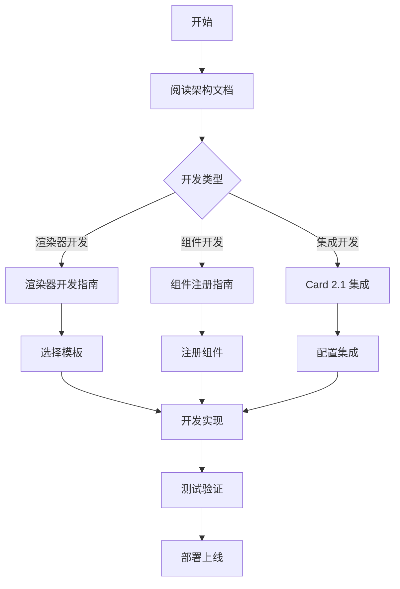

# Visual Editor 文档中心

本目录包含 Visual Editor 的完整技术文档，涵盖架构设计、开发指南、最佳实践等内容。

## 📚 文档导航

### 🏗️ 核心架构

| 文档 | 描述 | 状态 |
|------|------|------|
| [组件注册机制指南](./WIDGET_REGISTRY_GUIDE.md) | 详细介绍组件注册系统、Card 2.1 集成 | ✅ 完整 |

### 🎨 渲染器系统

| 文档 | 描述 | 状态 |
|------|------|------|
| [渲染器系统概览](./renderers/README.md) | 渲染器系统完整介绍 | ✅ 完整 |
| [渲染器开发指南](./renderers/RENDERER_DEVELOPMENT_GUIDE.md) | 详细的开发步骤和示例 | ✅ 完整 |
| [最佳实践指南](./renderers/BEST_PRACTICES.md) | 性能优化和常见问题 | ✅ 完整 |
| [开发模板说明](./renderers/TEMPLATES.md) | 模板使用和自定义指南 | ✅ 完整 |

### 🧩 组件开发

| 文档 | 描述 | 状态 |
|------|------|------|
| [Layout 组件文档](./components/Layout.md) | Layout 组件使用说明 | ✅ 完整 |

### 🔧 技术细节

| 文档 | 描述 | 状态 |
|------|------|------|
| [ECharts 修复文档](./ECHARTS_FIX.md) | ECharts 相关问题修复 | ✅ 完整 |

## 🚀 快速开始

### 新手入门

1. **了解架构**: 从 [组件注册机制指南](./WIDGET_REGISTRY_GUIDE.md) 开始
2. **选择渲染器**: 查看 [渲染器系统概览](./renderers/README.md)
3. **开发组件**: 参考 [渲染器开发指南](./renderers/RENDERER_DEVELOPMENT_GUIDE.md)

## 🎨 增强交互功能

### 智能抽屉交互

PanelEditor 组件支持更加丝滑和智能的抽屉交互体验：

#### 左侧组件库交互
- 🎯 **悬浮按钮**: 左上角固定位置的组件库触发按钮
- 🖱️ **悬停显示**: 鼠标悬停按钮 300ms 后自动显示组件库
- 👆 **点击切换**: 直接点击按钮切换组件库显示/隐藏
- 🌊 **自动隐藏**: 点击画布空白处自动收起组件库
- 💫 **丝滑动画**: 缩放和透明度过渡效果

#### 右侧属性面板交互
- 🎯 **节点联动**: 选中节点时自动显示属性配置按钮
- ⚡ **即时响应**: 点击节点立即弹出属性面板
- 🖱️ **空白收起**: 点击画布空白处取消选中并收起面板
- 🎮 **配置按钮**: 选中节点时右上角显示配置按钮
- 💫 **脉冲效果**: 配置按钮带有轻微脉冲动画提示

#### 增强的视觉反馈
- 🎨 **状态指示**: 按钮颜色和样式反映当前状态
- 🔍 **悬浮提示**: 智能显示操作提示信息
- 🌟 **磨砂效果**: 按钮背景支持毛玻璃效果
- 📱 **响应式适配**: 移动端自动调整按钮位置和大小

### 开发者路径



### 按角色导航

#### 🎯 **产品经理 / 架构师**
- [架构设计备份](./architecture-design-backup.md)
- [MVP 计划](./minimal-mvp-plan.md)
- [目录结构备份](./directory-structure-backup.md)

#### 👨‍💻 **前端开发者**
- [组件注册机制指南](./WIDGET_REGISTRY_GUIDE.md) - **推荐起点**
- [渲染器开发指南](./renderers/RENDERER_DEVELOPMENT_GUIDE.md)
- [最佳实践指南](./renderers/BEST_PRACTICES.md)

#### 🎨 **UI/UX 开发者**
- [渲染器系统概览](./renderers/README.md)
- [开发模板说明](./renderers/TEMPLATES.md)
- [Layout 组件文档](./components/Layout.md)

#### 🔧 **运维 / 集成开发者**
- [ECharts 修复文档](./ECHARTS_FIX.md)
- [交互增强功能](./README.md#🎨-增强交互功能)

## 📖 文档规范

### 文档分类

- **📘 指南类**: 完整的操作指南，包含步骤和示例
- **📋 参考类**: API 文档、配置说明等参考资料
- **📝 备份类**: 历史文档、计划文档等备份资料
- **🔧 技术类**: 技术细节、问题修复等专业文档

### 文档状态

- ✅ **完整**: 文档内容完整，可以直接使用
- 🚧 **进行中**: 文档正在编写或更新中
- 📝 **备份**: 历史文档或备份资料
- ⚠️ **过时**: 可能需要更新的文档

### 贡献指南

#### 文档更新流程

1. **确定需求**: 明确文档更新的目的和范围
2. **创建分支**: 基于最新代码创建文档分支
3. **编写内容**: 遵循 Markdown 规范编写
4. **审查验证**: 确保内容准确性和完整性
5. **提交合并**: 提交 PR 并进行代码审查

#### 文档格式规范

```markdown
# 文档标题

简短的文档描述和目标。

## 📋 目录

- [章节1](#章节1)
- [章节2](#章节2)

## 🎯 核心内容

### 代码示例格式
```typescript
// 示例代码
const example = 'value'
```

### 注意事项格式
> ⚠️ **注意**: 重要提醒内容
> 
> ✅ **推荐**: 建议的做法
> 
> ❌ **避免**: 不建议的做法

### 链接格式
- 内部链接: [文档名称](./relative/path.md)
- 外部链接: [网站名称](https://example.com)
```

## 🔄 文档维护

### 更新频率

- **核心文档**: 每月检查，确保与代码同步
- **指南文档**: 每季度更新，添加新的最佳实践
- **参考文档**: 随 API 变更实时更新
- **技术文档**: 按需更新，解决新发现的问题

### 版本管理

文档版本与代码版本保持同步：

- **主要版本**: 架构重大变更时更新文档
- **次要版本**: 新功能发布时补充文档
- **补丁版本**: Bug 修复时更新相关文档

### 质量保证

#### 文档审查清单

- [ ] 内容准确性：代码示例可执行
- [ ] 完整性：涵盖所有重要概念
- [ ] 可读性：结构清晰，语言通俗
- [ ] 时效性：信息是最新的
- [ ] 链接有效性：所有链接可访问

#### 用户反馈机制

- **GitHub Issues**: 报告文档问题
- **PR 评论**: 直接在相关文档上提建议
- **定期收集**: 通过调研收集使用反馈

## 🆘 获取帮助

### 常见问题

1. **找不到相关文档**: 使用本页面的导航或搜索功能
2. **文档内容过时**: 提交 Issue 报告问题
3. **需要新文档**: 在 Issues 中提出需求

### 支持渠道

- **项目 Issues**: 技术问题和 Bug 报告
- **文档反馈**: 文档质量和内容建议
- **功能请求**: 新功能和改进建议

---

## 📊 文档统计

- **总文档数**: 13 个
- **完整文档**: 10 个
- **备份文档**: 3 个
- **最后更新**: 2024年

**选择合适的文档开始您的 Visual Editor 之旅！** 🚀