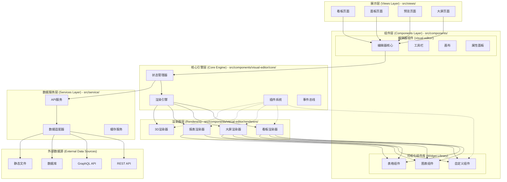
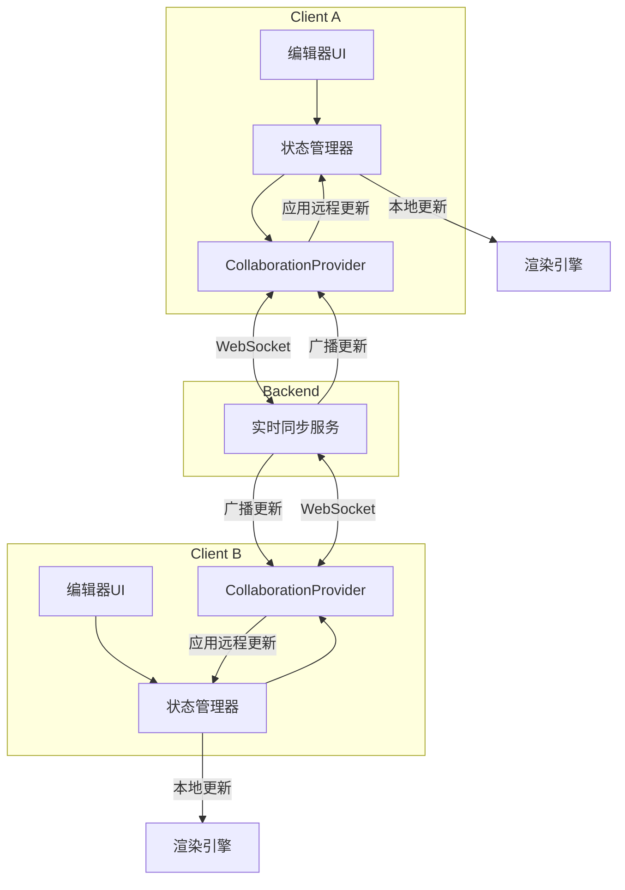

# 可视化编辑器架构设计

这是一个可切换大屏、看板、3D、报表的可视化编辑器的架构设计文档，基于实际项目目录结构进行设计。

## 项目目录结构说明

根据实际项目结构，我们的架构设计遵循以下目录约定：

- **展示层 (Views)**: `src/views/` - 包含所有页面级组件和路由视图
- **组件层 (Components)**: `src/components/` - 包含可复用的UI组件和业务组件
- **数据服务层 (Services)**: `src/service/` - 包含API调用和数据处理逻辑
- **状态管理层 (Store)**: `src/store/` - 包含全局状态管理
- **工具层 (Utils)**: `src/utils/` - 包含通用工具函数
- **类型定义层 (Types)**: `src/typings/` - 包含TypeScript类型定义

### 可视化编辑器在项目中的位置

```
src/
├── views/                          # 展示层 - 页面级组件
│   └── visualization/              # 可视化相关页面
│       ├── kanban/                 # 看板页面
│       ├── panel-preview/          # 面板预览页面
│       └── ...
├── components/                     # 组件层 - 可复用组件
│   ├── visual-editor/              # 可视化编辑器组件
│   ├── panel/                      # 旧版面板组件
│   └── ...
├── service/                        # 数据服务层
│   └── api/                        # API调用服务
└── ...
```

## 架构层次图



## 分层架构说明

### 1. 展示层 (Views Layer)
位置：`src/views/visualization/`

这一层包含所有的页面级组件，负责：
- 路由处理和页面布局
- 用户交互的入口点
- 调用编辑器组件进行具体功能实现
- 页面级的状态管理和生命周期

**示例目录结构：**
```
src/views/visualization/
├── kanban/
│   ├── index.vue                   # 看板编辑页面
│   └── components/                 # 页面专用组件
├── panel-preview/
│   └── index.vue                   # 面板预览页面
└── dashboard/
    └── index.vue                   # 大屏编辑页面
```

### 2. 组件层 (Components Layer)
位置：`src/components/`

这一层是**可复用的业务组件和UI组件**，包括：

#### 编辑器核心组件 (`visual-editor/`)
- 编辑器主体框架
- 工具栏、画布、属性面板等UI组件
- 核心编辑逻辑的封装

#### 可视化组件库
- 图表组件（基于ECharts、AntV等）
- 表格组件
- 自定义业务组件
- 这些组件是**黑盒化的**，对外提供统一的接口

**设计理念：**
- **组件库独立性**：可视化组件库设计为独立的、可插拔的模块
- **渲染器无关**：组件只关心数据输入和配置，不关心具体的渲染环境
- **统一接口**：所有组件都遵循统一的数据协议和生命周期

### 3. 数据服务层 (Services Layer)
位置：`src/service/`

这一层是**完全分离的黑盒**，负责：
- API调用和数据获取
- 数据转换和适配
- 缓存管理
- 数据源的统一抽象

**黑盒设计的优势：**
 - **技术栈无关**：可以独立升级或替换数据层技术
 - **测试友好**：可以轻松mock数据服务进行测试
 - **部署灵活**：数据服务可以独立部署或微服务化

## 开发指南与示例

### 在 `src/views` 中创建可视化编辑器示例

根据项目的实际目录结构，开发人员应该在 `src/views/visualization/` 目录下创建具体的页面示例。以下是推荐的开发流程：

#### 1. 创建页面组件

**示例：看板编辑器页面**
```vue
<!-- src/views/visualization/kanban-editor/index.vue -->
<template>
  <div class="kanban-editor-page">
    <!-- 页面级布局和导航 -->
    <PageHeader title="看板编辑器" />

    <!-- 引入可视化编辑器组件 -->
    <PanelEditor
      v-model:config="editorConfig"
      :renderer-type="'kanban'"
      @save="handleSave"
      @preview="handlePreview"
    />
  </div>
</template>

<script setup lang="ts">
import { ref } from 'vue'
import { PanelEditor } from '@/components/visual-editor'
import type { KanbanConfig } from '@/components/visual-editor/types'

// 页面级状态管理
const editorConfig = ref<KanbanConfig>({
  // 初始配置
})

// 页面级事件处理
const handleSave = (config: KanbanConfig) => {
  // 调用API保存配置
}

const handlePreview = (config: KanbanConfig) => {
  // 跳转到预览页面
}
</script>
```

#### 2. 路由配置

在路由配置中添加新的可视化页面：

```typescript
// src/router/routes/visualization.ts
export const visualizationRoutes = [
  {
    path: '/visualization/kanban-editor',
    name: 'KanbanEditor',
    component: () => import('@/views/visualization/kanban-editor/index.vue'),
    meta: {
      title: '看板编辑器',
      requiresAuth: true
    }
  },
  {
    path: '/visualization/dashboard-editor',
    name: 'DashboardEditor',
    component: () => import('@/views/visualization/dashboard-editor/index.vue'),
    meta: {
      title: '大屏编辑器',
      requiresAuth: true
    }
  }
]
```

#### 3. 开发人员注意事项

**关键原则：**

1. **分层职责明确**
   - `src/views/` 只负责页面级逻辑、路由和布局
   - `src/components/visual-editor/` 负责编辑器核心功能
   - `src/service/` 负责数据获取和处理

2. **组件使用方式**
   ```vue
   <!-- 正确：在页面中使用编辑器组件 -->
   <PanelEditor
     :renderer-type="rendererType"
     :initial-config="config"
     @change="handleConfigChange"
   />

   <!-- 错误：不要在页面中直接操作编辑器内部状态 -->
   ```

3. **数据流向**
   ```
   页面组件 (Views)
   ↓ 通过props传递配置
   编辑器组件 (PanelEditor)
   ↓ 通过事件回调
   页面组件处理保存/预览等业务逻辑
   ↓ 调用API
   数据服务层 (Services)
   ```

4. **状态管理策略**
   - **页面级状态**：使用 `ref/reactive` 管理页面特有的状态
   - **编辑器状态**：由编辑器组件内部管理，通过事件向外通信
   - **全局状态**：使用 `src/store/` 中的状态管理器

### 示例项目结构

基于实际项目，推荐的可视化相关目录结构：

```
src/
├── views/visualization/                # 可视化页面层
│   ├── kanban-editor/                  # 看板编辑器页面
│   │   ├── index.vue
│   │   └── components/                 # 页面专用组件
│   ├── dashboard-editor/               # 大屏编辑器页面
│   │   ├── index.vue
│   │   └── components/
│   ├── panel-preview/                  # 预览页面
│   │   └── index.vue
│   └── examples/                       # 示例和演示页面
│       ├── basic-usage/
│       ├── advanced-features/
│       └── integration-demo/
├── components/visual-editor/           # 编辑器组件层（黑盒）
│   ├── index.ts                        # 对外暴露的API
│   ├── PanelEditor.vue                 # 主编辑器组件
│   ├── core/                           # 核心引擎
│   ├── renderers/                      # 渲染器实现
│   └── types/                          # 类型定义
└── service/api/                        # 数据服务层（黑盒）
    ├── visualization.ts                # 可视化相关API
    └── data-source.ts                  # 数据源API
```

### 开发工作流程

1. **需求分析** → 确定需要哪种类型的可视化编辑器
2. **页面创建** → 在 `src/views/visualization/` 下创建页面组件
3. **组件集成** → 引入并配置 `PanelEditor` 组件
4. **数据对接** → 通过 `src/service/` 层对接后端API
5. **路由配置** → 添加路由和导航
6. **测试验证** → 功能测试和集成测试

## 核心服务层深度解析

### 1. 渲染器切换策略：引入“休眠”与“资源池”

在 `init()`/`render()`/`destroy()` 的基础上，我们为渲染器引入 `sleep()` 和 `wakeup()` 两个新的生命周期钩子，以实现更高效的切换。

- **`sleep()`**: 当渲染器被切换走时调用。此时，渲染器应：
  - **暂停渲染循环**: 停止 `requestAnimationFrame`。
  - **释放临时资源**: 清理临时计算结果、缓存等。
  - **GPU资源入池**: 将可复用的 GPU 资源（如纹理、缓冲区）标记为“休眠”并交由“资源池”统一管理，而不是立即销毁。

- **`wakeup()`**: 当渲染器被切回时调用。此时，渲染器应：
  - **从资源池获取资源**: 尝试从资源池中恢复之前缓存的 GPU 资源。
  - **恢复渲染循环**: 重新启动 `requestAnimationFrame`。

- **资源池 (Resource Pool)**: 这是一个独立的模块，负责管理所有渲染器的 GPU 资源。它可以根据资源的引用计数和最后使用时间来决定是否要真正释放资源，从而在内存占用和切换速度之间找到平衡。

### 2. 状态共享与隔离：分层状态树设计

我们采用分层的状态树来管理共享和隔离的状态，以 `Zustand` 为例：

```typescript
// store.ts
import create from 'zustand';

// 1. 全局共享状态 (Global Slice)
const useGlobalStore = create(set => ({
  theme: 'dark',
  currentUser: null,
  setTheme: (theme) => set({ theme }),
}));

// 2. 渲染器独立状态 (Renderer-Specific Slice)
const use3DSceneStore = create(set => ({
  cameraPosition: [0, 0, 10],
  lightIntensity: 1.0,
  setCameraPosition: (pos) => set({ cameraPosition: pos }),
}));

const useDashboardStore = create(set => ({
  gridSize: [10, 10],
  zoomLevel: 1,
  setZoomLevel: (level) => set({ zoomLevel: level }),
}));

// 3. 在组件中使用
function ThreeDComponent() {
  // 同时访问全局和特定渲染器的状态
  const theme = useGlobalStore(state => state.theme);
  const cameraPosition = use3DSceneStore(state => state.cameraPosition);
  // ...
}
```

**设计原则**:
- **全局状态 (Global Store)**: 存放所有渲染器都需要消费的状态，如主题、用户信息、全局数据源等。
- **特定渲染器状态 (Renderer-Specific Store)**: 每个渲染器或视图类型拥有自己独立的 Store，存放其特有的状态，如 3D 场景的相机、灯光，看板的布局模式等。这天然地实现了状态的隔离。
- **组件状态 (Component State)**: 组件自身的状态（如一个图表组件的内部UI状态）依然使用 `useState` 或 `useReducer` 进行管理。

## 数据抽象层与数据驱动

### 1. 统一数据节点协议 (Unified Data Node Protocol)

为了实现真正的渲染无关性，我们需要定义一个标准化的数据结构来描述场景中的每一个元素，无论是图表、3D模型还是看板卡片。这个协议是连接数据和渲染的桥梁。

```json
{
  "id": "node-123",
  "type": "barchart", // 组件类型
  "renderer": ["dashboard", "report"], // 适配的渲染器
  "layout": {
    "x": 100,
    "y": 50,
    "width": 400,
    "height": 300
  },
  "dataBinding": {
    "sourceId": "api-sales-data",
    "transform": [
      { "type": "filter", "field": "region", "value": "East" },
      { "type": "aggregate", "groupBy": "month", "method": "sum", "field": "amount" }
    ]
  },
  "properties": {
    "title": "月度销售额",
    "colorScheme": "blue",
    // ... barchart特有的属性
  }
}
```

- **`renderer`**: 明确指定该组件可以被哪些渲染器解析和渲染。
- **`dataBinding`**: 描述了数据来源和一系列转换操作，实现了数据处理逻辑与组件渲染逻辑的分离。

### 2. 数据适配器 (Data Adapter)

数据抽象层 (DataAbstractLayer) 内部包含一个适配器注册表，用于处理不同类型的数据源。

```typescript
// DataAbstractLayer.ts
interface IDataAdapter {
  fetch(sourceConfig: any): Promise<any[]>;
}

class ApiAdapter implements IDataAdapter {
  async fetch(config) {
    const response = await fetch(config.url);
    return response.json();
  }
}

class DatabaseAdapter implements IDataAdapter {
  // ... 连接数据库并查询
}

const adapters = {
  'api': new ApiAdapter(),
  'db': new DatabaseAdapter(),
};

export function fetchData(sourceConfig) {
  const adapter = adapters[sourceConfig.type];
  return adapter.fetch(sourceConfig);
}
```

当一个组件需要数据时，它只需声明其 `dataBinding`，核心引擎会根据 `sourceId` 找到对应的数据源配置，选择合适的适配器获取数据，并执行声明的 `transform` 操作，最终将干净的数据注入组件。

## 跨渲染器组件库设计

我们的目标是“一次开发，到处运行”。这需要一套特殊的组件设计模式。

### 1. 逻辑与渲染分离 (Logic-View Separation)

每个组件被拆分为两部分：
- **逻辑层 (Hook)**: 一个自定义 Hook，负责处理组件的所有业务逻辑、状态管理和数据获取。它返回渲染所需的数据和操作函数。
- **视图层 (Component)**: 多个视图组件，分别对应不同的渲染器（DOM, Canvas, WebGL）。它们接收逻辑层 Hook 返回的数据，并负责具体的渲染工作。

```typescript
// useBarChart.ts (Logic)
export function useBarChart(props) {
  const [data, setData] = useState([]);
  // ... 获取和处理数据的逻辑

  // 返回渲染所需的一切
  return { data, title: props.title };
}

// BarChart.DOM.tsx (View for DOM)
import { useBarChart } from './useBarChart';

export function BarChartDOM(props) {
  const { data, title } = useBarChart(props);
  return (
    <div>
      <h3>{title}</h3>
      {/* ... 使用 div 和 svg 渲染图表 */}
    </div>
  );
}

// BarChart.Canvas.tsx (View for Canvas)
import { useBarChart } from './useBarChart';

export function BarChartCanvas(props) {
  const { data, title } = useBarChart(props);
  // ... 使用 Konva 或原生 Canvas API 绘制图表
  return null; // Canvas渲染通常在一个大的Canvas画布上，由渲染引擎统一调度
}
```

### 2. 组件注册与动态加载

在组件库的入口，我们导出一个组件的元信息，而不是组件本身。

```typescript
// components/BarChart/index.ts
import { useBarChart } from './useBarChart';

export default {
  logic: useBarChart,
  views: {
    dom: () => import('./BarChart.DOM'),
    canvas: () => import('./BarChart.Canvas'),
    // webgl: () => import('./BarChart.WebGL')
  }
};
```

渲染引擎在渲染一个节点时，会根据当前的渲染器类型（如 `dom`）和节点的 `type` (`barchart`)，动态加载对应的视图组件 (`BarChart.DOM`)，并将节点的 `properties` 作为 `props` 传入。

## 插件系统：释放无限可能

插件系统是编辑器保持生命力和竞争力的关键。我们设计一个基于事件和钩子 (Hooks) 的插件系统。

### 1. 插件生命周期与钩子

插件是一个包含 `install` 方法的对象。`install` 方法接收一个 `context` 对象，该对象暴露了编辑器的核心能力和各个关键节点的钩子。

```typescript
// a plugin example: a watermark plugin
export default {
  name: 'watermark-plugin',
  install(context) {
    const { hooks } = context;

    // 监听渲染器渲染完成的钩子
    hooks.afterRender.tap('addWatermark', (rendererContext) => {
      const { rendererType, canvas } = rendererContext;
      if (rendererType === 'canvas' || rendererType === 'webgl') {
        const ctx = canvas.getContext('2d');
        ctx.fillStyle = 'rgba(0, 0, 0, 0.1)';
        ctx.font = '20px Arial';
        ctx.fillText('My Editor', canvas.width - 100, canvas.height - 20);
      }
    });

    // 注册一个新的API
    context.registerAPI('showWatermark', () => {
      // ... some logic
    });
  }
};
```

### 2. 核心扩展点 (Hooks)

- **`beforeRender` / `afterRender`**: 在渲染前后执行操作，可用于性能监控、添加水印等。
- **`onNodeSelect` / `onNodeUpdate`**: 监听节点的选择和更新，可用于开发自定义的属性面板。
- **`transformData`**: 在数据从数据源流向组件的过程中进行干预，可用于实现自定义的数据清洗或格式化逻辑。
- **`registerComponent`**: 动态注册新的组件类型。

## 架构核心决策：组合优于继承

您提出的关于如何处理不同渲染器之间“共性”与“个性”的问题，是本次架构设计的关键抉择。我们面临两种主流选择：

1.  **继承模式**: 定义一个抽象的 `BaseRenderer`，包含所有渲染器的公共属性和方法（如 `render()`, `update()`）。然后，`DOMRenderer`、`CanvasRenderer` 等具体实现都继承自这个基类。
2.  **组合/策略模式**: 定义一个统一的、标准化的数据结构（即我们的“统一数据节点协议”），它描述了“什么”需要被渲染。而各个渲染器则作为独立的策略，只负责根据这份数据结构，用自己的方式“如何”渲染。渲染引擎在运行时，根据需要动态地选择并“组合”数据与渲染策略。

**我们的选择是：坚定地采用“组合/策略模式”。**

### 为什么是组合，而不是继承？

| 特性 | 组合/策略模式 (我们的选择) | 继承模式 |
| :--- | :--- | :--- |
| **灵活性** | **极高**。可以动态、运行时切换渲染策略。添加新渲染器不影响现有体系。 | **较低**。一旦继承体系确定，修改基类会影响所有子类，牵一发而动全身。 |
| **耦合度** | **低**。数据与渲染逻辑完全解耦。渲染器之间互不关心。 | **高**。子类与父类紧密耦合，难以将一个渲染器的特性混入另一个。 |
| **扩展性** | **强**。可以轻松地为某个数据节点添加新的渲染方式，只需提供一个新的渲染策略即可。 | **弱**。面对复杂的、多维度的功能扩展（例如，一个组件既要支持DOM，又要支持3D），容易陷入复杂的“多重继承”困境。 |
| **职责划分** | **清晰**。数据协议只关心“意图”，渲染器只关心“实现”。 | **模糊**。父类需要承担过多的通用逻辑，可能变得臃肿，子类逻辑也可能不纯粹。 |

### 如何在组合模式下处理共性与个性？

我们通过“统一数据节点协议”的设计来优雅地解决这个问题：

- **共性 -> 协议的标准化字段**: 所有渲染器都必须理解和实现的属性，被定义为协议的顶级、标准化字段。这构成了我们架构的“通用语言”。

  ```json
  {
    "id": "node-123",         // 唯一标识 (共性)
    "type": "barchart",       // 组件类型 (共性)
    "layout": { ... },        // 布局信息 (共性)
    "dataBinding": { ... },   // 数据绑定 (共性)
    "properties": { ... }     // 个性化属性的容器
  }
  ```

- **个性 -> `properties` 属性包**: 每个组件、每种渲染器特有的属性，都存放在 `properties` 这个“属性包”中。渲染器按需从中读取自己关心的属性，忽略不认识的属性。

  ```json
  "properties": {
    // 大屏和报表渲染器会使用的属性
    "title": "月度销售额",
    "colorScheme": "blue",
    "showLegend": true,

    // 3D渲染器可能会使用的额外属性
    "extrusionDepth": 50,
    "material": "phong",

    // 看板渲染器可能会使用的属性
    "assignee": "user-456"
  }
  ```

通过这种方式，我们既保证了所有渲染器都能理解核心的、公共的指令，又为每个渲染器提供了无限的、隔离的扩展空间。这正是组合模式强大威力的体现。

## 实施路线图 (Roadmap)

一个复杂的系统需要分阶段实施，以控制风险并快速验证核心价值。

### Phase 1: 核心框架 (MVP) - (1-2个月)

- **目标**: 搭建一个功能最小但流程完整的编辑器。
- **关键任务**:
  1.  完成 **DOM渲染器** 的开发。
  2.  建立 **状态管理器 (Zustand)** 和核心的状态树。
  3.  定义 V1 版本的 **统一数据节点协议**。
  4.  实现一个基础的 **组件库**，包含2-3个核心组件（如文本、图片）。
  5.  搭建基础的 **属性检查器** 和 **工具栏**。

### Phase 2: 增强与扩展 - (2-3个月)

- **目标**: 引入更强大的渲染能力和数据处理能力。
- **关键任务**:
  1.  集成 **Canvas渲染器** (如 Konva)，并实现渲染器切换逻辑。
  2.  开发 **数据抽象层**，支持从静态 JSON 和 API 获取数据。
  3.  完善 **跨渲染器组件设计**，重构第一阶段的组件，使其支持双渲染器。
  4.  开发 **插件系统** 的核心骨架和1-2个示例插件。

### Phase 3: 高阶功能与性能优化 - (3-4个月)

- **目标**: 挑战高性能场景，并完善生态。
- **关键任务**:
  1.  集成 **WebGL渲染器** (如 Three.js)，重点攻克共享上下文和资源池的技术难题。
  2.  开发 **3D场景** 相关的功能和组件。
  3.  对性能进行深度优化，包括 **Web Worker** 的引入、增量渲染等。
  4.  丰富插件市场，鼓励团队成员或社区开发更多插件。
  5.  完善 **报表** 功能的专用渲染器和模板。

## 协同编辑与实时同步 (Collaborative Editing & Real-time Sync)

要支持多人实时协作，我们需要在现有架构之上引入处理数据一致性的机制。主流方案有两种：OT (Operational Transformation) 和 CRDT (Conflict-free Replicated Data Types)。考虑到可视化编辑场景中操作的复杂性（拖拽、缩放、属性修改等），CRDT 因其无需中央服务器协调冲突、更易于实现的特性，是更受青睐的选择。

### 1. 架构演进：引入协同服务

我们需要在核心引擎中增加一个 `CollaborationProvider`，并引入一个后端的 `SyncServer`。



- **CollaborationProvider**: 负责将本地的状态变更（通过监听 `StateManager`）转换为 CRDT 操作，并发送到 `SyncServer`。同时，它也接收来自 `SyncServer` 的远程操作，并将其应用到本地的 `StateManager`。
- **SyncServer**: 一个简单的 WebSocket 服务器，负责接收客户端的操作并将其广播给同一会话（房间）中的所有其他客户端。

### 2. 基于 CRDT 的状态管理

我们需要一个支持 CRDT 的状态管理库，例如 `Y.js`。我们的 `StateManager` 将会基于 `Y.js` 的数据类型来构建。

- **文档结构 (Y.Doc)**: 整个画布可以看作一个 `Y.Doc`。
- **节点数组 (Y.Array)**: 画布上的所有组件节点可以用一个 `Y.Array` 来表示。
- **节点属性 (Y.Map)**: 每个节点的属性（如 `layout`, `properties`）可以用一个 `Y.Map` 来表示。

```typescript
// store-crdt.ts
import * as Y from 'yjs';
import { WebrtcProvider } from 'y-webrtc';

// 1. 创建Y.js文档
const ydoc = new Y.Doc();

// 2. （可选）使用WebRTC Provider实现P2P同步，或使用WebSocket Provider连接自定义SyncServer
const provider = new WebrtcProvider('my-editor-room', ydoc);

// 3. 获取共享的数据类型
export const nodes = ydoc.getArray('nodes');

// 4. 监听远程变更，并通知UI更新 (例如，在React中使用)
// import { useYArray } from 'zustand-yjs';
// const nodeList = useYArray(nodes);

// 5. 修改操作
export function addNode(nodeData) {
  const yNode = new Y.Map();
  // Y.Map 支持嵌套，非常适合JSON对象
  Object.entries(nodeData).forEach(([key, value]) => {
    yNode.set(key, value);
  });
  nodes.push([yNode]);
}

export function updateNodePosition(nodeId, x, y) {
  const targetNode = nodes.toArray().find(n => n.get('id') === nodeId);
  if (targetNode) {
    const layout = targetNode.get('layout');
    // 开启一次事务来批量更新，更高效
    ydoc.transact(() => {
      layout.set('x', x);
      layout.set('y', y);
    });
  }
}
```

通过这种方式，我们将状态同步的复杂性完全委托给了 `Y.js`，我们的业务代码只需与这些 CRDT 数据类型进行交互即可。当任何一个客户端修改了 `Y.js` 的数据，这些变更会自动、高效地同步到所有其他客户端，并最终触发UI的重新渲染，实现了实时协同编辑。

## 测试策略与部署 (Testing & Deployment)

一个健壮的架构离不开完善的测试体系和自动化的部署流程。

### 1. 分层测试策略

我们采用测试金字塔模型，确保在不同层级都有足够的测试覆盖。

- **单元测试 (Unit Tests)**:
  - **目标**: 验证最小可测试单元（函数、Hook）的逻辑正确性。
  - **工具**: `Jest`, `React Testing Library` (用于测试自定义 Hooks)。
  - **示例**: 测试数据转换函数 (`transformData`)、自定义 Hook (`useBarChart`) 的返回值是否符合预期。

- **组件测试 (Component Tests)**:
  - **目标**: 验证单个视图组件的渲染和交互是否正确。
  - **工具**: `React Testing Library`, `Jest-DOM`.
  - **示例**: 模拟用户点击 `BarChart.DOM` 组件，断言某个回调函数是否被调用。

- **集成测试 (Integration Tests)**:
  - **目标**: 验证多个模块协同工作的正确性。
  - **工具**: `React Testing Library` (模拟整个页面或核心流程)。
  - **示例**: 模拟用户在属性检查器中修改一个节点的颜色，然后断言画布上对应组件的样式是否已更新。

- **端到端测试 (E2E Tests)**:
  - **目标**: 在真实的浏览器环境中，模拟完整的用户工作流。
  - **工具**: `Cypress`, `Playwright`.
  - **示例**: 编写一个脚本，自动完成“登录 -> 创建大屏 -> 拖入一个图表 -> 绑定API数据 -> 保存并预览”的完整流程。

- **可视化回归测试 (Visual Regression Testing)**:
  - **目标**: 防止意外的UI变更。
  - **工具**: `Storybook` + `Chromatic`, `Percy`.
  - **示例**: 为每个组件或页面状态创建一个快照，每次代码变更时，自动对比新旧快照的像素差异。

### 2. CI/CD 部署流程

自动化部署是保证交付效率和质量的关键。

```mermaid
flowchart TD
    A[开发者 Push 代码] --> B{GitLab / GitHub}
    B -->|触发 Webhook| C[CI/CD 服务器 (Jenkins / GitHub Actions)]
    subgraph CI/CD Pipeline
        D[安装依赖] --> E[代码检查 (Lint)]
        E --> F[运行单元/组件测试]
        F --> G[构建应用 (Build)]
        G --> H[运行E2E测试]
    end
    C --> D
    H -->|测试通过| I{部署}
    I --> J[部署到 Staging 环境]
    J --> K[手动/自动 部署到 Production 环境]
```

- **持续集成 (CI)**: 每次代码提交都会自动运行代码检查和所有测试，确保主分支的代码始终是可工作的。
- **持续部署 (CD)**: 当测试通过后，自动将应用构建并部署到测试环境或生产环境，实现一键发布。

## 开发者体验 (Developer Experience, DX)

一个成功的编辑器生态，离不开活跃的开发者社区。为了让开发者能够轻松、愉快地为平台贡献新的组件和插件，我们必须将开发者体验放在与核心功能同等重要的位置。

### 1. 脚手架工具 (CLI)

我们将提供一个官方的命令行工具（CLI），赋能开发者。

```bash
# 创建一个新的图表组件
npm create my-editor-widget --type chart --name awesome-chart

# 创建一个新的插件
npm create my-editor-plugin --name cool-plugin
```

该工具会自动生成遵循我们最佳实践的、包含所有必要文件（逻辑层、视图层、类型定义、测试用例、文档模板）的标准化项目结构，让开发者可以立即开始编写核心业务逻辑，而无需关心繁琐的配置。

### 2. 组件的隔离开发与调试 (Storybook)

我们将深度集成 `Storybook`，为每个组件提供一个隔离的开发环境。开发者可以在 `Storybook` 中：

-   **独立开发**: 无需启动整个编辑器，即可独立开发和测试组件的各种变体 (stories)。
-   **可视化测试**: 直观地查看组件在不同属性 (`props`) 和数据下的表现。
-   **文档驱动**: `Storybook` 可以自动根据代码和注释生成交互式的组件文档，作为我们组件库文档的核心组成部分。

### 3. 清晰的文档与范例

文档是开发者的地图。我们将提供：

-   **快速上手指南**: 引导新开发者在半小时内完成第一个组件或插件的开发。
-   **核心概念讲解**: 深入解释架构设计的关键概念，如数据节点协议、插件钩子等。
-   **完整的API参考**: 自动生成的、带有清晰示例的 API 文档。
-   **最佳实践范例**: 提供多个官方维护的、高质量的组件和插件作为学习和模仿的范本。

### 4. 极致的开发流程 (HMR)

利用 `Vite` 或 `Webpack` 的热模块替换 (Hot Module Replacement, HMR) 功能，确保开发者在修改代码后，无需刷新整个页面，即可在毫秒级内看到变更效果。这对于UI开发的效率提升是至关重要的。

## 性能监控与遥测 (Performance Monitoring & Telemetry)

一个优秀的架构不仅要设计得好，更要运行得好。为了洞察系统在真实环境下的表现，主动发现问题并指导优化，我们需要建立一套完善的监控遥测体系。

### 1. 核心监控指标

我们将关注以下几类关键指标：

-   **页面加载性能**:
    -   `FCP (First Contentful Paint)`: 首次内容绘制时间，衡量白屏时长。
    -   `LCP (Largest Contentful Paint)`: 最大内容绘制时间，衡量核心内容加载速度。
    -   `TTI (Time to Interactive)`: 可交互时间，衡量应用何时能响应用户操作。
-   **运行时性能**:
    -   `FPS (Frames Per Second)`: 渲染帧率，尤其是在进行拖拽、缩放等重交互时的帧率表现。
    -   `Memory Usage`: 内存占用，监控是否存在内存泄漏。
    -   `Long Tasks`: 超过50ms的長任務，这些是导致页面卡顿的元凶。
-   **业务与API**:
    -   `API Success Rate & Latency`: 核心数据接口的成功率和响应时长。
    -   `Component Load Time`: 动态加载组件的耗时。

### 2. 错误与异常追踪

我们将集成专业的错误监控服务（如 `Sentry`），实现：

-   **自动捕获**: 自动捕获前端的 JavaScript 错误、资源加载失败和未处理的 Promise rejection。
-   **Source Map 支持**: 将生产环境的压缩混淆代码的错误堆栈，反解回可读的源码位置，快速定位问题。
-   **上下文信息**: 错误上报时，自动附加用户信息、操作路径 (Breadcrumbs)、设备环境等上下文，帮助复现问题。

### 3. 用户行为分析

为了理解用户如何使用我们的产品，并做出数据驱动的决策，我们会进行无侵入的用户行为埋点。

-   **核心事件**: 跟踪核心用户路径的事件，如“创建大屏”、“添加组件”、“绑定数据源”、“发布项目”等。
-   **功能使用率**: 统计不同组件、不同插件的使用频率，以决定未来的优化优先级和资源投入。
-   **性能归因**: 将性能数据与用户行为关联，分析哪些操作或组件组合最容易导致性能问题。

### 4. 遥测系统实现

前端将内建一个轻量级的遥测SDK，负责收集上述数据，并通过 `Beacon API` 或 `requestIdleCallback` 在浏览器空闲时将数据批量发送到后端的分析服务，最大限度地减少对主线程性能的影响。

## 安全考量 (Security Considerations)

安全是架构设计的底盘，必须在设计之初就给予最高优先级的关注。我们将从数据、前端和访问控制三个层面构建安全防线。

### 1. 数据安全

-   **数据源凭证隔离**: 敏感的数据库或API凭证（如密码、API Key）**绝不**允许存储在前端或下发到客户端。所有凭证都应存储在安全的后端服务（如 HashiCorp Vault）中。前端只通过一个安全的代理层（我们的 `APIService`）来请求数据，由后端负责与真实数据源交互。
-   **沙箱化执行环境**: 如果平台允许用户编写自定义的数据转换脚本（`transform`），这些脚本必须在严格受限的沙箱环境中执行（例如，使用 `Web Worker` 配合严格的 `Content Security Policy`，或使用 `vm2` 库），以防止恶意代码访问全局对象 (`window`) 或发起未授权的网络请求。
-   **CORS 与 CSP**: 后端 API 服务必须实施严格的跨域资源共享 (CORS) 策略，只允许来自我们编辑器域名的请求。同时，前端应用应部署全面的内容安全策略 (Content Security Policy, CSP)，限制可执行脚本的来源、可加载资源的域名，从根本上防御 XSS 攻击。

### 2. 前端安全

-   **DOM 型 XSS 防御**: 所有的用户输入内容（如图表标题、文本框内容）在渲染到 DOM 之前，都必须经过严格的净化处理。我们将使用成熟的库（如 `DOMPurify`）来移除任何潜在的恶意 HTML 和 JavaScript。
-   **渲染层安全**: 在使用 `dangerouslySetInnerHTML` 或等效功能时，必须确保传入的内容是绝对可信的，或已经过上述净化处理。优先使用 React 等框架提供的原生、安全的渲染方式。

### 3. 访问控制

-   **基于角色的访问控制 (RBAC)**: 我们将设计一套灵活的 RBAC 模型来管理权限。
    -   **角色**: 定义不同的角色，如“管理员”、“编辑者”、“查看者”。
    -   **权限**: 定义具体的操作权限，如“创建项目”、“编辑组件”、“配置数据源”、“分享项目”等。
    -   **授权**: 将权限分配给角色，再将角色分配给用户。
-   **协同会话安全**: 对于实时协同编辑的会话，`SyncServer` 必须对加入房间的用户进行身份验证和授权检查，确保只有被授权的用户才能加入并修改画布内容。

## 国际化与本地化 (Internationalization & Localization, i18n & L10n)

为了让编辑器能够服务于全球用户，国际化支持是必不可少的。这不仅包括UI文本的翻译，还涉及数字、日期和布局的本地化。

### 1. i18n 框架集成

我们将集成一个成熟的 i18n 框架，如 `i18next` 配合 `react-i18next`，来管理和应用翻译。

- **资源文件**: 所有的UI文本将被提取到 JSON 格式的语言资源文件中，按语言和命名空间进行组织。

  ```json
  // public/locales/en/common.json
  {
    "welcomeMessage": "Welcome to the Editor",
    "buttons": {
      "save": "Save",
      "cancel": "Cancel"
    }
  }

  // public/locales/zh/common.json
  {
    "welcomeMessage": "欢迎使用编辑器",
    "buttons": {
      "save": "保存",
      "cancel": "取消"
    }
  }
  ```

- **语言检测**: 框架会自动检测用户浏览器的语言偏好，并加载相应的语言资源。同时，我们也会在UI上提供一个语言切换器，允许用户手动选择语言。

- **组件中的使用**: 在组件中，我们使用 `useTranslation` Hook 来获取翻译函数 `t`。

  ```typescript
  // MyComponent.tsx
  import { useTranslation } from 'react-i18next';

  function MyComponent() {
    const { t } = useTranslation('common');

    return (
      <div>
        <h1>{t('welcomeMessage')}</h1>
        <button>{t('buttons.save')}</button>
      </div>
    );
  }
  ```

### 2. 组件与内容的国际化

- **UI 文本**: 编辑器界面上的所有静态文本（菜单、按钮、标签、提示信息）都必须使用 `t()` 函数进行包裹。
- **用户生成内容 (UGC)**: 画布上由用户创建的文本内容（如图表标题、卡片描述）本身不应被翻译。但是，如果组件支持多语言属性，我们可以在其 `properties` 中设计一个支持多语言的结构。

  ```json
  "properties": {
    "title": {
      "en": "Monthly Sales",
      "zh": "月度销售额"
    }
    // ...
  }
  ```
  渲染时，根据当前的全局语言环境，选择对应的标题进行显示。

### 3. 本地化 (L10n)

本地化超越了简单的文本翻译，涉及到文化和地区的适配。

- **日期和时间格式**: 使用 `Intl.DateTimeFormat` API 或 `date-fns`、`moment.js` 等库来格式化日期和时间，确保其符合用户的本地习惯。
- **数字和货币格式**: 使用 `Intl.NumberFormat` API 来处理数字、百分比和货币的显示，包括小数分隔符、千位分隔符等。
- **布局与 RTL (Right-to-Left) 支持**: 对于阿拉伯语、希伯来语等从右到左书写的语言，UI 布局需要能够水平翻转。我们将使用支持 RTL 的样式方案（如 `CSS-in-JS` 的 `rtl-styling` 或 `Tailwind CSS` 的 `rtl` 插件）来自动处理布局的镜像转换。

## 总结与展望

本文档详细阐述了一个高度可扩展、可切换渲染引擎的现代化可视化编辑器架构。我们从核心渲染策略、数据流管理、组件化设计、插件系统，一直到实时协同、测试部署、开发者体验、性能监控、安全和国际化等多个维度，构建了一个全面而深入的架构蓝图。

### 核心设计哲学回顾

- **组合优于继承**: 通过统一数据协议与独立渲染策略（渲染器）的组合，实现了极致的灵活性和解耦。
- **数据驱动一切**: 所有渲染结果都是状态的映射，保证了视图的一致性和可预测性。
- **分层与隔离**: 通过分层状态管理、模块化设计，有效控制了系统复杂度。
- **开放与扩展**: 强大的插件系统和标准化的组件模型为编辑器赋予了无限的生命力。

### 未来展望

随着核心架构的稳定，未来我们可以在以下方向上继续探索和演进：

- **智能化 (AI-Powered)**:
  - **智能布局**: 利用机器学习算法，根据内容自动推荐最佳布局。
  - **数据洞察**: 集成自然语言处理（NLP），允许用户通过自然语言查询数据并自动生成图表。
  - **设计辅助**: AI 根据当前设计风格，推荐配色、字体和组件样式。

- **低代码/无代码 (Low-Code/No-Code) 增强**:
  - **逻辑编排**: 引入可视化的逻辑流程编排工具，让非开发者也能定义复杂的交互和数据处理逻辑。
  - **自定义组件生成器**: 提供一个向导式界面，让用户通过配置快速生成新的可视化组件。

- **全平台制霸**:
  - **移动端适配**: 优化渲染器和组件，提供一流的移动端查看和轻量级编辑体验。
  - **桌面端应用**: 使用 Electron 或 Tauri 将编辑器打包为高性能的桌面应用程序，提供更强大的本地文件系统访问和离线能力。

- **社区与生态**:
  - **开放组件市场**: 建立一个开放的平台，允许社区开发者贡献和销售他们创建的组件和插件。
  - **标准化模板库**: 鼓励用户分享他们的优秀作品作为模板，形成丰富的社区生态。

通过以上努力，我们旨在将此编辑器从一个强大的工具，打造为一个繁荣、智能、开放的可视化创作平台。
