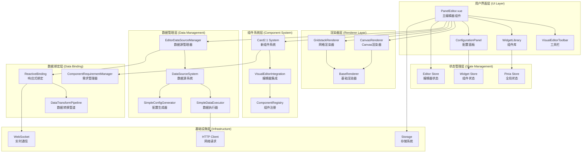
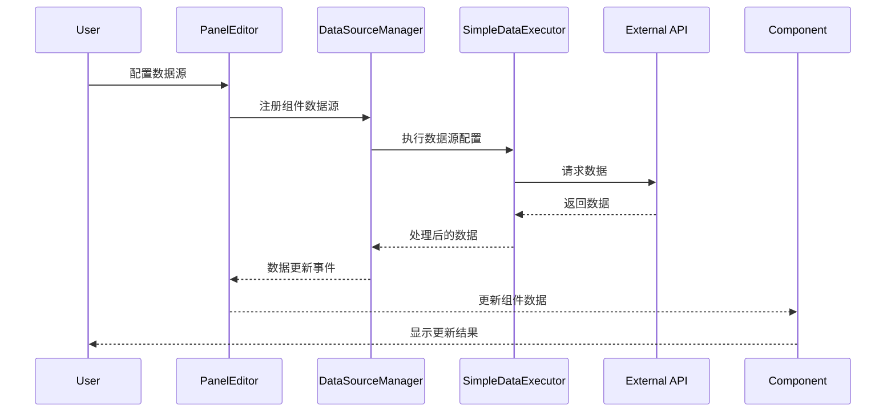

# ThingsPanel Visual Editor 架构分析报告

## 📋 文档信息
- **文档版本**: 1.0.0
- **分析日期**: 2025年8月22日
- **分析范围**: 系统整体架构和设计模式
- **分析深度**: 深度架构评估

---

## 🏗️ 系统架构概览

ThingsPanel Visual Editor 采用现代化的分层架构设计，体现了组件化、插件化和数据驱动的设计理念。

### 🎯 架构评级: **B+ (82/100)**

| 架构维度 | 评分 | 评价 |
|---------|------|------|
| **模块化设计** | 85/100 | 良好的模块分离和职责定义 |
| **可扩展性** | 90/100 | 优秀的插件化架构设计 |
| **可维护性** | 75/100 | 架构清晰但存在复杂度问题 |
| **性能设计** | 80/100 | 合理的性能考虑，存在优化空间 |
| **安全性** | 85/100 | 较好的安全边界设计 |

---

## 🏛️ 整体架构图



---

## 🔄 核心设计模式

### 1. **多渲染器模式 (Multiple Renderer Pattern)**

```typescript
// 基础渲染器抽象
abstract class BaseRenderer {
  abstract render(): void
  abstract cleanup(): void
}

// 具体渲染器实现
class CanvasRenderer extends BaseRenderer { /* ... */ }
class GridstackRenderer extends BaseRenderer { /* ... */ }
```

**优点:**
- 支持多种渲染方式无缝切换
- 渲染逻辑与业务逻辑分离
- 易于扩展新的渲染器

**改进建议:**
- 完善渲染器状态管理
- 添加渲染器间的数据迁移机制

### 2. **组件注册模式 (Component Registry Pattern)**

```typescript
// Card2.1 组件注册系统
interface ComponentDefinition {
  type: string
  name: string
  component: Component
  config?: ComponentConfig
}

class ComponentRegistry {
  register(definition: ComponentDefinition): void
  get(type: string): ComponentDefinition
}
```

**优点:**
- 动态组件加载和注册
- 类型安全的组件管理
- 支持插件化扩展

### 3. **数据绑定模式 (Data Binding Pattern)**

```typescript
// 响应式数据绑定
interface ReactiveDataBinding {
  start(): void
  stop(): void
  refresh(): Promise<void>
  onDataChange: (data: any) => void
}

// 数据转换管道
interface DataTransformPipeline {
  execute(): Promise<any>
  validate(): boolean
}
```

**优点:**
- 实时数据更新机制
- 多触发器支持(定时器、WebSocket、事件)
- 完整的数据验证和转换

### 4. **观察者模式 (Observer Pattern)**

```typescript
// 事件管理系统
class EventManager {
  on(event: string, callback: Function): void
  off(event: string, callback: Function): void
  emit(event: string, data?: any): void
}
```

**实现位置:**
- `EditorDataSourceManager` 事件系统
- `ReactiveBinding` 数据变化通知
- 组件间通信机制

### 5. **工厂模式 (Factory Pattern)**

```typescript
// 数据源工厂
class DataSourceFactory {
  create(type: string, config: any): DataSource
}

// 触发器工厂
class UpdateTriggerFactory {
  createTimerTrigger(interval: number): TimerTrigger
  createWebSocketTrigger(url: string): WebSocketTrigger
}
```

---

## 🏢 分层架构分析

### 1. **表现层 (Presentation Layer)**

**组件:** PanelEditor.vue, VisualEditorToolbar, WidgetLibrary, ConfigurationPanel

**职责:**
- 用户界面渲染和交互
- 用户输入处理和验证
- 状态展示和反馈

**架构评价:**
- ✅ 组件职责分离清晰
- ⚠️ PanelEditor.vue职责过重(1853行)
- ✅ 响应式设计良好

**改进建议:**
```typescript
// 建议拆分PanelEditor.vue为多个子组件
- EditorMain.vue (主编辑区域)
- EditorSidebar.vue (侧边栏管理)
- EditorStatusBar.vue (状态栏)
- EditorModal.vue (弹窗管理)
```

### 2. **业务逻辑层 (Business Logic Layer)**

**组件:** EditorDataSourceManager, Card2.1 System, VisualEditorIntegration

**职责:**
- 业务规则实现和验证
- 数据处理和转换
- 组件生命周期管理

**架构评价:**
- ✅ 业务逻辑封装良好
- ✅ 单一职责原则遵循较好
- ⚠️ 系统间耦合度偏高

### 3. **数据访问层 (Data Access Layer)**

**组件:** SimpleDataExecutor, DataSourceSystem, HTTP Client

**职责:**
- 数据源访问和管理
- 网络请求处理
- 数据缓存和持久化

**架构评价:**
- ✅ 数据访问抽象良好
- ✅ 支持多种数据源类型
- ✅ 错误处理机制完善

### 4. **基础设施层 (Infrastructure Layer)**

**组件:** Pinia Store, Event System, Configuration Management

**职责:**
- 全局状态管理
- 配置管理和持久化
- 系统级服务提供

**架构评价:**
- ✅ 基础设施服务完整
- ⚠️ 状态管理策略需要统一
- ✅ 配置系统设计合理

---

## 🔧 核心架构组件分析

### 1. **PanelEditor.vue - 主控制器**

**架构角色:** 系统主控制器和协调者

**核心职责:**
```typescript
class PanelEditor {
  // 状态管理
  private editorConfig: EditorConfig
  private stateManager: StateManager
  
  // 子系统协调
  private dataSourceManager: EditorDataSourceManager
  private configurationManager: ConfigurationManager
  private renderManager: RenderManager
  
  // 生命周期管理
  initialize(): Promise<void>
  cleanup(): void
}
```

**架构问题:**
- 🔴 **职责过重**: 1853行代码承载过多功能
- 🔴 **耦合度高**: 直接管理多个子系统
- 🟡 **测试困难**: 大量逻辑难以单元测试

**重构建议:**
```typescript
// 建议采用MVP/MVVM模式重构
interface EditorPresenter {
  handleUserAction(action: UserAction): void
  updateView(state: EditorState): void
}

interface EditorModel {
  getState(): EditorState
  updateState(updates: Partial<EditorState>): void
}
```

### 2. **Card2.1 系统 - 组件架构**

**架构角色:** 现代化组件系统核心

**设计亮点:**
```typescript
// 优秀的类型系统设计
interface ComponentDefinition {
  type: string
  name: string
  description?: string
  properties: Record<string, PropertyDefinition>
  dataRequirements?: ComponentDataRequirement
}

// 灵活的数据需求声明
interface ComponentDataRequirement {
  componentType: string
  dataSources: DataSourceRequirement[]
  fields: Record<string, DataFieldRequirement>
  relationships?: Record<string, DataRelationship>
}
```

**架构优势:**
- ✅ 类型安全的组件定义
- ✅ 灵活的数据需求声明
- ✅ 良好的扩展性设计

### 3. **数据源系统 - 数据管理架构**

**架构角色:** 统一数据访问和管理

**核心设计:**
```typescript
// 简化但功能完整的执行器
class SimpleDataExecutor {
  async execute(config: SimpleDataSourceConfig): Promise<ExecutionResult>
  startPolling(config: SimpleDataSourceConfig, callback: Function): string
  stopPolling(pollingId: string): void
}

// 配置标准化生成器
class SimpleConfigGenerator {
  generateConfig(requirement: ComponentDataRequirement, 
                userInputs: UserDataSourceInput[]): SimpleDataSourceConfig
}
```

**架构优势:**
- ✅ 统一的数据访问接口
- ✅ 支持多种触发机制
- ✅ 完整的错误处理

---

## 🔄 数据流架构

### 数据流向图



### 状态管理架构

```typescript
// 多层状态管理策略
interface StateArchitecture {
  // 全局状态 (Pinia Store)
  globalState: {
    editor: EditorState
    widgets: WidgetState
    user: UserState
  }
  
  // 组件状态 (Component Local State)
  componentState: {
    [componentId: string]: ComponentLocalState
  }
  
  // 临时状态 (Reactive Refs)
  temporaryState: {
    dragState: DragState
    selectionState: SelectionState
  }
}
```

---

## 🎭 架构模式评估

### 1. **分层架构模式**

**实现质量:** ⭐⭐⭐⭐☆ (4/5)

**优点:**
- 清晰的职责分层
- 良好的关注点分离
- 易于理解和维护

**不足:**
- 层间通信偶有冗余
- 某些组件跨层访问

### 2. **插件化架构模式**

**实现质量:** ⭐⭐⭐⭐⭐ (5/5)

**优点:**
- 优秀的组件注册机制
- 动态加载和卸载
- 强类型系统支持

**应用场景:**
- Card2.1组件系统
- 数据源插件系统
- 渲染器扩展系统

### 3. **事件驱动架构模式**

**实现质量:** ⭐⭐⭐⭐☆ (4/5)

**优点:**
- 松耦合的组件通信
- 异步事件处理
- 良好的扩展性

**改进空间:**
- 事件命名规范化
- 事件流追踪和调试

### 4. **MVC/MVP模式**

**实现质量:** ⭐⭐⭐☆☆ (3/5)

**问题:**
- 控制器职责不够清晰
- 模型和视图耦合度偏高
- 缺少明确的MVP分离

**改进建议:**
```typescript
// 建议明确分离关注点
interface EditorArchitecture {
  view: EditorView           // 纯UI组件
  presenter: EditorPresenter // 业务逻辑处理
  model: EditorModel         // 数据状态管理
}
```

---

## 🚀 架构演进建议

### 1. **微前端架构迁移**

```typescript
// 阶段性微前端架构
interface MicroFrontendArchitecture {
  shell: EditorShell         // 主壳应用
  modules: {
    renderer: RendererModule // 渲染器模块
    components: ComponentModule // 组件库模块
    dataSource: DataSourceModule // 数据源模块
  }
}
```

**迁移路径:**
1. 模块边界明确化
2. 独立部署能力
3. 运行时集成机制

### 2. **状态管理标准化**

```typescript
// 统一状态管理策略
interface UnifiedStateManagement {
  store: GlobalStore        // 全局状态
  context: ComponentContext // 组件上下文
  cache: DataCache         // 数据缓存
}
```

### 3. **性能优化架构**

```typescript
// 性能优化策略
interface PerformanceArchitecture {
  virtualization: VirtualRenderer // 虚拟化渲染
  lazyLoading: LazyLoader         // 懒加载机制
  caching: IntelligentCache       // 智能缓存
  optimization: BundleOptimizer   // 打包优化
}
```

---

## 📊 架构健康度评估

### 技术债务分析

| 债务类型 | 严重程度 | 影响范围 | 处理优先级 |
|---------|---------|----------|-----------|
| **代码复杂度** | 高 | PanelEditor.vue | 高 |
| **架构耦合** | 中 | 数据流管理 | 中 |
| **性能债务** | 中 | 大组件渲染 | 中 |
| **测试债务** | 高 | 整体测试覆盖 | 高 |

### 可扩展性评估

| 扩展维度 | 当前状态 | 扩展难度 | 建议 |
|---------|---------|----------|------|
| **新渲染器** | 优秀 | 低 | 继续完善接口规范 |
| **新组件类型** | 优秀 | 低 | 保持当前架构 |
| **新数据源** | 良好 | 中 | 简化配置流程 |
| **新功能模块** | 一般 | 高 | 重构主控制器 |

---

## 🎯 总结与建议

### 架构亮点
1. **现代化设计**: 充分利用Vue 3和TypeScript特性
2. **插件化架构**: 优秀的可扩展性设计
3. **数据驱动**: 完整的数据绑定和管理系统
4. **类型安全**: 强类型系统提供良好的开发体验

### 核心问题
1. **复杂度管理**: 主组件职责过重，需要重构
2. **状态管理**: 多种状态管理策略并存，需要标准化
3. **性能优化**: 大型组件渲染性能有优化空间

### 改进路线图

**短期目标 (1-2个月):**
- PanelEditor.vue重构分解
- 状态管理策略统一
- 核心性能问题修复

**中期目标 (3-6个月):**
- 微前端架构探索
- 测试体系完善
- 文档和规范建立

**长期目标 (6个月以上):**
- 插件生态建设
- 性能全面优化
- 架构标准化输出

ThingsPanel Visual Editor 的架构设计体现了现代前端开发的先进理念，具有良好的技术基础和发展潜力。通过系统性的重构和优化，有望发展成为业界领先的可视化编辑器平台。