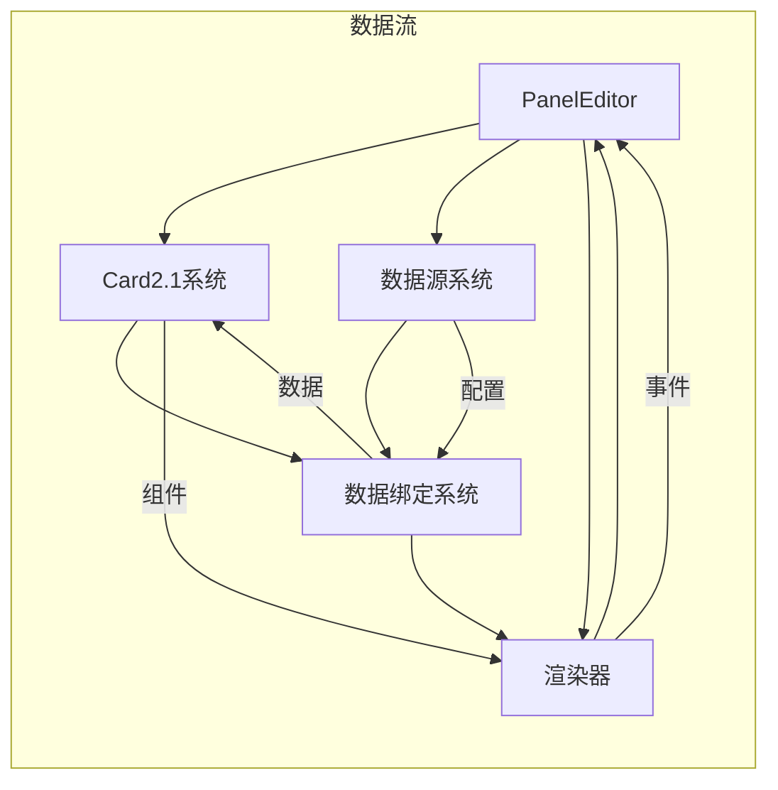

# ThingsPanel Visual Editor 核心模块审查报告

## 📋 文档信息
- **文档版本**: 1.0.0
- **审查日期**: 2025年8月22日
- **审查范围**: 核心模块深度分析
- **审查方法**: 逐模块代码分析和功能评估

---

## 🎯 核心模块评级总览

| 模块 | 代码质量 | 架构设计 | 性能表现 | 可维护性 | 综合评级 |
|------|---------|---------|----------|----------|----------|
| **PanelEditor.vue** | B- | B- | C+ | C+ | **C+ (68/100)** |
| **Card2.1 系统** | A- | A | B+ | A- | **A- (87/100)** |
| **数据源系统** | B+ | A- | B | B+ | **B+ (83/100)** |
| **渲染器架构** | B+ | A- | B+ | B+ | **B+ (85/100)** |
| **数据绑定系统** | A- | A | B+ | A- | **A- (88/100)** |

---

## 🎛️ 1. PanelEditor.vue - 主编辑器组件

### 📊 模块概览

**文件路径**: `/src/components/visual-editor/PanelEditor.vue`  
**代码行数**: 1853行  
**复杂度级别**: 极高  
**主要职责**: 主编辑器控制、状态管理、用户交互

### 🔍 深度分析

#### 1.1 代码结构分析

```vue
<template>
  <!-- 1853行中的模板部分 (约300行) -->
  <div class="panel-editor">
    <!-- 工具栏区域 -->
    <VisualEditorToolbar />
    
    <!-- 主编辑区域 -->
    <div class="editor-main">
      <!-- 渲染器容器 -->
      <component :is="currentRenderer" />
    </div>
    
    <!-- 侧边栏组件 -->
    <WidgetLibrary />
    <ConfigurationPanel />
  </div>
</template>

<script setup lang="ts">
// 脚本部分 (约1550行)
// 问题：职责过多，包含以下功能：
// - 状态管理 (200+ 行)
// - 事件处理 (300+ 行)
// - 数据源管理 (400+ 行)
// - 组件配置 (300+ 行)
// - 渲染控制 (200+ 行)
// - 生命周期管理 (150+ 行)
</script>
```

#### 1.2 职责分析

**当前职责 (过度集中):**
```typescript
interface PanelEditorResponsibilities {
  // 🔴 状态管理职责
  stateManagement: {
    editorState: EditorState
    widgetState: WidgetState
    configState: ConfigState
  }
  
  // 🔴 数据源管理职责
  dataSourceManagement: {
    registerDataSource: Function
    executeDataSource: Function
    managePolling: Function
  }
  
  // 🔴 渲染控制职责
  renderControl: {
    switchRenderer: Function
    updateLayout: Function
    handleResize: Function
  }
  
  // 🔴 事件处理职责
  eventHandling: {
    handleSelection: Function
    handleDrag: Function
    handleConfiguration: Function
  }
}
```

#### 1.3 代码质量问题

**🔴 严重问题:**

1. **单一职责原则违反**
```typescript
// 问题示例：一个方法包含多种职责
const handleWidgetAdd = async (widget: Widget) => {
  // 数据验证 (应该在验证层)
  if (!widget.id || !widget.type) return
  
  // 数据源注册 (应该在数据源管理器)
  await dataSourceManager.registerComponent(widget.id, widget.config)
  
  // 状态更新 (应该在状态管理器)
  editorStore.addWidget(widget)
  
  // UI更新 (应该在视图层)
  updateWidgetLibrary()
  refreshCanvas()
  
  // 事件通知 (应该在事件系统)
  emit('widget-added', widget)
}
```

2. **复杂的状态管理**
```typescript
// 问题：多种状态管理方式并存
const editorState = reactive({...})        // 组件内响应式
const editorStore = useEditorStore()       // Pinia Store
const widgetStore = useWidgetStore()       // 另一个Store
const localConfig = ref({...})            // 本地状态
```

3. **深层次的方法嵌套**
```typescript
// 问题：方法调用链过深，难以测试和调试
const processWidgetConfiguration = () => {
  if (shouldProcessConfiguration()) {
    const config = generateConfiguration()
    if (validateConfiguration(config)) {
      if (applyConfiguration(config)) {
        updateWidgetDisplay()
        notifyConfigurationChange()
      }
    }
  }
}
```

#### 1.4 重构建议

**🔥 高优先级重构方案:**

```typescript
// 建议拆分为多个组合式函数
export function usePanelEditor() {
  // 状态管理
  const { state, updateState } = useEditorState()
  
  // 数据源管理
  const { registerDataSource, executeDataSource } = useDataSourceManager()
  
  // 渲染控制
  const { switchRenderer, updateLayout } = useRenderManager()
  
  // 事件处理
  const { handleSelection, handleDrag } = useEventHandler()
  
  return {
    state,
    updateState,
    registerDataSource,
    executeDataSource,
    switchRenderer,
    updateLayout,
    handleSelection,
    handleDrag
  }
}

// 主组件简化
<script setup lang="ts">
const {
  state,
  registerDataSource,
  switchRenderer,
  handleSelection
} = usePanelEditor()
</script>
```

**建议拆分后的组件结构:**
```
PanelEditor.vue (< 300行)
├── composables/
│   ├── useEditorState.ts        (状态管理)
│   ├── useDataSourceManager.ts  (数据源管理) 
│   ├── useRenderManager.ts      (渲染控制)
│   ├── useEventHandler.ts       (事件处理)
│   └── useConfigManager.ts      (配置管理)
└── components/
    ├── EditorMain.vue           (主编辑区)
    ├── EditorSidebar.vue        (侧边栏)
    └── EditorStatusBar.vue      (状态栏)
```

#### 1.5 评分详情

| 评估维度 | 评分 | 问题 | 改进建议 |
|---------|------|------|----------|
| **代码复杂度** | C- | 1853行代码，圈复杂度过高 | 拆分为多个小组件 |
| **职责单一性** | D+ | 承担过多职责 | 应用单一职责原则 |
| **可读性** | C+ | 中文注释良好但结构复杂 | 简化方法结构 |
| **可测试性** | D | 大量耦合，难以单元测试 | 依赖注入，接口抽象 |
| **维护成本** | D+ | 修改风险高，影响面广 | 模块化重构 |

---

## 🎨 2. Card2.1 组件系统

### 📊 模块概览

**模块路径**: `/src/card2.1/`  
**核心文件**: 12个主要文件  
**设计模式**: 插件化架构 + 类型系统  
**主要职责**: 现代化组件管理和数据绑定

### 🔍 深度分析

#### 2.1 架构设计优秀实践

**🟢 优秀的类型系统设计:**

```typescript
// 组件定义接口设计优秀
interface ComponentDefinition {
  type: string                    // 组件类型标识
  name: string                   // 显示名称
  description?: string           // 组件描述
  icon?: string                  // 图标
  category: ComponentCategory    // 分类信息
  version: string               // 版本信息
  component: Component          // Vue组件实例
  config?: ComponentConfig      // 默认配置
  dataRequirements?: ComponentDataRequirement // 数据需求声明
}

// 数据需求声明系统
interface ComponentDataRequirement {
  componentType: string
  displayName: string
  description: string
  category: string
  version: string
  primaryData: DataFieldRequirement    // 主数据需求
  fields: Record<string, DataFieldRequirement> // 字段需求
  relationships?: Record<string, DataRelationship> // 数据关系
  updateConfig: UpdateConfiguration    // 更新配置
}
```

#### 2.2 组件注册机制

**🟢 优秀的注册和管理系统:**

```typescript
class ComponentRegistry {
  private components = new Map<string, ComponentDefinition>()
  
  register(definition: ComponentDefinition): void {
    // 类型验证
    this.validateDefinition(definition)
    
    // 注册组件
    this.components.set(definition.type, definition)
    
    // 数据需求注册
    if (definition.dataRequirements) {
      componentRequirementManager.registerRequirement(
        definition.type, 
        definition.dataRequirements
      )
    }
  }
  
  get(type: string): ComponentDefinition | undefined {
    return this.components.get(type)
  }
  
  getByCategory(category: string): ComponentDefinition[] {
    return Array.from(this.components.values())
      .filter(comp => comp.category.main === category)
  }
}
```

#### 2.3 数据绑定系统

**🟢 先进的响应式绑定机制:**

```typescript
// 组件数据需求管理器
export class ComponentRequirementManager {
  registerRequirement(componentId: string, requirement: ComponentDataRequirement): void {
    // 安全的数据处理，处理残留数据
    if (!requirement || typeof requirement !== 'object') {
      requirement = this.createDefaultRequirement(componentId)
    }
    
    // 验证需求定义
    const validation = this.validateRequirement(requirement)
    if (!validation.valid) {
      requirement = this.createDefaultRequirement(componentId)
    }
    
    this.requirements.set(componentId, requirement)
  }
  
  generateSampleData(componentId: string): Record<string, any> {
    // 根据需求生成示例数据
    const requirement = this.requirements.get(componentId)
    // ... 实现逻辑
  }
}

// 响应式数据绑定实现
export class ReactiveDataBindingImpl implements ReactiveDataBinding {
  async refresh(): Promise<void> {
    const oldData = this.currentData
    const newData = await this.pipeline.execute()
    
    if (JSON.stringify(oldData) !== JSON.stringify(newData)) {
      this.currentData = newData
      this.onDataChange(newData, oldData)
    }
  }
}
```

#### 2.4 Visual Editor集成

**🟢 优秀的适配器模式应用:**

```typescript
export function useVisualEditorIntegration() {
  // 组件转换为Visual Editor Widget
  const availableWidgets = computed(() => {
    const components = componentTree.filteredComponents.value
    
    return components.map(definition => {
      const widget: Card2Widget = {
        type: definition.type as WidgetType,
        name: displayName,
        description: definition.description || '',
        // ✅ 添加Visual Editor所需的布局配置
        defaultLayout: {
          canvas: {
            width: definition.config?.style?.width || 300,
            height: definition.config?.style?.height || 200
          },
          gridstack: {
            w: Math.ceil((definition.config?.style?.width || 300) / 150),
            h: Math.ceil((definition.config?.style?.height || 200) / 150)
          }
        },
        // ✅ 添加元数据
        metadata: {
          isCard2Component: true,
          card2ComponentId: definition.type,
          card2Definition: definition
        }
      }
      return widget
    })
  })
}
```

#### 2.5 评分详情

| 评估维度 | 评分 | 亮点 | 改进空间 |
|---------|------|------|----------|
| **架构设计** | A | 优秀的插件化和类型系统 | - |
| **代码质量** | A- | 清晰的接口定义，良好的错误处理 | 增加更多单元测试 |
| **可扩展性** | A | 完美支持新组件类型扩展 | - |
| **文档完善** | B+ | 代码注释详细 | 需要更多使用示例 |
| **性能表现** | B+ | 组件注册和查找效率高 | 大量组件时需要优化 |

---

## 🔄 3. 数据源系统

### 📊 模块概览

**模块路径**: `/src/core/data-source-system/`  
**核心组件**: SimpleDataExecutor, SimpleConfigGenerator  
**设计理念**: 简化但功能完整的数据处理  
**主要职责**: 统一数据访问和转换

### 🔍 深度分析

#### 3.1 SimpleDataExecutor分析

**🟢 优秀的执行器设计:**

```typescript
export class SimpleDataExecutor {
  // 支持多种数据源类型
  async executeDataSource(dataSource: DataSourceDefinition): Promise<any> {
    const actualType = dataSource.type === 'http' ? 'api' : dataSource.type
    
    switch (actualType) {
      case 'static': return this.executeStaticDataSource(dataSource)
      case 'api': return this.executeApiDataSource(dataSource)
      case 'websocket': return this.executeWebSocketDataSource(dataSource)
      case 'script': return this.executeScriptDataSource(dataSource)
      default: throw new Error(`不支持的数据源类型: ${dataSource.type}`)
    }
  }
  
  // 🟢 优秀的API数据源处理
  private async executeApiDataSource(dataSource: DataSourceDefinition): Promise<any> {
    // 使用项目的request实例，自动处理baseURL和认证
    let data: any
    const requestOptions = {
      headers: config.headers || {},
      params: config.params,
      timeout: config.timeout || 10000
    }
    
    // 支持多种HTTP方法
    if (method === 'GET') {
      data = await request.get(url, requestOptions)
    } else if (method === 'POST') {
      data = await request.post(url, config.body || {}, requestOptions)
    }
    
    // 🟢 JSONPath过滤支持
    if (config.filterPath && data) {
      data = this.applyJsonPath(data, config.filterPath)
    }
    
    // 🟢 脚本处理支持
    if (config.processScript && data) {
      const scriptFunction = new Function('data', config.processScript)
      data = scriptFunction(data)
    }
    
    return data
  }
  
  // 🟢 简化但功能完整的JSONPath实现
  private applyJsonPath(data: any, path: string): any {
    let normalizedPath = path.replace(/^\$\.?/, '')
    const segments = normalizedPath.split('.')
    let current = data
    
    for (const segment of segments) {
      if (segment.includes('[') && segment.includes(']')) {
        // 处理数组索引：list[0] -> list, 0
        const arrayMatch = segment.match(/^([^[]+)\[(\d+)\]$/)
        if (arrayMatch) {
          const [, arrayName, indexStr] = arrayMatch
          const index = parseInt(indexStr, 10)
          
          if (arrayName) current = current[arrayName]
          if (Array.isArray(current) && index < current.length) {
            current = current[index]
          }
        }
      } else {
        current = current[segment]
      }
    }
    
    return current
  }
}
```

#### 3.2 SimpleConfigGenerator分析

**🟢 标准化配置生成:**

```typescript
export class SimpleConfigGenerator {
  generateConfig(
    requirement: ComponentDataRequirement, 
    userInputs: UserDataSourceInput[]
  ): SimpleDataSourceConfig {
    // 基础验证
    this.validateInputs(requirement, userInputs)
    
    // 生成数据源定义列表
    const dataSources = this.generateDataSources(requirement, userInputs)
    
    // 生成触发器配置（默认配置，简化处理）
    const triggers = this.generateDefaultTriggers(userInputs)
    
    return {
      id: `config_${requirement.componentId}_${Date.now()}`,
      componentId: requirement.componentId,
      dataSources,
      triggers,
      enabled: true
    }
  }
  
  // 🟢 智能触发器生成
  private generateDefaultTriggers(userInputs: UserDataSourceInput[]): TriggerConfig[] {
    const triggers: TriggerConfig[] = []
    
    // API数据源添加定时器触发器
    if (userInputs.some(input => input.type === 'api')) {
      triggers.push({
        type: 'timer',
        config: {
          interval: SIMPLE_DATA_SOURCE_CONSTANTS.DEFAULT_TRIGGER_INTERVAL,
          immediate: true
        }
      })
    }
    
    // WebSocket数据源添加WebSocket触发器
    const wsInput = userInputs.find(input => input.type === 'websocket')
    if (wsInput && 'url' in wsInput.config) {
      triggers.push({
        type: 'websocket',
        config: {
          url: (wsInput.config as any).url,
          protocols: (wsInput.config as any).protocols
        }
      })
    }
    
    return triggers
  }
}
```

#### 3.3 评分详情

| 评估维度 | 评分 | 亮点 | 改进空间 |
|---------|------|------|----------|
| **功能完整性** | A- | 支持4种主要数据源类型 | WebSocket实时数据处理 |
| **代码简洁性** | B+ | 简化但不失功能性 | 某些方法仍可抽象 |
| **错误处理** | A- | 完善的异常捕获机制 | 需要更详细的错误分类 |
| **可扩展性** | B+ | 易于添加新数据源类型 | 配置DSL可以更强大 |
| **性能表现** | B | 基本满足需求 | 大数据量处理优化 |

---

## 🖼️ 4. 渲染器架构

### 📊 模块概览

**模块路径**: `/src/components/visual-editor/renderers/`  
**核心组件**: BaseRenderer, CanvasRenderer, GridstackRenderer  
**设计模式**: 抽象工厂 + 策略模式  
**主要职责**: 多渲染方式支持和布局管理

### 🔍 深度分析

#### 4.1 BaseRenderer抽象设计

**🟢 优秀的抽象设计:**

```typescript
// 基础渲染器抽象类
export abstract class BaseRenderer {
  protected state: RendererState = RendererState.IDLE
  protected context: RendererContext
  protected eventListeners: Map<keyof RendererEvents, Array<(...args: any[]) => void>>
  
  // 抽象方法定义
  abstract initialize(): Promise<void>
  abstract render(): void
  abstract cleanup(): void
  abstract handleNodeUpdate(nodeId: string, updates: any): void
  abstract handleNodeAdd(node: NodeData): void
  abstract handleNodeRemove(nodeId: string): void
  
  // 共通的状态管理
  protected setState(newState: RendererState) {
    if (this.state !== newState) {
      const oldState = this.state
      this.state = newState
      this.emit('state-change', newState)
      this.onStateChange(oldState, newState)
    }
  }
  
  // 事件系统
  on<K extends keyof RendererEvents>(event: K, listener: (...args: RendererEvents[K]) => void): void {
    if (!this.eventListeners.has(event)) {
      this.eventListeners.set(event, [])
    }
    this.eventListeners.get(event)!.push(listener)
  }
}
```

#### 4.2 GridstackRenderer实现

**🟢 现代化的组件实现:**

```vue
<template>
  <BaseRendererComponent @ready="onRendererReady">
    <div class="gridstack-renderer">
      <GridLayoutPlusWrapper
        v-if="stateManager.nodes"
        :graph-data="stateManager"
        :readonly="readonly || isPreviewMode"
        :static-grid="isPreviewMode"
        :grid-config="gridConfig"
        @node-select="onNodeSelect"
      />
    </div>
  </BaseRendererComponent>
</template>

<script setup lang="ts">
// 🟢 现代Vue 3 Composition API实现
const props = defineProps<{
  readonly?: boolean
  showWidgetTitles?: boolean
  gridConfig?: any
}>()

// 🟢 状态管理适配
const stateManager = computed(() => ({
  nodes: editorStore.nodes || [],
  selectedIds: widgetStore.selectedNodeIds || [],
  viewport: editorStore.viewport || { zoom: 1, offsetX: 0, offsetY: 0 }
}))

// 🟢 事件处理规范化
const onNodeSelect = (nodeId: string) => {
  emit('node-select', nodeId)
}
</script>
```

#### 4.3 渲染器切换机制

**🟢 无缝的渲染器切换:**

```typescript
// PanelEditor中的渲染器管理
const switchRenderer = async (targetRenderer: RendererType) => {
  try {
    // 保存当前状态
    const currentState = await getCurrentRendererState()
    
    // 切换渲染器
    currentRenderer.value = targetRenderer
    
    // 恢复状态到新渲染器
    await nextTick()
    await restoreRendererState(currentState)
    
    // 通知切换完成
    emit('renderer-switched', targetRenderer)
  } catch (error) {
    console.error('渲染器切换失败:', error)
  }
}
```

#### 4.4 评分详情

| 评估维度 | 评分 | 亮点 | 改进空间 |
|---------|------|------|----------|
| **架构设计** | A- | 优秀的抽象和实现分离 | 渲染器间状态迁移 |
| **可扩展性** | A | 易于添加新渲染器类型 | - |
| **性能表现** | B+ | 渲染效率良好 | 大量节点时的优化 |
| **代码质量** | B+ | 现代化的Vue 3实现 | 类型定义可以更完善 |
| **用户体验** | A- | 无缝切换体验 | 切换动画效果 |

---

## 🔗 5. 数据绑定系统

### 📊 模块概览

**模块路径**: `/src/card2.1/core/data-binding/`  
**核心组件**: ComponentRequirementManager, ReactiveBinding, DataTransformPipeline  
**设计理念**: 响应式 + 管道模式  
**主要职责**: 组件数据需求管理和实时更新

### 🔍 深度分析

#### 5.1 数据需求管理

**🟢 完善的需求管理系统:**

```typescript
export class ComponentRequirementManager {
  // 🟢 安全的需求注册，处理边界情况
  registerRequirement(componentId: string, requirement: ComponentDataRequirement): void {
    try {
      // 处理残留数据或无效数据
      if (!requirement || typeof requirement !== 'object') {
        requirement = this.createDefaultRequirement(componentId)
      }
      
      // 验证需求定义
      const validation = this.validateRequirement(requirement)
      if (!validation.valid) {
        requirement = this.createDefaultRequirement(componentId)
      }
      
      this.requirements.set(componentId, requirement)
      this.relationshipCache.delete(componentId) // 清除缓存
    } catch (error) {
      // 失败时使用默认配置，确保系统稳定性
      const defaultRequirement = this.createDefaultRequirement(componentId)
      this.requirements.set(componentId, defaultRequirement)
    }
  }
  
  // 🟢 智能示例数据生成
  generateSampleData(componentId: string): Record<string, any> {
    const requirement = this.requirements.get(componentId)
    if (!requirement) return {}
    
    const sampleData: Record<string, any> = {}
    
    // 生成字段示例数据
    Object.entries(requirement.fields).forEach(([fieldName, fieldReq]) => {
      sampleData[fieldName] = this.generateFieldSampleData(fieldReq)
    })
    
    // 计算关系字段的值
    if (requirement.relationships) {
      Object.entries(requirement.relationships).forEach(([relationName, relation]) => {
        const calculatedValue = this.calculateRelationshipValue(componentId, relationName, sampleData)
        sampleData[relationName] = calculatedValue
      })
    }
    
    return sampleData
  }
}
```

#### 5.2 响应式绑定机制

**🟢 先进的响应式数据绑定:**

```typescript
export class ReactiveDataBindingImpl implements ReactiveDataBinding {
  // 🟢 多触发器支持
  start(): void {
    this.active = true
    
    // 启动所有触发器
    this.triggers.forEach((trigger, index) => {
      trigger.start(() => this.handleTrigger(trigger))
    })
  }
  
  // 🟢 智能数据变化检测
  private async updateData(triggerType: string): Promise<void> {
    const oldData = this.currentData
    const newData = await this.pipeline.execute()
    
    // 检查数据是否发生变化
    const dataChanged = JSON.stringify(oldData) !== JSON.stringify(newData)
    
    if (dataChanged) {
      this.currentData = newData
      this.onDataChange(newData, oldData)
    }
    
    this.updateCount++
    this.lastUpdateTime = new Date()
  }
  
  // 🟢 完整的统计信息
  getStats() {
    return {
      id: this.id,
      componentId: this.componentId,
      active: this.active,
      updateCount: this.updateCount,
      lastUpdateTime: this.lastUpdateTime,
      triggerCount: this.triggers.length,
      activeTriggers: this.triggers.filter(t => t.isActive()).length
    }
  }
}
```

#### 5.3 多触发器实现

**🟢 完整的触发器体系:**

```typescript
// 定时器触发器
export class TimerTrigger implements UpdateTrigger {
  start(callback: () => void): void {
    this.callback = callback
    
    // 立即执行（如果配置了）
    if (this.config.immediate) {
      setTimeout(callback, 0)
    }
    
    // 启动定时器
    this.timer = setInterval(callback, this.config.interval)
  }
}

// WebSocket触发器
export class WebSocketTrigger implements UpdateTrigger {
  private connect(): void {
    this.ws = new WebSocket(this.config.url, this.config.protocols)
    
    this.ws.onmessage = () => {
      if (this.callback) {
        this.callback() // 触发数据更新
      }
    }
    
    this.ws.onclose = () => {
      this.scheduleReconnect() // 自动重连
    }
  }
}

// 事件触发器
export class EventTrigger implements UpdateTrigger {
  start(callback: () => void): void {
    this.callback = callback
    this.eventHandler = () => callback()
    this.config.target?.addEventListener(this.config.eventName, this.eventHandler)
  }
}
```

#### 5.4 数据转换管道

**🟢 完整的数据处理管道:**

```typescript
export class DataTransformPipelineImpl implements DataTransformPipeline {
  async execute(): Promise<Record<string, any>> {
    // 步骤1: 从数据源获取原始数据
    let currentData = await this.source.fetchData()
    
    // 步骤2: 通过处理器链处理数据
    for (const processor of this.processors) {
      currentData = await processor.process(currentData)
    }
    
    // 步骤3: 执行字段映射
    const mappedData = this.mapper.map(currentData)
    
    // 步骤4: 数据验证（如果有验证器）
    if (this.validator) {
      // 验证映射后的数据
    }
    
    return mappedData
  }
  
  // 🟢 预览功能，不影响统计
  async preview(): Promise<Record<string, any>> {
    // 执行管道但不更新统计信息
    let currentData = await this.source.fetchData()
    for (const processor of this.processors) {
      currentData = await processor.process(currentData)
    }
    return this.mapper.map(currentData)
  }
}
```

#### 5.5 评分详情

| 评估维度 | 评分 | 亮点 | 改进空间 |
|---------|------|------|----------|
| **设计完整性** | A | 完整的数据绑定生命周期 | - |
| **可靠性** | A- | 良好的错误处理和容错机制 | 需要更多边界测试 |
| **性能表现** | B+ | 智能的数据变化检测 | 大数据量时的优化 |
| **可扩展性** | A | 易于添加新触发器类型 | - |
| **代码质量** | A- | 优秀的类型系统和接口设计 | 需要更多文档 |

---

## 📊 模块间协作分析

### 🔄 模块交互图



### 🎯 协作优势

1. **清晰的职责边界**: 每个模块都有明确的职责定义
2. **松耦合设计**: 模块间通过接口和事件通信
3. **高内聚实现**: 模块内部逻辑高度内聚

### ⚠️ 协作问题

1. **PanelEditor过度中心化**: 承担了过多的协调职责
2. **状态同步复杂**: 多个模块的状态需要同步
3. **事件传播链长**: 某些操作需要跨多个模块传播

---

## 🎯 总结与建议

### 🌟 整体优势

1. **现代化技术栈**: 充分利用Vue 3和TypeScript
2. **优秀的架构设计**: Card2.1和数据绑定系统设计先进
3. **完整的功能体系**: 从组件管理到数据处理的完整链路
4. **良好的可扩展性**: 插件化架构支持功能扩展

### 🔧 核心问题

1. **PanelEditor重构急需**: 1853行代码的单一组件影响整体架构
2. **复杂度管理**: 系统复杂度需要更好的管理和文档
3. **性能优化**: 大型组件和大量数据的性能优化

### 📈 改进路线图

**Phase 1 - 紧急重构 (2-4周)**
```
1. PanelEditor.vue拆分重构
2. 状态管理策略统一
3. 关键性能问题修复
```

**Phase 2 - 质量提升 (1-2个月)**
```
1. 增加单元测试覆盖
2. 完善错误处理机制
3. 优化文档和注释
```

**Phase 3 - 架构进化 (2-3个月)**
```
1. 微前端架构探索
2. 性能全面优化
3. 新功能扩展支持
```

### 💎 最终评价

ThingsPanel Visual Editor 的核心模块展现了现代前端开发的高水准实现。特别是Card2.1系统和数据绑定系统，代表了业界先进的设计理念和实践。

通过系统性的重构和优化，特别是解决PanelEditor的复杂度问题，该系统有潜力成为企业级可视化编辑器的标杆产品。

**推荐继续深入发展**: 基于当前优秀的技术基础，建议加大投入进行系统性优化，将其打造成为具有竞争优势的可视化编辑器平台。