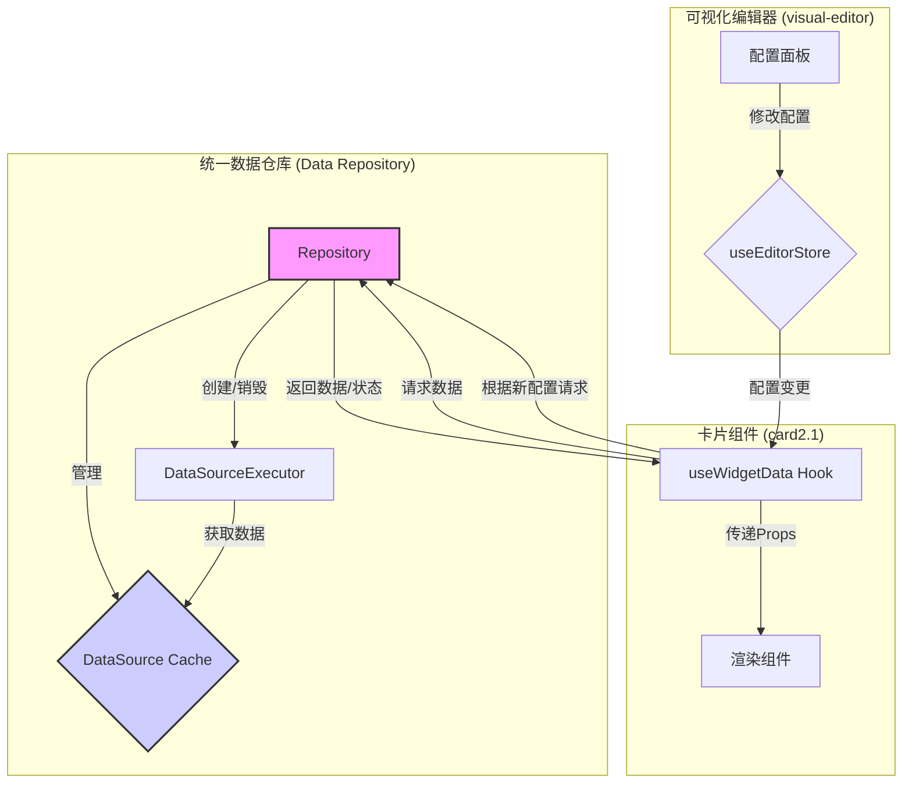

# 可视化编辑器、卡片与数据源系统数据流分析报告

## 1. 整体数据流分析

根据对现有代码的分析，当前系统的数据流闭环大致如下：

1.  **数据源执行器 (DataSourceExecutor)**: 根据用户在编辑器中配置的数据源信息（如HTTP请求、WebSocket或静态JSON），主动获取原始数据。
2.  **数据中心 (dataSourceCenter)**: 这是一个核心的数据中转站，`DataSourceExecutor` 获取到的数据会在这里进行注册和管理。
3.  **卡片组件 (card2.1)**:
    *   卡片组件通过 `useWidgetProps` Hook 从 `dataSourceCenter` 订阅其关心的数据。
    *   当 `dataSourceCenter` 中的数据更新时，会通知所有订阅该数据的卡片组件。
    *   卡片组件内部的 `DataBindingManager` 负责处理具体的数据绑定逻辑，将数据源返回的数据根据配置的路径（如 `a.b.c`）提取出来。
    *   `useWidgetProps` 最终将处理好的数据作为 props 传递给卡片内部的渲染组件，完成UI更新。
4.  **可视化编辑器 (visual-editor)**:
    *   编辑器通过 `useEditorStore` (Pinia store) 管理画布上所有组件（节点）的配置信息，包括它们的位置、大小以及各自的业务配置（例如，卡片的数据源配置）。
    *   当用户在编辑器的配置面板中修改某个卡片的配置时（例如，修改了数据源的URL或轮询时间），这个修改会通过 `ConfigurationManager` 更新到 `useEditorStore` 中对应节点的配置（`node.props`）。
5.  **配置驱动数据获取**:
    *   卡片的数据源配置（存储在 `node.props` 中）被 `useWidgetProps` 读取。
    *   `useWidgetProps` 根据这些配置，决定向 `dataSourceCenter` 订阅哪些数据。
    *   如果配置发生变化，`useWidgetProps` 会取消旧的订阅，并根据新配置创建新的订阅。这间接触发了 `DataSourceExecutor` 可能需要根据新的配置去获取数据。

**数据闭环流程图:**

## 2. 各模块分析

### 2.1. 可视化编辑器 (`visual-editor`)

*   **核心管理者**: `useEditorStore` 和 `useWidgetStore` (Pinia)。
*   **数据管理**:
    *   `useEditorStore`: 负责存储画布的整体状态，包括所有节点 (`nodes`) 的数组、视口 (`viewport`) 信息和当前模式 (`mode`)。每个节点对象包含了该组件的所有配置信息（`props`），这是数据持久化和回显的核心。
    *   `useWidgetStore`: 负责管理当前选中的组件 (`selectedIds`) 和已注册的组件列表 (`widgetRegistry`)。它与 `useEditorStore` 存在交互，例如，当选中一个节点时，会同时更新两个 store 的状态。
*   **配置流**: 用户在UI上的操作 -> 调用 `ConfigurationManager` -> `ConfigurationManager` 提交对 `useEditorStore` 的修改。这是一个单向的数据流，清晰地将配置的修改集中管理。

### 2.2. 卡片组件 (`card2.1`)

*   **核心管理者**: `useWidgetProps` Hook。
*   **数据管理**:
    *   **配置管理**: `FlexibleConfigManager` 负责处理组件的静态配置，包括配置的合并、验证和默认值处理。它定义了组件“有什么”配置项。
    *   **数据绑定**: `DataBindingManager` 负责动态数据的绑定。它根据 `useWidgetProps` 提供的配置，向 `dataSourceCenter` 订阅数据，并管理数据更新后的回调。
    *   **数据流入点**: `useWidgetProps` 是连接“静态配置”和“动态数据”的桥梁。它从 `useEditorStore` 获取组件的配置，然后利用这些配置去 `dataSourceCenter` 获取动态数据，最终将合并处理后的所有 props 传递给渲染组件。这种模式使得渲染组件可以保持“纯净”，只关心传入的 props，而不用关心数据是怎么来的。

### 2.3. 数据源系统 (`data-source-system`)

*   **核心管理者**: `DataSourceExecutor`, `MultiDataSourceExecutor`, `ExecutorFactory`。
*   **数据管理**:
    *   **执行器工厂 (`ExecutorFactory`)**: 根据数据源的类型（HTTP, WebSocket等）创建对应的执行器实例。
    *   **执行器 (`DataSourceExecutor`, `HttpItemExecutor`, etc.)**: 负责执行具体的数据请求，并管理自身的执行周期（如轮询）。
    *   **多数据源管理器 (`MultiDataSourceExecutor`)**: 当一个卡片或页面依赖多个数据源时，该管理器负责协调这些数据源的并行或串行执行。
    *   **调度器 (`DataSourceScheduler`)**: (虽然文件过大未能查看) 推测其负责管理所有数据源执行器的生命周期，例如，根据页面的可见性来启动或停止轮询，从而优化性能。
*   **数据出口**: 所有执行器获取的数据，最终都会被送到 `dataSourceCenter`，等待被消费。

## 3. 现有问题分析

用户提到“数据仓库管理混乱”，这在当前架构下体现得非常明显。问题根源在于 **`dataSourceCenter` 的职责过于模糊和被动**。

1.  **`dataSourceCenter` 只是一个被动的数据中转站**:
    *   它本身不主动管理数据，只是被动地接收 `DataSourceExecutor` 推送来的数据，和被动地被 `useWidgetProps` 订阅。
    *   它缺乏对数据源生命周期的管理。一个数据源何时被创建、何时不再需要、何时应该被销毁，这些都由各个卡片组件分散管理，缺乏统一的协调。

2.  **数据获取与组件生命周期耦合过紧**:
    *   每个卡片组件的 `useWidgetProps` 都需要自行处理数据源的订阅和取消订阅逻辑。
    *   这导致了大量的重复逻辑。如果10个卡片都用了同一个数据源，就会有10次重复的订阅和取消订阅的逻辑判断。
    *   当多个组件订阅同一个数据源时，可能会导致不必要的重复请求。例如，如果取消订阅的逻辑处理不当，当最后一个订阅者取消后，数据源可能仍在后台轮询，造成资源浪费。

3.  **数据流不够清晰，职责分散**:
    *   **谁负责发起数据请求？** 表面上是 `DataSourceExecutor`，但实际上它是由卡片组件的配置间接触发的。这个链路太长，难以追踪。
    *   **谁负责数据的唯一性？** `dataSourceCenter` 似乎承担了这个角色，但它只是一个简单的键值存储，并没有对数据源的“实例”进行管理。例如，对于同一个API端点，如果配置稍有不同（例如，只是轮询时间不同），可能会被视为两个独立的数据源，导致重复创建执行器。

## 4. 架构优化建议

为了解决上述问题，核心思想是 **引入一个真正的、主动的“数据仓库”层（Data Repository）**，来统一管理数据源的生命周期和数据缓存，彻底解耦数据获取与组件渲染。

### 建议的架构：

### 具体实施步骤：

1.  **创建 `DataRepository` (数据仓库)**:
    *   这是一个全局单例，负责整个应用的数据源管理。
    *   **职责**:
        *   **统一订阅管理**: 组件不再直接订阅 `dataSourceCenter`，而是向 `DataRepository` 发起数据请求，并提供一个回调。`DataRepository` 内部维护一个引用计数机制。
        *   **生命周期管理**: 当第一个组件请求某个数据源时，`DataRepository` 负责创建对应的 `DataSourceExecutor` 并启动它。当最后一个组件取消订阅时，`DataRepository` 负责销毁该执行器，停止数据获取。
        *   **数据缓存**: `DataRepository` 内部维护一个数据缓存（可以替代 `dataSourceCenter`）。所有执行器获取的数据都存入此缓存，任何组件请求数据时，都从这里获取。这保证了数据的唯一性和一致性。
        *   **提供统一API**: 暴露如 `subscribe(dataSourceConfig, callback)` 和 `unsubscribe(dataSourceConfig, callback)` 这样的接口给上层调用。

2.  **改造 `useWidgetProps` -> `useWidgetData`**:
    *   创建一个新的 Hook，例如 `useWidgetData`。
    *   这个 Hook 的职责是：
        *   从 `useEditorStore` 中获取组件的配置。
        *   调用 `DataRepository.subscribe()` 来订阅数据。
        *   在组件卸载时，调用 `DataRepository.unsubscribe()`。
        *   将从 `DataRepository` 获取的数据（以及加载状态、错误信息等）作为 props 传递给渲染组件。
    *   这样，所有与数据源交互的复杂逻辑都被封装在了 `DataRepository` 和 `useWidgetData` 中，卡片组件本身变得非常简单。

3.  **简化 `DataSourceExecutor`**:
    *   `DataSourceExecutor` 不再需要关心数据应该推送到哪里，它只需要在获取到数据后，调用一个在创建时由 `DataRepository` 注入的回调函数即可。

### 优化后的优势：

*   **职责清晰**:
    *   `DataRepository`: 唯一的数据源管理者。
    *   `useWidgetData`: 连接组件配置与数据仓库的桥梁。
    *   组件: 纯粹的UI渲染器。
*   **高效的资源利用**: 通过引用计数和统一的生命周期管理，避免了不必要的数据请求和后台轮询，节省了客户端和服务器的资源。
*   **易于维护和调试**: 数据流变得更加清晰和可预测。当出现数据问题时，可以直接在 `DataRepository` 中打点调试，快速定位问题。
*   **更好的可扩展性**: 未来如果需要支持新的数据源类型，只需要在 `DataRepository` 和 `ExecutorFactory` 中进行扩展，对上层组件完全透明。

通过以上改造，可以有效地解决当前“数据仓库管理混乱”的问题，构建一个更加健壮、高效和可维护的数据管理架构。