# DataSourceConfigForm 数据流向分析图表

## 1. 整体数据流架构

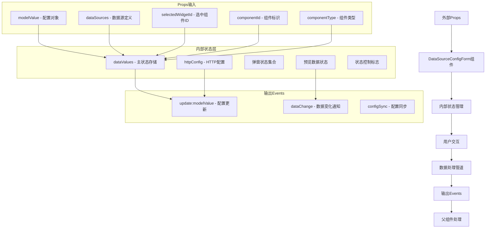

## 2. 核心数据流程详解

### 2.1 初始化流程
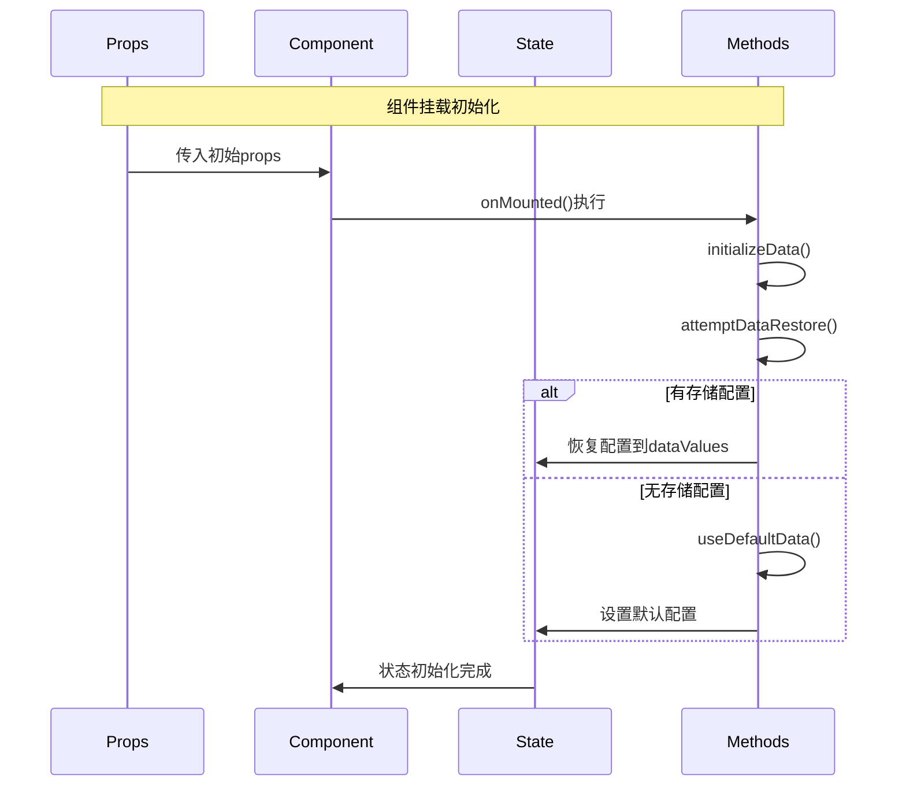

### 2.2 配置同步流程
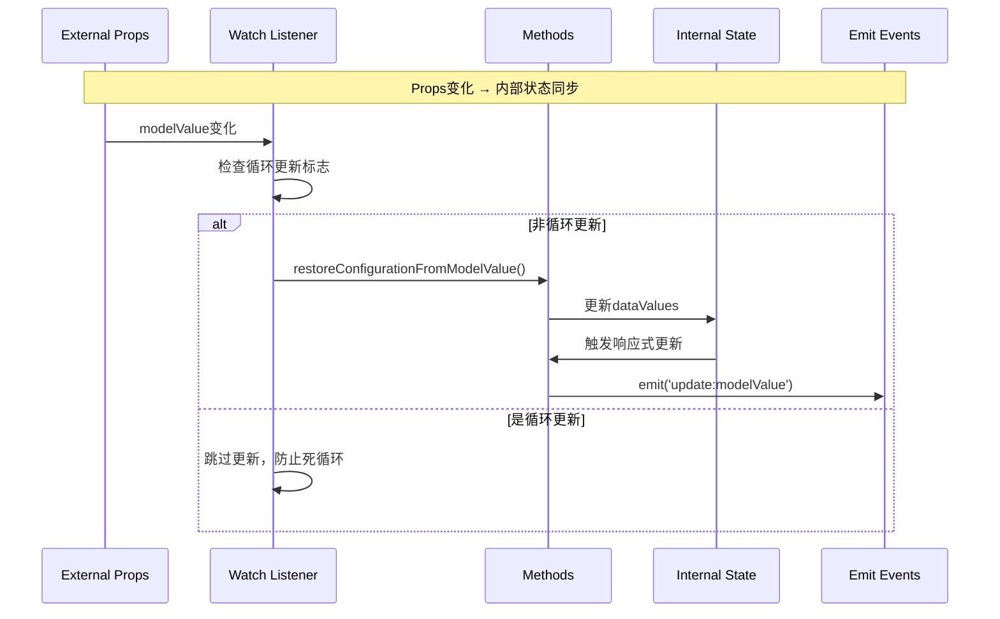

### 2.3 用户操作流程
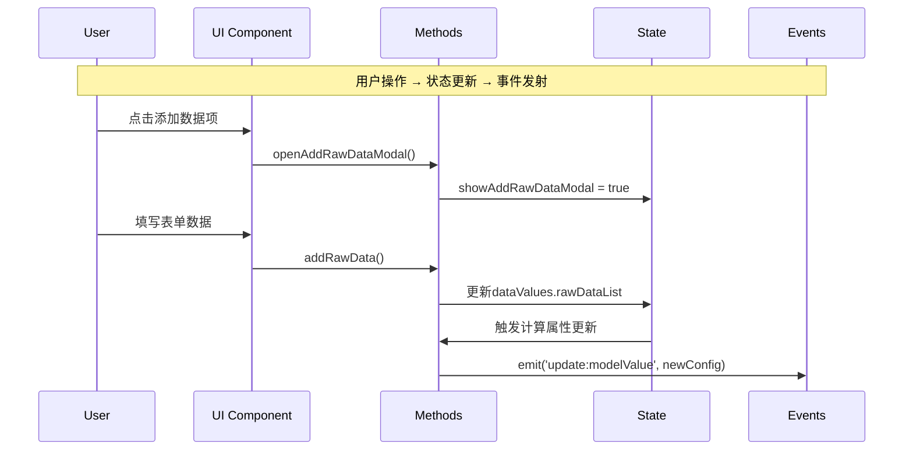

## 3. 数据处理管道详解

### 3.1 原始数据处理流程
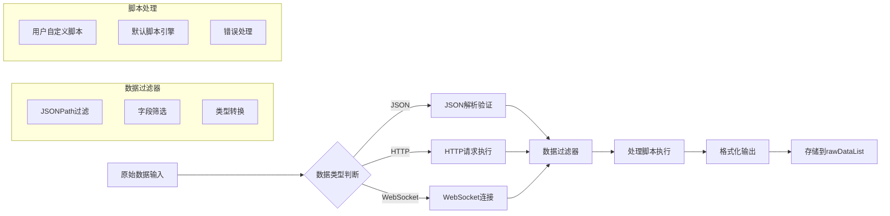

### 3.2 最终数据合并流程
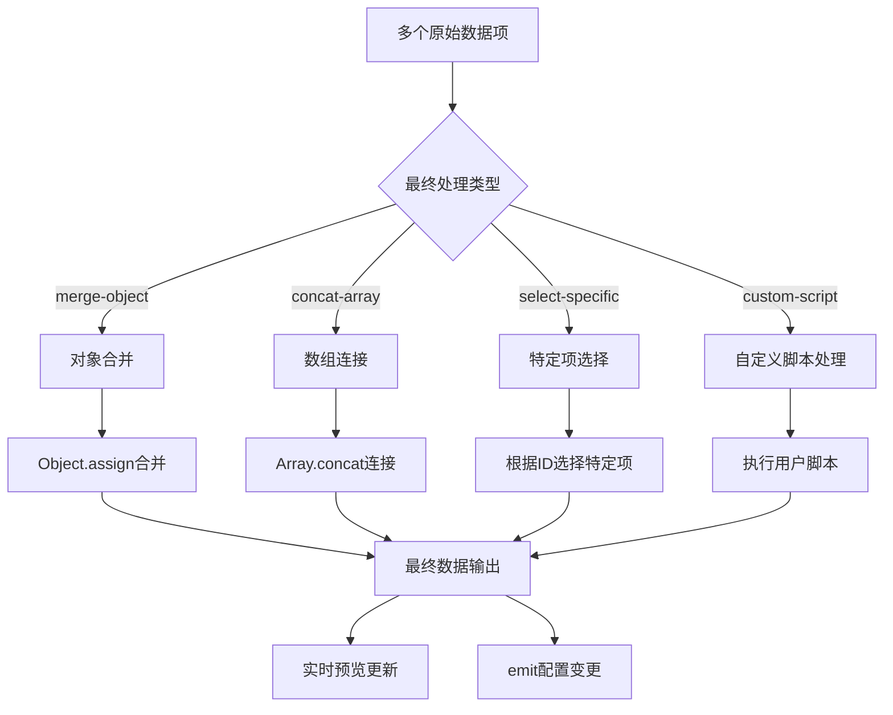

## 4. HTTP数据源特殊流程

### 4.1 HTTP请求配置流程
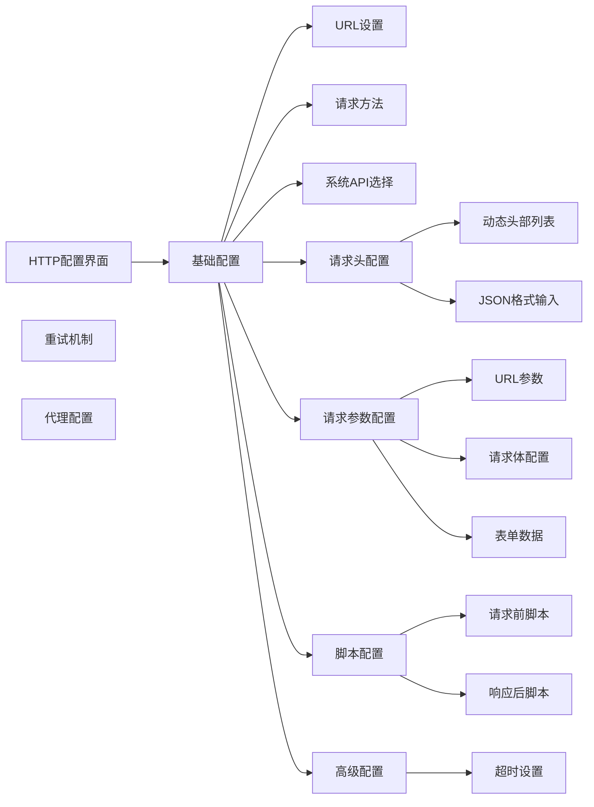

### 4.2 HTTP请求执行流程
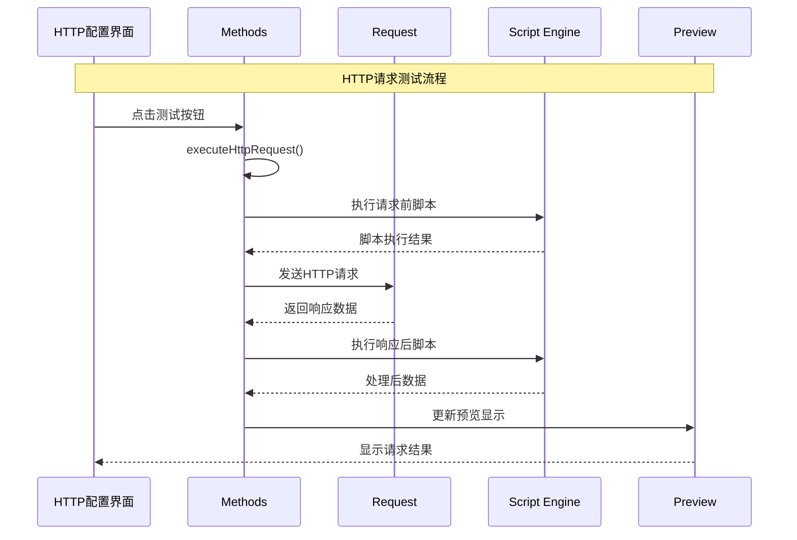

## 5. 状态管理复杂性分析

### 5.1 状态层级结构
```
dataValues: Record<string, DataSourceValue>
├── [dataSourceKey]: DataSourceValue
    ├── currentData: any                    // 当前数据快照
    ├── lastUpdateTime: number             // 最后更新时间
    ├── rawDataList: RawDataItem[]         // 原始数据项列表
    │   └── [rawDataItem]
    │       ├── id: string
    │       ├── name: string
    │       ├── type: 'json' | 'http' | 'websocket'
    │       ├── content: any
    │       ├── filterPath: string
    │       └── processScript: string
    ├── finalProcessingType: FinalProcessingType
    ├── finalProcessingScript: string
    └── processingStatus: ProcessingStatus
```

### 5.2 状态同步控制机制
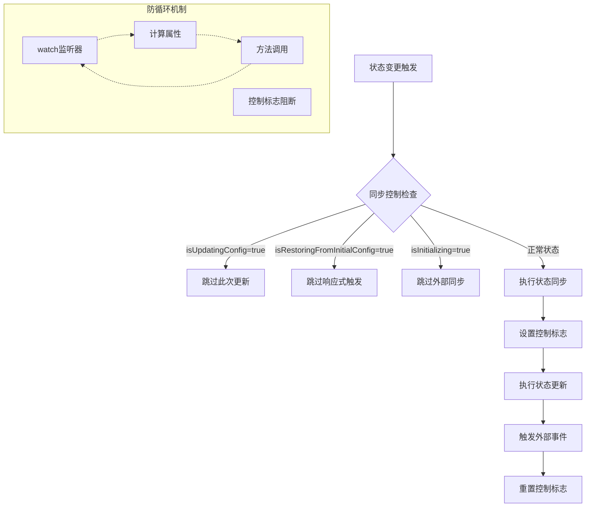

## 6. 事件流向图

### 6.1 用户交互事件流
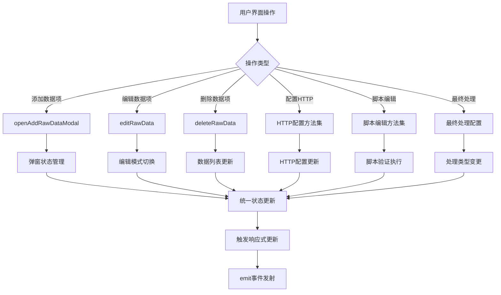

### 6.2 数据验证和错误处理流
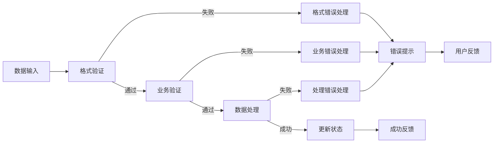

## 7. 性能影响点分析

### 7.1 响应式性能热点
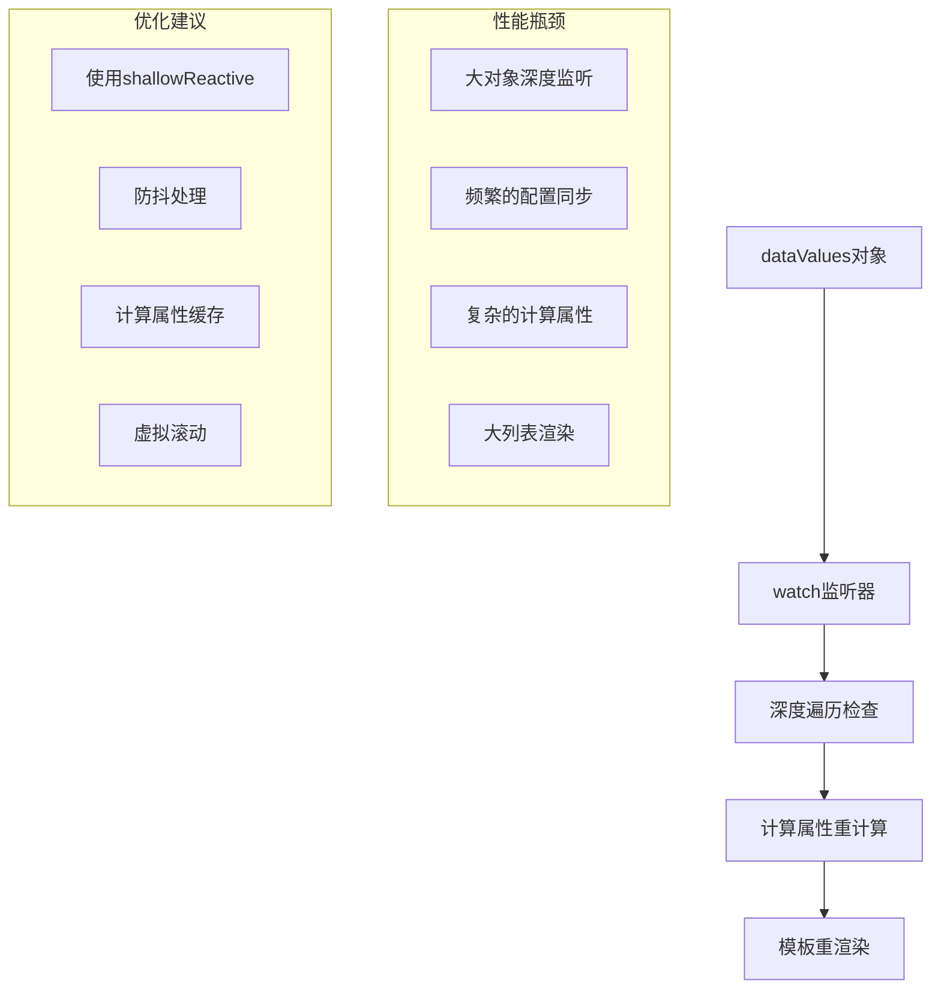

### 7.2 内存使用分析
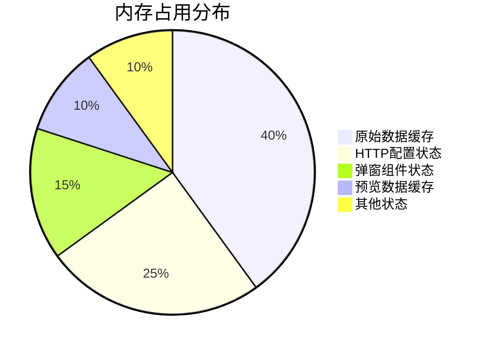

## 8. 重构数据流建议

### 8.1 状态管理重构方案
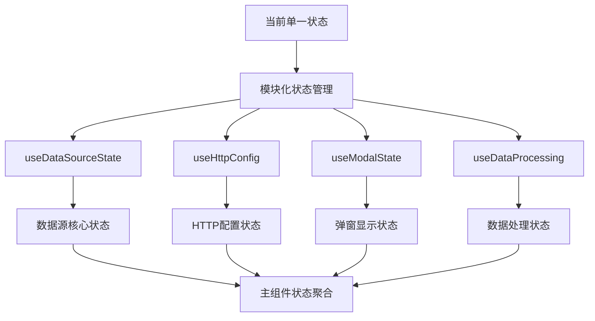

### 8.2 事件驱动架构建议
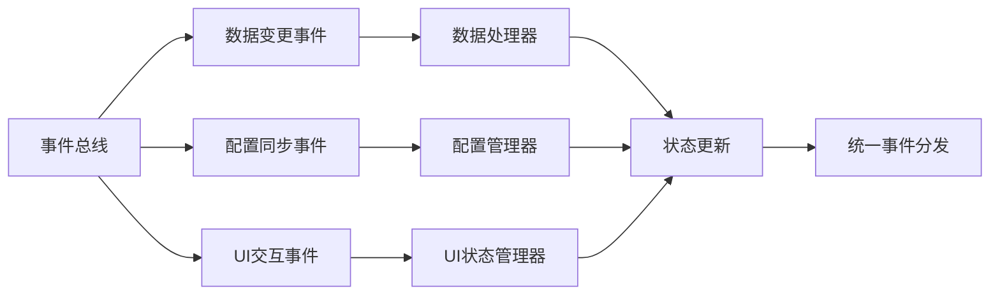

## 总结

DataSourceConfigForm的数据流呈现以下特点：

**复杂性来源**：
1. **多层次状态管理** - Props → 内部状态 → 计算属性 → Events
2. **复杂的同步机制** - 防循环更新的多重标志控制
3. **多样的数据处理管道** - JSON/HTTP/WebSocket三种不同处理流程
4. **实时的双向绑定** - v-model与内部状态的复杂映射

**优化建议**：
1. **状态管理模块化** - 按功能拆分为独立的composables
2. **简化同步逻辑** - 使用事件驱动替代复杂的watch机制
3. **性能优化** - 使用浅层响应式和防抖处理
4. **数据流清晰化** - 建立明确的数据流向和处理管道

这个数据流分析为后续的组件重构提供了清晰的架构指导。