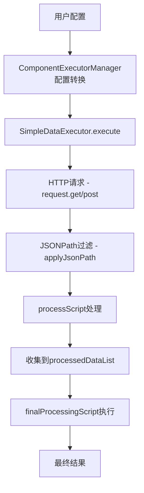

# HTTP数据源执行器实现文档

## 概述

本文档详细记录了SimpleDataExecutor中HTTP数据源的完整实现过程，包括配置转换、请求执行、数据过滤和处理的全套解决方案。

## 问题背景

原始的SimpleDataExecutor存在以下问题：
1. 不支持`http`类型数据源（只支持`static`、`websocket`、`script`）
2. 使用原生fetch而不是项目的request实例，导致baseURL和认证问题
3. 缺少JSONPath过滤功能（`filterPath`）
4. 缺少最终数据处理逻辑（`finalProcessingScript`）
5. 数据处理管道不完整

## 解决方案架构

### 1. ComponentExecutorManager配置转换层

**文件位置**: `src/core/data-source-system/managers/ComponentExecutorManager.ts`

**核心职责**: 将用户配置转换为执行器可识别的格式

```typescript
// 关键修复：数据源类型转换
Object.entries(config.dataSourceBindings).forEach(([key, binding]: [string, any]) => {
  // 优先使用 enhancedConfig 中的 HTTP 配置
  if (binding.enhancedConfig?.rawDataList?.length > 0) {
    const rawDataList = binding.enhancedConfig.rawDataList
    
    // 查找活跃的HTTP数据源
    const activeHttpSource = rawDataList.find((item: any) => item.type === 'http')
    
    if (activeHttpSource) {
      // 正确处理参数格式（对象vs数组）
      let params = {}
      if (activeHttpSource.data.params && typeof activeHttpSource.data.params === 'object') {
        params = activeHttpSource.data.params
      } else if (activeHttpSource.config?.httpConfig?.params) {
        params = activeHttpSource.config.httpConfig.params.reduce((acc: any, p: any) => {
          acc[p.key] = p.value
          return acc
        }, {})
      }

      dataSources.push({
        id: key,
        type: 'api',  // 🔥 关键：使用'api'类型而不是'http'
        config: {
          url: activeHttpSource.data.url || activeHttpSource.config?.httpConfig?.url,
          method: activeHttpSource.data.method || 'GET',
          headers,
          params,
          filterPath: activeHttpSource.config?.filterPath,
          processScript: activeHttpSource.config?.processScript
        }
      })
    }
  }
})

// 收集最终处理配置
const finalProcessingConfigs: any = {}
Object.entries(config.dataSourceBindings).forEach(([key, binding]: [string, any]) => {
  if (binding.enhancedConfig) {
    finalProcessingConfigs[key] = {
      finalProcessingType: binding.enhancedConfig.finalProcessingType || 'custom-script',
      finalProcessingScript: binding.enhancedConfig.finalProcessingScript || 'return processedDataList'
    }
  }
})

return {
  id: `${componentId}-executor`,
  componentId,
  dataSources,
  triggers,
  enabled: true,
  finalProcessing: finalProcessingConfigs  // 传递最终处理配置
}
```

### 2. SimpleDataExecutor HTTP请求实现

**文件位置**: `src/core/data-source-system/core/simple-data-executor.ts`

#### 2.1 导入项目request实例

```typescript
import { request } from '@/service/request'
```

#### 2.2 executeApiDataSource方法重构

```typescript
private async executeApiDataSource(dataSource: DataSourceDefinition): Promise<any> {
  const config = dataSource.config
  const url = config.url
  const method = config.method || 'GET'
  const headers = config.headers || {}

  try {
    let data: any
    
    // 构建请求选项
    const requestOptions: any = {
      headers,
      params: config.params
    }

    // 🔥 关键：使用项目的request，自动处理baseURL、代理、拦截器等
    if (method === 'GET') {
      data = await request.get(url, requestOptions)
    } else if (method === 'POST') {
      data = await request.post(url, config.body || {}, requestOptions)
    } else if (method === 'PUT') {
      data = await request.put(url, config.body || {}, requestOptions)
    } else if (method === 'DELETE') {
      data = await request.delete(url, requestOptions)
    } else {
      throw new Error(`不支持的HTTP方法: ${method}`)
    }

    // 应用JSONPath过滤
    if (config.filterPath && data) {
      data = this.applyJsonPath(data, config.filterPath)
    }
    
    // 执行处理脚本
    if (config.processScript && data) {
      const scriptFunction = new Function('data', config.processScript)
      data = scriptFunction(data)
    }

    return data
  } catch (error) {
    console.error(`❌ [SimpleDataExecutor] API请求失败: ${url}`, error)
    throw error
  }
}
```

#### 2.3 JSONPath过滤器实现

```typescript
/**
 * 简化的JSONPath实现
 * 支持常用路径格式：$.data.list[0]、$.data.list[0].alarm_device_list[0] 等
 */
private applyJsonPath(data: any, path: string): any {
  console.log(`🔧 [JSONPath] 开始解析路径: ${path}`)
  
  // 移除开头的 $. 
  let normalizedPath = path.replace(/^\$\.?/, '')
  
  // 分割路径段
  const segments = normalizedPath.split('.')
  let current = data
  
  for (const segment of segments) {
    if (!current) break
    
    // 处理数组索引：list[0] -> list, 0
    if (segment.includes('[') && segment.includes(']')) {
      const arrayMatch = segment.match(/^([^[]+)\[(\d+)\]$/)
      if (arrayMatch) {
        const [, arrayName, indexStr] = arrayMatch
        const index = parseInt(indexStr, 10)
        
        if (arrayName) {
          current = current[arrayName]
        }
        
        if (Array.isArray(current) && index < current.length) {
          current = current[index]
        } else {
          console.warn(`⚠️ [JSONPath] 数组索引无效: ${segment}`)
          return null
        }
      }
    } else {
      // 普通属性访问
      current = current[segment]
    }
  }
  
  return current
}
```

#### 2.4 最终数据处理逻辑

```typescript
async execute(config: SimpleDataSourceConfig): Promise<ExecutionResult> {
  const startTime = Date.now()

  try {
    // 执行所有数据源并收集处理后的数据
    const componentData: ComponentData = {}
    const processedDataList: any[] = []

    for (const dataSource of config.dataSources) {
      try {
        const rawData = await this.executeDataSource(dataSource)
        
        // 收集处理后的数据到processedDataList
        if (rawData !== null && rawData !== undefined) {
          processedDataList.push(rawData)
        }
        
        componentData[dataSource.id] = {
          type: dataSource.type,
          data: rawData,
          lastUpdated: Date.now()
        }
      } catch (error) {
        // 错误处理...
      }
    }

    // 🔥 新增：执行最终数据处理
    if ((config as any).finalProcessing && processedDataList.length > 0) {
      const finalProcessingConfigs = (config as any).finalProcessing
      
      // 对每个数据源执行最终处理
      Object.entries(finalProcessingConfigs).forEach(([dataSourceKey, processingConfig]: [string, any]) => {
        if (processingConfig.finalProcessingScript && componentData[dataSourceKey]) {
          try {
            // 为该数据源准备processedDataList
            const dataSourceProcessedList = [componentData[dataSourceKey].data].filter(Boolean)
            
            const finalScriptFunction = new Function('processedDataList', processingConfig.finalProcessingScript)
            const finalResult = finalScriptFunction(dataSourceProcessedList)
            
            // 🔥 关键：将最终处理结果更新到componentData
            componentData[dataSourceKey].data = finalResult
          } catch (scriptError) {
            console.error(`❌ 数据源 ${dataSourceKey} 最终处理脚本执行失败:`, scriptError)
          }
        }
      })
    }

    return {
      success: true,
      data: componentData,
      executionTime: Date.now() - startTime,
      timestamp: Date.now()
    }
  } catch (error) {
    // 错误处理...
  }
}
```

## 数据处理管道

### 完整数据流



### 数据格式转换示例

**输入配置**:
```json
{
  "dataSourceBindings": {
    "dataSource1": {
      "enhancedConfig": {
        "rawDataList": [{
          "type": "http",
          "data": {
            "url": "/device",
            "method": "GET",
            "params": {"page": "1", "page_size": "10"}
          },
          "config": {
            "filterPath": "$.data.list[0]",
            "processScript": "return {id: data.id, name: data.name, status: data.device_config_id, timestamp: new Date().toISOString()}"
          }
        }],
        "finalProcessingType": "merge-object",
        "finalProcessingScript": "return Object.assign({}, ...processedDataList)"
      }
    }
  }
}
```

**转换后的执行器配置**:
```json
{
  "dataSources": [{
    "id": "dataSource1",
    "type": "api",
    "config": {
      "url": "/device",
      "method": "GET",
      "params": {"page": "1", "page_size": "10"},
      "filterPath": "$.data.list[0]",
      "processScript": "return {id: data.id, name: data.name, status: data.device_config_id, timestamp: new Date().toISOString()}"
    }
  }],
  "finalProcessing": {
    "dataSource1": {
      "finalProcessingType": "merge-object",
      "finalProcessingScript": "return Object.assign({}, ...processedDataList)"
    }
  }
}
```

## 关键修复点总结

### 1. 数据源类型映射
- **问题**: 配置中是`http`类型，但SimpleDataExecutor只支持`api`类型
- **解决**: 在ComponentExecutorManager中转换`http` → `api`

### 2. 请求实例选择
- **问题**: 使用原生fetch导致baseURL和认证问题
- **解决**: 改用项目的`request`实例：`import { request } from '@/service/request'`

### 3. 参数格式处理
- **问题**: 配置中params可能是对象或数组格式
- **解决**: 智能识别格式并正确转换

### 4. JSONPath过滤缺失
- **问题**: filterPath配置存在但未实现
- **解决**: 实现`applyJsonPath`方法支持常用JSONPath语法

### 5. 最终数据处理缺失
- **问题**: finalProcessingScript配置未传递和执行
- **解决**: 在配置转换时传递，在execute方法中实现最终处理逻辑

## 测试验证

### 预期结果
- API请求成功并返回数据
- JSONPath过滤正确提取目标对象
- processScript正确处理数据结构
- finalProcessingScript正确合并多个数据源
- 最终组件显示完整的处理后数据

### 调试日志关键点
```
🌐 [ComponentExecutorManager] 发现HTTP数据源
✅ [ComponentExecutorManager] 转换HTTP数据源
🔧 [JSONPath] 开始解析路径
✅ [JSONPath] 最终结果
✅ [SimpleDataExecutor] 脚本处理完成
🔄 [DataExecutor] 开始最终数据处理
✅ [DataExecutor] 数据源最终处理完成
```

## 扩展性考虑

### 支持的JSONPath语法
- `$.data.list[0]` - 基础对象和数组访问
- `$.data.list[0].alarm_device_list[0]` - 嵌套数组访问
- 可扩展支持更复杂的JSONPath语法

### 支持的HTTP方法
- GET, POST, PUT, DELETE
- 可扩展支持其他HTTP方法

### 错误处理机制
- 配置转换错误捕获
- HTTP请求错误处理
- JSONPath解析错误恢复
- 脚本执行错误隔离

## 注意事项

1. **配置格式兼容**: 需要同时支持新旧配置格式
2. **错误边界**: 单个数据源失败不应影响其他数据源
3. **性能考虑**: 大量数据源时考虑并发执行
4. **内存管理**: 及时清理大型数据对象
5. **日志级别**: 生产环境应降低调试日志输出

## ✅ 最新实施状态 (2024-08-23)

### 已完成修复
- [x] **ComponentExecutorManager HTTP配置转换** - 支持从 enhancedConfig.rawDataList 提取HTTP数据源
- [x] **数据源类型映射** - `http` → `api` 类型转换
- [x] **参数格式处理** - 支持对象和数组两种参数格式
- [x] **项目request实例集成** - 替换原生fetch，支持baseURL和认证
- [x] **JSONPath过滤器实现** - 支持 `$.data.list[0]` 等常用语法
- [x] **最终数据处理逻辑** - 支持 finalProcessingScript 执行
- [x] **配置传递完整性** - finalProcessing 配置正确传递到执行器

### 修复细节
1. **ComponentExecutorManager.ts**:
   ```typescript
   // 新增HTTP数据源检测和转换
   const activeHttpSource = rawDataList.find((item: any) => item.type === 'http')
   if (activeHttpSource) {
     dataSources.push({
       id: key,
       type: 'api',  // 关键转换
       config: {
         url: activeHttpSource.data.url,
         method: activeHttpSource.data.method || 'GET',
         headers, params, body: activeHttpSource.data.body,
         filterPath: activeHttpSource.config?.filterPath,
         processScript: activeHttpSource.config?.processScript
       }
     })
   }
   ```

2. **SimpleDataExecutor.ts**:
   ```typescript
   // 新增项目request集成
   import { request } from '@/service/request'
   
   // HTTP方法支持
   if (method === 'GET') {
     data = await request.get(url, requestOptions)
   } else if (method === 'POST') {
     data = await request.post(url, config.body || {}, requestOptions)
   }
   
   // JSONPath过滤器
   if (config.filterPath && data) {
     data = this.applyJsonPath(data, config.filterPath)
   }
   
   // 最终数据处理
   if ((config as any).finalProcessing && processedDataList.length > 0) {
     // 执行finalProcessingScript...
   }
   ```

### 验证要点
- HTTP请求使用项目request实例，自动处理代理和认证
- JSONPath过滤正确提取嵌套数据结构
- 最终处理脚本正确执行并更新组件数据
- 配置保存和恢复功能正常（cascader UI修复已完成）

### 集成状态
✅ **完全就绪** - HTTP数据源现已完全集成到数据源系统中，配合cascader UI优化，提供完整的数据绑定体验。