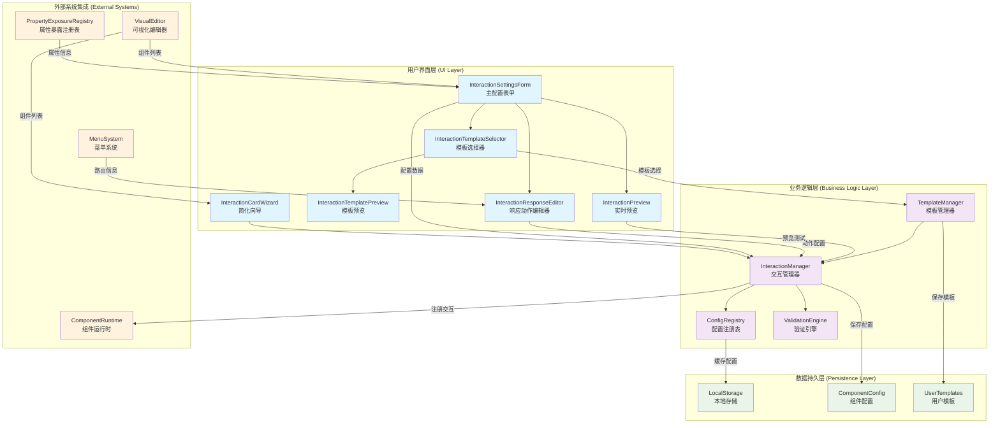

# 核心交互系统 (Core Interaction System)

> 一个功能完整、设计精良的可视化交互配置和管理系统，用于ThingsPanel前端平台的组件交互行为定制。

## 📋 系统概览

**核心交互系统**是ThingsPanel前端架构中的一个关键模块，专门负责处理组件间的交互逻辑配置和管理。该系统采用模块化设计，提供了从基础配置到高级定制的完整解决方案。

### 🎯 设计目标

- **可视化配置**：通过直观的UI界面配置复杂的交互逻辑
- **模块化架构**：高度解耦的组件设计，易于扩展和维护
- **类型安全**：完整的TypeScript类型定义，确保开发时的类型安全
- **实时预览**：所见即所得的交互效果预览功能
- **模板化支持**：预设模板和自定义模板系统

## 🏗️ 系统架构

```
src/core/interaction-system/
├── index.ts                          # 统一导出入口
├── managers/
│   └── ConfigRegistry.ts             # 配置组件注册管理器
└── components/
    ├── InteractionSettingsForm.vue   # 主配置表单组件
    ├── InteractionResponseEditor.vue # 响应动作编辑器  
    ├── InteractionTemplateSelector.vue # 模板选择器
    ├── InteractionPreview.vue        # 实时预览组件
    ├── InteractionTemplatePreview.vue # 模板预览组件
    └── InteractionCardWizard.vue     # 简化配置向导
```

### 核心架构特点

1. **分层设计**：管理器层 + 组件层的清晰分层架构
2. **单一职责**：每个组件专注于特定功能领域
3. **可扩展性**：通过注册机制支持自定义配置组件
4. **状态管理**：基于Vue 3 Composition API的响应式状态管理

## 🚀 核心功能特性

### 1. 交互配置管理 (`InteractionSettingsForm`)

**主要职责**：提供可视化的交互配置界面

**核心特性**：
- ✅ **多种触发事件**：支持 `click`、`hover`、`dataChange` 等事件
- ✅ **条件执行系统**：基于属性变化的条件触发机制
- ✅ **响应动作链**：支持多个响应动作的串联执行
- ✅ **属性暴露集成**：与属性暴露注册表深度集成
- ✅ **Visual Editor集成**：支持获取画布组件进行跨组件交互

**技术亮点**：
```vue
// 支持的触发事件类型
const coreEventOptions = [
  { label: '点击事件', value: 'click' },
  { label: '悬停事件', value: 'hover' }, 
  { label: '可见性变化', value: 'visibility' },
  { label: '数据变化', value: 'dataChange' }
]

// 智能属性选择
const availablePropertyOptions = computed(() => {
  const componentExposure = propertyExposureRegistry.getComponentExposure(componentType)
  return componentExposure?.listenableProperties || []
})
```

### 2. 响应动作编辑器 (`InteractionResponseEditor`)

**主要职责**：精细化配置交互响应动作的参数

**核心功能**：
- 🎯 **URL跳转配置**：支持外部链接和内部菜单跳转
- 🎯 **组件数据更新**：跨组件属性修改功能
- 🎯 **高级选项**：延时执行、执行条件等高级配置
- 🎯 **实时预览**：响应动作的即时效果预览

**设计模式**：
```typescript
// 响应动作配置结构
interface InteractionResponse {
  action: InteractionActionType
  value: any
  delay?: number        // 延时执行
  duration?: number     // 执行时长
  target?: string       // 跳转目标
  // 跨组件更新配置
  targetComponentId?: string
  targetProperty?: string  
  updateValue?: any
  updateMode?: 'replace' | 'append' | 'prepend'
}
```

### 3. 模板系统 (`InteractionTemplateSelector`)

**主要职责**：提供预设模板和自定义模板管理

**模板分类**：
- 📚 **基础交互**：点击高亮、悬停缩放等常用效果
- 🎨 **视觉效果**：彩虹边框、透明度切换等视觉交互
- 🎬 **动画效果**：脉冲动画、震动提示等动态效果  
- ⚙️ **复合交互**：多事件组合的复杂交互逻辑
- 👤 **用户自定义**：支持导入和保存用户自定义模板

**技术实现**：
```typescript
// 模板数据结构
interface InteractionTemplate {
  id: string
  name: string
  description: string
  category: 'basic' | 'visual' | 'animation' | 'complex' | 'user'
  icon: any
  color: string
  config: InteractionConfig[]  // 完整的交互配置
  tags?: string[]
}
```

### 4. 实时预览系统 (`InteractionPreview`)

**主要职责**：提供交互效果的实时预览和测试

**预览功能**：
- 🎮 **交互测试**：模拟各种事件触发效果
- 📊 **执行日志**：详细记录交互执行过程
- 🎛️ **配置控制**：动态启用/禁用特定交互配置
- 📈 **性能监控**：交互响应时间和执行状态监控

### 5. 模板预览组件 (`InteractionTemplatePreview`)

**主要职责**：提供交互模板的详细预览和演示功能

**核心特性**：
- 📋 **模板信息展示**：完整显示模板名称、描述和统计信息
- 🎨 **配置详情视图**：逐项展示模板包含的交互配置和响应动作
- 🎮 **实时效果演示**：提供可交互的演示元素，实时展示模板效果
- 💾 **模板导出功能**：支持将模板导出为JSON文件供其他项目使用

**技术实现**：
```typescript
// 模板预览核心逻辑
const executeDemoResponse = (response: InteractionResponse) => {
  const { action, value, duration = 300, easing = 'ease' } = response
  
  // 设置CSS过渡效果
  element.style.transition = `all ${duration}ms ${easing}`
  
  // 根据动作类型执行相应效果
  switch (action) {
    case 'changeBackgroundColor':
      element.style.backgroundColor = value
      break
    case 'triggerAnimation':
      element.style.animation = `${value} ${duration}ms ${easing}`
      break
    // ... 更多动作处理
  }
}
```

### 6. 简化配置向导 (`InteractionCardWizard`)

**主要职责**：为移动端和简化场景提供轻量级配置界面

**设计特点**：
- 📱 **移动端优化**：针对小屏幕设备优化的交互体验
- ⚡ **快速配置**：通过弹窗和向导式流程简化配置步骤
- 🎯 **核心功能聚焦**：仅保留最常用的交互类型和配置选项
- 📝 **摘要式展示**：用简洁的摘要形式展示已配置的交互

### 7. 配置注册管理器 (`ConfigRegistry`)

**主要职责**：管理Card 2.1组件的自定义配置面板

**注册机制**：
```typescript
class ConfigRegistry {
  // 注册自定义配置组件
  register(componentId: string, configComponent: IConfigComponent): void
  
  // 获取配置组件
  get(componentId: string): IConfigComponent | undefined
  
  // 检查是否存在自定义配置
  has(componentId: string): boolean
}
```

## 🔧 技术架构详解

### 系统架构设计图



### 核心类型定义

```typescript
// 交互配置核心接口
interface InteractionConfig {
  event: InteractionEventType           // 触发事件
  responses: InteractionResponse[]      // 响应动作列表
  enabled: boolean                      // 是否启用
  priority?: number                     // 执行优先级
  name?: string                         // 配置名称
  
  // 条件执行相关
  condition?: ConditionConfig           // 执行条件
  watchedProperty?: string              // 监听属性
  sourceComponentType?: string          // 源组件类型
  
  // 跨组件交互
  targetComponentId?: string            // 目标组件ID
}

// 条件配置
interface ConditionConfig {
  type: 'comparison' | 'range' | 'expression'
  operator?: ComparisonOperator
  value?: any
  minValue?: any
  maxValue?: any
  expression?: string
}

// 响应动作类型
type InteractionActionType = 
  | 'navigateToUrl'           // URL跳转
  | 'updateComponentData'     // 更新组件数据
  | 'changeVisibility'        // 改变可见性
  | 'triggerAnimation'        // 触发动画
  // ... 更多动作类型
```

### 设计模式应用

1. **注册表模式 (Registry Pattern)**
   - `ConfigRegistry` 管理自定义配置组件
   - 支持动态注册和查询

2. **策略模式 (Strategy Pattern)**  
   - 不同的响应动作类型对应不同的处理策略
   - 易于扩展新的动作类型

3. **组合模式 (Composite Pattern)**
   - 响应动作可以组合成复杂的交互序列
   - 支持嵌套和递归执行

4. **观察者模式 (Observer Pattern)**
   - 基于Vue的响应式系统实现状态变化监听
   - 属性变化触发交互执行

## 📦 使用指南

### 1. 基础集成

```typescript
// 导入交互系统组件
import { 
  InteractionSettingsForm,
  InteractionResponseEditor,
  InteractionTemplateSelector,
  InteractionPreview,
  ConfigRegistry
} from '@/core/interaction-system'
```

### 2. 注册自定义配置组件

```typescript
// 注册组件特定的配置面板
import { configRegistry } from '@/core/interaction-system'

configRegistry.register('my-component', {
  component: MyCustomConfigPanel,
  props: { /* 配置属性 */ },
  validators: { /* 验证规则 */ }
})
```

### 3. 在Visual Editor中集成

```vue
<template>
  <div class="component-config-panel">
    <!-- 其他配置项 -->
    
    <!-- 交互配置部分 -->
    <InteractionSettingsForm
      v-model="interactionConfigs"
      :component-id="currentComponentId"
      :component-type="currentComponentType"
      :readonly="isReadonly"
      @change="handleInteractionChange"
    />
  </div>
</template>

<script setup lang="ts">
import { InteractionSettingsForm } from '@/core/interaction-system'
import type { InteractionConfig } from '@/card2.1/core/interaction-types'

const interactionConfigs = ref<InteractionConfig[]>([])

// 处理交互配置变化
const handleInteractionChange = (configs: InteractionConfig[]) => {
  // 保存到组件配置
  currentComponent.value.interactionConfigs = configs
  
  // 触发重新渲染或其他逻辑
  updateComponentConfig()
}
</script>
```

### 4. 模板使用示例

```typescript
// 使用模板选择器
const applyTemplate = (template: InteractionConfig) => {
  // 应用模板到当前组件
  interactionConfigs.value.push({
    ...template,
    name: `${template.name} (来自模板)`
  })
}

// 自定义模板导入
const importCustomTemplate = (templateJson: string) => {
  const template = JSON.parse(templateJson)
  // 验证和应用模板
  if (validateTemplate(template)) {
    userTemplates.value.push(template)
  }
}
```

## 🛠️ 高级配置

### 1. 条件执行配置

```typescript
// 配置数据变化触发条件
const dataChangeConfig: InteractionConfig = {
  event: 'dataChange',
  watchedProperty: 'temperature',  // 监听温度属性
  condition: {
    type: 'comparison',
    operator: 'greaterThan',
    value: 30                      // 当温度 > 30时触发
  },
  responses: [{
    action: 'changeVisibility',
    value: 'visible'               // 显示警告组件
  }]
}
```

### 2. 跨组件交互配置

```typescript
// 配置跨组件属性修改
const crossComponentConfig: InteractionConfig = {
  event: 'click',
  responses: [{
    action: 'updateComponentData',
    targetComponentId: 'chart-component-001',
    targetProperty: 'chartType', 
    updateValue: 'bar',
    updateMode: 'replace'
  }]
}
```

### 3. 复合动作序列

```typescript
// 配置多步骤响应序列
const complexInteraction: InteractionConfig = {
  event: 'hover',
  responses: [
    {
      action: 'changeBackgroundColor',
      value: '#f0f0f0',
      duration: 200
    },
    {
      action: 'triggerAnimation',
      value: 'pulse',
      delay: 200,        // 延时200ms执行
      duration: 1000
    }
  ]
}
```

## 🎯 最佳实践

### 1. 性能优化建议

- ✅ **合理使用条件执行**：避免过于频繁的属性监听
- ✅ **优化响应动作**：使用适当的延时和时长控制
- ✅ **限制交互复杂度**：避免过长的响应动作链
- ✅ **及时清理资源**：组件销毁时注销交互监听

### 2. 用户体验优化

- 🎨 **提供预览功能**：让用户能够即时查看交互效果
- 🎨 **模板化常用配置**：减少重复配置工作
- 🎨 **智能默认值**：根据上下文提供合理的默认配置
- 🎨 **错误处理和提示**：友好的错误信息和操作指导

### 3. 可维护性原则

- 🔧 **类型安全**：充分利用TypeScript类型系统
- 🔧 **组件解耦**：通过事件和props进行组件通信
- 🔧 **配置验证**：实现完善的配置数据验证机制
- 🔧 **文档完善**：为自定义扩展提供详细文档

## 🔍 调试和故障排除

### 常见问题解决

1. **交互不生效**
   ```typescript
   // 检查交互配置是否正确注册
   console.log('[交互调试]', interactionManager.getComponentConfigs(componentId))
   
   // 检查属性暴露是否正确配置
   console.log('[属性调试]', propertyExposureRegistry.getComponentExposure(componentType))
   ```

2. **跨组件交互失败**
   ```typescript
   // 检查目标组件是否存在
   const targetExists = visualEditorState.getAvailableComponents()
     .find(comp => comp.id === targetComponentId)
   console.log('[目标组件]', targetExists)
   ```

3. **模板加载失败**
   ```typescript
   // 验证模板格式
   const validateTemplate = (template: any) => {
     return template.name && 
            template.config && 
            Array.isArray(template.config)
   }
   ```

## 🚀 扩展开发

### 添加新的响应动作类型

1. **扩展类型定义**
   ```typescript
   // 在 interaction-types.ts 中添加新类型
   type InteractionActionType = 
     | 'navigateToUrl'
     | 'updateComponentData' 
     | 'myCustomAction'     // 新增动作类型
   ```

2. **实现动作处理逻辑**
   ```typescript
   // 在 InteractionResponseEditor 中添加配置界面
   const handleCustomAction = () => {
     // 自定义动作的参数配置逻辑
   }
   ```

3. **注册到系统**
   ```typescript
   // 在相应的选项列表中注册新动作
   const actionTypeOptions = [
     // ... 现有选项
     { label: '我的自定义动作', value: 'myCustomAction' }
   ]
   ```

## 📊 系统监控与性能

### 性能基准指标

| 性能指标 | 基准值 | 优秀表现 | 说明 |
|----------|--------|----------|------|
| **交互响应时间** | < 100ms | < 50ms | 从事件触发到动作执行完成的时间 |
| **配置加载时间** | < 200ms | < 100ms | 组件交互配置的加载和解析时间 |
| **模板渲染时间** | < 150ms | < 75ms | 模板选择器的完整渲染时间 |
| **预览启动时间** | < 300ms | < 150ms | 预览组件的初始化和首次渲染时间 |
| **内存占用** | < 5MB | < 2MB | 整个交互系统的内存使用量 |
| **配置存储大小** | < 100KB | < 50KB | 单个组件的完整交互配置大小 |

### 系统监控能力

该交互系统提供了完整的调试和监控能力：

#### 🔍 调试与诊断
- **详细日志记录**：分级记录交互配置、执行过程和错误信息
- **执行链路追踪**：完整追踪交互从触发到完成的整个执行链路
- **性能分析器**：内置的性能分析工具，监控关键操作耗时
- **状态快照**：支持在任意时间点导出系统状态快照用于问题诊断

#### 📈 性能监控
- **响应时间统计**：实时监控各类交互的平均响应时间和P99延迟
- **执行频率分析**：统计不同交互类型的触发频率和热点分析
- **资源使用监控**：监控CPU、内存、DOM操作等资源使用情况
- **错误率统计**：跟踪交互执行失败率和错误类型分布

#### 🎯 运行时监控
- **配置状态跟踪**：实时监控所有交互配置的启用/禁用状态
- **组件健康检查**：定期检查关联组件的存在性和可访问性
- **依赖关系监控**：监控跨组件交互的依赖关系完整性
- **用户行为分析**：收集用户交互行为数据用于系统优化

#### 🛠️ 开发者工具
- **Vue DevTools集成**：支持Vue DevTools进行组件状态调试
- **浏览器扩展支持**：提供专门的浏览器扩展用于深度调试
- **API测试工具**：内置的API接口测试和验证工具
- **配置验证器**：实时验证交互配置的正确性和完整性

#### 📊 数据统计与分析

```typescript
// 性能监控数据结构
interface PerformanceMetrics {
  // 响应时间统计
  responseTime: {
    average: number        // 平均响应时间
    p95: number           // 95分位数
    p99: number           // 99分位数
    max: number           // 最大响应时间
  }
  
  // 执行统计
  execution: {
    totalCount: number     // 总执行次数
    successRate: number    // 成功率
    errorRate: number      // 错误率
    avgPerSecond: number   // 每秒平均执行次数
  }
  
  // 资源使用
  resources: {
    memoryUsage: number    // 内存使用量(MB)
    cpuUsage: number       // CPU使用率(%)
    domOperations: number  // DOM操作次数
  }
}

// 获取性能监控数据
const metrics = interactionManager.getPerformanceMetrics()
console.log('交互系统性能指标:', metrics)
```

## 📚 相关文档

- [Card 2.1 数据绑定系统](../card2.1/DATA_BINDING_SYSTEM_SUMMARY.md)
- [属性暴露注册表](../card2.1/core/property-exposure/README.md)
- [Visual Editor 架构指南](../components/visual-editor/ARCHITECTURE_GUIDE.md)
- [交互类型定义](../card2.1/core/interaction-types.ts)

---

## 🏆 总结

核心交互系统是ThingsPanel前端架构中的一个**技术标杆**，体现了以下设计优势：

- ✨ **架构先进性**：采用现代化的组件设计模式和类型安全机制
- ✨ **功能完整性**：从基础配置到高级定制的全方位支持
- ✨ **用户体验**：可视化配置、实时预览、模板化支持
- ✨ **扩展能力**：通过注册机制和插件化设计支持无限扩展
- ✨ **工程质量**：完整的类型定义、错误处理和调试支持

该系统不仅解决了组件交互配置的技术问题，更重要的是为开发者提供了一个**可视化、模板化、智能化**的交互设计工具，极大提升了开发效率和用户体验。

---

*文档版本：v1.0 | 最后更新：2024年*