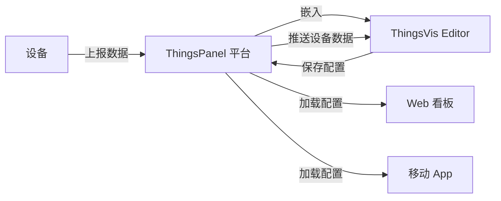

# ThingsPanel 集成测试文档

> **文档版本**: v1.0.0  
> **最后更新**: 2026-01-28  
> **目标平台**: ThingsPanel IoT Platform

本文档说明如何将 ThingsVis 可视化编辑器集成到 ThingsPanel 物联网平台，并提供完整的测试指南。

---

## 📋 目录

1. [集成概述](#集成概述)
2. [环境准备](#环境准备)
3. [物模型配置](#物模型配置)
4. [看板创建与配置](#看板创建与配置)
5. [详情图表展示](#详情图表展示)
6. [App 端集成](#app-端集成)
7. [测试验证](#测试验证)
8. [API 参考](#api-参考)

---

## 集成概述

### 架构说明

ThingsVis 提供嵌入式集成模式，可以作为 iframe 嵌入到 ThingsPanel 平台中。集成支持两种级别：

- **Full Integration（完整集成）**: 提供完整的编辑器 UI，包括组件库、属性面板、工具栏等
- **Minimal Integration（最小集成）**: 仅提供画布区域，所有 UI 控制由宿主平台提供

### 核心功能

1. **平台字段绑定**: 将可视化组件绑定到 ThingsPanel 的设备属性、遥测数据
2. **实时数据推送**: 通过 PostMessage 接收平台推送的实时设备数据
3. **保存到宿主**: 可视化配置可以保存回 ThingsPanel 数据库
4. **跨端展示**: 支持 Web 看板和移动端 App

### 数据流向



---

## 环境准备

### 1. 启动 ThingsVis Studio

```bash
# 进入项目根目录
cd thingsvis

# 安装依赖 (首次运行)
pnpm install

# 启动 Studio 编辑器
pnpm dev --filter ./apps/studio
```

Studio 将在 `http://localhost:3000` 启动。

### 2. 启动 Vue Host 测试环境

Vue Host 是一个模拟 ThingsPanel 平台的测试应用：

```bash
# 在新终端中启动
pnpm dev --filter ./apps/vue-host
```

Vue Host 将在 `http://localhost:5173` 启动（或终端显示的端口）。

### 3. 验证环境

打开浏览器访问 `http://localhost:5173`，你应该看到：

- 左侧控制面板：用于配置集成参数
- 右侧 iframe：嵌入的 ThingsVis 编辑器

---

## 物模型配置

### 步骤 1: 定义物模型字段

在 ThingsPanel 中创建物模型，定义设备的属性和遥测字段。示例物模型：

| 字段 ID | 字段名称 | 数据类型 | 字段类型 | 单位 | 说明 |
|---------|----------|----------|----------|------|------|
| `temp` | 温度 | number | telemetry | °C | 设备当前温度 |
| `humi` | 湿度 | number | telemetry | % | 环境湿度 |
| `status` | 运行状态 | string | attribute | - | 设备运行状态 |
| `power` | 功率 | number | telemetry | W | 设备功率 |

### 步骤 2: 在 Vue Host 中配置平台字段

打开 Vue Host 测试页面，在左侧面板的 **Platform Fields** 部分：

1. ✅ 勾选 **Enable Platform Fields**
2. 查看预配置的字段列表（与上述物模型对应）
3. 字段会自动传递给嵌入的编辑器

### 步骤 3: 测试字段传递

编辑器 URL 中会包含平台字段配置：

```
http://localhost:3000/main#/editor?
  mode=embedded
  &integration=full
  &platformFields=[{"id":"temp","name":"温度",...}]
```

### 代码示例：定义平台字段

在真实的 ThingsPanel 集成中，使用以下代码传递字段：

```typescript
// ThingsPanel 后端代码示例
interface PlatformField {
  id: string;           // 字段唯一标识
  name: string;         // 显示名称
  type: 'number' | 'string' | 'boolean' | 'json';
  dataType: 'attribute' | 'telemetry' | 'command';
  unit?: string;        // 单位（可选）
  description?: string; // 描述（可选）
}

const deviceFields: PlatformField[] = [
  {
    id: 'temp',
    name: '温度',
    type: 'number',
    dataType: 'telemetry',
    unit: '°C',
    description: '设备当前温度'
  },
  // ... 其他字段
];

// 将字段序列化为 JSON 并传递给编辑器
const fieldsParam = encodeURIComponent(JSON.stringify(deviceFields));
const editorUrl = `${studioBaseUrl}#/editor?platformFields=${fieldsParam}`;
```

---

## 看板创建与配置

### 步骤 1: 创建可视化看板

在 Vue Host 测试环境中：

1. 在 ThingsVis 编辑器（右侧 iframe）中，从左侧组件库拖拽组件到画布
2. 推荐组件：
   - **Basic/Text**: 显示设备名称、状态文本
   - **Chart/LineChart**: 显示温湿度趋势（需先创建图表插件）
   - **Custom/Gauge**: 显示实时数值（仪表盘）

### 步骤 2: 绑定平台字段

选中画布上的组件，在右侧属性面板：

1. 找到 **Data Binding（数据绑定）** 部分
2. 点击 **Field Picker**
3. 选择 **Platform Fields** 标签页
4. 选择要绑定的字段（如 `temp - 温度`）
5. 点击确认


### 步骤 3: 配置保存目标

在 Vue Host 左侧面板：

1. 找到 **Save Target** 下拉菜单
2. 选择保存目标：
   - **ThingsVis**: 保存到 ThingsVis 自己的数据库（用于测试）
   - **ThingsPanel (Host)**: 保存到宿主平台（真实场景）

### 步骤 4: 保存看板配置

方式一：通过编辑器保存

- 在编辑器顶部工具栏点击 **保存** 按钮
- 如果 `saveTarget=host`，配置会通过 PostMessage 发送给宿主

方式二：通过宿主触发保存

- 在 Vue Host 点击 **💾 Trigger Save** 按钮
- 查看 **Host Log** 日志，确认收到保存数据

### 保存数据格式

ThingsPanel 后端会收到以下格式的配置数据：

```json
{
  "type": "thingsvis:requestSave",
  "requestId": "req_1234567890",
  "payload": {
    "meta": {
      "version": "1.0.0",
      "id": "project-xxx",
      "name": "设备监控看板",
      "createdAt": 1706428800000,
      "updatedAt": 1706428800000
    },
    "canvas": {
      "mode": "infinite",
      "width": 1920,
      "height": 1080,
      "background": "#1e1e2e",
      "gridEnabled": true
    },
    "nodes": [
      {
        "id": "node-1",
        "type": "basic/text",
        "position": { "x": 100, "y": 100 },
        "size": { "width": 200, "height": 50 },
        "props": {
          "text": "温度监控",
          "fontSize": 24,
          "fieldBinding": {
            "sourceType": "platform",
            "fieldId": "temp"
          }
        }
      }
    ],
    "dataSources": [],
    "dataBindings": [
      {
        "nodeId": "node-1",
        "propPath": "text",
        "sourceType": "platform",
        "fieldId": "temp"
      }
    ]
  }
}
```

### ThingsPanel 后端处理

```typescript
// 监听来自 ThingsVis 的保存请求
window.addEventListener('message', (event) => {
  if (event.data?.type === 'thingsvis:requestSave') {
    const { requestId, payload } = event.data;
    
    // 保存到数据库
    await saveVisualizationTemplate({
      deviceId: currentDeviceId,
      templateData: JSON.stringify(payload),
      name: payload.meta.name,
      updatedAt: new Date()
    });
    
    // 返回成功响应
    iframeWindow.postMessage({
      type: 'thingsvis:saveResponse',
      requestId: requestId,
      payload: {
        success: true,
        data: { templateId: 'tpl_xxx' }
      }
    }, '*');
  }
});
```

---

## 详情图表展示

### Web 看板展示

#### 步骤 1: 加载配置

从 ThingsPanel 数据库加载保存的可视化配置：

```typescript
// ThingsPanel 前端代码
const template = await fetchVisualizationTemplate(deviceId);
const templateData = JSON.parse(template.templateData);

// 将配置注入到编辑器
const editorUrl = `${studioBaseUrl}#/editor?` +
  `mode=embedded&` +
  `integration=minimal&` +
  `defaultProject=${encodeBase64Url(JSON.stringify(templateData))}`;
```

#### 步骤 2: 推送实时数据

在 Vue Host 中测试数据推送：

1. 点击 **📊 Push Data Once** - 推送一次模拟数据
2. 点击 **▶️ Start Auto (5s)** - 每 5 秒自动推送数据
3. 观察画布中绑定的组件实时更新

真实场景中，ThingsPanel 接收到设备数据后推送：

```typescript
// 设备数据上报时
deviceDataSocket.on('data', (data) => {
  // 推送到嵌入的编辑器
  Object.entries(data).forEach(([fieldId, value]) => {
    iframeWindow.postMessage({
      type: 'thingsvis:platformData',
      payload: {
        fieldId: fieldId,
        value: value,
        timestamp: Date.now()
      }
    }, '*');
  });
});
```

#### 步骤 3: 配置数据刷新

```typescript
// 示例：每 3 秒推送最新设备数据
setInterval(async () => {
  const latestData = await getDeviceLatestData(deviceId);
  
  pushDataToVisualizer({
    temp: latestData.temp,
    humi: latestData.humidity,
    status: latestData.status,
    power: latestData.power
  });
}, 3000);
```

### 数据绑定验证

在 Vue Host 的 **Host Log** 中可以看到：

```
[16:01:23] 📊 Pushed: temp=25.3°C, humi=62.1%, status=正常, power=125W
```

---

## App 端集成

### Android/iOS WebView 集成

#### 步骤 1: 配置 WebView

**Android 示例：**

```kotlin
// MainActivity.kt
class DeviceDetailActivity : AppCompatActivity() {
    private lateinit var webView: WebView
    
    override fun onCreate(savedInstanceState: Bundle?) {
        super.onCreate(savedInstanceState)
        
        webView = WebView(this)
        webView.settings.apply {
            javaScriptEnabled = true
            domStorageEnabled = true
        }
        
        // 加载可视化页面
        val deviceId = intent.getStringExtra("deviceId")
        val visualUrl = "https://thingspanel.io/device/$deviceId/visual"
        webView.loadUrl(visualUrl)
        
        setContentView(webView)
    }
}
```

**iOS 示例：**

```swift
// DeviceDetailViewController.swift
import WebKit

class DeviceDetailViewController: UIViewController {
    var webView: WKWebView!
    var deviceId: String?
    
    override func viewDidLoad() {
        super.viewDidLoad()
        
        let config = WKWebViewConfiguration()
        webView = WKWebView(frame: view.bounds, configuration: config)
        
        if let deviceId = deviceId {
            let url = URL(string: "https://thingspanel.io/device/\(deviceId)/visual")!
            webView.load(URLRequest(url: url))
        }
        
        view.addSubview(webView)
    }
}
```

#### 步骤 2: 数据推送到 WebView

通过 WebView 的 JavaScript 注入推送数据：

**Android:**

```kotlin
// 推送设备数据
fun pushDeviceData(data: DeviceData) {
    val jsCode = """
        window.postMessage({
            type: 'thingsvis:platformData',
            payload: {
                fieldId: 'temp',
                value: ${data.temperature},
                timestamp: ${System.currentTimeMillis()}
            }
        }, '*');
    """.trimIndent()
    
    webView.evaluateJavascript(jsCode, null)
}
```

**iOS:**

```swift
// 推送设备数据
func pushDeviceData(_ data: DeviceData) {
    let jsCode = """
        window.postMessage({
            type: 'thingsvis:platformData',
            payload: {
                fieldId: 'temp',
                value: \(data.temperature),
                timestamp: \(Date().timeIntervalSince1970 * 1000)
            }
        }, '*');
    """
    
    webView.evaluateJavaScript(jsCode, completionHandler: nil)
}
```

### React Native 集成

```jsx
// DeviceVisualScreen.tsx
import React, { useRef, useEffect } from 'react';
import { WebView } from 'react-native-webview';

export default function DeviceVisualScreen({ route }) {
  const webViewRef = useRef(null);
  const { deviceId } = route.params;
  
  // 推送设备数据
  const pushData = (fieldId, value) => {
    const message = JSON.stringify({
      type: 'thingsvis:platformData',
      payload: { fieldId, value, timestamp: Date.now() }
    });
    
    webViewRef.current?.injectJavaScript(`
      window.postMessage(${message}, '*');
    `);
  };
  
  // 监听设备数据更新
  useEffect(() => {
    const subscription = DeviceDataService.subscribe(deviceId, (data) => {
      pushData('temp', data.temperature);
      pushData('humi', data.humidity);
      pushData('status', data.status);
    });
    
    return () => subscription.unsubscribe();
  }, [deviceId]);
  
  return (
    <WebView
      ref={webViewRef}
      source={{ uri: `https://thingspanel.io/device/${deviceId}/visual` }}
      javaScriptEnabled={true}
    />
  );
}
```

---

## 测试验证

### 测试清单

#### ✅ 环境测试

- [ ] Studio 编辑器启动成功 (`localhost:3000`)
- [ ] Vue Host 启动成功 (`localhost:5173`)
- [ ] iframe 正确加载编辑器

#### ✅ 物模型测试

- [ ] 平台字段正确传递到编辑器
- [ ] 字段选择器显示所有字段
- [ ] 字段类型标签正确（attribute/telemetry）

#### ✅ 数据绑定测试

- [ ] 可以选择平台字段进行绑定
- [ ] 绑定后组件显示字段 ID
- [ ] 绑定信息保存到配置中

#### ✅ 数据推送测试

- [ ] 点击 "Push Data Once" 组件更新
- [ ] Auto Push 模式数据持续更新
- [ ] Host Log 显示推送记录

#### ✅ 保存功能测试

- [ ] 编辑器保存按钮触发保存
- [ ] "Trigger Save" 按钮触发保存
- [ ] Host Log 显示接收到的完整配置
- [ ] 保存响应返回成功

#### ✅ 加载配置测试

- [ ] 勾选 "Inject Default Project" 加载示例
- [ ] 自定义配置可以正确加载
- [ ] 数据绑定关系保持正确

### 测试场景

#### 场景 1: 温度监控仪表盘

1. 创建文本组件显示 "温度监控"
2. 创建数值组件绑定 `temp` 字段
3. 启动 Auto Push
4. 验证数值实时更新（20-30°C 范围）

#### 场景 2: 多字段看板

1. 创建 4 个组件分别绑定 temp、humi、status、power
2. 推送数据一次
3. 验证所有组件同时更新
4. 保存配置
5. 刷新页面，验证配置加载正确

#### 场景 3: 最小集成模式

1. 切换 Integration 为 "Minimal"
2. 验证左侧组件库隐藏
3. 验证右侧属性面板隐藏
4. 验证仍可接收数据推送

---

## API 参考

### 嵌入参数

通过 URL 参数配置编辑器行为：

| 参数 | 类型 | 可选值 | 说明 |
|------|------|--------|------|
| `mode` | string | `standalone`, `embedded` | 运行模式 |
| `integration` | string | `full`, `minimal` | 集成级别 |
| `saveTarget` | string | `self`, `host` | 保存目标 |
| `platformFields` | string | JSON 数组 | 平台字段定义 |
| `showLibrary` | boolean | `0`, `1` | 显示组件库 |
| `showProps` | boolean | `0`, `1` | 显示属性面板 |
| `showToolbar` | boolean | `0`, `1` | 显示工具栏 |
| `defaultProject` | string | Base64 URL | 默认项目配置 |

**示例 URL:**

```
http://localhost:3000/main#/editor?
  mode=embedded&
  integration=full&
  saveTarget=host&
  platformFields=[{"id":"temp","name":"温度","type":"number","dataType":"telemetry"}]&
  showLibrary=1&
  showProps=1
```

### PostMessage API

#### 1. 推送平台数据（Host → Editor）

```typescript
iframeWindow.postMessage({
  type: 'thingsvis:platformData',
  payload: {
    fieldId: string;      // 字段 ID
    value: any;           // 字段值
    timestamp: number;    // 时间戳（毫秒）
  }
}, '*');
```

#### 2. 请求保存（Editor → Host）

```typescript
// 编辑器发送
{
  type: 'thingsvis:requestSave',
  requestId: string,      // 请求唯一标识
  payload: {
    meta: {...},          // 项目元数据
    canvas: {...},        // 画布配置
    nodes: [...],         // 节点列表
    dataSources: [...],   // 数据源
    dataBindings: [...]   // 数据绑定
  }
}

// 宿主响应
iframeWindow.postMessage({
  type: 'thingsvis:saveResponse',
  requestId: string,      // 对应的请求 ID
  payload: {
    success: boolean,
    data?: any,           // 成功时的数据
    error?: string        // 失败时的错误信息
  }
}, '*');
```

#### 3. 触发保存（Host → Editor）

```typescript
iframeWindow.postMessage({
  type: 'thingsvis:editor-trigger-save',
  payload: {}
}, '*');
```

#### 4. 请求字段数据（Editor → Host）

```typescript
{
  type: 'thingsvis:requestFieldData',
  payload: {}
}
```

### TypeScript 类型定义

```typescript
// 平台字段定义
interface PlatformField {
  id: string;
  name: string;
  type: 'number' | 'string' | 'boolean' | 'json';
  dataType: 'attribute' | 'telemetry' | 'command';
  unit?: string;
  description?: string;
}

// 数据推送
interface PlatformDataMessage {
  type: 'thingsvis:platformData';
  payload: {
    fieldId: string;
    value: any;
    timestamp: number;
  };
}

// 保存请求
interface SaveRequestMessage {
  type: 'thingsvis:requestSave';
  requestId: string;
  payload: ProjectData;
}

// 保存响应
interface SaveResponseMessage {
  type: 'thingsvis:saveResponse';
  requestId: string;
  payload: {
    success: boolean;
    data?: any;
    error?: string;
  };
}
```

---

## 常见问题

### Q1: 平台字段未显示在选择器中？

**解决方案:**
1. 检查 URL 参数 `platformFields` 是否正确传递
2. 打开浏览器控制台，查看是否有解析错误
3. 验证 JSON 格式是否正确（使用 JSON 验证工具）

### Q2: 数据推送后组件不更新？

**解决方案:**
1. 确认组件已正确绑定字段
2. 检查 PostMessage 的 `fieldId` 与绑定的字段 ID 一致
3. 打开控制台查看是否有错误信息
4. 验证 iframe 的 `contentWindow` 不为 null

### Q3: 保存后刷新页面配置丢失？

**解决方案:**
1. 确认 `saveTarget=host` 参数已设置
2. 检查宿主是否正确处理 `thingsvis:requestSave` 消息
3. 确认保存响应已返回 `success: true`
4. 验证数据库中已保存配置数据

### Q4: App 端显示空白？

**解决方案:**
1. 检查 WebView 是否启用 JavaScript
2. 验证 URL 可以在浏览器中正常访问
3. 检查是否有跨域或 CSP 策略限制
4. 查看 WebView 控制台日志

---

## 下一步

完成集成测试后，你可以：

1. **创建自定义组件**: 使用 `vis-cli` 创建专用的物联网组件（仪表盘、状态灯等）
2. **配置数据源**: 集成 REST API、WebSocket、MQTT 数据源
3. **部署生产环境**: 构建生产版本并部署到 ThingsPanel CDN
4. **开发移动端**: 完善 App 端的交互和离线功能

---

## 相关文档

- [组件开发指南](../component/development.md)
- [数据源配置](../datasource/configuration.md)
- [嵌入式集成规范](../feature/editor-core-features-spec.md)

---

**ThingsVis x ThingsPanel** - 让物联网数据可视化更简单
