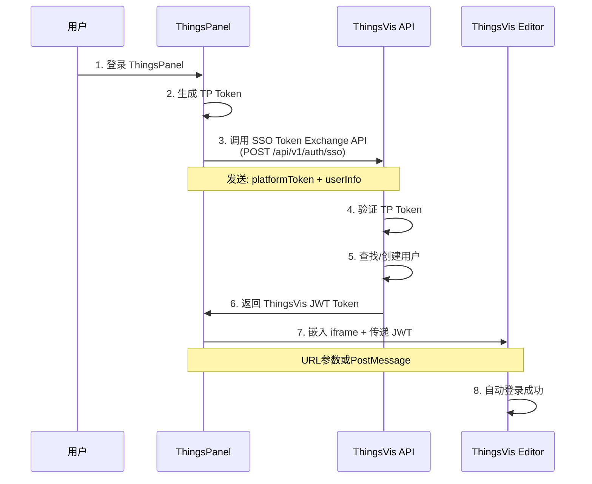

# ThingsPanel 第三方认证集成方案

> **文档版本**: v2.0.0  
> **最后更新**: 2026-01-28  
> **目标平台**: ThingsPanel IoT Platform  
> **实现状态**: ✅ SSO API 已实现

本文档详细说明如何实现 ThingsVis 与 ThingsPanel 的第三方认证集成,支持自动登录(SSO - Single Sign-On)。

## ✅ 实现状态

**SSO Token Exchange API 已完成实现** (2026-01-28)

| 组件 | 状态 | 文件位置 |
|------|------|----------|
| SSO API 端点 | ✅ 已实现 | [apps/server/src/app/api/v1/auth/sso/route.ts](file:///f:/coding/thingsvis/apps/server/src/app/api/v1/auth/sso/route.ts) |
| 验证 Schema | ✅ 已实现 | [apps/server/src/lib/validators/auth.ts](file:///f:/coding/thingsvis/apps/server/src/lib/validators/auth.ts) |
| ThingsPanel 辅助函数 | ✅ 已实现 | [apps/server/src/lib/thingspanel.ts](file:///f:/coding/thingsvis/apps/server/src/lib/thingspanel.ts) |
| 数据库 Schema | ✅ 支持 | 已包含 `ssoProvider` 和 `ssoSubject` 字段 |
| ThingsVis 前端自动登录 | ⚠️ 待实现 | 需要在 Editor 中添加 Token 接收逻辑 |

> [!NOTE]
> API 已可用于集成,当前 Token 验证为开发模式(接受所有 Token)。生产环境需实现真实的 ThingsPanel Token 验证。

---

## 📋 问题分析

### 你遇到的问题

当你在 ThingsPanel 中集成 ThingsVis 时,无法实现自动登录,用户需要手动输入账号密码。这是因为缺少 **SSO Token 交换机制**。

### 为什么需要 SSO

在第三方平台集成场景下:
1. 用户已经登录 ThingsPanel
2. 嵌入的 ThingsVis iframe 需要独立的身份认证
3. 不能让用户重复登录(体验差)
4. **解决方案**: ThingsPanel 的登录凭证 → ThingsVis 的登录凭证(Token Exchange)

---

## 🔐 认证架构

### 认证流程图



### 三种认证模式

ThingsVis 支持三种认证模式:

| 模式 | 说明 | 使用场景 | Token 形式 |
|------|------|----------|-----------|
| **Credentials** | 邮箱密码登录 | 独立使用 ThingsVis | Session Cookie |
| **SSO** | 第三方平台集成 | ThingsPanel 嵌入 | JWT Bearer Token |
| **Guest** | 临时访问 | 公开分享大屏 | Guest Token |

---

### 步骤 1: ThingsVis 后端 - SSO API

✅ **ThingsVis 后端 SSO API 已实现完成**

#### API 端点

```
POST /api/v1/auth/sso
```

#### 请求体

```json
{
  "platform": "thingspanel",
  "platformToken": "TP_JWT_TOKEN_HERE",
  "userInfo": {
    "id": "tp_user_12345",
    "email": "user@example.com",
    "name": "张三",
    "tenantId": "tenant_abc"
  }
}
```

#### 响应体

```json
{
  "accessToken": "eyJhbGciOiJIUzI1NiIsInR5cCI6IkpXVCJ9...",
  "refreshToken": "eyJhbGciOiJIUzI1NiIsInR5cCI6IkpXVCJ9...",
  "expiresIn": 7200,
  "user": {
    "id": "user_xyz",
    "email": "user@example.com",
    "name": "张三",
    "role": "EDITOR",
    "tenantId": "tenant_xyz",
    "tenant": {
      "id": "tenant_xyz",
      "name": "thingspanel - tenant_abc"
    }
  }
}
```

#### 后端实现文件

**已创建的文件**:

1. **SSO API 端点**: [apps/server/src/app/api/v1/auth/sso/route.ts](file:///f:/coding/thingsvis/apps/server/src/app/api/v1/auth/sso/route.ts)
   - 完整的 POST handler
   - 自动创建/查找租户和用户
   - 生成 accessToken (2小时) 和 refreshToken (7天)
   - 支持邮箱迁移(已有邮箱用户自动绑定 SSO)

2. **验证 Schema**: [apps/server/src/lib/validators/auth.ts](file:///f:/coding/thingsvis/apps/server/src/lib/validators/auth.ts)
   ```typescript
   export const SSOExchangeSchema = z.object({
     platform: z.literal('thingspanel'),
     platformToken: z.string().min(1),
     userInfo: z.object({
       id: z.string().min(1),
       email: z.string().email(),
       name: z.string().optional(),
       tenantId: z.string().min(1),
     }),
   })
   ```

3. **ThingsPanel 辅助函数**: [apps/server/src/lib/thingspanel.ts](file:///f:/coding/thingsvis/apps/server/src/lib/thingspanel.ts)
   ```typescript
   export async function verifyThingsPanelToken(token: string): Promise<boolean>
   export async function getThingsPanelUserInfo(token: string): Promise<UserInfo | null>
   ```

#### API 功能特性

- ✅ 请求参数验证 (Zod Schema)
- ✅ 租户自动创建 (格式: `thingspanel-{tenantId}`)
- ✅ 用户自动创建 (默认角色: EDITOR)
- ✅ 邮箱用户迁移 (已有邮箱用户自动关联 SSO)
- ✅ JWT Token 生成 (HS256 算法)
- ✅ 最后登录时间更新
- ✅ 完整的错误处理和日志
- ⚠️ Token 验证 (当前为开发模式,生产需实现)

#### 测试 SSO API

使用 PowerShell 测试:

```powershell
$body = @{
    platform = "thingspanel"
    platformToken = "test_token_abc123"
    userInfo = @{
        id = "tp_user_001"
        email = "test@example.com"
        name = "测试用户"
        tenantId = "tenant_demo"
    }
} | ConvertTo-Json

Invoke-WebRequest `
  -Uri "http://localhost:3001/api/v1/auth/sso" `
  -Method POST `
  -ContentType "application/json" `
  -Body $body
```

测试文件: [apps/server/test-sso-request.json](file:///f:/coding/thingsvis/apps/server/test-sso-request.json)  
测试文档: [apps/server/SSO_API_TEST.md](file:///f:/coding/thingsvis/apps/server/SSO_API_TEST.md)

---

### 步骤 2: ThingsPanel 前端 - Token 交换

在 ThingsPanel 中实现 Token 交换逻辑:

```typescript
// ThingsPanel 前端代码

class ThingsVisIntegration {
  private thingsvisApiUrl = 'https://thingsvis.example.com'
  
  /**
   * 交换 ThingsPanel Token -> ThingsVis Token
   */
  async exchangeToken(): Promise<string> {
    // 1. 获取当前 ThingsPanel 用户信息
    const currentUser = await this.getThingsPanelUser()
    const tpToken = this.getThingsPanelToken()
    
    // 2. 调用 ThingsVis SSO API
    const response = await fetch(`${this.thingsvisApiUrl}/api/v1/auth/sso`, {
      method: 'POST',
      headers: {
        'Content-Type': 'application/json',
      },
      body: JSON.stringify({
        platform: 'thingspanel',
        platformToken: tpToken,
        userInfo: {
          id: currentUser.id,
          email: currentUser.email,
          name: currentUser.name,
          tenantId: currentUser.tenantId,
        },
      }),
    })
    
    if (!response.ok) {
      throw new Error('Token exchange failed')
    }
    
    const { accessToken } = await response.json()
    
    // 3. 缓存 Token
    this.cachedToken = accessToken
    this.tokenExpiry = Date.now() + 7200 * 1000  // 2小时
    
    return accessToken
  }
  
  /**
   * 获取有效的 ThingsVis Token(自动刷新)
   */
  async getValidToken(): Promise<string> {
    // Token 未过期,直接返回
    if (this.cachedToken && Date.now() < this.tokenExpiry) {
      return this.cachedToken
    }
    
    // Token 过期,重新交换
    return await this.exchangeToken()
  }
}
```

---

### 步骤 3: ThingsPanel 前端 - 嵌入编辑器

#### 方式 A: URL 参数传递 Token(推荐)

```typescript
// ThingsPanel 嵌入编辑器
async function embedThingsVisEditor() {
  const integration = new ThingsVisIntegration()
  
  // 1. 交换获取 Token
  const jwtToken = await integration.getValidToken()
  
  // 2. 构建编辑器 URL
  const editorUrl = new URL('https://thingsvis.example.com/main#/editor')
  editorUrl.searchParams.set('mode', 'embedded')
  editorUrl.searchParams.set('integration', 'full')
  editorUrl.searchParams.set('token', jwtToken)  // ✅ Token 传递
  
  // 3. 嵌入 iframe
  const iframe = document.createElement('iframe')
  iframe.src = editorUrl.toString()
  iframe.style.width = '100%'
  iframe.style.height = '100vh'
  iframe.style.border = 'none'
  
  document.getElementById('editor-container').appendChild(iframe)
}
```

#### 方式 B: PostMessage 传递 Token

```typescript
// ThingsPanel 前端
async function embedWithPostMessage() {
  const integration = new ThingsVisIntegration()
  const iframe = document.getElementById('thingsvis-editor') as HTMLIFrameElement
  
  // 监听编辑器就绪消息
  window.addEventListener('message', async (event) => {
    if (event.data.type === 'thingsvis:editor-ready') {
      // 编辑器加载完成,发送 Token
      const jwtToken = await integration.getValidToken()
      
      iframe.contentWindow.postMessage({
        type: 'thingsvis:auth-token',
        payload: {
          token: jwtToken,
          expiresIn: 7200
        }
      }, '*')
    }
  })
  
  // 加载编辑器
  iframe.src = 'https://thingsvis.example.com/main#/editor?mode=embedded'
}
```

---

### 步骤 4: ThingsVis 前端 - 自动登录

在 ThingsVis Editor 中接收并使用 Token:

```typescript
// apps/studio/src/pages/EditorPage.tsx 或类似文件

import { useEffect } from 'react'
import { useAuth } from '@/lib/auth'

export function EditorPage() {
  const { loginWithToken } = useAuth()
  
  useEffect(() => {
    // 方式 A: 从 URL 读取 Token
    const urlParams = new URLSearchParams(window.location.search)
    const token = urlParams.get('token')
    
    if (token) {
      loginWithToken(token).then(() => {
        console.log('✅ SSO 自动登录成功')
      }).catch(err => {
        console.error('❌ SSO 登录失败:', err)
      })
    }
    
    // 方式 B: 监听 PostMessage Token
    const handleMessage = (event: MessageEvent) => {
      if (event.data.type === 'thingsvis:auth-token') {
        const { token } = event.data.payload
        loginWithToken(token)
      }
    }
    
    window.addEventListener('message', handleMessage)
    
    // 通知宿主编辑器已就绪
    window.parent.postMessage({ type: 'thingsvis:editor-ready' }, '*')
    
    return () => window.removeEventListener('message', handleMessage)
  }, [])
  
  return <div>编辑器...</div>
}
```

认证 Hook 实现:

```typescript
// apps/studio/src/lib/auth.ts

export function useAuth() {
  /**
   * 使用 JWT Token 登录
   */
  const loginWithToken = async (token: string) => {
    try {
      // 1. 验证 Token 有效性
      const response = await fetch('/api/v1/auth/verify', {
        headers: {
          'Authorization': `Bearer ${token}`
        }
      })
      
      if (!response.ok) {
        throw new Error('Token 验证失败')
      }
      
      const user = await response.json()
      
      // 2. 保存 Token 到本地
      localStorage.setItem('thingsvis_token', token)
      
      // 3. 更新认证状态
      setUser(user)
      setIsAuthenticated(true)
      
      return user
    } catch (error) {
      console.error('Token 登录失败:', error)
      throw error
    }
  }
  
  return { loginWithToken, /* ... */ }
}
```

---

## 🔍 调试检查清单

### 1. ThingsVis 后端检查

```bash
# 检查 SSO API 是否存在
curl -X POST http://localhost:3001/api/v1/auth/sso \
  -H "Content-Type: application/json" \
  -d '{
    "platform": "thingspanel",
    "platformToken": "test_token",
    "userInfo": {
      "id": "test_user",
      "email": "test@example.com",
      "tenantId": "test_tenant"
    }
  }'

# 预期响应: 400 或 401 (而不是 404)
```

> [!IMPORTANT]
> 如果返回 **404 Not Found**,说明 SSO API 尚未实现,需要先创建 `apps/server/src/app/api/v1/auth/sso/route.ts`。

### 2. ThingsPanel 后端检查

在 ThingsPanel 后端日志中确认:

```
✅ 成功调用 ThingsVis SSO API
✅ 收到 accessToken: eyJhbGciOiJIUzI1NiIsInR5cCI6IkpXVCJ9...
❌ 调用失败: Request failed with status 404
```

### 3. 前端 Token 传递检查

打开浏览器开发者工具:

```javascript
// 在 ThingsPanel 页面控制台执行
const iframe = document.querySelector('iframe')
console.log('Iframe URL:', iframe.src)

// 应该包含: ?token=eyJhbGciOiJIUzI1NiI...
```

### 4. ThingsVis 前端接收检查

在 ThingsVis Editor 控制台:

```javascript
// 检查 URL 参数
const token = new URLSearchParams(window.location.search).get('token')
console.log('收到 Token:', token)

// 检查 localStorage
console.log('本地 Token:', localStorage.getItem('thingsvis_token'))
```

---

## 🐛 常见问题排查

### Q1: 调用 SSO API 返回 404

**✅ 已解决**: SSO API 已实现

**API 位置**: `apps/server/src/app/api/v1/auth/sso/route.ts`

**确认 API 可用**:
```bash
# 测试 API (需要先重启服务器)
cd apps/server
pnpm dev

# 在新终端测试
curl -X POST http://localhost:3001/api/v1/auth/sso \
  -H "Content-Type: application/json" \
  -d @test-sso-request.json
```

**如果仍返回 404**:
- 确认服务器已重启
- 检查 API 路由文件是否正确创建
- 查看服务器启动日志

### Q2: Token 验证失败(401 Unauthorized)

**原因**: ThingsPanel Token 验证逻辑未实现

**当前状态**: SSO API 中有 TODO 注释:

```typescript
// TODO: 验证 platformToken (调用 ThingsPanel API)
// const isValid = await verifyThingsPanelToken(platformToken)
```

**解决方案**:

```typescript
// apps/server/src/lib/thingspanel.ts

export async function verifyThingsPanelToken(token: string): Promise<boolean> {
  try {
    // 调用 ThingsPanel 的 Token 验证接口
    const response = await fetch('http://demo.thingspanel.cn/api/verify-token', {
      headers: {
        'Authorization': `Bearer ${token}`
      }
    })
    
    return response.ok
  } catch (error) {
    console.error('ThingsPanel Token 验证失败:', error)
    return false
  }
}
```

然后在 SSO API 中启用验证:

```typescript
// apps/server/src/app/api/v1/auth/sso/route.ts

import { verifyThingsPanelToken } from '@/lib/thingspanel'

export async function POST(request: NextRequest) {
  // ...
  
  // ✅ 启用 Token 验证
  const isValid = await verifyThingsPanelToken(platformToken)
  if (!isValid) {
    return NextResponse.json(
      { error: 'Invalid platform token' }, 
      { status: 401 }
    )
  }
  
  // ...
}
```

### Q3: 编辑器无法自动登录

**检查清单**:

1. ✅ ThingsPanel 是否成功调用 SSO API?
2. ✅ ThingsPanel 是否正确传递 Token 给 iframe?
3. ✅ ThingsVis Editor 是否接收到 Token?
4. ✅ ThingsVis Editor 是否调用了 `loginWithToken()`?

**调试代码**:

```typescript
// 在 ThingsVis Editor 中添加日志
useEffect(() => {
  const token = new URLSearchParams(window.location.search).get('token')
  console.log('🔍 检查 Token:', {
    hasToken: !!token,
    tokenPreview: token?.substring(0, 20) + '...',
    url: window.location.href
  })
  
  if (token) {
    console.log('🚀 开始自动登录...')
    loginWithToken(token)
      .then(user => console.log('✅ 登录成功:', user))
      .catch(err => console.error('❌ 登录失败:', err))
  }
}, [])
```

### Q4: 跨域问题(CORS)

**现象**: 控制台报错:

```
Access to fetch at 'https://thingsvis.example.com/api/v1/auth/sso' 
from origin 'https://thingspanel.io' has been blocked by CORS policy
```

**解决方案**: 在 ThingsVis 后端配置 CORS

```typescript
// apps/server/src/middleware.ts

export function middleware(request: NextRequest) {
  // 允许 ThingsPanel 跨域请求
  const response = NextResponse.next()
  
  response.headers.set('Access-Control-Allow-Origin', 'https://demo.thingspanel.cn')
  response.headers.set('Access-Control-Allow-Methods', 'GET, POST, PUT, DELETE, OPTIONS')
  response.headers.set('Access-Control-Allow-Headers', 'Content-Type, Authorization')
  
  return response
}
```

---

## 📚 相关文档

- [ThingsPanel 集成测试文档](file:///f:/coding/thingsvis/docs/iot/thingspanel-integration-testing.md)
- [Phase 7 后端设计](file:///f:/coding/thingsvis/docs/saas/phase7-backend-design.md#L991-L1097) - SSO 设计细节
- [NextAuth.js 配置](file:///f:/coding/thingsvis/apps/server/src/lib/auth.ts)
- [认证辅助函数](file:///f:/coding/thingsvis/apps/server/src/lib/auth-helpers.ts)

---

## 🎯 当前状态与下一步

### ✅ 已完成

1. **ThingsVis 后端**: SSO API 已实现并可用
   - ✅ API 端点: `/api/v1/auth/sso`
   - ✅ 验证 Schema
   - ✅ 用户/租户自动创建
   - ✅ JWT Token 生成

2. **文档和测试**:
   - ✅ 集成文档已更新
   - ✅ 测试文件已创建
   - ✅ API 测试指南

### ⚠️ 待实现

1. **ThingsPanel 后端**: Token 交换调用
   - 在 ThingsPanel 后端添加调用 ThingsVis SSO API 的逻辑
   - 参考文档中的 `ThingsVisIntegration` 类实现

2. **ThingsPanel 前端**: Token 传递
   - 在嵌入 iframe 时传递 Token (URL 参数或 PostMessage)
   - 参考文档"步骤 3"中的代码示例

3. **ThingsVis 前端**: 自动登录
   - 在 Editor 中添加 Token 接收和处理逻辑
   - 实现 `loginWithToken()` 函数
   - 参考文档"步骤 4"中的代码示例

4. **生产环境优化**:
   - 实现真实的 ThingsPanel Token 验证
   - 启用 Token 刷新机制
   - 添加详细的错误日志和审计

### 🧪 测试步骤

```bash
# 1. 确认 SSO API 可用
curl -X POST http://localhost:3001/api/v1/auth/sso \
  -H "Content-Type: application/json" \
  -d @apps/server/test-sso-request.json

# 2. 重启服务器以应用所有更改
cd apps/server
pnpm dev
```

---

**需要帮助?** 如果你在实现过程中遇到问题,请提供:
- 具体的错误信息(控制台日志)
- 当前执行到哪一步
- ThingsPanel 的版本和部署方式
