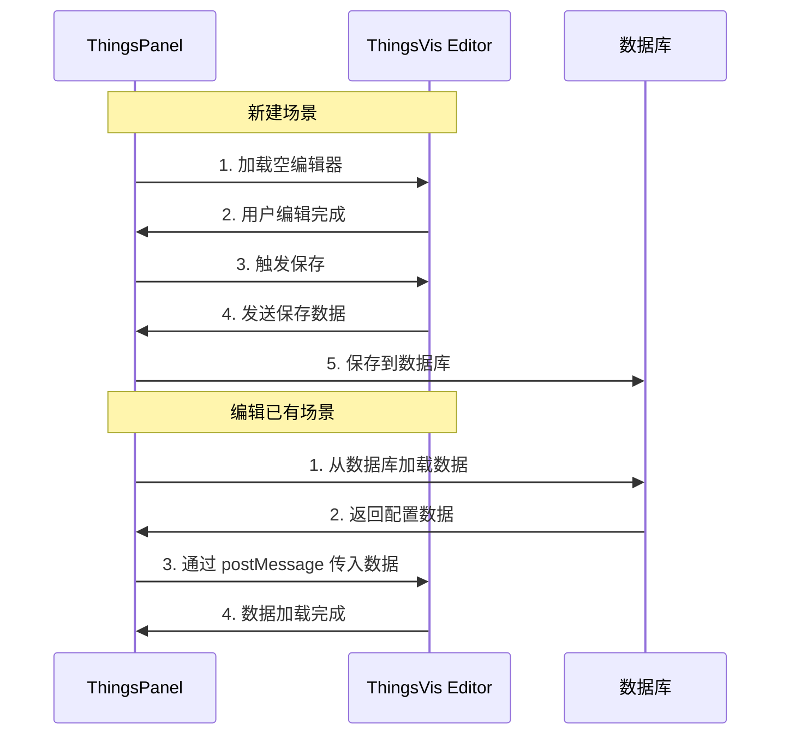

# ThingsPanel 编辑器集成指南

## 概述

本文档说明如何在 ThingsPanel 中集成 ThingsVis 编辑器，实现可视化配置的保存和回显功能。

## 数据流程



## 一、嵌入编辑器

### 1.1 iframe 配置

```html
<!-- 在 ThingsPanel 页面中嵌入编辑器 -->
<iframe
  id="thingsvis-editor"
  :src="editorUrl"
  frameborder="0"
  style="width: 100%; height: 100vh;"
></iframe>
```

### 1.2 构建编辑器 URL

```typescript
// ThingsPanel Vue 组件
const editorUrl = computed(() => {
  const baseUrl = 'http://your-thingsvis-domain.com/main'
  const params = new URLSearchParams()
  
  // 必需参数
  params.set('mode', 'embedded')
  
  // 可选：隐藏不需要的 UI 元素
  params.set('showLibrary', '1')    // 显示组件库
  params.set('showProps', '1')       // 显示属性面板
  params.set('showTopLeft', '0')     // 隐藏左上角
  params.set('showToolbar', '1')     // 显示工具栏
  params.set('showTopRight', '0')    // 隐藏右上角
  
  return `${baseUrl}#/editor?${params.toString()}`
})
```

## 二、保存数据

### 2.1 监听保存事件

在 ThingsPanel 中监听编辑器发送的保存请求：

```typescript
// mounted 或 onMounted
onMounted(() => {
  window.addEventListener('message', handleEditorMessage)
})

onUnmounted(() => {
  window.removeEventListener('message', handleEditorMessage)
})

function handleEditorMessage(event: MessageEvent) {
  // 处理保存请求
  if (event.data?.type === 'thingsvis:host-save') {
    const payload = event.data.payload
    console.log('收到保存数据:', payload)
    
    // 调用保存 API
    saveVisualizationConfig(payload)
  }
}
```

### 2.2 触发保存

有两种方式触发编辑器保存：

#### 方式1: 用户在编辑器内保存（推荐）
编辑器已内置保存快捷键（Ctrl+S），会自动触发保存事件。

#### 方式2: ThingsPanel 主动触发
```typescript
function triggerSave() {
  const iframe = document.getElementById('thingsvis-editor') as HTMLIFrameElement
  if (!iframe?.contentWindow) return
  
  iframe.contentWindow.postMessage({
    type: 'thingsvis:editor-trigger-save',
    payload: {}
  }, '*')
}
```

### 2.3 保存数据格式

编辑器发送的数据格式：

```typescript
{
  canvas: {
    mode: "reflow" | "fixed" | "infinite" | "grid",
    width: number,        // 画布宽度
    height: number,       // 画布高度
    background: string,   // 背景色
    gridCols?: number,    // Grid 模式：列数
    gridRowHeight?: number, // Grid 模式：行高
    gridGap?: number      // Grid 模式：间距
  },
  nodes: [
    {
      id: string,
      type: string,       // 组件类型，如 "basic/text"
      position: { x: number, y: number },
      size: { width: number, height: number },
      props: Record<string, any>,  // 组件属性
      grid?: {            // Grid 布局信息（reflow/grid 模式）
        x: number,        // 网格列位置
        y: number,        // 网格行位置
        w: number,        // 网格宽度（占几列）
        h: number         // 网格高度（占几行）
      },
      thingModelBindings?: [  // 物模型绑定
        {
          targetProp: string,
          metricsId: string,
          metricsName: string,
          // ...
        }
      ]
    }
  ],
  dataBindings: [       // 所有数据绑定（扁平化）
    {
      nodeId: string,
      type: "thingModel" | "platformField",
      targetProp: string,
      // ... 其他绑定信息
    }
  ]
}
```

### 2.4 保存到数据库

```typescript
async function saveVisualizationConfig(payload: any) {
  try {
    // 序列化为 JSON 字符串存储
    const config = JSON.stringify(payload)
    
    // 调用 ThingsPanel API
    const response = await fetch('/api/visualization/save', {
      method: 'POST',
      headers: { 'Content-Type': 'application/json' },
      body: JSON.stringify({
        scene_id: currentSceneId.value,
        config: config,
        name: sceneName.value,
        // ... 其他字段
      })
    })
    
    if (response.ok) {
      console.log('✅ 保存成功')
      // 显示成功提示
    }
  } catch (error) {
    console.error('❌ 保存失败:', error)
  }
}
```

## 三、回显数据

### 3.1 加载已有配置

当用户打开已有的可视化场景时，需要将保存的配置传给编辑器：

```typescript
// 从数据库加载配置
async function loadVisualizationConfig(sceneId: string) {
  const response = await fetch(`/api/visualization/${sceneId}`)
  const data = await response.json()
  
  // data.config 是之前保存的 JSON 字符串
  const config = JSON.parse(data.config)
  
  // 等待 iframe 加载完成后发送数据
  sendConfigToEditor(config)
}
```

### 3.2 发送数据到编辑器

**重要**：等待 iframe 加载完成后再发送数据。

```typescript
const iframeRef = ref<HTMLIFrameElement | null>(null)
const iframeLoaded = ref(false)

// 监听 iframe 加载
function onIframeLoad() {
  iframeLoaded.value = true
  
  // 如果已有配置数据，立即发送
  if (savedConfig.value) {
    sendConfigToEditor(savedConfig.value)
  }
}

function sendConfigToEditor(config: any) {
  if (!iframeRef.value?.contentWindow) {
    console.warn('⚠️ Iframe 未就绪')
    return
  }
  
  // 深度克隆确保数据可序列化
  const clonedData = JSON.parse(JSON.stringify(config))
  
  iframeRef.value.contentWindow.postMessage({
    type: 'thingsvis:editor-init',
    payload: { data: clonedData }
  }, '*')
  
  console.log('📤 已发送配置数据到编辑器')
}
```

### 3.3 完整示例

```vue
<template>
  <div class="visualization-editor">
    <div class="toolbar">
      <button @click="handleSave">保存</button>
      <button @click="handleBack">返回</button>
    </div>
    
    <iframe
      ref="iframeRef"
      :src="editorUrl"
      frameborder="0"
      @load="onIframeLoad"
      style="width: 100%; height: calc(100vh - 60px);"
    />
  </div>
</template>

<script setup lang="ts">
import { ref, computed, onMounted, onUnmounted } from 'vue'
import { useRoute } from 'vue-router'

const route = useRoute()
const sceneId = computed(() => route.params.id as string)

const iframeRef = ref<HTMLIFrameElement | null>(null)
const iframeLoaded = ref(false)
const savedConfig = ref<any>(null)

// 编辑器 URL
const editorUrl = computed(() => {
  const baseUrl = 'http://localhost:3000/main'
  const params = new URLSearchParams()
  params.set('mode', 'embedded')
  params.set('showTopLeft', '0')
  params.set('showTopRight', '0')
  return `${baseUrl}#/editor?${params.toString()}`
})

// 加载已有配置
async function loadConfig() {
  if (!sceneId.value) return
  
  try {
    const response = await fetch(`/api/visualization/${sceneId.value}`)
    const data = await response.json()
    
    if (data.config) {
      savedConfig.value = JSON.parse(data.config)
      
      // 如果 iframe 已加载，立即发送数据
      if (iframeLoaded.value) {
        sendConfigToEditor(savedConfig.value)
      }
    }
  } catch (error) {
    console.error('加载配置失败:', error)
  }
}

// iframe 加载完成
function onIframeLoad() {
  iframeLoaded.value = true
  console.log('✅ 编辑器加载完成')
  
  // 发送已加载的配置
  if (savedConfig.value) {
    sendConfigToEditor(savedConfig.value)
  }
}

// 发送配置到编辑器
function sendConfigToEditor(config: any) {
  if (!iframeRef.value?.contentWindow) return
  
  try {
    const clonedData = JSON.parse(JSON.stringify(config))
    
    iframeRef.value.contentWindow.postMessage({
      type: 'thingsvis:editor-init',
      payload: { data: clonedData }
    }, '*')
    
    console.log('📤 配置已发送到编辑器')
  } catch (error) {
    console.error('发送配置失败:', error)
  }
}

// 处理编辑器消息
function handleEditorMessage(event: MessageEvent) {
  if (event.data?.type === 'thingsvis:host-save') {
    const payload = event.data.payload
    console.log('💾 收到保存数据:', payload)
    saveConfig(payload)
  }
}

// 保存配置
async function saveConfig(payload: any) {
  try {
    const config = JSON.stringify(payload)
    
    const response = await fetch('/api/visualization/save', {
      method: 'POST',
      headers: { 'Content-Type': 'application/json' },
      body: JSON.stringify({
        scene_id: sceneId.value,
        config: config
      })
    })
    
    if (response.ok) {
      console.log('✅ 保存成功')
      // TODO: 显示成功提示
    }
  } catch (error) {
    console.error('❌ 保存失败:', error)
  }
}

// 主动触发保存
function handleSave() {
  if (!iframeRef.value?.contentWindow) return
  
  iframeRef.value.contentWindow.postMessage({
    type: 'thingsvis:editor-trigger-save',
    payload: {}
  }, '*')
}

// 返回
function handleBack() {
  // TODO: 路由跳转
}

onMounted(() => {
  window.addEventListener('message', handleEditorMessage)
  loadConfig()
})

onUnmounted(() => {
  window.removeEventListener('message', handleEditorMessage)
})
</script>
```

## 四、数据库表设计建议

```sql
CREATE TABLE visualization_scenes (
  id VARCHAR(36) PRIMARY KEY,
  name VARCHAR(255) NOT NULL,
  description TEXT,
  config LONGTEXT NOT NULL,  -- JSON 字符串
  created_at TIMESTAMP DEFAULT CURRENT_TIMESTAMP,
  updated_at TIMESTAMP DEFAULT CURRENT_TIMESTAMP ON UPDATE CURRENT_TIMESTAMP,
  created_by VARCHAR(36),
  -- 其他字段...
  INDEX idx_created_by (created_by)
);
```

## 五、关键注意事项

### 5.1 时序问题

⚠️ **必须等待 iframe 加载完成后再发送数据**

```typescript
// ❌ 错误：iframe 可能还未加载完成
const sendData = () => {
  iframe.contentWindow.postMessage(...)
}

// ✅ 正确：等待 load 事件
iframe.addEventListener('load', () => {
  sendData()
})
```

### 5.2 数据克隆

⚠️ **发送前必须深度克隆数据**

```typescript
// ❌ 错误：可能包含不可序列化的对象
iframe.contentWindow.postMessage({
  type: 'thingsvis:editor-init',
  payload: { data: savedConfig }
}, '*')

// ✅ 正确：JSON 深度克隆
const clonedData = JSON.parse(JSON.stringify(savedConfig))
iframe.contentWindow.postMessage({
  type: 'thingsvis:editor-init',
  payload: { data: clonedData }
}, '*')
```

### 5.3 Grid 属性保存

如果使用 `reflow` 或 `grid` 模式，确保保存时包含 `grid` 属性：

```typescript
{
  nodes: [
    {
      id: "node-1",
      type: "basic/text",
      position: { x: 100, y: 100 },
      size: { width: 300, height: 100 },
      props: { text: "Hello" },
      grid: {          // ⚠️ 重要：Grid 布局信息
        x: 0,
        y: 0,
        w: 6,
        h: 2
      }
    }
  ]
}
```

## 六、调试技巧

### 6.1 控制台日志

编辑器会输出详细的日志，帮助调试：

```
🔗 [Editor] Embed mode detected: skipping projectStorage.load
📨 [Editor] Received embed init event
🎨 [Editor] Loading canvas config from external data
📦 [Editor] Loading 3 nodes from external data
✅ [Editor] Embed mode initialization complete
```

### 6.2 检查发送的数据

```typescript
console.log('📤 发送到编辑器的数据:', JSON.stringify(config, null, 2))
```

### 6.3 检查保存的数据

```typescript
function handleEditorMessage(event: MessageEvent) {
  if (event.data?.type === 'thingsvis:host-save') {
    const payload = event.data.payload
    console.log('💾 保存数据结构:', payload)
    console.log('- Canvas模式:', payload.canvas?.mode)
    console.log('- 节点数量:', payload.nodes?.length)
    console.log('- Grid列数:', payload.canvas?.gridCols)
    
    // 检查每个节点的 grid 属性
    payload.nodes?.forEach((node: any, i: number) => {
      console.log(`  Node ${i}: grid=`, node.grid || 'MISSING')
    })
  }
}
```

## 七、常见问题

### Q1: 编辑器加载后显示空白？
- 检查是否等待 iframe 加载完成再发送数据
- 检查控制台是否有 `Received embed init event` 日志
- 检查发送的数据格式是否正确

### Q2: Grid 布局没有正确显示？
- 确认 `canvas.mode` 为 `"reflow"` 或 `"grid"`
- 确认每个 `node` 都有 `grid` 属性
- 检查 `canvas.gridCols`、`gridRowHeight`、`gridGap` 是否存在

### Q3: 保存后数据丢失？
- 检查数据库字段类型是否为 `LONGTEXT`（普通 TEXT 可能不够）
- 检查 JSON 序列化/反序列化是否正确
- 检查是否有特殊字符导致存储问题

### Q4: postMessage 报错 DataCloneError？
- 确保数据已通过 `JSON.parse(JSON.stringify())` 深度克隆
- 检查数据中是否包含函数、循环引用等不可序列化对象

## 八、完整流程测试清单

- [ ] 创建新场景，编辑器正常加载
- [ ] 添加组件，保存成功
- [ ] 数据成功写入数据库
- [ ] 重新打开场景，数据正确回显
- [ ] 组件位置、大小、属性正确还原
- [ ] Grid 布局正确还原（如果使用）
- [ ] 保存快捷键（Ctrl+S）正常工作
- [ ] 控制台无错误
